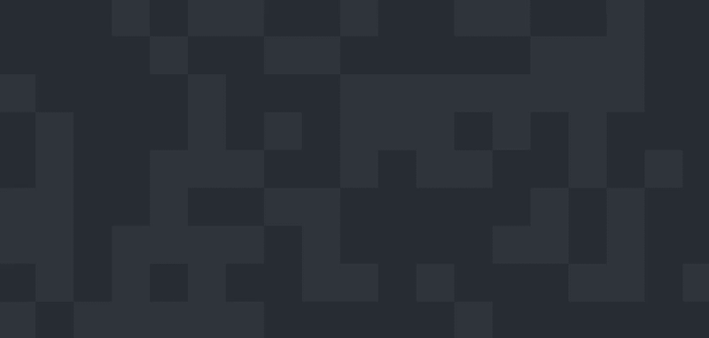

Conway's Game of Life, not to be confused with Game of Life or games in general,
is a set of simple rules that you apply to a group of cells over several
generations.

| 1. Any live cell with fewer than two live neighbours dies, as if caused by under-population.
| 2. Any live cell with two or three live neighbours lives on to the next generation.
| 3. Any live cell with more than three live neighbours dies, as if by overcrowding.
| 4. Any dead cell with exactly three live neighbours becomes a live cell, as if by reproduction.

With those rules you can make a ton of interesting Conway patterns.
Here's just one, the glider.


In fact, it looks pretty dope even with a randomly generated pattern.



The way I implemented this is with the HTML5 canvas and some object oriented
JavaScript, which is generally pretty painless. In a broad sense, I divided the
`<canvas>` into a grid of a size dependent on the size of the browser window,
then created a Cell object for each grid cell. I store the grid in an array. Each cell
remembers its position and if it's dead or alive for this generation and the next.
There are some implementations that remember the grid one generation before instead,
but my thinking was that it would be around the same amount of memory and that this sort
of Cell class is neater.

```javascript
// aliasing for ease of reference
var CELL_SIZE = 64; // the fixed size of each cell in pixels
var DEAD = false; // false - dead, true - alive for cells
var ALIVE = true;
var ALIVE_COLOUR = "#282C34";
var DEAD_COLOUR = "#2F343D";
var GRID_COLOUR = "#ddd";
var DISABLED_COLOUR = "#ABB2BF";

var grid = [];
var width,
  height,
  canvas,
  ctx,
  noOfRows,
  noOfCols,
  isPlaying = false,
  interval;

// Cell class constructor
var Cell = function (row, col) {
  this.row = row;
  this.col = col;
  this.curState = DEAD;
  this.nextState = false;

  this.draw = function () {
    if (this.curState)
      // if I'm alive, draw me
      ctx.fillStyle = ALIVE_COLOUR;
    // alive colour
    else ctx.fillStyle = DEAD_COLOUR;
    ctx.fillRect(
      this.col * CELL_SIZE,
      this.row * CELL_SIZE,
      CELL_SIZE,
      CELL_SIZE
    );
  };

  this.setNextState = function () {
    // look for my neighbours
    var aliveNeighbours = 0;

    for (var rowPos = this.row - 1; rowPos <= this.row + 1; rowPos++) {
      for (var colPos = this.col - 1; colPos <= this.col + 1; colPos++) {
        if (
          !(rowPos == this.row && colPos == this.col) &&
          isInBounds(rowPos, colPos) &&
          grid[rowPos][colPos].curState
        ) {
          grid[rowPos][colPos].draw();
          aliveNeighbours++;
        }
      }
    }

    if (this.curState == ALIVE && (aliveNeighbours < 2 || aliveNeighbours > 3))
      // under/over population
      this.nextState = DEAD;
    if (this.curState == ALIVE && aliveNeighbours >= 2 && aliveNeighbours <= 3)
      // if we have 2-3 neighbours, we're alive still!
      this.nextState = ALIVE;
    if (this.curState == DEAD && aliveNeighbours == 3)
      // reproduction
      this.nextState = ALIVE;
  };

  this.updateState = function () {
    this.curState = this.nextState;
    this.nextState = false;
  };
};
```

If you're coming in to this new to object oriented JavaScript like I was when I
started this project, I'll bet this Cell class looks a little weird to you. There
is no class keyword in JavaScript---if you want a class, you want a function that's
stored in a variable. The easiest way I found to think about this coming from
object oriented languages like Java and C++ is to think of the whole "class" as a
constructor with member functions that it treats like instantiated member variables.

Back to the implementation here. Each cell knows how tell the canvas how to draw itself,
how to calculate whether it'll be alive next generation, and there's a helper method
called updateState that just sets the next state in preparation to be drawn. So when
the main Conway method wants to animate the canvas, it just tells
every cell to calculate whether it'll be alive next generation, to update
its states, and then to draw itself again. Which is, you know, $$O(n^{2})$$ time.
That's not so hot, but it's good enough for a weekend hack.

```javascript
function animate() {
  if (isPlaying) {
    for (var i = 0; i < noOfRows; i++) {
      for (var j = 0; j < noOfCols; j++) {
        grid[i][j].draw();
        grid[i][j].setNextState();
      }
    }
    // now update each cell
    for (var i = 0; i < noOfRows; i++)
      for (var j = 0; j < noOfCols; j++) grid[i][j].updateState();
  }
}
```

All we're missing now is the initial method to do any work we need before kicking
off the animation i.e. calculating the size of the `<canvas>` and each Cell's position,
a click listener to put in which cells are alive to start, and something to start
the animation, like maybe hitting the keyboard key [p].

```javascript
function initAnimation() {
  // model the canvas as a grid containing life cells
  noOfCols =
    window.innerWidth % CELL_SIZE === 0
      ? Math.floor(window.innerWidth / CELL_SIZE)
      : Math.floor(window.innerWidth / CELL_SIZE) + 1;
  noOfRows =
    window.innerHeight % CELL_SIZE === 0
      ? Math.floor(window.innerHeight / CELL_SIZE)
      : Math.floor(window.innerHeight / CELL_SIZE) + 1;
  canvas.width = noOfCols * CELL_SIZE; // resive canvas to be an exact fit
  canvas.height = noOfRows * CELL_SIZE;
  grid = new Array(noOfRows);
  for (var k = 0; k < noOfRows; k++) {
    grid[k] = new Array(noOfCols);
    for (var n = 0; n < noOfCols; n++) grid[k][n] = new Cell(k, n);
  }

  draw();
}

// Event handling
function addListeners() {
  window.addEventListener("scroll", scrollCheck); // stops the animation if it scrolls out of range
  window.addEventListener("resize", resize); // makes canvas responsive
  window.addEventListener("click", onClick);
}

function onClick(event) {
  isPlaying = false;
  clearInterval(interval); // stops the animation!

  // check if the page has scrolled!
  if (document.body.scrollTop > height) return;
  offsetY = document.body.scrollTop;

  var col = Math.floor(event.clientX / CELL_SIZE);
  var row = Math.floor((event.clientY + offsetY) / CELL_SIZE);

  if (isInBounds(row, col)) {
    if (grid[row][col].curState == ALIVE) grid[row][col].curState = DEAD;
    else grid[row][col].curState = ALIVE;
  }

  draw();
}

// plays the animation when the p key is hit!
// a slight wrinkle, this is jQuery, which I included as a script
// but it's pretty easy to make this pure javascript too
$(document).on("keypress", function (e) {
  if (e.keyCode == 112) {
    if (isPlaying) {
      isPlaying = false;
      clearInterval(interval);
    } else {
      isPlaying = true;
      interval = setInterval(animate, 500);
    }
  }
});
```

All of these functions are called in a function I called animateBackground(),
which I call when the document is ready.

```javascript
function animateBackground() {
  // main
  canvas = document.getElementById("canvas");
  ctx = canvas.getContext("2d");

  initAnimation();
  addListeners();
}

// animate background when document is ready
// this is jQuery too
$(document).ready(animateBackground);
```

In my full implementation, I also included some bonuses like a method to draw
gridlines and a method to generate a random starting population among other things,
which you might find useful. See the full thing as a background header animation on my site [here](http://ivy-zhou.github.io).
