> Professor Caroline Kierstead, Spring 2017

> Software engineering principles, a course where attendance is probably correlated with a higher grade.

# ADT Design

**Abstract data type \(ADT\):** A user defined class which bundles together data about the class and operations on it e.g. stack, linkedlist. The point is to make the compiler catch illegal values in the class and illegal operations on it \(programming errors\) as type errors.

Accessors and mutators do exactly what they sound like they do. A naming convention used in the course is that accessors are declared as `dataField()` and mutators are declared as `dataFieldIs(const &dataField newDataField)`.

> **Best Practice \(BP\):** Mutators should check the values that they're writing into the ADT, and throw an exception if things aren't working out. Use const references to pass in things to the mutator.

Function overloading is when you have two functions with the same name having different parameter types, so you can call either. Function overriding is when you have two functions with the same name and the same parameter types, so one overrides the other \(e.g. child class overrides parent class method\).

You can also overload operators, either as member functions \(which have access to your private variables/methods\) or as non-member functions \(declared outside, have no access to anything that isn't public\). Sometimes you get operators like `<<` and `>>` which are streaming operators that have to be declared outside BUT you also need to access the private data members \(say, to output them\), so you declare them as a friend inside the class, and then declare it again outside. Friends have access to all your private information in C++. Friend classes will do this too.

You can specify default arguments to a class in the declaration for it, but not in the definition.

```cpp
class RationalFriend {
    // this doesn't do anything except show you how friend declaration works for classes
};

class Rational : Fraction {
    // my friends which are classes
    friend class RationalFriend;

    // my friends which are functions
    friend ostream& operator<< (ostream&, const Rational&);
    friend istream& operator>> (istream&, Rational&);

    public:
        // accessors, mutators
        int numerator() const;
        int denominator() const;
        void numeratorIs( const int );
        void denominatorIs( const int ) throw (char const*);

        Rational (int num = 0, int denom = 1); // declaration with default arguments


    ...
};

ostream& operator<< (ostream &sout, const Rational); // notice we return a stream for chaining!
istream& operator>> (istream &sin, Rational &s);

// arithmetic/comparison operator overloading
Rational operator+ (const Rational&, const Rational&);
Rational operator* (const Rational&, const Rational&);
bool operator== (const Rational&, const Rational&);
bool operator!= (const Rational&, const Rational&);
```

Other function declaration keywords to remember:

- **explicit:** prevents C++ from doing implicit type conversion e.g. a constructor that looks like `explicit Rational (int num = 0, int denom = 1);` prevents `Rational doubleRational = Rational(1.0, 1.0)` from compiling
- **override:** signals that this method is overridden from a base class and the compiler gives an error if it doesn't actually override anything \(not technically necessary\)
- **virtual:** signals that this method should be overridden by the most derived child class \(not technically necessary, you can override without it, but it would be a bad practice\) e.g. `virtual int foo();`

> What's the point of virtual then?
>
> Consider some code which looks like `Base *foo = new Child();`. If you called `foo -> childMethod()` \(where childMethod is defined in Child, but not declared virtual\) it wouldn't work. Since function binding was done at compile time, foo was declared a Base and it can only use Base class methods. The virtual keyword tells the compiler to delay function lookup to runtime, so that `foo -> childMethod()` will work.

- **pure virtual:** defining a method like this makes the class an abstract base class which cannot be instantiated \(you have to instantiate a child class that defines the method instead e.g. `pure virtual int foo() = 0;`
- **final:** prevents the method from being redefined, does the same thing for classes if you declare the class as `class Object final{...}` e.g. `int foo() final;`

- **const:** prevents this method from mutating the object e.g. `int foo() const;`

Object slicing: occurs when you cast a specified child class to its parent class, thus slicing off all its child class data fields

> **BP:** Use helper functions, but don't pollute the global namespace by making them public. Put them as private, or put them in a namespace.

`const` and `private` are basically the major themes of this course.

### Entity v.s. Value-based ADTs

| Entity ADTs                                                                                                                               | Value-based ADTs                                                                                                                          |
| :---------------------------------------------------------------------------------------------------------------------------------------- | :---------------------------------------------------------------------------------------------------------------------------------------- |
| Objects with distinct identities, a representation of some real world object                                                              | Objects with the same values are considered identical                                                                                     |
| Examples are: physical objects \(planes\), people \(passengers\), transactions \(reservations, receipts\), records \(customer information | Examples are: mathematical types, measurements, quantities, properties \(colour, location, time\), restricted value sets \(postal codes\) |
| Prohibit copy constructor, assignment, type conversions, operator overloading for comparison and equality \(none of these are meaningful  | Allow copy constructor, assignment, often operator overloading is meaningful                                                              |
| Usually mutable                                                                                                                           | Usually immutable \(think about somebody having a reference to your Coin object and mutating it without you knowing!\)                    |

### Special member functions

The compiler gives us these 6 member functions for free:

- default constructor with no params

  - This is removed if you define a constructor yourself
  - It does memberwise initialization. It'll go through all your data members and try to initialize all of them \(your simple data types like strings and ints are untouched, your pointers are untouched, your member objects get their default constructor called on them, and any data members you got from your parents are initialized with your parent's constructors

- destructor

  - It does memberwise deletion. Your simple data members are deallocated, your pointers get dealloc'd but the memory that they were pointing to isn't deleted, your member objects are cleaned up using their destructors \(from your parent class or from the member class\)

- copy constructor \(shallow copy\)

  - This is also memberwise. Your simple data members and your pointers are bitwise copied \(so your copy points at the same memory as the object you're copying from\), and your member objects have their copy constructors used.

- copy assignment \(remember, this is just operator =\)

  - Remember that the distinction between copy assignment and copy constructor is that in assignment, the object you're trying to copy into already exists e.g. `Object foo(bar);` v.s. `Object foo = bar;`
  - Again, it's going to be memberwise. It's going to bitwise copy your simple data members and your pointers, and then it's going to call the assignment operator on all your member objects.

- move constructor

  - This is basically a copy constructor which doesn't guarantee that the object you're copying is going to stay unchanged. It's useful for efficiency reasons like for example if you're assigning a rvalue like `Object foo; foo = Object(std::move(baz));`
  - It's pretty much the same memberwise story as before \(bitwise copy of simple data + pointers, move construction of your member variables\)
  - You declare it like this:

  ```cpp
  MyClass::MyClass (MyClass&& m) : Base{ std::move(m) }, comp_{ std::move(m.comp_) },
                                   simple_{ m.simple }, ptr_{ m.ptr_ } {
     m.ptr_ = nullptr;
  }
  ```

- move assignment

  - Basically an assignment operator without the guarantee that the object you're copying is going to stay unchanged. I'm getting tired of typing the memberwise stuff.
  - You can roll up your move assignment and your copy assignment into one nifty function:

  ```cpp
  // we don't need these 2
  MyClass::MyClass( const MyClass & other) : MyClass(0) {
      copy( *this, other );
  }
  MyClass::MyClass( MyClass && other ) : MyClass(0) {
      swap( *this, other );
  }

  // since we can just define this one!
  MyClass& MyClass::operator= (MyClass m) {
      // Since MyClass m is passed by value here, it's already been
      // copied, so it's perfectly OK to directly swap the values using copy-swap
      swap( *this, m );
      return *this;
  }
  ```

#### Copy and swap idiom

The copy and swap idiom is a way to implement deep copies in assignment operator definitions whose main benefit is that if the deep fails, the original object we were trying to copy is unaffected.

Say we're trying to deep copy some Object foo in an assignment operation. We'll make a deep copy of foo by using foo's copy constructor \(which already does deep copies\). Let's call this deep copy foo2. Then, we can copy foo by swapping out the values of my pointers and data members with the values in foo2. This is a shallow copy, but that's totally fine, because foo2 already did all the hard work of deep copying. Also, we don't have to delete our old members anymore because since foo2 was allocated on the stack, its destructor is going to get called, so it'll do the work of deleting our old data members too!

**Pros:** Since we didn't really touch foo except for deep copying it, if the deep copy fails, everything's fine and we didn't break foo.

**Cons:** We essentially copied foo twice, so it's kind of inefficient.

```cpp
// friend that swaps contents of m1 and m2
// using std::swap from <algorithm>
void swap( MyClass & m1, MyClass &m2 ) {
 Base &b_m1 = static_cast<Base&>(m1);
 Base &b_m2 = static_cast<Base&>(m2);
 swap( b_m1, b_m2 );
 std::swap( m1.comp_, m2.comp_ );
 std::swap( m1.ptr_, m2.ptr_ );
 std::swap( m1.simple_, m2.simple_ );
}
MyClass& MyClass::operator= (const MyClass& m) {
 MyClass temp{m};
 swap( *this, temp );
 return *this;
}
```

## Singleton Design Pattern

Ensure that exactly one of our ADT object can be instantiated can exist.

```cpp
class Egg {
  static Egg e; // singleton instance
  int i; // data member
  Egg(int ii) : i(ii) {} // private constructor
 public:
   static Egg* instance() { return &e; } // You would call for an instance of egg using Egg()
   int val() const { return i; }
   Egg(const Egg&) = delete; // prevent copy
   Egg& operator= (const Egg&) = delete; // prevent assign
};

Egg Egg::e(42); // initialization of singleton (apparently, you can access private static data fields
                // in line in C++, wow)
```

## PImpl Idiom

Header files are kind of wack--they let everyone see what type of private data members you're using, which is no good. So to solve this, we can forward declare a `struct Impl;`, create a reference to it in our header file which our class will use to store its data members, and then actually define the `Impl` in the `.cc` file.

```cpp
class Rational {
 public:
  Rational (int numer = 0, int denom = 1);
  int numerator() const;
  int denominator() const;
 private:
  struct Impl;
  Impl* rat_;
 public:
  ~Rational();
  Rational ( const Rational& );
  Rational& operator= ( const Rational& );
};
```

# Modules and Interfaces

When you put `#include "something.h"` into your header file, all the compiler does is copy paste the contents of that header file into your header file. So, to prevent things from being included twice \(e.g. I include something.h and you include something.h, and I also include you\), we use header guards.

```cpp
#ifndef RATIONAL_H
#define RATIONAL_H
    // class Rational declaration and related functions go here
...
#endif
```

But what if I include you and you include me? To break that circular dependency, at least one of us has to forward declare the other. This way, when we're compiled together, the declarations will be filled in for both of us and everyone's happy.

From adt1.h

```cpp
class ADT2; // forward declaration
class ADT1 {
    friend class ADT2;
    int data_;
    ADT1 *next_;
};
```

From adt2.h

```cpp
class ADT1; // forward declaration
class ADT2 {
    ADT1 *s;
}
```

> Never put a using directive in a header file, since your header file can be included in a bunch of other header files, all of which are now using your namespace. Never put a using directive before an includes, since it messes with the namespace of the includes.

## Make

Remember that the build process in C++ has compilation \(creating object files of assembly code, containing symbols which may not be defined\) separate from linking \(generating an executable from the object files\). Also compilation of each file is done separately, so ideally, we want to only recompile a file that we've changed. However, if the file we're changing has other files depending on it, we've got to recompile those files too. Make will do the dependency tracking and smart recompilation for you. Here are 3 sample Makefiles.

```Makefile
# This produces something you can run with ./program if you call make program or make
program : main.o ADT1.o ADT2.o # dependency graph
    g++-5 -std=c++14 -g -Wall main.o ADT1.o ADT2.o -o program # build rule

main.o : main.cpp ADT1.h # sub dependency graph
    g++-5 -std=c++14 -g -Wall -c main.cpp -o main.o
ADT1.o : ADT1.cpp ADT1.h ADT2.h
    g++-5 -std=c++14 -g -Wall -c ADT1.cpp -o ADT1.o
ADT2.o : ADT2.cpp ADT2.h ADT1.h
    g++-5 -std=c++14 -g -Wall -c ADT2.cpp -o ADT2.o
```

```Makefile
# you can define macros like this!
CXX = g++-5 -std=c++14 # variables and initialization
CXXFLAGS = -g -Wall -Werror -Wextra -Wpendantic

OBJECTS = main.o stack.o node.o
EXEC = program

# you can use implicit rules like this!
${EXEC} : ${OBJECTS} # default target
${CXX} ${CXXFLAGS} ${OBJECTS} -o ${EXEC}

# gmake knows how to build .o files; just list dependencies
main.o : main.cpp stack.h
stack.o : stack.cpp stack.h node.h
node.o : node.cpp node.h stack.h

# run with make clean
clean : # second target
    rm -rf ${OBJECTS} ${EXEC}
```

```
# this calculates dependencies for you!
CXX = g++-5 -std=c++14 # variables and initialization
CXXFLAGS = -g -MMD -Wall -Werror -Wextra -Wpedantic # -MMD builds dependency lists in .d files

OBJECTS = main.o stack.o node.o
DEPENDS = ${OBJECTS:.o=.d} # substitute ".o" with ".d"
EXEC = program

${EXEC} : ${OBJECTS}
${CXX} ${CXXFLAGS} ${OBJECTS} -o ${EXEC}

clean :
    rm -rf ${DEPENDS} ${OBJECTS} ${EXEC}

-include ${DEPENDS} # reads the .d files and reruns dependencies
```

## Namespaces

Namespaces are variable scopes that you can create and name. It's like an enclosing if block without any conditions attached to it. People used them to package together related variables, classes, and functions. There is a global namespace which is implicitly declared in every program.

```cpp
// We use the RationalADT namespace here because we don't want to pollute the global namespace
// with this nasty ass Rational class.
// Now people can only refer to it by RatADT::Rational, which is good.
namespace RatADT {
 class Rational {
public:
 Rational (int numer = 0, int denom = 1);
 ...
};
Rational operator+ (const Rational&, const Rational&);
Rational operator* (const Rational&, const Rational&);
bool operator== (const Rational&, const Rational&);
bool operator!= (const Rational&, const Rational&);
std::ostream& operator<< (std::ostream &sout, const Rational &r);
std::istream& operator>> (std::istream &sin, Rational &s);
 ...
}
```

You can also declare anonymous namespace, which has no name attached to it:

```
namespace {
    void f();
}
```

> Why would you ever want to use an anonymous namespace? How can you refer to it if you can't use the using directive?
>
> You don't ever refer to an anonymous namespace outside of the file it's defined in. Things defined inside the anonymous namespace brackets are available to the rest of the file but not other source files which include your source. It's kind of like defining a static function/variable.
>
> ```cpp
> // these are the same
> static int func_for_this_file_only() { ... }
> namespace { int func_for_this_file_only() { ... } }
> ```

**Using declaration:** Makes one name on par with local names, may cause conflicts e.g. `using std::cout;`

**Using directive:** Brings in all of the names from a namespace at a lower level than your local names \(differentiate between which version you want with the name of the namespace\) e.g. `using namespace std;`

**Principle of Separation of Concerns:** Each class should only be responsible for one thing

**Principle of Information Hiding:** Make data private to make it safer

# Interfaces

**Module:** a software component that encapsulates some design decision e.g. function, class, package, library, component

**Interface:** abstract public description of some module

**Interface specification:** contract between a programmer and the client describing their expectations of the interface, composed of a signature \(specifying the syntax\) and a specification \(describes the module's behaviour\)

The interface specification specification has preconditions and postconditions. These conditions only describe the abstract values of the class the client sees, and not any sort of restriction on the implementation details.

- preconditions: requires \(does not include exception conditions, we assume that the client takes care of these\)
- postconditions: modifies, ensures, throws \(list all exceptions that can be thrown with when they are thrown\), returns

For a child class, we only have to create the interface specification for new/overridden methods.

**Specificand set: **the set of all implementations which satisfy a specification

An interface A is stronger than an interface B if:

- A's preconditions are equal to or weaker \(less restrictive\) than B
- A's postconditions are equal to or stronger \(promise more\) than B
- A modifies the same or more objects
- A throws the same or fewer exceptions than B

# Representation Invariants and Abstraction Functions

**Representation invariant: **defines the valid set of concrete values of an ADT's implementation

**Abstraction function:** maps the concrete values of implementation of an ADT to the abstract values they mean

The key difference between the representation invariant and the abstraction function is that representation invariants are boolean predicates and abstraction functions are function definitions.

To identify representation invariants, think about the structural properties of your ADT, the valid values for fields in your ADT, keeping fields of your ADT in sync, and invalid values for fields in your ADT.

**Representation exposure: **occurs when you have non-private data members, when you make something which someone else has a reference to a part of your own ADT, and when you output your internal members or give someone else an iterator over your internal members

See the slides and tutorial for examples.

# Exceptions

**Exception:** an object thrown to represent the occurrence an error, handle with try-catch blocks

We can define our own exception classes, or we can inherit from std::exception and override the what\(\) method.

```cpp
class Rational {
public:
 // Custom exception class
 class DivideByZeroException {
   public:
     DivideByZeroException( int n ) : numer_(n) {}
     int numer() const { return numer_; } // accessor
     private:
     int numer_; // exception data
 };

 // Inherited from std::exception
 class My_Exception : public std::exception {
   public:
    char const *what() const override { return "Something bad happend."; }
 };
...
};
```

When an exception is caught and control is handed over to the catch block, the C++ runtime has to pop everything on the call stack leading up to the catch block execution. Say we've got some method called trouble on that call stack which originally threw the error. If trouble only created variables on the stack, we're good, because the C++ runtime will dealloc those properly. It'll also take care of anything that was halfway created, like the failed construction of an object on the stack. However, it won't properly delete objects on the heap.

Also, if anybody's destructor throws an error which it does not handle itself, the whole program will terminate, since there's no way to tell the C++ runtime to try-catch as it's unwinding the stack. So, destructors should never throw exceptions.

```cpp
class X {
 public:
  class Trouble {};
  class Small : public Trouble {};
  class Big : public Trouble {};
  void f() { throw Big(); }
};

int main() {
 X x;
 try {
    x.f(); // This prints "Trouble"
 }
 catch(X::Small&) {
   cout << "Small Trouble";
   throw X::Trouble(); // This is going to end the program, because catch blocks don't chain!
 }
 catch(X::Trouble&) { cout << "Trouble"; }
 catch(X::Big&) { cout << "Big Trouble"; }
 catch(...) { cout << "catches any type of exception"; throw; }
}
```

We call an operation **exception-safe** if leaves the program in a valid state after terminating by throwing an exception. There are several different guarantees we can make to classify an exception-safe operation.

**Basic guarantee:** basic invariants of all the objects invoked are maintained and there are no resource leaks e.g. most std operations

**Strong guarantee:** basic guarantee + the program reverts back to the state it was in before the operation was called e.g. std::vector.push_back

**Nothrow guarantee:** basic guarantee + the program will never throw an exception e.g. std::swap, std::stack.pop. You can tell the compiler than a function has the nothrow guarantee using the `noexcept` keyword.

> Don't throw exceptions to try to catch programming errors, since doing so should unwind your callstack and destroy your program state. Use assertions in order to preserve the program state and help you debug.

## Smart Pointers

**Problem: **Pointers aren't deleted properly by the C++ runtime, since it never goes to what the pointer is pointing to and deletes that. But objects on the stack are deleted just fine when they have destructors.

**Solution: **Allocate a wrapper around a pointer on the stack, create something on the heap with it so you still get to do pointer things, and then specify in the destructor of the pointer wrapper that you want what the pointer was pointing to deleted as well. That's a smart pointer!

> Smart pointers have customizable deleters which destroy the heap object that they point to, so two smart pointers that have different deleters can't point to the same object or be assigned to each other, even if the type of object they're supposed to be pointing to is the same.

#### unique_ptr

A unique pointer can't be shared, so if you straight up try to assign one to the other or use a copy constructor, it won't compile. You can however use std::move to transfer ownership, and you can call reset\(\) on the pointer to delete the memory.

```cpp
std::unique_ptr<int> p1(new int(5));
std::unique_ptr<int> p2 = p1; // Compile error.
std::unique_ptr<int> p3 = std::move(p1); // Transfers ownership. p3 now owns the memory
                                         // and p1 is rendered invalid.

p3.reset(); //Deletes the memory.
p1.reset(); //Does nothing.
```

You can also use the source and sink idiom to grab unique pointers or get rid of them. For example, every time you make a unique pointer a shared pointer for whatever reason, you can't convert it back. So you have to throw the pointer away and get a new one.

```cpp
// Source
unique_ptr<T> Source() {
    return unique_ptr<T> ( new T ); // return by copy
}
unique_ptr<T> pt = Source();

// Sink
void Sink ( unique_ptr<T> pt ) {
    // passed in by copy == transfer of ownership
    pt.reset();
}
Sink( pt );
```

#### auto_ptr

Auto pointers are deprecated and less efficient, so don't use them. They can use copy semantics \(unlike unique pointers\) and they can't be used in STL containers.

#### shared_ptr

Shared pointers are designed so that multiple references can go to the same memory, and once all references go out of scope, the memory will delete itself. You can make a reference go out of scope early by calling reset\(\) on it.

```cpp
std::shared_ptr<int> p1(new int(5));
std::shared_ptr<int> p2 = p1; // Both now own the memory.

p1.reset(); // Memory still exists, due to p2.
p2.reset(); // Deletes the memory, since no one else owns the memory.
```

#### weak_ptr

A weak pointer handles cases of cycles in shared ptr, where the internal counter would never reach 0. It doesn't impact the reference count that the shared pointers keep, and when all the shared pointers go out of scope and the memory is deleted, the weak pointer becomes empty as well.

```cpp
struct B;
struct A {
  std::shared_ptr<B> aData;
};

struct B {
  std::weak_ptr<A> bData; // if this was a shared_pointer too, then neither a or b would be dealloc'd
};

void useAnB() {
  auto a = std::make_shared<A>();
  auto b = std::make_shared<B>(); // we can assign a shared pointer to a weak pointer,
                                  // and it'll have no effect on the reference count
  a->aData = b;
  b->bData = a;
}

int main() {
   useAnB();
}
```

To use a weak pointer, you have to convert it into a shared pointer first by calling lock\(\) on it. You can check if there's still something inside the weak pointer using expired\(\).

## Resource Acquisition is Initialization

**Resource Acquisition is Initialization \(RAII\):** equates resource management with the lifetime of an object, resource is allocated inside an object's constructor, resource is deallocated inside an object's destructor

# UML

**UML:** Unified modelling language

**Aggregation:** An aggregate class is a collection of its member class objects. It's not responsible for deleting the objects in its collection; think a class of students

**Composition:** A composite class is made up of its member class objects. It's responsible for creating and deleting the objects it is made up of; think a student with body parts

We call a derived class a **generalization** of a base class.

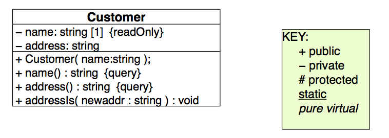

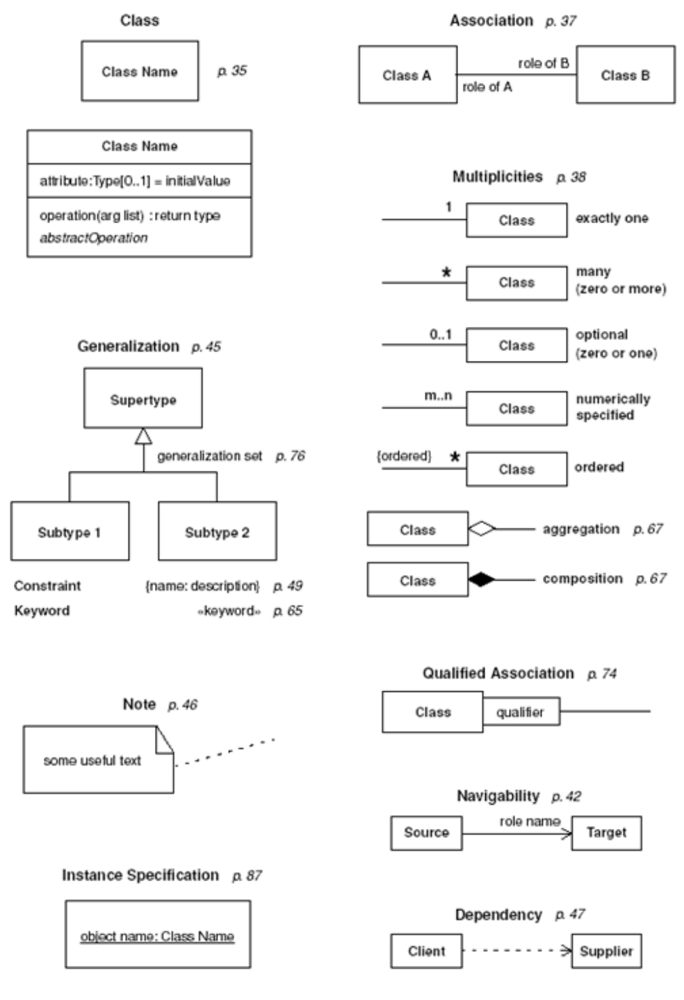

# Design Patterns I, II

We use design patterns because they encapsulate a ready-made solution to some design problem, making the code more modular and more flexible. Since everybody knows them, they improve efficiency in finding a good solution, they improve predictability of the end product, they come with a higher abstraction than a class or a function, and they should be easier to understand/refactor.

**Coupling:** measures the amount of dependency between classes, we always want low coupling

**Cohesion:** measures the amount of relatedness within a module, we always want high cohesion \(we want everything in a module strongly related together\)

### Template Method Pattern

**Problem:** Duplicate code

**Solution:** Localize duplicate code structure in an abstract class

Imagine you've want to output a bill for some cellphone accounts, a cheap one and an expensive one. Clearly, the format of the bill is going to be the same \($$bill = monthlyFee + callCharges$$\). To output this bill using the template pattern, you could create an abstract base class Account with two child classes CheapAccount and ExpensiveAccount, and then implement a `bill` method in Account which uses the pure virtual methods `monthlyFee` and `callCharges`, which are be implemented by the ExpensiveAccount and CheapAccount subclasses.

This way, we avoid having duplicate code in the ExpensiveAccount and CheapAccount classes. Think of the template pattern as defining a "fill-in-the-blank" method in your parent class which your child classes then complete.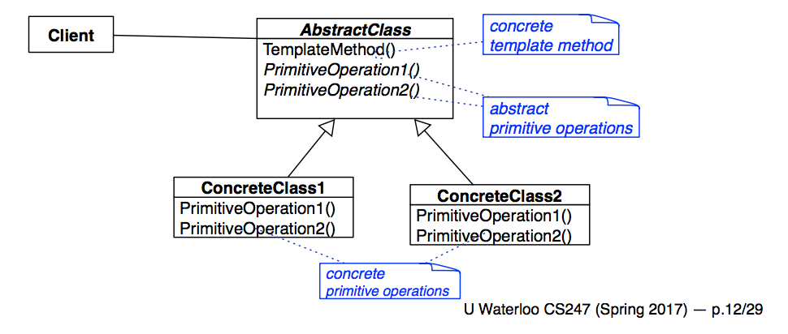

### Adapter Design Pattern

**Problem:** Interface mismatch between two modules

**Solution:** Define an Adapter class that maps one interface to another

Imagine you've got a whole codebase that uses stacks, and one day, you have to change the implementation for that, but all you have on hand is some code for STL deques. So what you can do is create a "stack" class which is basically just a wrapper around an instance of a deque. We call that stack class an adapter, and the deque an adaptee.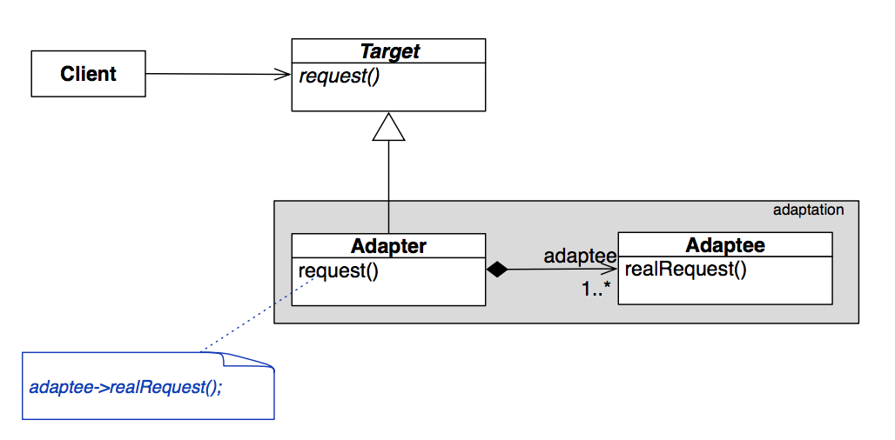

### Facade Design Pattern

**Problem:** Complex interface

**Solution:** Create a single, simplified interface \(class\)

Imagine you're a wedding planner, and you've got clients who want to get married. No couple walks in and says to you, "I want 126 white peonies delivered from the flower shop to arrive at 4:35 PM the day of the wedding, please call and make a reservation in advance for the cake which should serve at least 60 guests...". That would be crazy complicated! Instead, the couple generall just picks a theme and a venue from some choices you provide, and you schedule the rest of it. You are the facade between your clients and the complex system of wedding dress makers, bakeries, flower shops etc. that is involved in a wedding.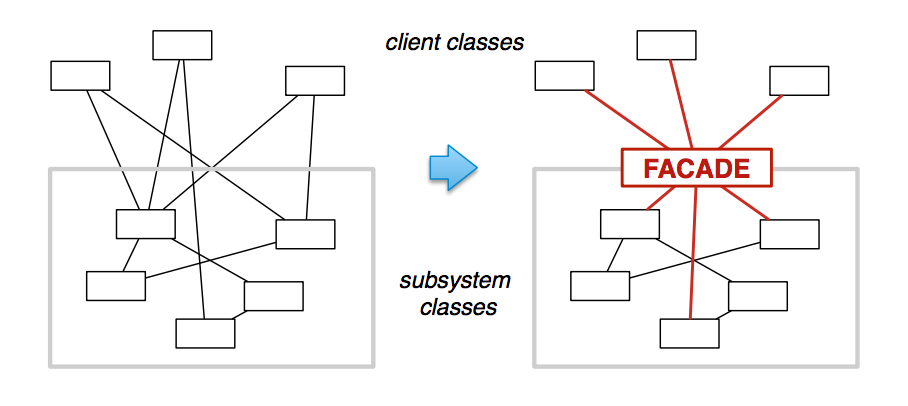

### Strategy Design Pattern

**Problem:** Want to vary an algorithm at run-time

**Solution:** Encapsulate the algorithm decision

Say you're a master card player at a casino, who can tell at a glance inexperienced players from grandmasters. So if you're up against some newbies, you want to bet more aggressively, and if you're up against a champion card player, you want to bet more conservatively.

To implement this, we can create a BiddingStrategy class which has two subclasses, a ConservativeStrategy and a AggressiveStrategy. Each player then has a pointer to their own BiddingStrategy class object, and when they want to change up their strategy, they just delete their old strategy and assign the BiddingStrategy to a new one.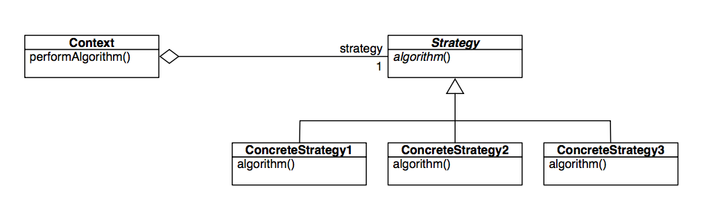

---

### Observer Pattern

**Problem: **maintaining consistency among related objects.

**Solution:** Subject sends updates to collection of abstract Observers

Imagine you have a bunch of graphs that you have to display which are pulling from the same data. Whenever someone messes with your data table, you have redraw all your graphs! So, you can create an abstract base class called Observer which all of your graphs can inherit from. Observer defines a public function called update which each of your graphs can implement to draw the data in their own unique way. Next, your data table can inherit from a Subject class which has a protected implemented notify method and a way to subscribe and unsubscribe Observers. The next time your data table changes, it can just call notify, and every Observer will know it needs to update.

This is called "pushing" your state information. Alternatively, you could have Observers request information from the Subject when they noticed something's changed, and that would be "pulling" state information. Which version of Observer pattern you choose depends on the complexity of the information you want and the frequency at which you're updating it.

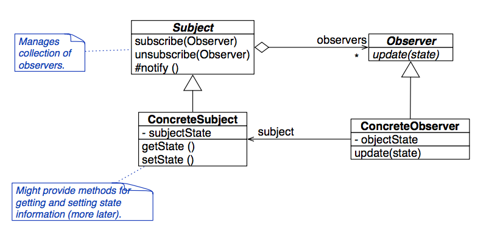

### Model View Controller \(MVC\) Pattern

MVC is three design patterns in one. It uses the Composition pattern since all the View objects are part of the View superclass, it uses the Strategy pattern to translate between events caught by View objects and operations on the Model, and it uses the Observer pattern to communicate between the View and the Model.

Concretely, this means that the Model class has no references to anyone at first, the Controller class has a reference to the model, and the View has references to both the Model class and the Controller class. This allows any new instantiated View to subscribe itself to the model, and to let the Controller class know about any events it has gotten.

> The fact that we identify the mapping between UI events and model updates as the Strategy pattern is kind of confusing, since don't we need a proper Strategy class with subclasses to use the strategy method?
>
> Actually, that isn't necessarily the case. The way to think about this part of MVC is to imagine the View as the card player, and the Controller and Model as one combined strategy class. View has a pointer to the Controller in order to communicate, and the behavior of the Controller and Model is always changing, so it's as if we're using a strategy pattern to adapt the Controller and Model, even though we never swap out any pointers.

There are loads of examples of MVC. Think about the Straights game that we implemented--the View was a gtkmm window, there was a Controller class, and the Card, Deck, Player, Straights etc. classes made up the Model.

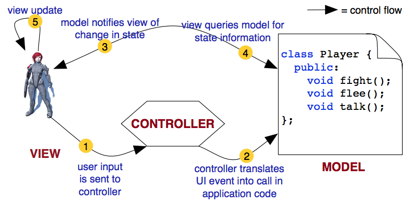

# Object Oriented Design Principles

### Open Closed Principle

**Principle:** A module should be open for extension but closed for modification.

We can achieve this with inheritance, or with composition. Using inheritance, we could have the client use the existing abstract base class reference which it can switch out for different extended subclasses of that abstract base class. Or we could use composition and simply have that existing abstract base class be a member of our new extended class.

> Using an abstract base class to reference different subclass methods like this is called dynamic polymorphism \(a fancy word for method overriding\). Method overloading is static polymorphism.

Which do we choose? We should favor inheritance when we're trying to take advantage of **subtyping**, which is when we can use our extended class wherever we used to have our base class. We should also favor inheritance when we know we're going to be using the entirety of the base class interface.

We should favor composition for simple use cases when we don't _need_ to override the function. Composition is more flexible since the wrapper class is able to cast the existing class to whatever they choose, thus changing the data and functions of the class at runtime. Also, composition by definition obeys the Single Responsibility Principle and prevents class hierarchies from getting too bloated with subclasses.

> **BP:** Favor composition over inheritance

**Delegation:** returning the value of another class's method when your method is called, composition uses this to simulate method inheritance

### Single Responsibility Principle

**Principle:** Encapsulate one design decision or responsibility per module.

Consider a Deck class which has the methods: hasNextCard\(\) : bool, nextCard\(\) : Card, addCard\(Card\), removeCard\(Card\), and shuffle. The Deck is responsible for iterating over the contents, the order of the contents, and maintaining the membership of the contents. That's technically 3 responsibilities, which is kind of pushing it, but since these responsibilities all have high cohesion, it's OK.

### Liskov Substitutibility Principle

**Principle:** A derived class must be substitutable for its base class.

A subclass has an "is-a" relationship with its parent class, so it should handle all of its parent class's responsibilities as well. A rule of thumb: if it looks like a duck and it quacks like a duck but it needs batteries, it doesn't satisfy LSP.

Consider a bounded stack, which is stack that only stores a limited number of items. Is this bounded stack substituable for its superclass stack? Clearly not. But it is substitutable the other way around!

What about a count stack, which counts how many items there are in the stack? Yes, this is substitutable for the parent stack class.

#### LSP Signature Rules

The subclass has to match all the signatures of the superclass methods it overrides. You can't change the parameters to the method, since that would be overloading instead of overriding, and if you change the return type, you can only change it so that it's a subtype of the original type the superclass used to return.

#### LSP Method Rules

The specification of a subclass must be as strong as or stronger than that of its superclass. It should have preconditions that are no stronger than that of the base class, and its postconditions should be no weaker.

#### LSP Property Rules

The subclass has to preserve all the invariants of the superclass as well as all of its required optimizations. An $$O(2^n)$$ algorithm is not substitutable for an O\(n\) one.

**Information hiding: **hide design and implementation details; when using composition, use the accessors and mutators for the existing abstract base class inside your wrapper methods so that you can reveal less about what's actually happening

### Law of Demeter

1. You can play with yourself.
2. You can play with your toys \(but you can't take them apart\).
3. You can play with toys that were given to you.
4. You can play with toys that you made yourself.

This is a metaphor for how encapsulated classes obeying the Law of Demeter can only access their class's data members and functions, and parameters which were given, and any object the class itself constructed. In particular, if you're given a reference to an object, to say, output, you should never try to call the methods of that object, since you don't own it, so you shouldn't change it.

Encapsulation has pros and cons.

Pros:

- reduces coupling between client and supplied code
- class interface easer to understand for someone who didn't write the code
- can test using stubs for both client and composition

Cons:

- interface increases in size
- performance hit due to indirection \(unlike using friends\)

# Refactoring

**Refactoring:** improving the design of code i.e. reducing coupling, improving cohesion, consolidating near duplicate code, improve understandibility, maintainibility etc.

After refactoring, we should run full unit tests to see if we messed anything up while cleaning, but we often don't need system level tests, since we didn't change the functionality at all.

**Technical debt:** the idea that doing quick things rather than clean designs leads to bad designs which are harder to maintain and add to over time, which then means that bad design decisions will fossilize over time

Ideally, you're refactoring a little bit every time you make a contribution \(new function, bug fix, code review etc.\), since refactoring sooner rather than later leads to less technical debt. However, if refactoring is invasive and is going to take up an inordinate amount of time for others on your team to understand, don't do it. Similarly, if refactoring is time-consuming, expensive, or requires a ton of testing, don't do it. Also, if the code is garbage and it'd be easier just to write it from scratch, you could do that instead.

#### The Rule of 3

The first time you need to do something, do it. The second time, cringe and do it again. The third time, refactor the code \(this is Just-in-time abstraction\).

**Bad smells:** signs that you should refactor e.g. duplicate code, long method, large class, long parameter list etc.

# Design Patterns III, IV

### Composite Design Pattern

**Problem:** composite object consists of several heterogenous parts \(i.e. a internal node class and a leaf class\)

**Solution:** create a uniform interface for the object's components

Consider modelling a directory, which could contain directories or files. The client doesn't care about the distinction between files and directories, so we can simply have the Directory and File classes both subclass from the the same abstract base class Component and thus have the same uniform interface. This works because Component actually defines the interface for both the leaf case \(File class\) and the internal node case \(Directory class\), and each subclass just overrides the part of Component which makes sense for it to override.

Of course, all of this is definitely violating Liskov's Substitutability Principle. Clearly, leaf classes shouldn't be able to be substituted for internal node classes and vice versa \(what does it mean to add a node to a leaf?\). This is the safety tradeoff that we have to make to get a uniform interface for the composite object. In general, we can make this tradeoff when:

- The client is going to treat the structure uniformly
- We have to traverse the whole composition
- There exist reasonable default implementations of operations

If these don't hold, we could implement the composite design pattern with distinct leaf and internal node classes, and this way, we could catch all illegal operations made to either class.

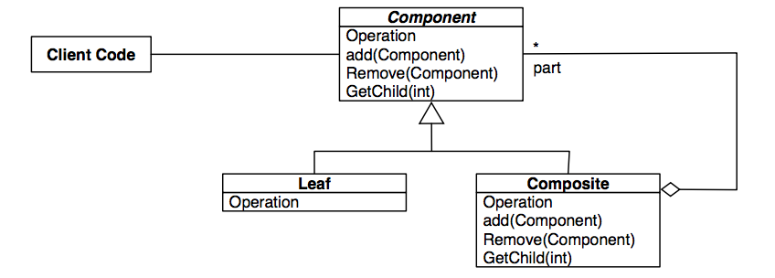

### Iterator Pattern

**Problem:** we want to iterate over a collection of objects

**Solution:** we have the collection class we're interested in implement its own specialized iterator class

An iterator takes in an instance of the Collection class it's iterating over and implements methods to check if the next element in the collection exists, to walk over to the next element in the collection, and to get the current element. There can be multiple iterators at once iterating in different orders. The specific concrete Collection could be a subclass of a general Collection class, and the specific concrete Iterator class could be a subclass of a general Iterator class. This way, the client can get generic iterators and collections.

Iterating over list structures is pretty intuitive, since the Collection class probably already implements all the methods necessary to get the correct element in the collection, and all the iterator needs to do is keep track of an index.

To implement iterators over composite structures is pretty weird though. We keep a stack of IteratorNodes in the Iterator, each of which has a reference to a Component and a cursor to check how far we've looked into that particular Component.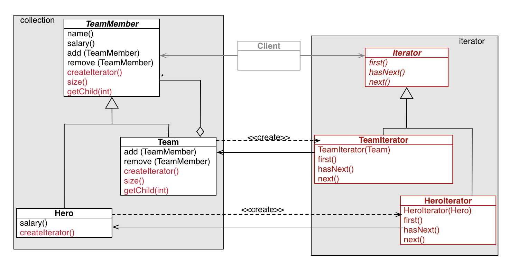

### Decorator Design Pattern

**Problem: **many independent features are needed in some combination at runtime

**Solution: **build wrapper classes with the same interface as your original class

Consider a class which draws a window on your screen. Windows have a ton of independent features, like what buttons they have, whether they have a horizontal or a vertical scrollbar, or how they draw their content. Using inheritance to solve this kind of problem would be a very bad idea, since not only do we have a ton of features, we could have a window which uses any subset of those features \(consider a HorizontalScrollBarWithBorder class and a VertialScrollBarWithBorder class\). So instead, we'll use composition to create successive wrapper classes that add functionality.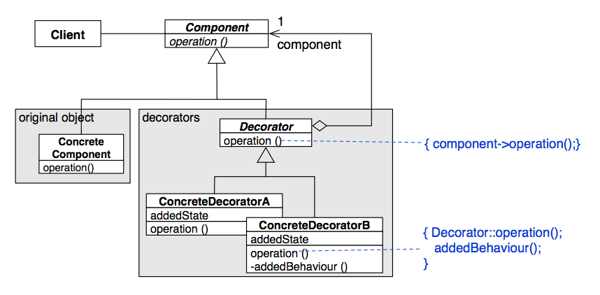

### Factory Design Pattern

**Problem:** encapsulate the code that creates concrete objects

**Solution:** use the Template Method

By definition, we can't instantiate abstract base classes. This sucks for the client, because at some point, they're going to have to program to our implementation of the subclasses, instead of the abstract base class interface that we designed for them.

So, to fix up this issue, we could build a simple factory. This gist of it is that the client gives us some parameters for an object they want to instantiate, the simple factory instantiates it, and then gives back to the client the abstract base class that it wants to work with. Simple factory is technically not a design pattern, since this would be pretty specific to the type of object we're creating.

What if we want a general polymorphic factory? In that case, we can try a Factory Method Pattern approach, which uses an abstract Creator class to define a template/factory method calls operations that ConcreteCreators classes implement in order to create different kinds of objects. For example, you could have an abstract Creator class called ShapeFactory, which has child classes SquareFactory and CircleFactory which know how to make Squares and Circles that they return as Shapes.

Now we have a polymorphic class ShapeFactory, but instantiating one still isn't very useful, since it can only make one type of shape at a time. To make a polymorphic ShapeFactory which can manufacture both Squares and Circles, we can use the Singleton design pattern with composition to make ShapeFactory hold a SquareFactory and a CircleFactory.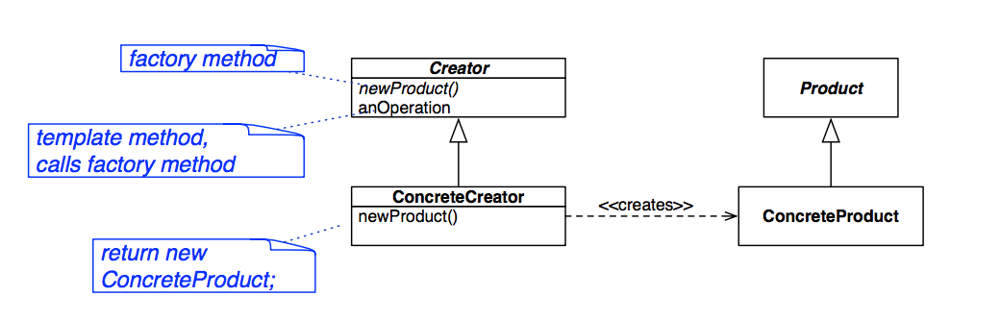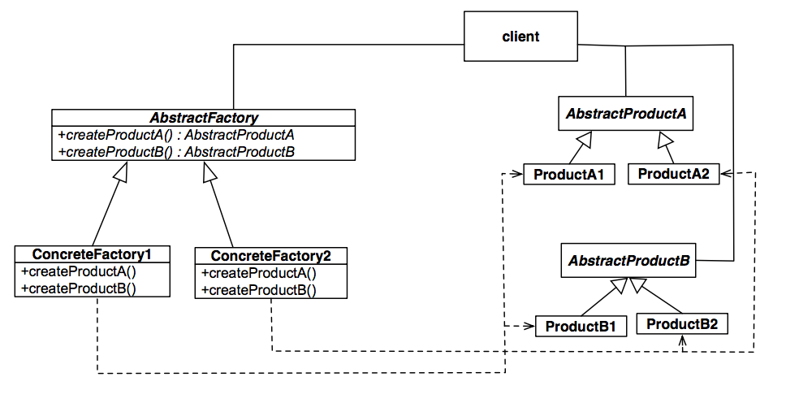

# STL Containers

The STL is composed of:

- Generic containers of any element type e.g. vector, stack, deque etc.
- Different kinds of iterators for those generic containers
- Algorithms which perform operations on a range of elements in containers via iterators

If you're using a STL generic container which has order, you should probably implement a comparison operator on the type of object you want to insert, or define a functor. A functor is a class which overloads operator \(\) so that you can call the functor object like a method.

Note that the STL uses value semantics, so if you're putting a type into an STL container, make sure that it has copy and assignment operations overloaded, since the STL copies things around a lot.

A related point to how much the STL copies things around: try to have containers of object pointers instead of the object itself. This way, you're just copying pointers, and you don't get object slicing \(assigning `Base b = Derived d;` gives you b as a Base class!\).

### Sequence Containers

Containers which store things in the order they were added e.g. vector, linkedlist, deque, list \(doubly linked list\), forward_list \(singly linked list\) etc.

### Container Adapters

This is what you get if you apply the Adapter design pattern to containers e.g. stack, queue, priority_queue etc.

The STL doesn't believe in inheritance, so you shouldn't inherit from its classes.
