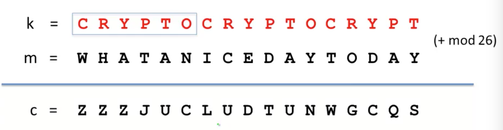
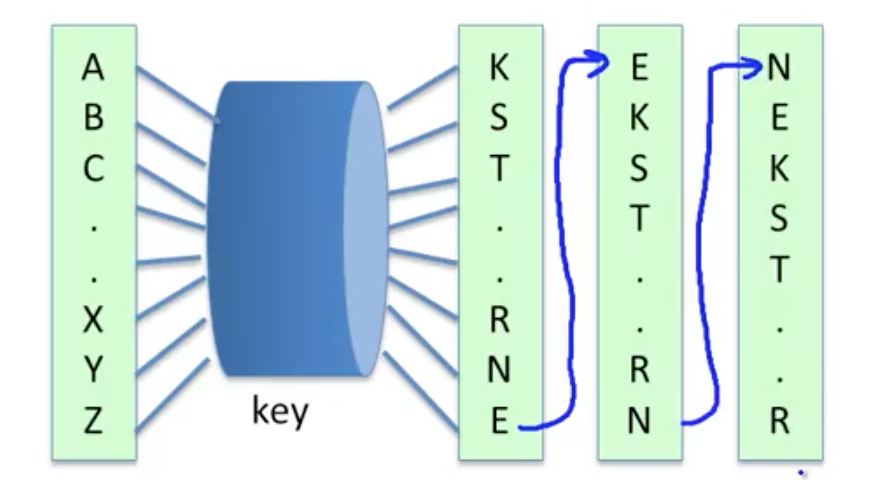

[Cryptography I](https://www.coursera.org/learn/crypto)

# Week 1

## Section 1: What is Cryptography?

### Core Crypto

**Secure key establishment:** Alice and Bob agree on a shared key and have verified each others identities

Cryptography can be used for secure communication, digital signatures, anonymous communication, and anonymous digital cash. These are topics which we will explore more later in this course.

We can also use cryptography in order to do secure protocols (elections, auctions). 

**Theorem**: Any protocol which can be done with a trusted authorithy can also be done without a trusted authority.

###### Zero knowledge (proof of knowledge):

Suppose there is some $N  = p * q$  where $p, q$ are some very large primes. Suppose Alice knows $N, p, q$ and Bob knows $N$. We can prove to Bob that Alice knows the factorization of N while keeping Bob in the dark as to what $p$ and $q$ are.

###### Cryptography is a science

The three steps of crptography:

1. Precisely specify threat model
2. Propose a construction which thwarts the threat
3. Prove that breaking the construction under the threat model will solve some underlying hard problem

### History of Cryptography

#### Symmetric Ciphers

Suppose Alice and Bob agree on some secure key $K$. Alice has an encryption cipher function $E(K, m)$ which takes in a plaintext message $m$ and the secure key $K$, and then outputs an encrpyted ciphertext $C$. Bob then obtains $m$ by feeding $C$ and $K$ into his decryption cipher function $D(K, C)$.

This is known as a symmetric cipher because the Alice and Bob use a single secure key $K$.

#### Historic Ciphers

All of these ciphers are broken.

##### Substitution cipher

Suppose that $K$ is some permutation of the alphabet which maps each plaintext character to a new alphbet letter. Then encryption is done by substituting the plaintext character with its corresponding character in the mapping $K$, and decryption is done in the reverse process.

There are $26!$ possibilities for $K$, but we often don't have to try all of them in order to break the substitution cipher. The most frequent letter in English is 'E'. So, if we count the letter frequencies in a sufficiently long ciphertext, we can identify the letter mapping in $K$ corresponding to 'E'.

Similarly, we can do this with the second-most frequent letter in English, and the third-most frequent, and so on, until the frequencies probabilities are even enough that this approach doesn't help us anymore. At this point, we can do a similar process with the frequency of pairs of letter (called digrams), or triples of letters (called trigrams). Eventually, we will derive $K$ based on only $C$, which is called a ciphertext only attack.

##### Vigener cipher

Using the Vigener cipher, we concat the keyword $K$ as many times as need be so that it is as long as m. Next, we assign each letter a numeric value, and perform an addition of each letter in $K$ with its corresponding letter in $M$, which we can then apply$\mod(26)$ to in order to get the ciphertext character. To decrpyt, we can just write out $k$ again and subtract instead of adding.

Supposing we know the length of $K$, the Vigener cipher reduces to the problem of decrypting the substitution cipher. We can divide the ciphertext $C$ into sections of length $K$, and the first character in each of these sections must all be encrypted using the same character first character in $K$. We can then apply the letter frequency analysis from before in order to identify the encryption for the most common character 'E'. Suppose that in the ciphertext, 'E' was encrpyted as 'H'. Then, we can derive that the corresponding letter in $K$ is $H - E$, since by definition, $H = K[0] + E$. Once we know $K[0]$, we can then decrypt all the letters encrpyted by $K[0]$ (i.e. every $K$th character).

Using this process over each $K + i, \forall i \in \mathbb{N}$ letter, we can then decrypt all of $M$ from $C$. We can even use this as a ciphertext only approach by simply guessing the length of $K$ each time.

##### Rotor Machines

The Hebern machine is an encryption machine that uses a single rotor to rotate its substitution table each time you encode a letter.

This could still be broken by letter frequency attacks, and so rotor machines became more and more complicated, implementing multiple rotors and plugboards. The most famous of these was the Enigma, which had 3-5 rotors which rotate at different rates. This was then broken at Bletchley Park during WWII.

##### Data Encryption Standard

Around 1974, the American federal government implemented the DES (Data Encryption Standard) to guarantee the strength of the encrpytion in industry products it was buying. DES encrpyted 64 bits or 8 characters at a time and has a keyspace of $2^{56}$. It has since been deprecated for having a keyspace which is too small and can be decrpyted by bruteforce.

# Section 2: Discrete Probability

Let $U$ be the universe of possibilties. We will define $U$ as the *finite* set $\{0, 1\}^n$, the set of all possible $n$ bit strings. (Indiscrete probabilty has inifite possibilities, and isn't very good at keeping them secret.)

We define the probability distribution $P$ over $U$ is as a function such that $\sum{P(x)} = 1$. $P(x)$ describes the probability or weight of $x$, and ranges between $0$ and $1$.

It follows that if $P(x) = \frac{1}{\vert U \vert}$, then the probability distribution is uniform, and if $P(x_0) = 1$, $P(x) = 0, \forall x \ne x_0$, then $x_0$ is the only possibility for the bit string.

Since $U$ is finite, we can define a distribution vector, which lists the probability of each element in $U$.

Let $A \subset U$. Then, we define $P(A) = \sum_{x \in A}{P(x)} \in [0, 1]$. In English, this means that the probability of the subset of $U$ known as $A$ is the probability of any of the string in $A$. We call the set $A$ an event.

Suppose we have 2 events $A$ and $B$. Then the probability that either $A$ or $B$ occurs is bounded by $P(A) + P(B)$.

A random variable $X$ is a function $X: U \rightarrow V$, meaning that $X$ takes in numbers from the finite universe $U$ and applies a function, inducing a distribution over the output set of random numbers $V$.

The uniform random variable $r$ is defined as obeying $P(a) = \frac{1}{\vert U \vert}, \forall a \in U$. Thus, $r(x) = x, \forall x \in U$.

A deterministic algorithm is one which gives you the same output everytime when you give it the same input. A randomized algorithm takes in the input which you give it and a sample from a random variable, meaning that the same input could result in different output. Thus, we could think of a randomized algorithm is a random variable in itself.

Two events $A$ and $B$ are indepedent if $P(A, B) = P(A) * P(B)$.

The `XOR` of two bit strings is their bitwise addition modulo 2. If you apply `XOR` to a random variable Y and an independent variable X, you will get Z, an independent variable.

# Section 3: Ciphers 1

We define a cipher as a pair of efficient algorithms $E$, an encryption function, and $D$, a decryption function. Every cipher satisfies $D(K, E(K, m)) = m$, known as the consistency equation.

### One Time Pad

$K$ for the One Time Pad is an n bit string, encoding a n bit message string. To encode, we define $C = E(K, m) = K \oplus m$. To decode, we use $D(K, C) = K \oplus c$.

Let's see that it satisfies the consistency equation:

$\begin{align} D(K, E(K, m)) &= D(K, K \oplus m) \\ &= K \oplus K \oplus m \\ &= m\end{align}$

This works because any bit `XOR`'d with itself is 0, and 0 `XOR` any bit is that bit.

**Exercise:**   Consider if you had the message $m$ and its encryption $C$. Could you compute $K$?

> We know that $C = K \oplus m$, so if we compute $C \oplus m = K \oplus m \oplus m = K$, then we can obtain $K$.

The advantage of this method is that encoding and decoding is extremely fast. However, the disadvantage is that this involves keys which are the length of the plaintext. If you had a method to securely transmit a key of such a length, then you might as well transmit the plaintext by that method as well.

#### Is OTP is secure?

We define a cipher (E, D) as having perfect secrecy if $\forall m_0, m_1, \in M$ and $\forall c \in C$, $P(E(K, m_0) = C) = P(E(K, m_1) = C)$. In other words, given the same ciphertext and the same key, it is equally probable that the ciphertext was derived from two distinct message. So, given a particular ciphertext, it is impossible to tell what $m$ was encoded. Under perfect secrecy, a ciphertext only attack is impossible.

OTP has perfect secrecy.

> **Proof:** We know $P(E(K, m) = C) = \frac{\vert K \in \mathbb{K} \mid E(K, m) = C \vert}{\mathbb{K}}$. For perfect secrecy to hold, we must have that $\forall m_0, m_1, \in M$ and $\forall c \in C$, $P(E(K, m_0) = C) = P(E(K, m_1) = C)$. So, $P(E(K, m) = C)$ must be a constant. 
>
> In other words, the numerator of $P(E(K, m) = C)$, or the number of keys such that $E(K, m) = C$, must be a constant number in order for the cipher to have perfect secrecy.
>
> For OTP, if $C = E(K, m) = K \oplus m$, we can compute $K$ as $C \oplus m$, so there must be only one choice of $K$ for every given $C$ and $m$.
>
> Thus, $P(E(K, m) = C) = \frac{\vert K \in \mathbb{K} \mid E(K, m) = C \vert}{\mathbb{K}} = \frac{1}{\mathbb{K}}$, which is a constant for all $m$.
>
> Thus, OTP has perfect secrecy.

**Theorem:** Perfect secrecy requires that the length of your key be at least as long as the length of your message.

So in fact, the OTP is the optimal solution for perfect secrecy, since its keys are only as long as its messages. Thus, all strictly perfect ciphers are not practical due to their unwieldy key lengths.

### Stream Ciphers

This cipher adapts the OTP to be practical. The key idea is to replace the purely random key which OTP uses with a "pseudorandom" key. A pseudorandom key is generated by a PRG (pseudo-random generator), which is a function that maps numbers from a seed space to a much larger output space.

We require the PRG to be efficient (computable) and we would like the output of the PRG to "look" random.

So, supposing we had some PRG function $G(K)$, we can redefine OTP's encoding as $C = E(G(K), m) = G(K) \oplus m$. Similarly, to decode, we use $D(G(K), C) = G(K) \oplus c$. 

**Exercise:** Can a stream cipher have perfect secrecy?

> In general, no. If the random seed being used was always the length of the message, we could argue that the stream cipher has perfect secrecy, but choosing a random key like this defeats the purpose of using a stream cipher in the first place.

Stream ciphers do not have perfect secrecy. In fact, as we saw with OTPs, the notion of perfect secrecy as a measure of security is a horrendously unuseful one, since its definition requires random keys as long as the message. We will have to define a new notion of security.

We'll explore this new definition of security more in future lectures, but for now, let's impose some requirements on our PRGs.

#### PRGs must be unpredictable

Suppose that a PRG is predictable. In the mathematical sense, this means that there exists some length $i$ for which if you know the first $0$ to $i$ characters of the bit string $G(K)$, then you can predict some remaining characters of $G(K)$.

This is insecure, since attackers often know bits and pieces of information which will appear in the cipher. For example, the "from:" field will appear in every email.

Let's define this more formally.

We say that a PRG $G(K) \rightarrow \{0, 1\}^n$ is predictiable if there exists an efficient algorithm $A(G(K))$ and $1 \le i \le n - 1$ such that $P(A(G(K)\_{1 \ldots i}) = G(K)_{i + 1}) \ge \frac{1}{2} + \epsilon$, for some non-neglible $\epsilon$. Then a PRG is unpredictable if for all $i$, no such $A(G(K))$ exists.
