> Professor Lin Tan, Spring 2018

## Lecture 1: Intro

**static analysis:** inspecting code in a non-runtime environment for bugs e.g. walkthrough code, code inspection

**dynamic analysis:** monitor system memory/performance and verify that the system has the correct behaviour during program execution e.g. white box or black box testing

## Lecture 2: Daikon

Daikon is a tool for dynamic analysis. It tries to recover invariants from programs by running the program many times and examining the internal values in the program for patterns. Then, you can enforce those invariants using `assert` statements to detect bugs.

Suppose you had the following program:

```c++
// Sum array b of length n into variable s.
i = 0; s = 0;
while(i != n) {
	s = s + b[i];
	i = i + 1;
}
```

This has the loop invariants $0 \le i \le n$ and $s = \sum_{j}^{0 \le j \le i}  b[j] $. It also has preconditions and postconditions which Daikon will also get.

To discover these invariants, we would generate 100 random arrays and run the program on each of them. Daikon has an _instrumenter_ which adds code to write variable values (which are in scope) into a data file when the program starts, when the program finishes, and at each iteration of the loop. Adding code like this is called a _source-to-source_ translation.

Daikon will print out all of the invariants in a list, separated by what point in the program it refers to. On the side, it will print how many different values it has for that variable throughout all test cases.

```
15.1.1:::LOOP							(1107 samples)
   	N = size(B)							(7 values) // only 7 different sizes were given
   	S = sum(B[0..I-1])					(96 values)
	N in [7..13]						(7 values)
	I in [0..13] 						(14 values)
	I <= N								(77 values)
	B									(100 values)
    	All elements in [-100..100]		(200 values)
   	B[0..I-1]							(985 values)
     	All elements in [-100..100]		(200 values)

15.1.1:::END
	...									(...)

15.1.1:::BEGIN
	...									(...)
```

There is no guarantee of completeness or soundness with Daikon.

Daikon generates possible invariants by looking at all the variables in scope at a given program point, and then trying to to fit different kinds of invariants to them. This also includes derived variables like the length of an array, the sum of an array, the max or an array, the element at the current index or the current subarray.

For numbers, it will try:

- unary invariants e.g. $x = a$, where $a$ is some constant
- n-ary invariants e.g. $x \le y$, where $y$ is another variable

For sequences it will try unary invariants (e.g. sorting), scalar invariants (e.g. membership), and sequence invariants (e.g. subsequence invariants).

It just picks an invariant and then tries it until it fails, which means that the runtime is:

- quadratic in the number of variables at a program point (?)
- linear in the number of invariants checked
- linear in the test suite size
- linear in the number of program points

We can also show that an invariant is true using statistical analysis rather than experimentally. Suppose we were trying to show that $x \ne 0$ for $v$ values of $x$ in range of size $r$. This is the same as proving that $(1 - \frac{1}{r})^v$ (the probability that $x$ is not 0 throughout $v$ trials) is 1.

| Static analysis                                                                                                                                                                                                                    | Dynamic analysis                                                 |
| ---------------------------------------------------------------------------------------------------------------------------------------------------------------------------------------------------------------------------------- | ---------------------------------------------------------------- |
| **alias problem:** difficult to determine whether separate memory references point to the same area of memory, i.e. how do we know that `Object foo = bar` means that both `foo` and `bar` will be modified on an update to `foo`? | depends on the quality of the inputs and the runtime environment |
| false positives                                                                                                                                                                                                                    | run time over head                                               |
|                                                                                                                                                                                                                                    | false negatives                                                  |

## Lecture 3: Fault, Error, Failure

**fault:** static defect in code (incorrect lines of code)

**error:** an unobserved error causing incorrect internal state

**failure:** an observed error causing incorrect external behaviour

We need to know the specified and desired behaviour before we can determine whether something is fault, error, or a failure.

Suppose we had the following program:

```java
// Effects: if x is null, throw a NullPointerException
//			otherwise, return the index of the last element in x that equals y
//			if no such element exists, return -1
public int findLast(int [] x, int y) {
	for(int i = x.length - 1; i > 0; i--) { // fault fixed by i >= 0
      if(x[i] == y)
        return i;
	}
    return -1;
}
```

We would not execute the fault if we had the test case `x = null`. We could execute the fault without resulting in an internal error state if we gave the test case `x = []` or if `y` was in any position in `x` which is not position 0.

We could have an error, but no failure if we had an input where `y` is not in `x`, since the program counter would be wrong on the final iteration of the loop, but we would see no failure in the output.

For a failure to be observed, we must have:

- Reachability: the fault causing the program must be reached and executed
- Infection: after executing the fault, the internal state of the program must be incorrect
- Propagation: the incorrect internal state of the program must propagate to some ouput

We can address the fault at different stages:

- design stage, fault avoidance e.g. better design
- implementation stage, fault detection e.g. testing
- shipped stage, fault tolerance e.g. redundancy, isolation

## Lecture 4: Structural Coverage

**Test case**: Informally, it is input, given an expected output. Formally, it is the test case values (input values), expected results (output values), prefix values, and postfix values necessary to evaluate software under test

**Test set**: a set of test cases

**Expected results**: The result that will be produced when executing the test if and only if the program satisfies its intended behaviour

**Test requirement**: A test case that covers part of a given rule e.g. The rule is that ice cream cones come in vanilla, chocolate, or mint. The test requirement would be to test one chocolate cone. TR means a set of test requirements.

**Coverage criterion**: Rule or collection of rules that generates test requirements in order to fully cover that rule e.g. CC: Cover all flavors of ice cream. TR: Test flavors chocolate, vanilla, and mint.

#### Measuring test sets

**Coverage:** Given a set of test requirements TR for a coverage criterion C, a test set T satisfies C $\iff$ for every test requirement tr $\in$ TR, at least one t $\in$ T satisfies tr.

**Line coverage:** Testing every line of code, often infeasible due to dead code.

**Coverage level**: Given a set of test requirements TR and a test set T, the coverage level is the ratio of the number of test requirements satisfied by T to the size of TR e.g. test set 1 has 2/3 = 66.7% test coverage

**Criteria Subsumption:** A test criterion C1 subsumes C2 $\iff$ every set of test cases that satisfies criterion C1 also satisfies C2.

**Edge coverage:** For every true/false branch, both need to be a test case. Also called branch coverage (node coverage is also called statement/line coverage).

**Q:** What's the difference between edge/node coverage? Which is stronger?

**A:** Edge coverage subsumes node coverage. However, node coverage does not subsume edge coverage. Consider the following code:

```
if(a) {
  foo();
}
```

You can cover this using node coverage by setting a to true, but under edge coverage, you're able to test the other case in which a is not true and the program terminates.

```
int d[2]; // node 1
if(x >= 0 && x < 2) { // node 1
  print x // node 2
}

if(y > 2) { // node 3
  print d[x] + y // node 4
}

exit // node 5
```

Here, path [N1, N2, N3, N4, N5] satisfies node coverage but we don't find the buffer overflow bug. Path [N1, N3, N4, N5] creates a buffer overflow when executing `print d[x] + y`.

### Graph coverage

Given a block of code, we can represent the statements as nodes and the branches as edges in a **control flow graph**. In such a graph, we will always have an initial and final node.

**subpath:** a subsequence of a path where you cannot skip over any nodes in the original path e.g. [1, 2 ,5] is a subsequence of [1, 2, 3, 5, 6, 2], but it is not a subpath

**test path:** A path from $N_i$ to $N_f$ (initial to final node), can be length 0. We can usually map from test cases to test paths 1 to 1, except in the case where the code is non-deterministic (e.g. contains some call to `random()` )

**syntactic reachability:** looking purely at the code, a node n is syntactically reachable from $N_i$ if there exists a path from $N_i$ to n

**semantic reachability:** a node n is semantically reachable from $N_i$ if there is a path from $N_i$ to n on some input. This is an undecidable problem due to the halting problem being NP complete.

For example, consider the following code:

```python
if False:
  print("unreachable")
print("reachable")
```

The node on line 2 is syntactically reachable, but not semantically reachable.

We only consider reachability as syntactic reachability in this course. We define reach(x) as the subgraph reachable from node x. We only consider reachable nodes from $N_i$.

**SESE graphs:** Single entry single exit graphs

We say that a path visits a node if the path contains that node. We say that a path A tours another path B if A contains B (same as saying that B is subpath of A).

We can redefine node and edge coverage using control flow graph lingo:

**node coverage:** TR contains all reachable nodes in G

**edge coverage:** TR contains all reachable paths of length [0, 1] in G. We define it in this way so that graphs with only 1 node will still only satisfy edge coverage if they visit that node.

**edge pair coverage:** TR contains all reachable paths of length [0, 2] in G

**simple path:** a path in which no node appears more than once in the path, except if the path is a cycle

**prime path:** a simple path of maximal length

**prime path coverage:** TR contains each prime path in G

**complete path coverage:** TR contains all paths in G

**specified path coverage:** TR contains a specified set S of paths

Sometimes, due to the structure of a program, you cannot tour path directly. For example, consider the path q = [1, 2, 4] in the following graph. Suppose you must go to node 3.

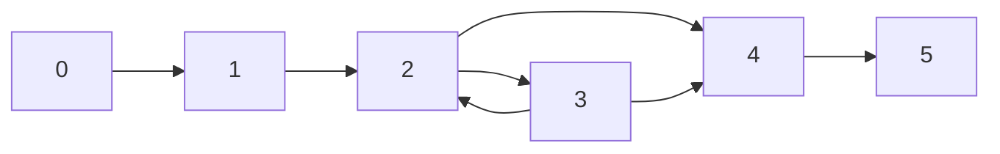

Then, we could tour q using **side trip** to node 3 through the test path [0, 1, 2, 3, 2, 4]. Or we could tour q using a **detour** to node 3 using the test path [0, 1, 2, 3, 4].

If a test path p tours subpath q with a sidetrip or a detour, then every edge in q is also in p, in the same order.

**best-effort touring:** only use side trips or detours for test requirements which cannot be toured directly

**round trip path:** prime path of nonzero length that starts and ends at the same node

**simple round trip coverage:** TR contains at least one round-trip path for each reachable node in G that begins and ends a round-trip path

**complete round trip coverage:** TR contains all round-trip paths for each reachable node in G

**bridge coverage:** TR contains all bridges in G

### Graph coverage subsumption relationships

Here, the arrow points in the direction of subsuming e.g. edge pair coverage subsumes edge coverage.

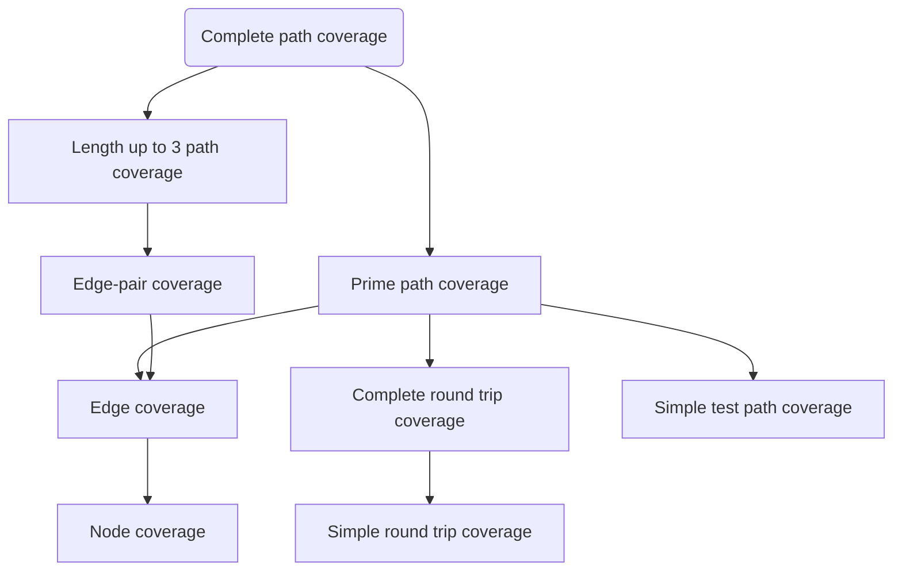

## Lecture 5: Control Flow Graphs

We can simplify a CFG by grouping code into **basic blocks**.

**basic block:** piece of code with one entry point and one exit point, cannot have other nodes pointing to something in the middle of the basic block

An example of a control flow graph for a for loop:

```java
for(int i = 0; i < 57; i++) {
  	if(i % 3 == 0) {
    	System.out.println(i);
	}
}
```

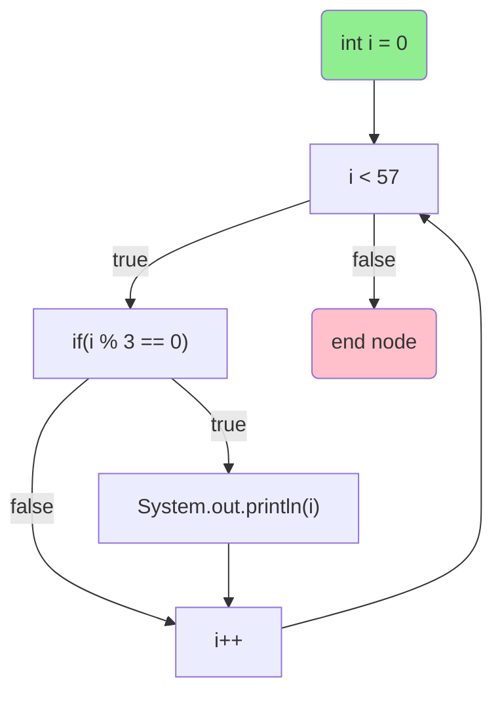

## Lecture 9: Concurrency

**race:** two parallel accesses to the same state, at least one of which is a write, causing different program output depending on which access gets there first

We can detect races using Helgrind, which is a part of Valgrind.

`pthread_mutex_lock` blocks the thread until the resource is available for locking, and then locks the resource. `pthread_mutex_trylock` checks if the resource is available without blocking the thread. `pthread_mutex_unlock` releases the resource.

**re-entrant locks:** a thread can request a re-entrant lock multiple times and then must release it the same number of times

Notice that we have to pair up locks and unlocks, always. We can derive this relationship, as we will see in later lectures.

If we **spinlock** a resource, we need to disable interrupts, since the next process which interrupts us might also need the resource and have to be stuck there waiting for the resource. In this case, the system becomes deadlocked. Spinlocking means that you write blocking code which repeatedly checks if the lock is available.

## Lecture 10: Coverity and iComment

**Coverity:** static tool which finds bugs in large programs

Bug detection programs don't know the correct output, so they rely on finding **contradictions** and **deviances** in the source code. A contradiction will always be an error.

**must beliefs:** beliefs inferred from the code which must be true e.g. `x = *p / z` implies that p is not null and z != 0, `if(p == NULL)` implies that 1) we did not know the value of p beforehand and 2) p is null on a true path and not null otherwise.

We check that the must beliefs are the same at different points in the code.

**may beliefs:** beliefs inferred from the code which may not be true e.g. `A(); B();` implies that A() and B() are paired.

We rank may beliefs by confidence (calculated as the ratio of the number of errors found over the number of checks). An error is a place where the code has violated some may belief, and a check is a place where that may belief is not violated.

It's difficult to catch **use-after-free** errors because there can be undocumented system functions which have a side effect of freeing a pointer. So, we just assume that all functions free all of their arguments and report errors based on confidence.

Suppose we wanted to catch errors caused by functions returning null when the programmer doesn't expect it to. We'll assume that all functions can return null and report errors based on confidence.

Suppose we want to catch errors where a pair of functions was not called together. We can derive pairs by assuming that all pairs of functions are a valid pair and reporting errors based on confidence.

**iComment:** static tool which extracts specifications from comments

It's tough to know exactly what comments are useful and what comments are not, so iComment focuses on checking for errors based on comments about locks i.e `\* Caller must have lock *\` implies that the caller for the function holds some lock, or that the comment is wrong.

## Lecture 11: Automated testing & Bug detection tools

#### Tools for Java/JavaScript

**FindBugs:** static bytecode analyzer, detects: off-by-one, null pointer dereference, read() return should be checked, return value should be checked, etc.

**PMD (doesn't stand for anything):** static source code analyzer, detects: unused variables, empty catch blocks, unnecessary object creation, copy-paste-detector (duplicate code)

**Google Error Prone:** static analysis tool which catches errors at compile time, focus on rules that produce very few false alarms e.g. type errors

**EvoSuite:** dynamic bytecode analyzer which generates JUnit tests, form of mutation testing (type of software testing where we mutate certain statements in the source and check if the test cases are able to find the errors).

**Randoop:** dynamic tool which generates random sequences of method calls looking for object contract violations (try to construct complex objects without considering illegal argument exceptions)

**Java Path Finder:** static bytecode analyzer which checks for concurrency bugs by default and can detect deadlocks and unhandled exceptions

**Korat:** generates Java objects from a given representation invariant specification written as a Java method. Korat then uses the generated objects to test other methods in the class

**Daikon:** recover invariants from programs by running the program and examining internal/external values

**ESC/Java - Comaq:** checks Java programs against specification written in JML (Java modelling language) e.g. `@public invariant balance >= 0 && balance <= MAX_BALANCE`

#### Tools for C++

**cppcheck:** static analyzer which detects: bounds checking, memory leaks, division by zero, null pointer, obsolete functions, uninitialized variables etc.

**valgrind:** dynamic tool which detect memory errors e.g. illegal read/write, use of uninitizliaed values, illegal frees, memory leaks

**helgrind:** dynamic tool which detects errors in multi-threaded programs

**Flawfinder:** static tool which finds security bugs based on known patterns e.g. buffer overflow risks, format string problems, race conditions

**Clang static analyzer:** C/C++ compiler which includes a static analyzer (checks for null pointers, division by zero, memory leaks, etc.)

**American fuzzy lop:** dynamic security oriented fuzzer (testing program which throws large amounts of random data at the program under test in order to generate errors) using genetic algorithms which generates test cases

**Sparse:** static parsing tool used to find faults in the Linuz kernel space e.g. user/kernel space violations, null pointers

**Splint:** static code analyzer for C which checks for security vulnerabilities and coding mistakes

**symbolic execution:** values for variables in the program which cause it to go down different branches of execution. Each leaf of the symbolic execution tree can be a test case.

**Intellitest:** static analyzer which generates interesting inputs for a program e.g. what value of x will cause it to go into the if and what value will cause it to go into the else, symbolic testing tool

**KLEE:** techniques to use input constraints automatically extracted from documents to guide symbolic execution to test more effectively, symbolic testing tool

#### Other tools from academia and industry

**Coverity:** static analysis tool based on must beliefs and may beliefs

**GrammaTech CodeSonar:** static analysis tool

**Visual Studio:** IDE with automatic static analysis i.e. linting

**Defect prediction:** based on finding past commits marked "fix", predict if a new commit will cause a bug and propose a possible fix

## Lecture 12: Data Flow

Industry generally only uses NC and EC. A form of logic coverage (MC/DC) is required by the FAA for safety critical software. This is because of:

- Ignorance
- Lack of tools to measure coverage criteria and too expensive to achieve coverage criteria
- Lack of evidence to support benefits

We want to check that when a value is defined, we end up using it.

**definition (def):** a location where a value for a variable is stored into memory e.g. x = 5, bar(x) if x is a reference

**use:** a location where a variable's value is accessed e.g. RHS of assignment, in conditional, or in method param

**def(node) or def(edge):** the set of variables that are defined by a node n or edge e

**use(n) or use(e):** the set of variables that are used by node n or edge e

**DU pair:** a pair of locations with a define and a use for a single variable

**def-clear:** a path from A to B is def-clear with respect to variable b for if every node n and every edge on the the path from A to B, v is not in def(n) and v is not in def(e) (i.e. the definition of b reaches its use)

**reach:** if there exists a def-clear path from A to B with respect to variable v, then A reaches B

**du-path:** simple path that is def clear with respect to a variable v

**def-pair set du($n_i, n_j, v$):** the set of du paths from $n_i$ to $n_j$

**def-pair set du($n_i, v$):** the set of du paths that start at $n_i$

**all-defs coverage (ADC):** for each set of du-paths S = du($n, v$), TR contains at least one path in S. Ensures each def reaches a use.

**all-uses coverage (AUC):** for each set of du paths to uses S = du($n_i, n_j, v$), TR contains at least one path in S. Ensures that every def reaches all possible uses.

**all-du-paths coverage:** for each set S = du($n_i, n_j, v$), TR contains every path in S. Covers all du-paths between defs and uses.

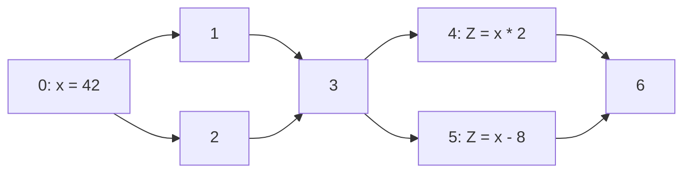

all du paths coverage for X: {(0, 1, 3, 4), (0, 1, 3, 5), (0, 2, 3, 4), (0, 2, 3, 5)}

all defs coverage for X: {(0, 1, 3, 4)}

all uses coverage for X: {(0, 1, 3, 4), (0, 1, 3, 5)}

List all paths for all coverages, even if they are subpaths of each other.

A test path p _du-tours_ subpath d with respect if p tours d and the subpath taken is def clear with respect to v. We can use side trips.

**basic block:** rule out some definitions and uses as irrelevant. Consider only the last definition of a variable in a basic block. Consider only uses of variables not defined within the basic block in a basic block.

Graph coverage subsumption:

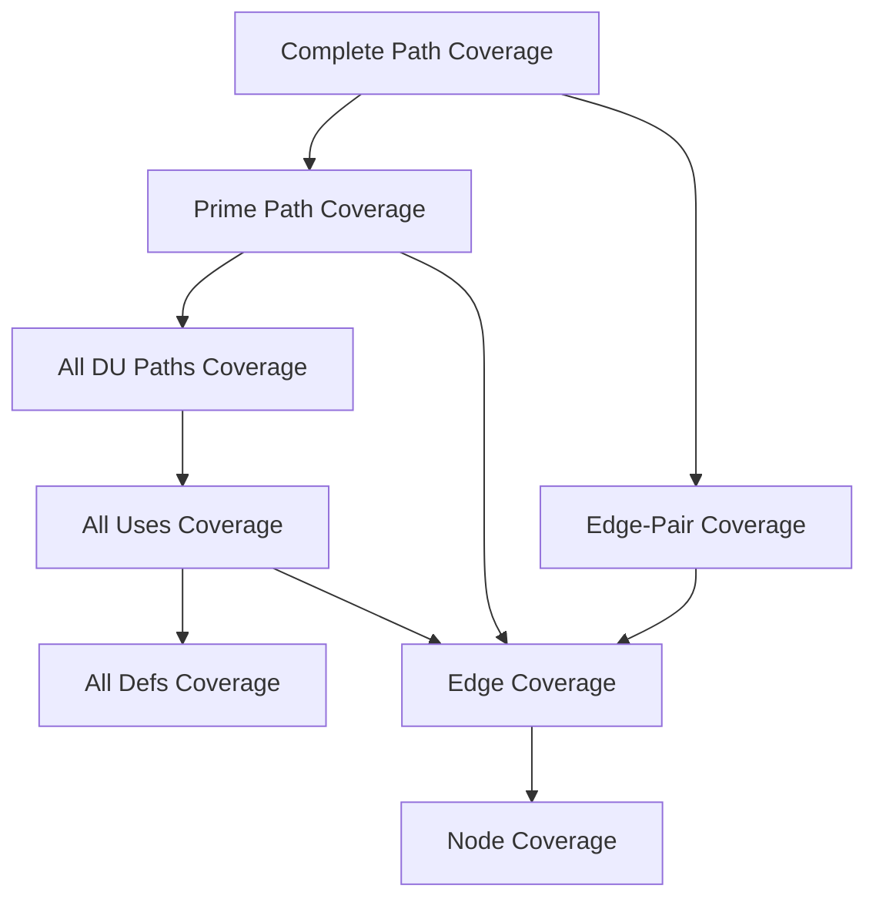

> **Q: Why does AUC subsume EC?**
>
> **A:** It's because we assume that for nodes with multiple outgoing edges, at least one variable is used on each out edge and the same variables are used on each out edge.
>
> Suppose some test set T satisfies AUC. Consider any edge in the graph $e_1$.
>
> If $e_1$ is a branch edge, then it has a use, so it must be covered by T.
>
> If $e_1$ is not a branch edge, then the closest branch edge before or after $e_1$, call it $e_2$, must be covered by T. Then, T must also include $e_1$ since all test cases go from start to finish. If there is no such closest branch edge, then there must be no branches in the entire program. In this case, as long as some variable was used in the program, then T must cover that one test case testing the entire program to ensure AUC. Notice that we have covered the TR for EC even without having that specific TR!
>
> So, AUC must cover any edge the graph, so AUC subsumes EC.

**caller:** a unit that invokes another unit

**callee:** the unit that is called

**callsite:** statement or node where the call appears

**actual parameter:** variable in the caller

**formal parameter:** variable in the callee

Intraprocedural analysis is too expensive because we have to consider too many def-use pairs. Interprocedural analysis only considers the last def and the first use between procedures calls.

**last-def:** the set of nodes that define a variable x and has a def-clear path from the node through a callsite to a use in the other unit e.g. caller to callee as a param, callee to caller as return value

**first-use:** the set of nodes that have uses of a variable y and for which there is a def-clear and use-clear path from the call site to the nodes

Strengths and weaknesses of graph coverage:

- must create graph
- node coverage is usually easy, but cycles make it hard to get good coverage in general
- incomplete node or edge coverage point to deficiencies in a test set

## Lecture 13: Logic Coverage

`(x > y) || foo(z) && bar` is a _predicate_ containing 3 _clauses_.

The logical operators we allow, in order of precedence (high to low):

1. ¬ (negation)
2. ∧ (and)
3. ∨ (or)
4. → (implication, only false when a → b, a = T, b = F)
5. $\oplus$ (xor)
6. ↔ (equivalence, true when both sides are the same)

**predicate:** expression which evaluates to a boolean value e.g. a $\implies$ b

**clause:** predicate without logical operator e.g. a < b, foo(b), bar

**Predicate coverage (PC):** For each predicate p $\in$ P, TR contains a requirement where p evaluates to true and a requirement where p evaluates to false. PC is analgous to edge coverage.

**Clause coverage (CC):** For each clause c $\in$ C, TR contains a requirement where c evaluates to true and a requirement where c evaluates to false.

Clause coverage doesn't subsume PC.

> **Proof by counter example:**
>
> Consider P = a or !b.
>
> Clause coverage is satisfied by (a = T, b = T), (a = F, b = F), but this doesn't satisfy PC.

PC doesn't subsume CC.

> **Proof by counter example:**
>
> Consider P = a or !b.
>
> Predicate coverage is satisfied by (a = T, b = T), (a = F, b = T), but this doesn't satisfy CC (EC).

**Combinatorial coverage (CoC):** tests each combination of clauses. However, this grows the number of test requirements exponentially.

**active clause:** clause which affects the predicate it's in. It is said to _determine_ the predicate.

To determine whether a clause is an active clause, we pick some major clause within the predicate, y. We set y to true and evaluate the predicate. Then, we set y to false and evaluate the predicate. If the results are different, then y is an active clause.

> Notice that we don't require that the value of the major clause be the same as the value of the predicate for the major clause to be active. For example, consider $p = !a$. Clearly, p is determined by a, but the value of the p and the value of a must be different.

Notice that whether the major clause is active depends on the value of the minor clauses. If some set of values for the minor clauses causes the major clause to be active, then that major clause can be said to determine the predicate under conditions defined by the minor clauses.

We can also determine whether a predicate $a$ determines P by computing $p_a = p_{a = \text{true}} \oplus p_{a = \text{false}}$. If $p_a$ is true, then $p_a$ determines P, and if not, $p_a$ doesn't determine P.

> Consider $p = a \lor \neg a$.
>
> $$
> p_a = (\text{true} \lor \text{false})  \oplus (\text{false} \lor \text{true}) \\
>  = \text{false}
> $$
>
> So, $a$ does not determine $p$.
>
> Consider $p = a \leftrightarrow b$.
>
> $$
> p_a = (\text{true} \leftrightarrow b)  \oplus (\text{false} \leftrightarrow b) \\
> = b \oplus \neg b \\
>  = \text{true}
> $$
>
> So $a$ determines $p$.

If $p_a$ evaluates to an expression, that expression describes conditions for other variables which makes the major clause determine the predicate.

> Consider $p = a \lor b$.
>
> $$
> p_a = (\text{true} \lor b)  \oplus (\text{false} \lor b) \\
> = \text{true} \oplus b \\
>  = \neg b
> $$
>
> So $a$ determines $p$ when $b$ is false.

**active clause coverage (ACC):** For each clause a, set it as a major clause and then determine the values of minor clauses which will cause them to determine a. Require that there be one test case where a is set to true and one test case where a is set to false.

Notice that this means we'll require $2n$ test requirements, where $n$ is the number of clauses. So, it is less expensive than combinatorial coverage but a stronger test requirement than predicate coverage or clause coverage.

**Q:** Does active clause coverage subsume predicate coverage and clause coverage?

**A:** This is an ambiguous question for predicate coverage, since ACC doesn't define what the minor clause assignments should be.

> Consider predicate $p = a \land (b \lor c)$. Let a be the major clause.
>
> Consider the following TR {a: true, b: true, c: true}, {a: false, b: true, c: true}. Notice that in this case, we could have also picked {a: true, b: true, c: false}, {a: false, b: false, c: false}

However, ACC should aways subsume CC, since we flip the true and false values of every clause when we pick it to be the major clause.

**General active clause coverage:** No restrictions on the minor clauses. GACC doesn't subsume PC.

You can choose minor clauses such that the major clause determines the predicate, but the predicate evaluates to the same value either way.

> Consider $p = a \oplus b$.
>
> GACC is satisfied by the TR {a: true, b: true}, {a: false, b: false}. This is because a always determines p, regardless of the value of b, and the same applies to b determining p.
>
> In both test cases, $p$ = false, so GACC doesn't subsume PC.

**Correlated active clause coverage:** Choose values for minor clauses such that the predicate evaluates to true for one value of the major clause and false for another value of the major clause. This contains exactly the definition of PC, so CACC subsumes PC.

> Consider $p = a \oplus b$.
>
> CACC is satisfied by the TR {a: true, b: true}, {a: false, b: true}, {a:true, b: false}. We add the last case to satisfy that b determines p.

**Restricted active clause coverage:** Choose values for each minor clause that are the same when the major clause is true and when the major clause is false.

> Consider $p = a \oplus b$.
>
> RACC is satisfied by the TR {a: true, b:true}, {a: false, b: true}, {a:true, b: false}.
>
> So when we hold a as the major clause, we consider {a: true, b:true}, {a: false, b: true}. Then b has the same value as a changes.
>
> When we hold b as the major clause, we consider {a: false, b:true}, {a:true, b:false}. Then a has the same value as b changes.

Sometimes a flavour of ACC is too restrictive to be achievable. Consider for example, a predicate which lives inside some dead code or a predicate which is never true e.g. `array.length < 0` or when a clause never determines a predicate. When this happens, we can:

- Drop infeasible test requirements

- Switch to a less restrictive kind of ACC (RACC > CACC > GACC).

Subsumption relationships:

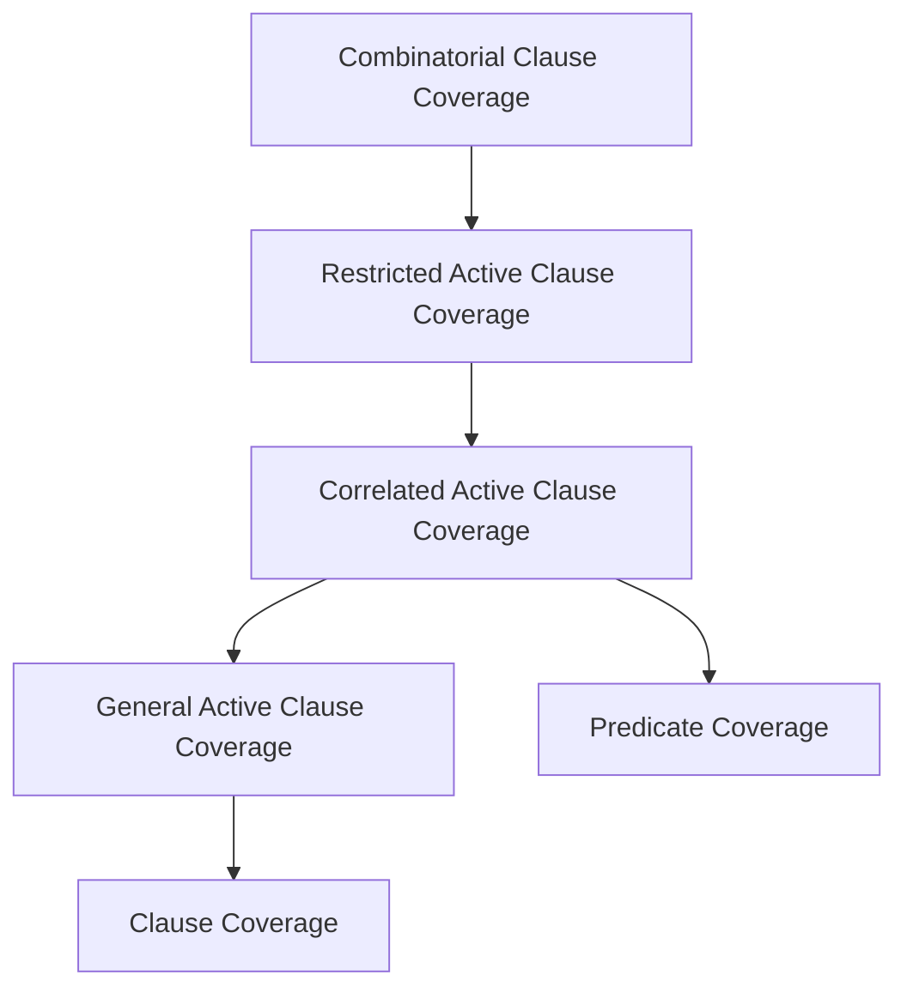

To achieve logic coverage, we:

1. Identify the predicates in the program under test.
2. Figure out how to reach each of the predicates.
3. Make each clause c determine each predicate p.
4. Find values for program variables to meet various TR.

Let's look at an example for the following piece of code:

```c++
// pL is the pattern length and sL is the subject length, pattern and subject are char arrays
isPat == false && iSub + pL - 1 < sL || subject[iSub] == pattern[0];
```

Let $p = a \land b \lor c$ where a = `isPat == false`, b = `iSub + pL - 1 < sL`, c = `subject[iSub] == pattern[0]`.

We compute $p_a = b \land \neg c$, $p_b = a \land \neg c$, $p_c = \neg(a \land b)$.

Suppose we wanted TR for predicate coverage.

Then, we could have 2 test cases:

```c++
// TR for p = true => a = T, b = T, c = T
pattern = new char[1];
pattern[0] = 'a';
subject = new char[1];
subject[0] = 'a';
isPat = false;
iSub = 0;
// TR for p = false => a = F, b = T, c = T
pattern = new char[1];
pattern[0] = 'a';
subject = new char[1];
subject[0] = 'a';
isPat = true;
iSub = 0;
```

## Lecture 14: Specification mining and bug detection

We can extract specifications by inferring them from source code (assuming that the majority of the source code is correct). However, there's a lack of support for this, since there's not always enough examples of a rule for it to be detected. It also misses other kinds of information, for example, mistaken units.

But there's other sources of information that we can use: i.e. comments, traces. manual pages

The spectrum of specification mining ranges from automatic (deep learning) to manual (find a specific type of bug) and from text to source code.

#### Google DASE

DASE is a dynamic tool that takes in a list of constraints (generated via branch conditions) and then tests based on those constraints.

## Lecture 19: Syntax-based Testing

There are two types of mutation testing:

- **input space grammars:** create valid/invalid input strings
- **program-based grammars:** modify programs into other valid mutant programs, create tests which distinguish the mutant program from the original

Consider the following grammar:

**actions** = (action)\*

**action** = dep \| deb

**dep** = "deposit" account amount

**deb** = "debit" account amount

**account** = digit{3}

**amount** = "\$"digit+"."digit{2}

**digit** = ["0" - "9"]

Here, "\$", ".", "deposit" etc. are terminals. We define actions to be the start symbol, and everything in bold is a non-terminal. Based on this, these classifications, we define coverage criteria:

**Terminal Symbol Coverage (TSC):** TR contains each terminal of grammar G

**Production Coverage (PDC):** TR contains a test case using each production rule of grammar G. PDC subsumes TSC.

**Derivation Coverage (DC):** TR contains every possible string derivable from G and may contain infinite test sets.

**ground string:** A valid string belonging to the language of the grammar

**mutation operator:** a rule that specifies syntactic variations of strings generated from a grammar

**mutant:** the result of one application of a mutation operator to a ground string

#### Input Space Grammars

We need to test programs on invalid inputs since undefined behaviour is often unacceptable. We can generate an invalid input by mutating the grammar and then generating test trings from it.

We can mutate a grammar by taking a production rule applying a grammar mutation operator:

- Nonterminal replacement
- Terminal replacement
- Terminal/Nonterminal deletion
- Terminal/Nonterminal duplication

A test case which _kills a mutant_ refers to a test case that produces a different output when running the program on the ground string compared to running the program on the mutant string.

**Mutation Coverage (MC):** For each mutant m, TR contains a requirement to kill m. The **mutation score** defines what percentage of mutants is killed by the TR.

**Mutation Operator Coverage (MOC):** For each mutation operator op, TR contains a requirement to create a mutated string m derived using op. Example operators: absolute value insertion, operator replacement, scalar variable replacement, crash statement replacement

**Mutation Production Coverage (MPC):** For each mutation operator op and each production p that op can be applied to, TR contains requirement to create a mutated string from p

#### Program-based Grammars

We will create interesting mutant programs which behave differently than the original program. An interesting mutant program is not stillborn (cannot compile), trivial (killed by any test case), or equivalent (same as the original program).

Ideally, we want our programs to mimick possible common mistake and provide statement coverage (i.e. through unit testing).

A test case which _kills a mutant_ refers to a test case which has a different behaviour on a mutant program than on the original program. If the difference results in different output we say the test case _strongly kills_ the mutant. If the difference results in a different internal state at some point we say the test case _weakly kills_ the mutant.

**strong mutation:** fault must be reachable, infect the state, and propagate to output

**weak mutation:** fault must be reachable and infect the state

**strong mutation coverage:** For each mutant m, TR contains a test which strongly kills m

**weak mutation coverage:** For each mutant m, TR contains a test which weakly kills m

Consider the following example:

```c++
// original method
int Min (int A, int B) {
  int minVal;
  minVal = A;
  if (B < A) {
    minVal = B;
  }
  return (minVal);
} // end Min

// mutant
int Min (int A, int B) {
  int minVal;
  minVal = B; // mutant line
  if (B < A) {
    minVal = B;
  }
  return (minVal);
} // end Min
```

**Reachability:** Unavoidable

**Infection:** B $\ne$ A (condition for weakly killing mutant)

**Propagation:** A < B (condition for strongly killing mutant)

Mutation testing tools: EvoSuite, Randoop, American Fuzzy Lop, PIT Mutation testing tool, Major mutation framework

## Lecture 22: Input Space Partitioning

**input space partitioning:** test one input from each partition, where partitions must be complete (cover entire domain) and disjoint (do not overlap)

**partition:** a way of splitting values into a set of blocks, i.e. splitting up input range based on possible values of a characteristic

**block:** a set of values that are alike with respect to a characteristic e.g. value, length, nullness, emptiness.

In general, we want as few blocks in a partition as possible to ensure disjointness and completeness.

#### Input space modelling

1. Find units/functions to test e.g. test all public methods, test all use cases

2. Identify parameters of each unit (method parameters, relevant program state, files)

3. Come up with the input domain model (IDM). IDM can be:

   - **interface-based:** using the input space directly

     - pros: good in practice, easy to identitfy characteristics, easy to translate to test cases
     - cons: may be less effective because it doesn't use domain knowledge

   - **functionality-based:** using a functional or behavioural view of the program

     - pros: can create IDM from specifications rather than implementations, may be more effective because it uses domain knowledge
     - cons: may be hard to identify values and characteristics, harder to generate tests

     Sources of charactersitics for functionality based IDMs: preconditions, postconditions, relationships between variables, specifications

   For example, to test a method `public boolean containsElement(List list, Object element)` using interface based IDM, you could use whether the list was null or whether the list was empty.

   To test the same method using functionality based IDM, you could use the number of occurences of the element in the list, or whether the element occurs first in the list.

In general, we want to pick blocks such that they contain: valid/invalid values, boundary/non-boundary values, special values.

Sometimes we will have multiple IDMS e.g. one for valid values, one for invalid values.

Suppose we had to test a function which takes 3 inputs, which are a, b, c. The partitions based on the inputs are: a = {A, B}, b = {1, 2, 3}, and c = {x, y}. The list of blocks from all partitions is: [A, B, 1, 2, 3, x, y].

**all combinations coverage (ACoC):** TR contains all combinations of blocks from all characteristics. The number of test requirements is the product of the number of blocks in each partition.

$TR_{ACoC}$ = {(A, 1, x), (A, 1, y), (A, 2, x), (A, 2, y), (A, 3, x), (A, 3, y), (B, 1, x), (B, 1, y), (B, 2, x), (B, 2, y), (B, 3, x), (B, 3, y)}

**each choice coverage (ECC):** TR contains one value from each block for each characteristic in some test case.

$TR_{ECC}$ = {A, B, 1, 2, 3, x, y}

Test set {(A, 1, x), (B, 2, y), (A, 3, x)} satisfies ECC.

**pair-wise coverage (PWC):** TR contains a combination of a value for each block for each characterstic with some value from every other block for other charateristics

$TR_{PWC}$ = {(A, 1), (A, 2), (A, 3), (A, x), (A, y), (B, 1), (B, 2), (B, 3), (B, x), (B, y), (1, x), (1, y), (2, x), (2, y), (3, x), (3, y)}

Test set {(A, 1, x), (A, 2, y), (A, 3, x), (B, 1, y), (B, 2, x), (B, 3, y)} satisfies PWC.

**t-wise coverage (TWC):** TR contains a combination of a value from each block for each group of T characteristics. When T is the number of partitions, TWC is the same as ACoC.

ACoC, ECC, PWC, and TWC treat all blocks as equally important. Suppose now we pick one block as the most important block and call it the base choice.

**base choice coverage (BCC):** Choose a base choice block for each characterstic, and a base test by combining the base choices for all characteristics. For each characteristic c, TR contains the requirements for a test which varies the base test by using all other blocks for charactersitic c.

Suppose we picked the base choice blocks A, 1, x. Then, the base test is (A, 1, x).

$TR_{BCC}$ = {(A, 1, x), (**B**, 1, x), (A, **2**, x), (A, **3**, x), (A, 1, **y**)}

**multiple base choice coverage (MBCC):** Choose one or more base choice blocks for each characterstic, and form base tests by using base choices for each characteristic at least once. For each characteristic c, TR contains the requirements for a test which varies each base test by using all other blocks for characteristic c.

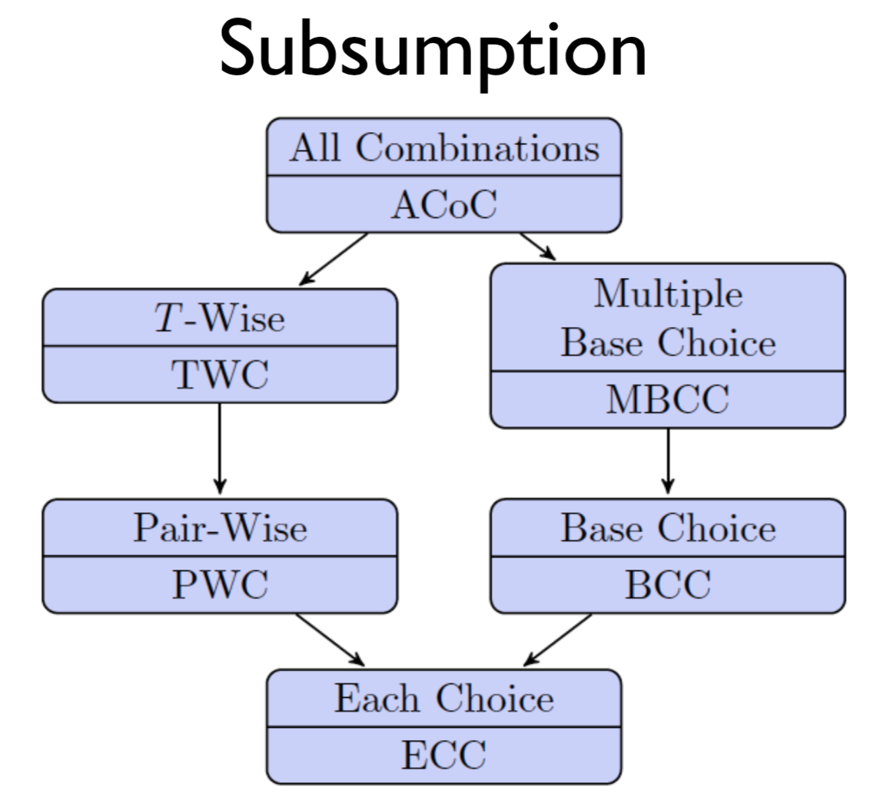

Some choices can lead to infeasible test requirements e.g. negative side lengths for scalene triangles. To deal with this, we can drop infeasible TRs, and if we are using BCC, we can change the base case.

## Lecture 23: Better Bug Reports

In 2008, Bettenburg surveyed Apache, Eclipse, and Mozilla developers on what makes a good bug report. They found that steps to reproduce, stack traces, and test cases were most helpful in bug reports.

## Lecture 24: Regression Testing

**regression testing:** re-testing software that has been modified. They should be automated, appropriately sized (test set too small will be ineffective at catching bugs, test set too large will take too long to run), and up-to-date.

Ensure that you add to your regression test suite when you update your codebase (e.g. one test case per bug). Try to get rid of irrelevant tests over time (i.e. using coverage criteria).

#### UI Testing

Testing input from a file is easy and unit testing a function is easy, but UI tests are hard.

We create inputs to UI tests by capturing and replaying events, but this can be fragile to verify output on due to resolution, whitespace, window placement etc. So, QA for UI is generally manual.

Another approach is to capture screenshots before test cases and compare them with an expected screenshot, but this is also fragile due to animation, font hinting, resolution, changes in layout etc.

A tool for recording and replaying UI tests is Selenium.

#### Industry Process

- Unit Tests
- Code Review
- Continuous Builds: Unit testing and regression testing is integrated with version control.
- QA Team
- Release

**integration testing:** test interfaces between modules in a system for interface faults

Types of interface faults:

- Inadequate or incomplete functionality e.g. a module makes an incorrect functionality assumption about another module
- Data structure related e.g. size of data structure insufficient
- Inadequate error handling
- Inadequate post-processing e.g. failure to release resources

**driver:** a component that calls the tested unit and controls the test cases

**stub:** a component the tested unit depends on, has a partial implementation using fake values

3 approaches for integration testing:

- **big bang approach:** test all subsystems individually, then construct the whole program and run all tests on it, good for small systems

  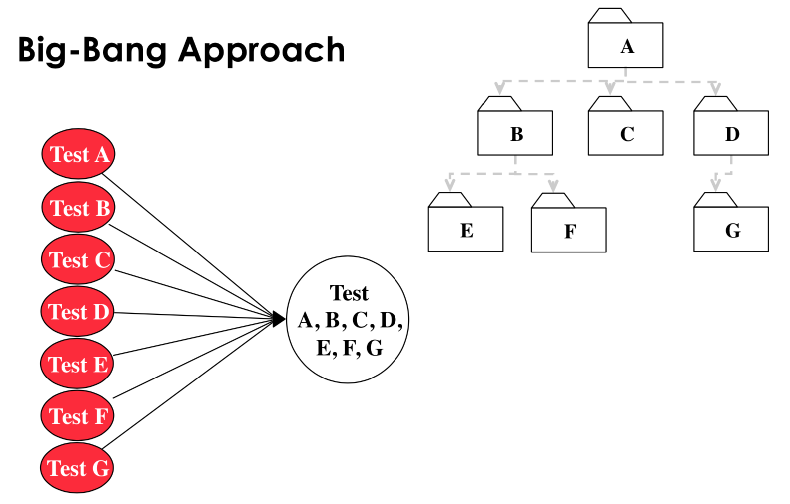

- **bottom up:** subsystems at the bottom layer of the call hierarchy are tested individually, then test all subsystems which call the previously tested layer (bubble up call hierarchy), drivers are needed

  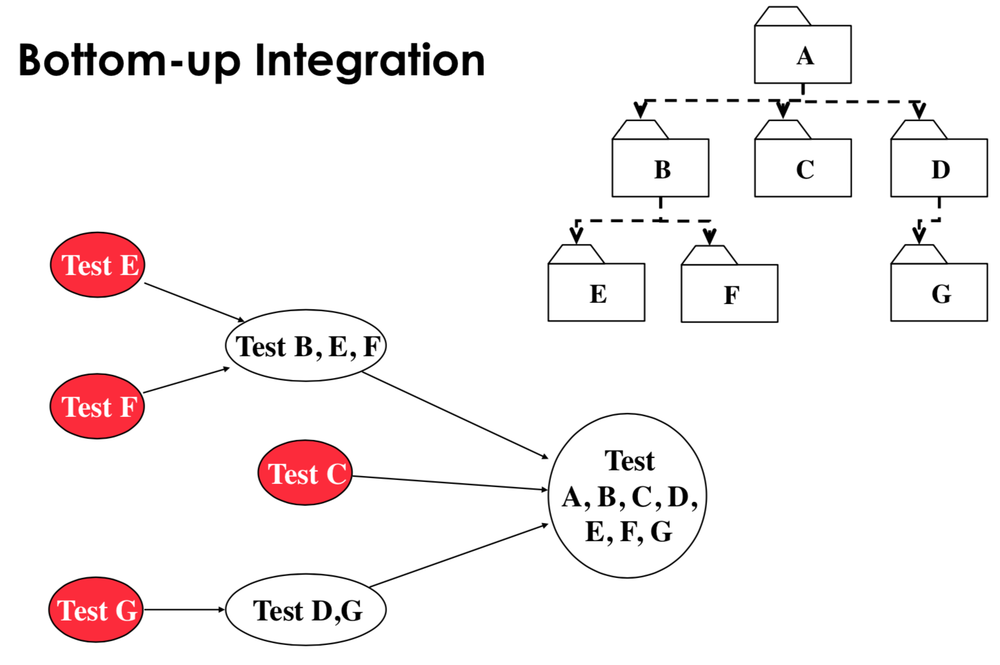

  - pros:
    - no stubs needed
    - useful for integration testing of object oriented systems, real time systems, systems with strict performance requirements
  - cons:
    - driver needed
    - tests the UI (most important subsystem) last

- **top-down:** test the top layer or controlling subsystem first, then test all subsystems which were called next (bubble down call hiearchy), stubs needed

  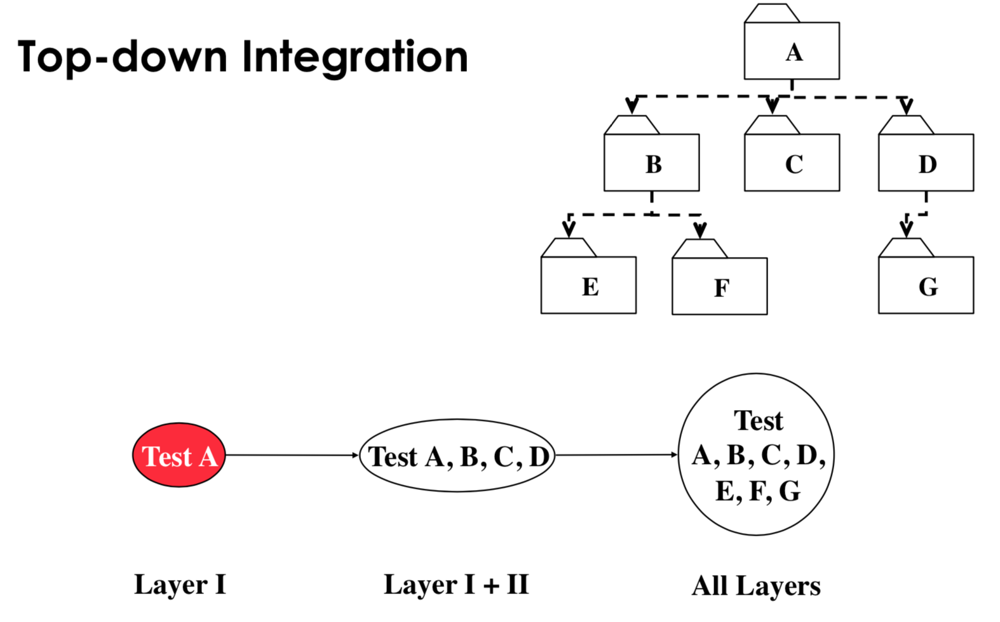

  - pros:
    - Can easily define test cases in terms of the functionality of the system
    - No drivers needed
  - cons:
    - Stubs must allow all possible conditions to be tested, so writing stubs is difficult
    - Large number of stubs may be required, depending on the number of methods at the lowest level of the system.

- **sandwich testing strategy:** view system as target middle layer, layer above the target, and layer below the target. Testing converges at the target layer.

  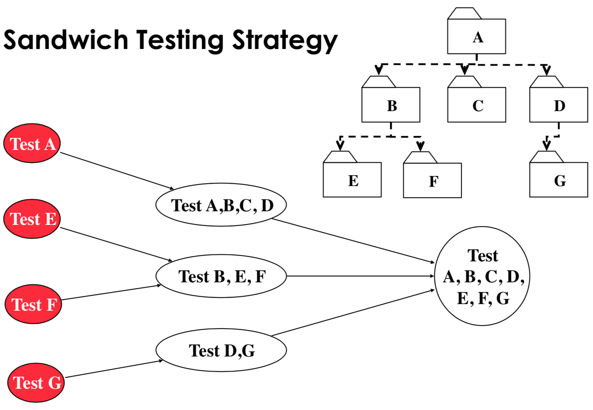

  - pros:
    - top and bottom layer tests can be done in parallel
  - cons:
    - doesn't test individual subsystems and their interfaces thoroughly before integration. To fix this, we can use modified sandwich testing, which requires that we test all subsystems corresponding to the next layer. For example, in the graph above, we test A because it's the top layer, but we don't test B, C, D individually.

- **construct incremental builds:** build an interim software image for testing

  1. Construct an initial core build to provide basic, lower level functionalities.
  2. Add new modules to the existing build

  This way, we can rollback modules which have introduced bugs.

Writing code to verify output any output is very hard (e.g. verification of sorting). Instead, we can use:

- Redundant computation: write N versions of the program under test and check that they all have the same output on the same input
- Consistency checks: check probabilities are not negative and not larger than 1, check assertions and invariants
- Data redundancy: compare results of different inputs
