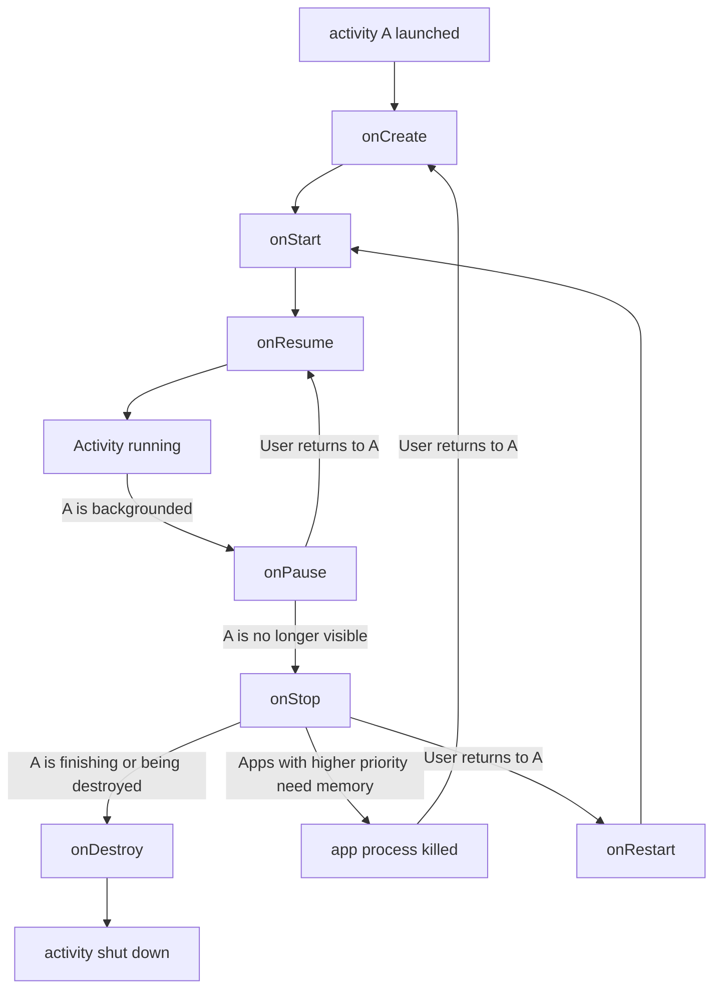
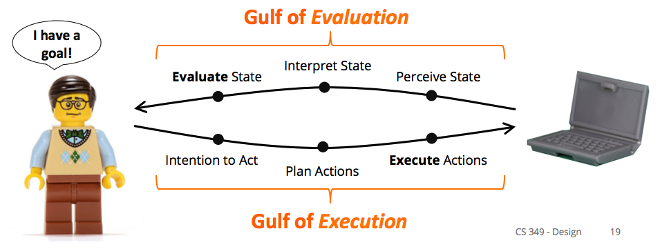
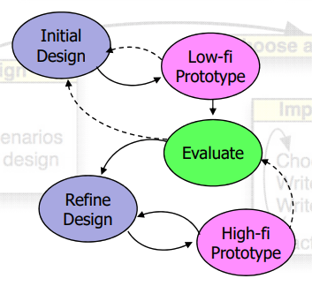
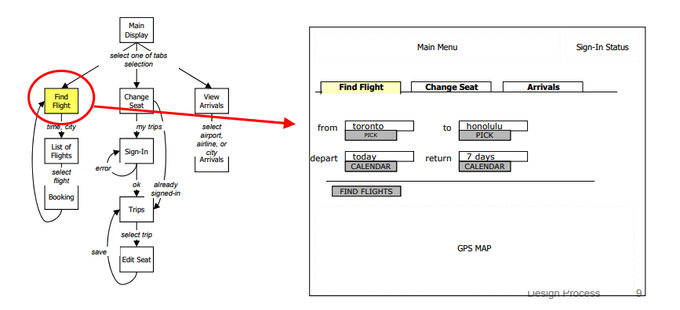
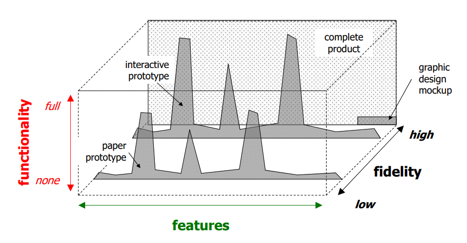
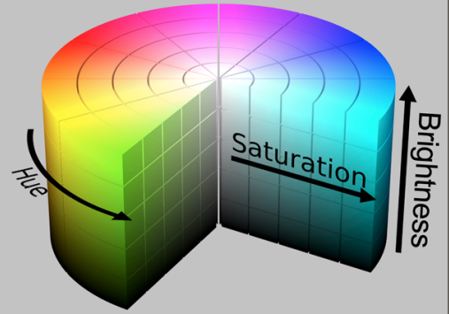
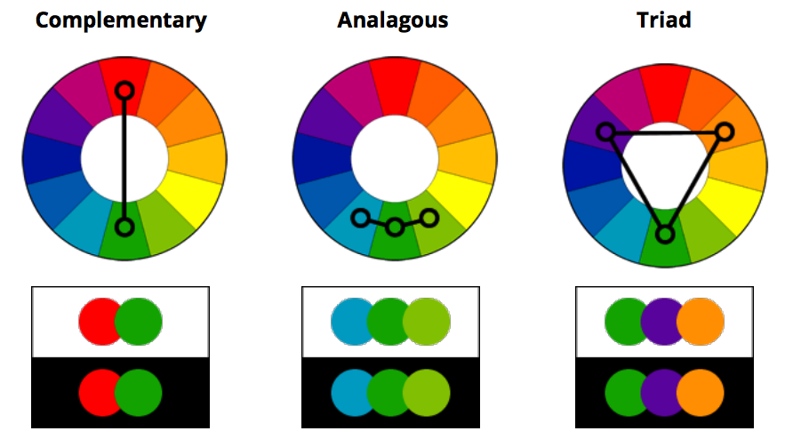
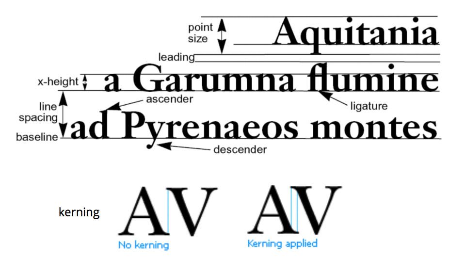

> Professor Keiko Katsuragawa, Winter 2018

> This course teaches the principles of creating user interfaces (UIs) including underlying UI architecture and algorithms, how to implement UIs from scratch and using UI frameworks, theories and methods for UI design, and an introduction to the field of human-computer interaction.

## Introduction

**user interface:** place where a person expresses intention to an artifact, and the artifact presents feedback to the person e.g. microwave screen

**interaction:** sequence of actions by the user and system over time

Interaction design is challenging because of the variability in users and tasks. Users may have varying levels of expertise, and you may have to design an interface for many tasks at once.

## History

Interaction has changed over the course of history to be more user friendly rather than machine friendly. This is because the time of humans has gradually become more valuable than the time of machines.

#### Batch Interfaces

Around 1945 to 1965, computers had batch interfaces. This means that you prepared a large set of instructions (medium could be punch cards, paper tape, magnetic tape), and then you received a paper printout after execution. These machines could only be used by specialists.

#### Conversation Interfaces

From 1965 to 1985, interfaces improved to conversation interfaces, i.e. the command line. This allowed for feedback during execution, but not for modification during execution. One of the advantages of the commandline is that it is highly flexible since you can specify options and combine different commands very quickly. However, commands had to be learned and could be hard to discover (requires recall rather than recognition).

#### Important people

In 1945, **Vannevar Bush** published "As we may think", a post-war article urging scientists to make knowledge more accessible, thus improving the human mind as a microscope might improve the human eye. In the article, Bush described a memex (memory index) machine, which could compress and store books, records, and communications. It was envisioned as an extension to the human memory. It proposed hyperlinks between content (later used in the internet), a dual display setup, direct annotation, and indexing. Nobody built a memex in 1945 because the hardware problems it posed were impossible and now I suppose it's because nobody wants to now that there's Youtube.

**Ivan Sutherland**, "father of computer graphics", invented Sketchpad as a part of his 1963 PhD thesis, for which he later received a Turing Award. Sketchpad had a light pen with which you could directly interact with the computer screen. This was really very cool because nobody even had mice for their computers yet.

**Douglas Engelbart** led a team at Stanford Research Institute to create oN-Line System (NLS). This was demo'd at "The Mother of All Demos" in 1968, where Douglas showed off the _mouse_, hypertext, copy/paste, and shared-screen collaboration across a network among other things.

**Alan Kay** developed the Smalltalk programming language, and thus was one of the people who first came up with the idea of object oriented programming. He also described the Dynabook, which was a laptop computer, which was not built because the hardware was not feasible. His work influenced the Xerox Star (released in 1981), which was the first commercial system to have a window based GUI, icons, folders, mouse etc.

#### Graphical User Interface

GUIs, which were refined from 1984 on by companies such as Microsoft and Apple, have a high resolution, high refresh graphics display. To interact with it, you might use a keyboard, or a pointing device such as a mouse. This puts the user in control and favours recognition over recall.

In the future we could have voice interfaces, virtual reality, lots of other stuff!

## Windowing Systems

**windowing system:** OS software that handles input device events (e.g. mouse and keyboard), provides drawing methods (e.g. bitmaps, text, primitives), and manages windows (e.g. resizing, reordering, redrawing windows, controlling what application has access to content area of window)

**X Windows** was developed in 1984 as the standard windowing system for Unix systems. It's free and it doesn't care what processor you're using under the hood. It also has the following design criteria:

- Should work on a variety of displays
- Applications should be independent of the device
- Must be network transparent, meaning it shouldn't matter if the (X client) application being displayed is locally on the machine or if it's being accessed over the network
- Should support multiple, concurrent application displays
  - Then, each application display can have a hierarchy of resizable windows which may overlap with each other or the windows of other application displays
  - Each window within an application display can be oriented any which way across multiple computer monitors
- Should support many applications
- Should be high performance and support text, 2D graphics, imaging
- Should be extensible

Remember that a windowing system is the base OS software—it doesn't have any sort of style to it.

#### X Client-Server Architecture

The X Windows model is inverted—the X Client handles all the application logic, and the X server handles all display output and user input. The idea is that you could have many applications running on multiple machines which you have access to (maybe over a network), but each user has one X Server which deals with their user interface.

We can look at the X Server as the view and the controller in an MVC model, and the X Client as the model.

When we write an X Windows program, we're actually writing an X Client program. Here's some general pseudocode for such a program:

```t
Perform X Client initialization on self
Connect to X Server // Note that the X Server must already be running
Init X
while(true) {
  Get next event from X server
  Handle the event
  	If the event is quit, break;
  Do client-initiated work
  Send drawing requests to the X Server
}
Close connection to X Server
Perform client cleanup
```

**Xlib:** wrapper around low-level X Window protocol so we don't have to implement message passing in order to create a window for an application

**Base Window System:** a windowing system which ensures that only one application is changing the frame buffer (contents of the monitor) at a time. This means that the base window system is single threaded.

The BWS also translates between the global co-ordinate system, and each window's canvas co-ordinate system, which assumes that the top-left is (0, 0).

**Window Manager:** layer on top of BWS which provides interactive components e.g. menus, close boxes, drag to resize, which it implements using BWS methods. The Window Manager styles the application window, and the application handles the canvas.

By separating the window manager and the BWS, we can put a new skin on an operating system just by changing the style on the window manager. It's also more robust, since now we have 2 codebases in different places.

Nowadays, you don't have to host your X clients on a server somewhere. Since you computer has a lot of processing power, it's possible for the user's computer to act as the X Client and the X Server.

## Drawing

There are 3 conceptual modes for drawing:

- Pixel: creating images by setting each pixel
- Stroke: Drawing a line, or drawing a rectangle
- Region: Drawing text, or drawing a filled in rectangle

We've got a lot of options for drawing e.g. colour, stroke width, dashed etc. so we often just store the defaults in an object called a **Graphics Context**. The X Server then uses its copy of the graphics context to render its UI.

**Painter's algorithm:** draw a complex shape by combing primitives, back to front, layering the image

To implement painter's algorithm, we will create a `Displayable` abstract class which forces each primitive to know how to draw itself. Then, we'll just keep the `Displayable` objects in the display list order back to front so that the base of the image can be drawn first.

**clipping:** not allowing images to draw outside of a certain area

## Events

**event-driven programming:** program is structured as registered handlers for events e.g. window resizing/closing, keyboard presses, mouse movement

**event:** message to notify application that something happened

Recall that the BWS is responsible for handling low level input device events and events from the window manager. This means that it will collect event information, place them in an `Event` class, order the events, decide which application needs to know about the event, and then deliver the events.

```c++
// Structure of XEvent
typedef union { // in this case, union is the type
    enum type { Key, Button /*, others */ };
    XKeyEvent xkey;
    XButtonEvent xbutton;
    // other types of events
    unsigned long serial;
    bool send_end; // isFromSendEvent request e.g. requested from XNextEvent
    Display *display; // display this event was read from
    Window window; // window which event is relative to
} XEvent;
```

`XNextEvent(Display *display, XEvent *)`: Blocks the current thread of execution until the next `XEvent` arrives from the event queue

`XPending(Display *display)`: Checks if the event queue has another event, doesn't block

An application needs to select which input events it wants to listen to by sending the appropriate bit mask to the window manager.

When animating, we want to repaint at 24/60 FPS, since any more than would be not detectable by the human eye, so it would be a waste of CPU resources. So, we implement the following event loop:

```c++
while(true) {
  if(XPending(display) > 0) {
    XNextEvent(display, &event);
    switch(event.type) {
      // handle event
    }
  }

  // now() returns the current time in microseconds
  unsigned long now = now();

  // 1000000 / FPS is the time in microseconds it takes to display 1 frame
  if(now - lastRepaint > 1000000 / FPS) {
    handleAnimation(xinfo);
    repaint(xinfo);
    lastRepaint = now();
  }

  // sleep until next frame repaint
  if(XPending(xinfo.display) == 0) {
    usleep(1000000 / FPS - (now - lastRepaint));
  }
}
```

**double buffering:** Double buffering solves flickering when an intermediate image is on the display by creating an offscreen image buffer, drawing to that buffer, and then fast-copying the buffer to the screen

> Missing lectures: Java Basics, Java GUI

## Widgets

**widget:** part of an interface which has its own behaviour e.g. buttons, drop-downs. They have a defined appearance and they send/receive events. Container widgets can contain other container widgets, or they can contain simple widgets.

Examples of container widgets: menu tree, dropdown, panel, tab

Examples of simple widgets: textboxes, number slider, radio buttons, buttons, labels, toggles.

You can also have special value widgets like a colour picker or a date picker.

**logical device:** essential function of a widget. Examples:

- logical button device: generates push events e.g. keyboard shortcuts, menu items
- logical number device: generates number change events e.g. numeric textbook, slider
- logical boolean device: generates true/false events e.g. toggle

The logical device can be considered the model of the widget.

**widget toolkits:** software bundled with window manager, OS, language, or hardware platform which defines GUI widgets. Widget toolkits use event-driven programming.

**heavyweight widget:** widget toolkit wraps native OS widgets, BWS/OS _treats_ widget as an window and sends events directly to the widget e.g. X Windows, Java's AWT, HTML forms.

> Advantages: it preserves the OS look and feel and events generated by user are passed directly to components by BWS/OS.
>
> Disadvantages: OS-specific programming means minimal portability. The multiplatform widget toolkits are bad.

**lightweight widget:** widget toolkit draws its own widgets and maps incoming events to widgets e.g. Java Swing, jQuery UI

> Advantages: preserves application look and feel across platforms, guarantees consistent widget set across all platforms, can be very light/optimized
>
> Disadvantages: widgets appear non-native and may have bad performance since they don't directly communicate with the BWS/OS

## Event Dispatch

Event architecture:

1. Capture event, queue event
2. Dispatch event to correct window and widget. The BWS is used to dispatch the event to either the window (and then a toolkit will send the event to the widget) or the widget directly depending on whether the widget is lightweight or heavyweight
3. Bind event with application code

**interactor tree:** Hierarchy of widgets (container widgets are ancestors of simple widgets) e.g. file menu tree. Dispatch of events to an element of an interactor tree is done by traversing the tree.

**positional dispatch:** a way that an OS or a toolkit might try to dispatch an event, basically sends input to widget "under" mouse cursor. But what happens when widgets overlap?

We can try a bottom-up approach or a top-down approach e.g. leaf node handles first and bubble up, or root node handles first and bubble down.

Positional dispatch can lead to odd behaviour, because the mouse can switch between widget elements really quickly. Say you're holding a scrollbar, but then you move outside the scrollbar area while scrolling. Do you send events outside of the scrollbar? What about if you click down on top of one button, but you release the click on top of another button? Do both buttons get clicked?

We solve these problems with **focus dispatch**.

**focus dispatch:** events are dispatched to widget regardless of mouse cursor position e.g. keyboard focus and mouse focus. We change mouse focus when we get a mouse down event on top of another element. We change keyboard focus when the tab key is pressed.

> _We only have one keyboard focus and one mouse focus. Why is this?_
>
> Consider if you had two keyboard focuses. Then, you're typing inside two textfields at the same time each time you hit a key. This is not really useful. Consider also changing focus—which keyboard focus changes? Both of them?

In order to change focus for focus dispatch, we need to listen to mouse down events on other elements. This requires positional dispatch, to determine which widget has the new focus.

**accelerator key dispatch:** events are dispatched based on which special keys being pressed e.g. keyboard shortcuts

## Event Binding

After we dispatch an event, how do we make sure that the relevant handler to an event is executed? We do this with event binding.

There are a lot of ways that we can approach event binding:

#### Event Loop + Switch Statement Binding

This is also called manual binding, and it's used in Xlib and other early UI systems. Don't confuse this with switch statement binding.

```c++
while(true) {
  XNextEvent(display, &event); // blocking wait for next event
  switch(event.type) {
    case Expose:
      ... // handle expose event
      break;
    case ButtonPress:
      ... // handle button press event
      break;
    ...
  }
}
```

#### Switch statement binding

Each window implements a `WindowProc` function called each time an event is dispatched. The `WindowProc` function then switches on the types of events in order to handle them. This gets unwieldy because there are over 100 standard events, making for a very large function.

```c++
LRESULT CALLBACK WindowProc(HWND hwnd, UINT uMsg, WPARAM wParam, LPARAM lParam) {
switch(uMsg) {
  case WM_CLOSE:
    DestroyWindow(hWnd);
    break;
  case WM_SIZE:
    …
  case WM_KEYDOWN:
  …
```

#### Java Event Queue

Java has an event queue available in `java.awt.Toolkit` which allows you to get the current event, get the next event, peek at an event, replace an event, or place an event on the queue. It works a lot like the X11 event loop, but with more features.

```java
public class EventLoop extends JPanel {
  EventLoop()	{
    EventQueue eq = Toolkit.getDefaultToolkit().getSystemEventQueue();
    // replaces the default system event queue with MyEventQueue
    eq.push(new	MyEventQueue());
  }

  public static void main(String[] args) {
    EventLoop panel = new EventLoop();
    ...
  }

    private class MyEventQueue extends EventQueue {
      public void dispatchEvent(AWTEvent e) {
        if (e.getID() == MouseEvent.MOUSE_DRAGGED) {
          MouseEvent me = (MouseEvent) e;
          x =	me.getX();
          y =	me.getY();
          repaint();
        }
        super.dispatchEvent(e);
      }
    }
}
```

#### Inheritance binding

All events are dispatched to objects of a special class, which we'll call `EventListener`. `EventListener` has methods which get called whenever a specific action has happened, like `onMousePress` or `onMouseMove`. Then, any new widget which needs to listen to a specific action can extend `EventListener` and override the handler method that it needs.

**Problems:**

- Each widget must handle its own events, so the widget container needs to check what widget the event is meant for
- Multiple events are processed through each event method (switch statement problem)
- No filtering of events (e.g. mouse movement has several associated events), which causes performance issues
- Can't easily add new events
  - Suppose we add a new event to listen to. Then, everyone who is currently using an EventListener needs to implement a new handler (remember the massive switch statement?), regardless of whether they use the event or not.
- Bad separation of concerns, since application logic now lives in a handler which the GUI holds

#### Listener Interface binding

We can define a `EventListener` interface for each type of listener e.g. `MouseListener`, `MouseMotionListener`, etc. This way, each widget only listens to the types of events that it needs.

So we're no longer going to get massive switch statements, we can easily add a new event by implementing another interface, and we can filter by the type of event that each widget wants to listen to. That solves 3 problems from inheritance binding.

We still have the problem of bad separation of concerns. We can solve this by implementing the `EventListener` subclass as an inner class of the application logic class, which then allows the handlers to hook into application logic without being a separate UI class.

**Problems:**

- Each widget must handle its own events, so the widget container needs to check what widget the event is meant for

#### Listener Adapter binding

We can improve on Listener Interface binding a little by not forcing developers to implement all of the methods from the interface. Instead of implementing `MouseMotionListener`, we can extend from `MouseMotionAdapter`, and that will allow us to only implement the `mouseDragged` method we need. This reduces the number of no-op methods inside the listener object.

#### Delegate Binding (.NET)

Sometimes, defining a whole interface is too much work. We can get our handlers executed if we created a delegate for them. Delegates are like function pointers, but they're object oriented, type checked, and can point to more than one method.

```c++
// declare delegate using a method signature
public delegate void Del(string message); // can type check your delegate

Del handler; // object oriented
public static void handlerMethod1(string message) {
  /* implementation of handler 1 */
}
public static void handlerMethod3(string message) {
   /* implementation of handler 3 */
}

// Assign handler to static method
handler = ClassName.handlerMethod1;
handler += delegate(string message) {
  /* anonymous implementation of handler 2 */
}
handler += ClassName.handlerMethod3;
handler -= ClassName.handlerMethod3;

// Invoke delegate, calls handlerMethod 1 and 2
handler("Hello world");
```

In .NET, there are special delegates called events. Events are delegates which restricts access to adding and removing handlers from the delegate to the enclosing class of the delegate only.

#### Global Event Queue "Hooks"

Some applications may be able to monitor BWS events across all applications. They can then use this technique to inject events to another application e.g. mail application opens email attachment in preview application. This can also be a security issue, since the application might be able monitor your keystrokes for passwords.

For example, IM clients hook into to these global event queues in order to determine whether you are "away" or not.

Note that sometimes, we're going to get too many events to process all of them. In this case, we get the final event, with an list of skipped events inside it.

## Layout

**responsive:** universal design which adjusts to fit the screen size of devices

**adaptive:** switch between designs optimized for each screen size

To make an interface layout, we need to:

1. Design a spatial layout of widgets in the container
2. Adjust the spatial layout when the container is resized

**dynamic layout:** modifying how widgets are displayed (e.g. location, size, visibility) when the window is resized so that we preserve consistency and visual quality of the spatial layout

Widgets in Java Swing use the _Composite_ design pattern, since composite elements like JPanels can contain other JPanels as well as leaf elements like JButtons and JLabels. So, since the layout is defined by the widget hierarchy, the layout also uses the Composite design pattern.

A layout manager changes how widgets are displayed using a layout algorithm, which takes in a range of sizes from the widgets as hints. The layout manager uses a _Strategy_ design pattern, since it can swap out different layout algorithms for different situations.

#### Fixed Layout

Widgets have a fixed size and a fixed position. We can achieve this by setting the LayoutManager to null.

This is useful if there's very few widgets used, or if the application is only used on one type of screen. However, the UI can become non-aligned or fall off screen when the window is resized. If the application is run on a screen with a very high pixel density, the widgets may also become too small to be be usable.

#### Intrinsic Size Layout

We start bottom up from each leaf widget and query it for its preferred size. Then, the container widgets will resize to fit around them. However, this requires each leaf widget to know its preferred height and width, and doesn't account for the case where the total preferred height and width of all the leaf elements is larger than the window size provided. In that case, some UI will be cut off.

We can achieve this by using BoxLayout or FlowLayout.

#### Variable Intrinsic Size Layout

Variable intrinsic height adds a top-down pass through the layout elements after traversing bottom up to get each leaf element's preferred size. This adjusts for the case where leaf elements want to be too large for the window size.

We can achieve this by using GridBagLayout or BorderLayout.

####Struts and Springs Layout

**strut:** fixed distance between widgets

**spring:** stretches to expand distance between widgets when possible, also called glue

We can achieve this by using SpringLayout or BoxLayout.

#### Relative Layout

Relative layouts allow you to constrain elements relative to one another e.g. A must be to the left of B.

We can achieve this by using Spring Layout.

> **Example**
>
> Suppose we wanted a custom layout where all the components are going to be in one horizontal row, with equal spaces in between, and the row itself is centered in the screen. We can create a custom implementation of LayoutManager to achieve this.
>
> ```java
> class AlignLayout implements LayoutManager {
>     private int minSpacing = 0;
>     private int preferredSpacing = 0;
>
>     // Custom constructor, passing in the minimum spacing
> ```

      // between items on the row

>     public AlignLayout(int minSpacing, int preferredSpacing) {
>     this.minSpacing = minSpacing;
>       this.preferredSpacing = preferredSpacing;
>     }
>
>     // Calculates the preferred layout size for the specified container
>     public Dimension preferredLayoutSize(Container parent) {
>       ...
>     }
>
>     // Calculates the minimum size dimensions for the specified container
>     public Dimension minimumLayoutSize(Container parent) {
>       ...
>     }
>
>     // Lays out the specified container using preferred size
>     public void layoutContainer(Container parent) {
>       Dimension space = calculateSpace(parent, true);
>       // this container's padding
>       Insets insets = parent.getInsets();
>       // get actual space available in parent
>       int w = parent.getWidth() - insets.left - insets.right;
>       int h = parent.getHeight() - insets.top	- insets.bottom;
>
>       // vertical centre line to layout component
>       int y = h / 2;
>       // starting x is left side of all components to lay out
>       int x = (w - space.width) / 2;
>
>       int nComponents = parent.getComponentCount();
>       for(int i = 0; i < nComponents; i++) {
>         Component c = parent.getComponent(i);
>         Dimension d = c.getPreferredSize();
>         c.setBounds(x, y - d.height / 2, d.width, d.height);
>         x += d.width + preferredSpacing;
>       }
>     }
>
>     // Custom method to calculate the full height and width of the center row
>     // depending on whether we're accounting for the preferred or the minimum
>     // spacing between components
>     private Dimension calculateSpace(Container parent, boolean isPreferred){
>         // sum all widths and heights of components inside parent into result
>         Dimension result = new Dimension(0,0);
>
>         int nComponents = parent.getComponentCount();
>         for (int i = 0; i < nComponents; i++) {
>           Dimension d;
>           if(isPreferred) {
>             d = parent.getComponent(i).getPreferredSize();
>           } else {
>             d = parent.getComponent(i).getMinimumSize();
>           }
>
>           // update the total	width and height required
>           result.width += d.width;
>           result.height =	Math.max(result.height,	d.height);
>         }
>
>         // add spacing in between components
>         if(isPreferred) {
>           result.width +=	(nComponents - 1) * preferredSpacing;
>         } else {
>           result.width += (nComponents - 1) *	minimumSpacing;
>         }
>         return result;
>     }
>
> }
>
> ```
>
> **Exercise:** How would you implement an accordion layout manager? What about a ribbon layout manager?
> ```

## Graphics

**model:** mathematical representation of an image (e.g. location, size, orientation, color, texture) stored in data structures

**rendering:** using properties of the model to create an image

**image:** rendered model

As an example, a shape model would have a list of points, whether it's a closed shape or not, and a fill color.

Let's consider one point on the shape $(x, y)$, which we translate by $(t_x, t_y)$. Then, $x' = x + t_x$, $y' = y + t_y$.

Suppose we scale the shape by $(s_x, s_y)$. Then, $x' = s_x \cdot x$, $y' = s_y \cdot y$.

Suppose we rotate the shape about the origin counterclockwise by $\theta$ . Then, $x' = x\cos(\theta) - y\sin(\theta)$, $y' = x\sin(\theta) + y\cos(\theta)$.

Now, to do this in code, we could call the `scale`, `rotate`, and `translate` functions, but that's slow. We want to instead represent all transformations as a matrix, since that's more efficient for the GPU.

The most intuitive thing would be to represent the point $(x, y)$ as a 2D matrix, and try to use matrix multiplication to rotate and scale. This works for rotation and scaling, but it breaks down for translation.

$\begin{bmatrix} 1 & t_x/y \\ t_y/x & 1 \end{bmatrix} \begin{bmatrix} x \\ y \end{bmatrix} = \begin{bmatrix}   x + t_x \\ y + t_y \end{bmatrix}$

This doesn't work if $x$ or $y$ is 0.

So, we introduce **homogeneous coordinates** to solve this problem. We will represent points as a 3 x 1 matrix, containing $x$, $y$, and a scaling factor $w$.

$\begin{bmatrix} x \\ y \\ w \end{bmatrix}$ represents a point at location $\begin{bmatrix} x/w \\ y/w \end{bmatrix}$.

##### Translation

$\begin{bmatrix} 1 & 0 & t_x \\ 0 & 1 & t_y \\ 0 & 0 & 1 \end{bmatrix} \begin{bmatrix} x \\ y \\ 1 \end{bmatrix} = \begin{bmatrix} x + t_x \\ y + t_y \\ 1 \end{bmatrix}$

##### Scaling

$\begin{bmatrix} s_x & 0 & 0 \\ 0 & s_y & 0 \\ 0 & 0 & 1 \end{bmatrix} \begin{bmatrix} x \\ y \\ 1 \end{bmatrix} = \begin{bmatrix} x(s_x) \\ y(s_y) \\ 1 \end{bmatrix}$

##### Rotation

$\begin{bmatrix} \cos(\theta) & -\sin(\theta) &  0 \\ \sin(\theta) & \cos(\theta) & 0 \\ 0 & 0 & 1 \end{bmatrix} \begin{bmatrix} x \\ y \\ 1 \end{bmatrix} = \begin{bmatrix} x\cos(\theta) - y\sin(\theta) \\ x\sin(\theta) + y\cos(\theta) \\ 1 \end{bmatrix}$

An **affine transformation matrix** is the result of multiplying together translation, scaling and rotation matrices to get one combined transformation matrix. Note that the order of transformations is the order of matrix multiplication, right to left. This also applies to code (the last instruction to transform is the one that gets applied first).

```java
/* Useful Graphics2D methods: */
void rotate(double theta) {...}
// rotates and then translates origin by (-x, -y)
void rotate(double theta, double x, double y) {...}
void scale(double sx, double sy) {...}
void translate(double tx, double ty) {...}

// gets the current transform in the Graphics2D context
AffineTransform getTransform() {...}
void setTransform(AffineTransform affineTransform) {...}

/* Useful AffineTransform static methods */
// These are like the Graphics2D methods, except they also give you the AffineTransform matrix back
static void getRotateInstance(double theta) {...}
static void getRotateInstance(double theta, double x, double y) {...}
static void getScaleInstance(double sx, double sy) {...}
static void getTranslateInstance(double tx, double ty) {...}
// it also has versions of these methods which don't return an affine transform matrix
```

Often, we'll try to draw shapes in a relative context by saving our current context using `getTransform()`, modifying the context in order to draw, and then reseting the context using `setTransform()`.

## Graphics Hit Testing

We will hit test open shapes like lines using edge hit test, and closed shapes like polygons using inside hit test.

### Edge Hit Test

A line has no thickness, so we'll define some threshold distance from the mouse position to the line. Then, we'll compute the shortest perpendicular distance from the mouse position to the line, and compare it with the threshold distance in order to see if there is a hit.

In order to do this, we need to find the closest point on the line to the mouse position.

Recall that the orthogonal projection of a vector $b$ onto a vector $a$ is $\mathrm{proj \,\textbf{b}_{\textbf{a}}} = \frac{a \cdot b}{a \cdot a}a$

```java
static Point2d closestPoint(Point2d	M, Point2d P0, Point2d P1) {
  Vector2d v = new Vector2d();
  v.sub(P1,P0); // v = P2 - P1

  // early out if line is less than 1 pixel long
  if (v.lengthSquared() < 0.5)
    return P0;

  Vector2d u = new Vector2d();
  u.sub(M, P0); // u = M - P1
  // scalar of vector projection
  double s = u.dot(v) / v.dot(v);

  // find point for constrained line segment
  // if the point is past the line start
  if(s < 0)
    return P0;
  // if the point is past the line end
  else if(s > 1)
    return	P1;
  else {
    Point2d I = P0;
    Vector2d w = new Vector2d();
    w.scale(s, v); // w = s * v
    I.add(w); // I = P1 + w
    return I;
  }
}
```

This is implemented by `Line2D.ptSegDist(P0.x, P0.y, P1.x, P1.y, M.x, M.y)` in Java.

### Rectangle Shape Hit Test

Suppose we wanted to know whether a point is inside a shape. For efficiency, we can first check if the point is within the bounding box of the shape. Then if the point is within the bounding box, we can draw a ray outwards (horizontally or vertically, say) from the mouse point and determine how many times it intersects with an edge of the shape. If it intersects an odd number of times, then the point is within the shape. If it intersects an even number of times, the point is outside the shape.

This is implemented by `contains(M.x, M.y)` in Java.

Note that the mouse and the canvas live in different co-ordinate systems, so you will have to transform one co-ordinate system to the other for any of these approaches to work. Usually, we have more canvas objects than mice, so it's less costly to translate the mouse co-ordinates into the canvas co-ordinate system. We do this by multiplying the inverse of the canvas transform with the mouse position (`canvas.createInverse().transform(origMouse, newMouse)`).

This means that we'll also have to transform the hit-test threshold.

## Model View Controller

MVC (model view controller) was developed in 1979 by Trygve Reenskaug.

The view and the controller know everything about the model, but the model interacts with a view interface only. The view sends events to the controller, and the controller knows everything about the view in order to interpret events. Only the controller should be able to change the state of the model.

An implementation:

```java
interface Observer {
  public void updateView();
}

class View implements Observer {
  private Model model;
  private List<Widget> widgets;

  public View(Model model, Controller controller) {
    /* init widgets here ... */
    this.model = model;
    for(Widget widget : widgets) {
      widget.addListener(controller);
    }
  }

  public void updateView() {
    for(Widget widget : widgets) {
      widget.setProperty(model.getValue());
    }
  }
}

class Controller implements Listener {
  private Model model;

  public Controller(Model model) {
    this.model = model;
  }

  // event handler for a specific event e.g. MouseMotion
  public void eventHandler(Event e) {
    model.setValue(...);
  }
}

class Subject {
  private List<Observer> views;

  public abstract void addView(Observer view);
  public abstract void removeView(Observer view);

  private void notifyObservers() {
    for(Observer view : views) {
      view.updateView();
    }
  }
}

class Model extends Subject {
  public void addView(Observer view) {...}
  public void removeView(Observer view) {...}

  // public getters for value
  public type getValue() {...}

  // public setters for value
  public void setValue() {
    /* implementation ...*/
    // note we refresh the entire interface, which might be slow,
    // but in the interest of clarity, probably better
    notifyObservers();
  }
}
```

You can also implement the Controller as an inner class of the View, and you can use Java's implementations of the Observer/Subject classes.

#### Benefits of MVC

1. We can swap out the view for alternate interfaces, and the controller for alternate input methods, while not changing the model. This makes porting to a new OS or a new UI toolkit easy.
2. We can have as many views as we like at the same time. Each view can independently use the same data.
3. We can reuse code from one MVC architecture to another, since a Model may be compatible with many different Views, and a View is compatible with many different types of Models.
4. We can test the Model without any UI, and we can test the View/Controller without any model.

## Input Devices

Characteristics/dimensions to classify computer input:

- Sensing method: mechanical (switch), motion (accelerometer), contact (pressure sensor), signal processing (audio)
- Continuous or discrete input
- Degrees of freedom

**specific input devices:** input device optimized for specific tasks e.g. tablet pen

**general input device:** input device adapted to many tasks e.g. mouse and keyboard

#### Keyboards

In QWERTY, most typing is done with the left hand, so DVORAK was developed in order to alternate letters between hands. But there's no significant difference between the two.

Keyboards are often downsized (lower key travel, smaller keys) to increase portability.

Virtual keyboards are keyboards displayed on a touch screen or some other kind of flat surface. These are portable and are customizable, but you could have difficulty identifying where to rest your hands.

**Chording keyboards:** hitting a combination of keys produces a letter. This can be very fast and portable (one handed) if you remember all of the combinations.

Other letter input methods include graffiti/unistroke gestures, natural handwriting recognition, and gestural input (mapping movements to commands).

Ways to improve keyboard usability:

- **Predictive text:** Disadvantages are that it's easy to have collisions between common words and it's hard for users to type and monitor predictions at the same time

**positional input:** use input to specify a position e.g. etch-a-sketch.

Properties of positional input:

- absolute positioning (touchscreen) vs. relative positioning (mouse)
  - Absolute positioning maps an input device position to a display position
  - Relative position maps changes in input device position to changes in display position e.g. mouse
- direct contact (touchscreen) vs. indirect contact (mouse)
- force sensing (joysticks) vs. displacement sensing (mouse)
  - Elastic force sensing refers to where resistance increases with movement e.g. trackpoint. This doesn't happen for pure force sensing.
  - We map force sensing to a rate and displacement sensing to a position.
- position control (mouse) vs. rate control (joysticks)
- dimensions sensed (e.g. 1 = dial, 2 = mouse, 3 = Wii remote)

**Control-Display Gain (CD Gain):** ratio of display pointer velocity to device control velocity, $CD_\text{gain} = V_\text{pointer} / V_\text{device}$. We can dynamically change the CD Gain based on the device velocity.

## Input Performance

**input performance model:** model of how people use input devices and interfaces predicting <u>time</u>, <u>error</u>, fatigue, learning etc.

**keystroke level model (KLM):** describe each task as a sequence of operators, then sum up the time of each operator to estimate task time e.g. pointing operator (P) to point to a object on screen takes 1.1s

We may include a mental operator (M) to represent when people have to stop and think. Scenarios are: initate a task, make a strategy decision, retrive a chunk from memory, find something on the display, think of a task parmeter, verify that a specification/action is correct.

> Let's consider a date entry input represented as 1) a textbox in format "MM/DD/YYYY", 2) as three dropdowns, and 3) as 3 textfields "MM", "DD", "YYYY". Assume the user's hand is already on the mouse.
>
> We are given the following table of operators:
>
> | Operator                                      | Time (seconds) |
> | --------------------------------------------- | -------------- |
> | K - Key press and release                     | 0.3            |
> | P - Move mouse to point to object             | 1.1            |
> | B - Mouse press and release                   | 0.1            |
> | H - Hand from keyboard to mouse or vice versa | 0.4            |
> | M - Mental preparation                        | 1.2            |
>
> 1.  MPB H KK K KK K KKKK = 5.8s
>
> 2.  MPB MPB PB MPB PB MPB = 12s
>
> 3.  With tab: MPB H KK K KK K KKKK = 5.8s
>
> Without tab: MPB H KK H PB H KK H PB H KKK = 9.2s

KLM benefits: simple to calculate

KLM drawbacks: doesn't model errors or learning time, some time estimates are inherently variable e.g. mouse pointing to a small vs. a large button

**Fitt's Law:** a predictive model for pointing time considering device, distance, and target size. It observes that the pointing (movement) time is proprotional to the distance to the target and the inversely proportional to the size of the target.

$$
MT = a + b\log_2(\frac{D}{W} + 1)
$$

where MT = movement time, D = distance between starting point and the center of the target, W = constraining size of the target (e.g. $\min(W, H)$), and a, b are constants of the input device being used

Define index of performance (IP) as $1/b$. Define index of difficulty (ID) as $\log_2(\frac{D}{W} + 1)$.

Notice that Fitt's Law is calculated in motor space as opposed to screen space (i.e. space is calculated as the amount of time it would take to get there as opposed to pixels). We can take advantage of this by changing CD Gain dynamically. For example, we could make the mursor move more slowly over the save button, thus making the save button larger in motor space, which makes it faster to click save.

**Steering Law:** adaptation of Fitt's Law, sets a number of goal lines with variable lengths and measures the time it takes to pass through all goals. If we have only 2 goals, then this reduces to Fitt's Law.

The distance between any two goal lines is called an amplitude. We find the total time by summing all paths.

In general, to speed up movement time, we need to: keep things close, make things large, and manipulate motor space to make targets stickier

## Direct Manipulation

**direct manipulation:** when a virtual representation of an object is manipulated in a similar way to a real-world object, proposed in 1983 by Ben Schneiderman. It allows users to interact with a _domain_, so you can focus on the task instead of how to translate the task to an interface.

Principles of direct manipulation:

1. Continuous representation of objects and actions
2. Objects are manipulated by physical actions
3. Fast, incremental, and reversible actions with effects on objects immediately apparent
4. Layered, self-revealing approach to learning

GUIs don't always use direct manipulation. Some objects of interest are hidden e.g. text styles, page layout. Some objects in the interface aren't real objects of interest e.g. toolbar palettes. Even when you are acting on virtual representation of an object, you could use an indirect command e.g. menus, dialogs, toolbars instead of a direct command e.g. dragging on a handle to scale a shape.

**look:** how an object is presented in an interface

**feel:** how a user expression is translated to commands to manipulate an object

**interaction model:** set of prinicples, rules, and properties that guide the design of an interface, defines look and feel of all interactions

**instrumental interaction:** a model of interaction based on how we use tools (interaction instruments) to manipulate objects in the physical world (domain objects)

**instrument:** tool with which you can change the subject e.g. drag handles on an image. You can activate an instrument spatially (e.g. scroll bar) and temporally (e.g. dragging to create a rectangle).

We evaluate instruments by:

- **degree of indirection:** 2D measure of how close (spatially) the instrument is to the subject, and how long it takes for the instrument to act on the subject (temporally, how many other menus you have to get through).

  Examples of spatial indirection:

  - near: drag to translate, handles on to resize
  - med: scrollbars
  - far: dialog boxes

  Examples of temporal indirection:

  - short: direct dragging response
  - med: activate tool in toolbar
  - long: dialog boxes

- **degree of integration:** ratio between the number of degrees of freedom of the instrument and the degrees of freedom captured by the instrument e.g. mouse has 2 DOF, scrollbar has 1 DOF
- **degree of compatibility:** similarity between the physical actions on the instrument and the response of the object e.g. from high to low degree of compatibility: dragging, scrolling, dialog box

**meta-instrument:** tool with which you can change another instrument e.g. color palette (meta-instrument) for a filter color (instrument) chooser for an image (subject)

**reification:** a concrete expression of a concept e.g. a scrolbar reifies scroll commands

**object reification:** switching focus to a tool which chooses an attribute of a primary subject e.g. color swatch tool to pick color of shape

#### Direct manipulation interface

**direct manipulation interface:** allows a user to directly act on a set of objects in the interface (instrument is embedded in the object). Instruments are visually indistinguishable from the objects they control.

- Actions on the instrument should be analgous to actions to similar objects
- Actions on the instrument should preserve the conceptual linkage between the instrument and the subject

##### Issues with direct manipulation interface

- Visually impaired users, screen readers, and physically impaired users have a bad time
- Consumes screen space
- Switching between input devices or instruments throughout an action is time consuming
- Analogies might not be clear

## Undo

In this course, undo refers to undo/redo.

#### Benefits of undo

- enables exploratory learning
- lets you recover from errors
- lets you evaluate modifications (do-undo-redo cycle)

We can implement undo using checkpointing. Every so often, the user needs to manually save to create a checkpoint, and then when they undo, we can revert to that checkpoint.

But this is hassle for the user. So, applications should implement undo capability based on some design choices:

- **Undoable actions:** what actions should (or can) be undone?

  Some actions which aren't undoable:

  - actions which don't affect the model e.g. change to selection, window resizing, scrollbar positioning) often aren't unable. The exception is actions which change some view of the application that are very intensive
  - actions which are destructive and not easily undone e.g. quitting program with unsaved data, emptying trash
  - actions which physically can't be undone e.g. printing a document

  For un-undoable actions, we can ask for confirmation beforehand.

- **State restoration:** what part of UI is restored after undo?

  The user interface state should be meaningful after the undo/redo action. We should give undo feedback and ensure that focus is on the correct control.

- **Granularity:** how much should be undone at a time?

  We should chunk all changes resulting from a single interface event e.g. If we performed a mouse drag to draw a line, then we should undo the drawing of the line, rather than part of the line. The mouse delta is a direct manipulation intermediate state, which we should ignore.

  We also should delimit on discrete input breaks.

- **Scope:** is the undo global, local, or someplace in between?

  Is the undo on the system level, application level, document level, or widget level?

#### Implementing undo

To implement undo/redo, we create an undo stack and a redo stack.

##### Forward undo

1. Save complete baseline document state at some point.
2. Each time a change occurs, create a change record to transform the baseline document into the current document state. Save the change record into the undo stack.

We can undo by removing the last change record from the undo stack and then applying its reverse change record to the current document. We will transfer that last change record from the undo stack to the redo stack.

We can redo by removing the last change record from the redo stack and applying it to the current document. We will transfer that last change record from the redo stack to the undo stack.

##### Reverse undo

1. Save the complete current document state.
2. Each time a change occurs, create a reverse change record to transform the current document into the previous document state. Save the reverse change record into the undo stack.

We can undo by removing the last reverse change record from the undo stack and then applying it to the current document. We will transfer that last reverse change record from the undo stack to the redo stack.

We can redo by removing the last reverse change record from the redo stack and applying its reverse command to the current document. We will transfer that last reverse change record from the redo stack to the undo stack.

A change record can consist of a snapshot or diff between two states (**memento pattern**), or of a command (**command pattern**).

Java uses reverse undo with the command pattern. It is implemented in `javax.swing.undo.*`. To use it, we create a `UndoManager` member variable inside the Model class. The `UndoManager` manages an undo stack and a redo stack of `AbstractUndoableEdit` instances. It can also accept a `CompoundEdit` instance, which is a group of `UndoableEdit` instances in sequence.

```java
public void setValue(int v) {
  final int oldvalue = value;
  final int newValue = v;

  // Create undoable edit instance
  UndoableEdit undoableEdit = new AbstractUndoableEdit(){
    public void redo() {
      value = newValue; // the redo command
      notifyObservers();
    }
    public void undo() {
      value = oldValue; // the undo command
      notifyObservers();
    }
  };
  undoManager.addEdit(undoableEdit); // add edit to manager
  value = v; // finally, set the value
  notifyObservers();
}

public void undo() {
    if(undoManager.canUndo())
        undoManager.undo();
}

public void redo() {
    if(undoManager.canRedo())
        undoManager.redo();
}
```

You can also have a model implement the `StateEditable` interface in order to implement `storeState` and `restoreState`.

#### Destructive Commands

Consider an paint application using reverse undo.

Notice that when we apply the reverse undo operation to the current state, we revert to a state we didn't have before. To solve this, we could either:

- Use forward command, since this always creates the model from the baseline
- Use reverse command undo, but whenever we execute a "destructive" command like stroke, we also store the previous state so that we can revert to it (use the memento pattern instead of the command pattern). This costs a lot of memory.

## Clipboard and Drag and Drop

**data transfer:** methods to enable user-interface level data transfer (e.g. copy, cut, paste, drag-and-drop) within and between applications

We do data transfers by using a system level generic data buffer. We need to make sure that accessing the clipboard contents isn't a potential security risk, and that we can handle different data in different formats (e.g. HTML, RTF, MS Office, SVG, PDF, tables, video).

Java implements clipboard and drag-and-drop using the `java.awt.datatransfer` package. We access the local clipboard by creating a new `Clipboard` instance. We access the system clipboard by `Toolkit.getDefaultToolkit().getSystemClipboard()`.

To copy data to a clipboard:

```java
// Get clipboard
Clipboard cb = Toolkit.getDefaultToolkit().getSystemClipboard();
/* Create a transferable object
   - implements methods to list/query supported data formats/flavors
      DataFlavor[] getTransferDataFlavors()
      boolean isDataFlavorSupported(DataFlavor, flavor)
      Object getTransferData(DataFlavor flavor)
   - implements methods to get data in specified format
*/
Transferable transferObject = new Transferable() {
    // Get text from a textArea object
    private String text = textArea.getSelectedText();

    // when copying data to the clipboard, get text from the textArea
    public Object getTransferData(DataFlavor flavor) {
        if(flavor.equals(DataFlavor.stringFlavor)) {
            return text;
        }
        throw new UnsupportedFlavorException(flavor);
    }

    public DataFlavor[] getTransferDataFlavors() {
        return new DataFlavor[] { DataFlavor.stringFlavor };
    }

    public boolean isDataFlavorSupported(DataFlavor flavor) {
        return flavor.equals(DataFlavor.stringFlavor);
    }
};
// Set clipboard contents to Transferable object
cb.setContents(transferObject, this);
```

To paste data to a clipboard:

```java
// Get clipboard
Clipboard cb = Toolkit.getDefaultToolkit().getSystemClipboard();
if(cb.isDataFlavorAvailable(DataFlavor.stringFlavor)) {
    // Get text from clipboard
    String t = (String) cb.getData(DataFlavor.stringFlavor);
    textArea.replaceSelection(t); // replace the contents of the text area with pasted
}
```

Drag and drop involves a source widget passes data to a destination widget. The source widget will have a `TransferHandler` which implements `createTransferable` and `exportDone`. It will also have a mouseListener in order to detect the start of the drag gesture. When we have The destination widget also has a TransferHandler which implements `importData`.

```java
// in destination widget
private class ImageTransferHandler extends TransferHandler {
    ...
    public boolean importData(JComponent c, Transferable t) {
        if(t.isDataFlavorSupported(DataFlavor.imageFlavor)) {
            image = (Image) t.getTransferData(DataFlavor.imageFlavor);
            label.setIcon(new ImageIcon(image));
            return true;
        }
        return false;
    }

    // Invoked after data has been exported
    void exportDone(JComponent source, Transferable data, int action) {
    }
}

imageLabel = new JLabel();
imageLabel.setOpaque(true);
imageLabel.setTransferHandler(new ImageTransferHandler());

// in source widget
private class ImageTransferHandler extends TransferHandler {
    ...
    protected Transferable createTransferable(JComponenet c) {
        return new Transferable() {
            private Image img = ((ImageIcon) imageLabel.getIcon()).getImage();
            // Called on drag start
            public Object getTransferData(DataFlavor flavor) {
                if(flavor.equals(DataFlavor.imageFlavor)) {
                    return this.img;
                }
                throw new UnsupportedFlavorException
            }
        }
    }

    // returns COPY, MOVE, COPY_OR_MOVE
    public int getSourceActions(JComponent c) {
        return TransferHandler.COPY;
    }
}

private class DragGesture extends MouseInputAdapater {
    private boolean armed = true;
    public void mouseDragged(MouseEvent e) {
        // Only call drag and drop at start of drag
        if(armed) {
            JComponent c = (JComponent) e.getSource();
            TransferHandle handler = c.getTransferHandler();
            // Third param action is one of: COPY, MOVE, COPY_OR_MOVE
            handler.exportAsDrag(c, e, TranferHandler.COPY);
            armed = false;
        }
    }

    public void mouseReleased(MouseEvent e) {
        armed = true;
    }
}
```

## Mobile UI

Constraints of mobile:

- Limited resources e.g. memory, processing, battery
  - Intensive tasks need to be done offline/preprocessed. This means that we rely on a server, but we still have to make sure that the application is responsive while we're waiting on a server.
  - We have to use very few active background processes
- Primarily touch interaction
  - Touch screens use **capacitive touch screen** technology. we create an grid of thin wires and place a capacitor at each intersection. When a finger touches the screen, it creates a new capacitor with a different material capacitance. We can detect the touch by measuring the effective capcitance at each corner around the touch.
  - Difficult to know touch screen pressure due to noise
  - Touch targets must be large due to size of fingers
  - Center of screen is more accruate than corners of screen due to grip
  - Notice that there's no hover state with a touch screen, so we need other ways to preview an action. We also need to consider multitouch gestures.
  - Touch interaction means direct input, which fails when we reach the edge of the physical screen. One solution for scrolling is to use elastic effects.
  - Need to consider gestures
- Mobile form factor (small display size, single application focus, different orientations)
  - Requires a consistent navigation model

## Android Basics

App components:

- **activity:** single screen of an application
- **service:** long running background process
- **content provider:** provides shared set of application data
- **broadcast receiver:** responds to system broadcast events

#### Activity lifecycle



**intent:** messaging object used to request an action from another app component e.g. starting an activity, starting a service, delivering a broadcast

**fragments:** portions of a UI with their own layout and lifecycle. Activities can contain multiple fragments.

**views:** widgets in Android. ViewGroups are abstract containers of other views which can apply a layout to those views

**layout:** defines strcture for a user interface. Examples include:

- **LinearLayout:** organizes its children into a single horizontal/vertical row
- **RelativeLayout:** allows specification of a child's position relative to other children or the parent
- **GridLayout:** displays items in a two dimensional scrollable grid

We can define layout programmatically by manually instantiating ViewGroups and Views, or by using XML to describe the layout. XML is preferred.

**pixel density (dpi):** number of pixels that fit into an inch

**density independent pixels (dp):** 1 dp = one physical pixel on a screen with 160 dpi, dp = (width in pixels \* 160) / screen density

Android uses the Java event model with additional mobile events e.g. onLongClickListener, onTouchListener.

## User Centered Design

**usability:** the effectiveness, efficiency, and satisfaction with which users can achieve tasks

**usefulness:** meeting specific needs and supporting tasks, quality of being of practical use

Something that high usability does not always have high usefulness. For example, a Staples button is highly usable but not useful. A remote control with too many buttons is highly useful, but not very usable.

Three models of a system:

- developer's model: how the developer believes the system is used
- system model: how the system actually works
- user's model: how the user believes the system should be used

#### Norman's Model of Interaction

**Execution:** What we do to the system to achieve a goal.

1. Intention to act
2. Plan actions to fulfill intention
3. Execute actions

**Evaluation:** Comparing what happened with our intended goal

1. Perceive current state
2. Interpret state
3. Evaluate the state compared to the goal

**Gulf of execution:** difficulty translating user's intentions into actions allowed by system, whether users can carry out their intentions

**Gulf of evaluation:** difficulty interpreting the state of the system to determine whether our goal has been met



We want to minimize the gulf of execution and the gulf of evaluation.

#### Central Tension

Users have varied experiences, learn, and are creative. Systems follow a rigid program, have at best primitive learning and are not creative. The user interface must mediate between users and the system.

#### UI Design Principles

UI design principles reduce the gulf of execution and the gulf of evaluation and help users build a more correct mental model.

**Perceived Affordance:** what you think you can do with an object based on perceived properties e.g. door handle implies you can pull on it

What affordances we perceive is affected by our individual histories and cultural background.

**Mappings:** relationship between moving a control and results in the system e.g. turning a dial up/clockwise means "more"

In UI mappings, we map an event from an input device to a UI instrument which then translate that action to the object of interest.

Often times, a literal mapping between actions on object in a real world don't translate well to virtual objects e.g. virtual DJ turntable.

**Constraints:** prevent certain actions while enabling/encouraging others. Types:

- **physical constraints:** action is impossible due to physical characteristics like shape and size e.g. keys don't fit when inserted the wrong way, doors without handles can't be pulled, slider from left to right doesn't move up and down

- **logical constraints:** action should make sense e.g. given a set of lego pieces and a request to build something, we conclude that we should use all of the pieces

  A _natural mapping_ exists when a device has all of the necessary information to make correct inferences about some aspect of a system. It is a kind of logical constraint.

- **semantic contraints:** action should have meaning based on previous experiences and the current context e.g. Lego person on a motorcycle should face forwards

- **cultural constraints:** action according to cultural norms e.g. we read from left to right but other cultures read from right to left, this affects arrangement of previous/next buttons

An example of how people perceive constraints is Norman's Lego Motorcycle Experiment, where people were able to assemble a motorcycle from its component pieces without having seen the completed motorcycle or instructions. They were able to do this based on the constraints of a set of Lego.

**Visibility/Feedback:** make relevant parts of a UI visible and communicate feedback for an action in a visible way e.g. hinges on a door show the swing direction, progress indicators communicate feedback

**Metaphor:** set of unfied concepts used in a GUI e.g. desktop metaphor in windowing system, assembly line metaphor for a new car configurator

- **Benefits:** common language for all objects in the GUI (e.g. folders, files, and recycle bin all live on the desktop), inherent system semantics for users (e.g. recycling means reclaiming memory)
- **Problems:** metaphors can be inconsistent between different systems which use the same metaphor e.g. does moving a file to trash delete the file?

## Design Process

**user centered design (UCD):** philosophy which creates UI around users e.g. what users need, what problems they have, testing ideas with users



**UCD principles:**

- Understand needs of users
- Design the UI first, then design the architecture supporting the UI
- Iterate on the design
- Use it yourself
- Observe others using the design

**temporal aspects of UI:** when things appear, flow from one interface to another, represented by an _interaction sequence diagram_

**spatial aspects of UI:** where things appear on an individual interface section, represented by an _interface schematics diagram_

**interaction sequences:** macro-structure of system interaction, illustrates all possible interaction paths in a flow chart

**interface schematics:** microstructure, conveys essential content and functionality at individual steps of interaction, also called "wireframing"

- arrangement of content/information
- functionality of elements in interface e.g. forms, widgets
- navigational and content elements to convey structure and meaning
- indicates relative significance of all elements

A single schematic for a UI screen state can contain component schematics for widgets within the state e.g. sign-in status widget, pick calendar date widget.



We need both interaction sequences and interface schematics in order to describe the UI for a system.

**visual vocabulary:** standard set of graphical symbols and notation to describe a UI e.g. a page is a simple rectangle, concurrent sets of actions are represented by an arrow with a half-circle in the middle

**graphic design mockups:** interface schematic with color, layout, type, and shapes

**prototype:** limited representation of a design that allows people to interact with it and provide feedback from stakeholders, users, team members e.g. phyiscal models (wood, cardboard), software/hardware with limited functionality, video of sample use, paper prototyping

**paper prototyping:** paper version of interfaces switched out by person playing computer (Wizard of Oz technique), very fast and easy to make immediate modifications

We want to build prototypes to test:

- Concepts and terminology
- Navigation
- Mental models
- Documentation, help
- Requirements, functionality
- Layout
- Colours, fonts, graphic elements
- Brand
- Custom widgets + controls
- Time, performance
- Real world use
- Others:
  - Technical feasibility
  - Usefulness
  - Difficult, controversial, or crtitical areas
  - Ergonomics and form factor (for physical models)

**prototype fidelity:** how faithful the prototype's appearance and performance are to the final product

- Low-fi prototypes are easier, faster, and more creative. They're good for iteration and experimentation.
- High-fi prototypes are more accurate. However, they could cause people to over-critque.

**Stages of design process:**

1. Low-fi paper prototypes or physical models
   1. Rough out interface style
   2. Task centered walkthrough, redesigns
2. Medium fidelity interactive prototypes
   1. Fine tune interface design
   2. Heuristic evaluation, redesigns
3. High fidelity prototypes or restricted systems
   1. Usability testing, redesigns
4. Working systems
   1. Limited field testing
   2. Alpha/beta tests

**prototype comprehensiveness:** amount of features (breadth) and functionality (depth) in the prototype compared to the final product



## Visual Perception

Human perception of graphical output:

- **psychophysics:** relationship between external stimuli and internal sensations

- temporal resolution (flicker)

  **critical flicker frequency:** when perception of light source changes from flickering to continuous light, depends on brightness, wavelength etc.

  Ideally, we want continuous motion.

- spatial resolution (visual acuity, how well humans can see)

  If pixel density (ppcm, pixels per cm) is too high, the human eye can't distinguish between each pixel, which makes the display look smoother. Maximum pixel density for distinguishing pixels is around 49 ppcm to 86 ppcm.

  "Retina" displays have 87 ppcm. "Super retina" displays have 180 ppcm.

- colour perception

  We should only use graphical colors within the visible colour spectrum. We may use other wavelengths e.g. IR for input, and we might combine wavelengths in the visible colour spectrum to make light brighter or darker.

  In the human eye, we have 2 different types of light sensors:

  - **Cones:** perceive color and focus. There are blue, "red" (yellow), and green cones, each of which are most sensitive to that respective color. There are few blue cones, so it's harder for us to notice blues than reds.
  - **Rods:** distinguish light from dark (peripheral vision)

  Our vision is significantly worse around the edges. We see contrast better than absolute brightness. It's harder for us to tell apart color patches that are pale, small, or far apart.

  Types of color blindness:

  - **monochromacity:** 2 or 3 types of cones missing
  - **dichromacy:** 1 type of cone missing
    - Protanopia: missing red cones
    - Deuteranopia: missing creen cones
    - Tritanopia: missing blue cones and blue sensitive rods

  Color models:

  - **additive:** coloured light is added to produce white, RGB for displays (R + G + B = W)

  - **subtractive:** coloured light is absorved to produce black, CMY/CMYK for printing (C + M + Y = B)

  - **HSV/HSB:** hue (determines color), saturation (how much hue e.g. red or pink or gray), value or brightness (how much light is reflected e.g. black or red or white)

    

    Different types of color harmony:

    

    In screens, a common way to implement RGB is to have each pixel be composed of 3 RGB subpixels. We can then adjust the 3 RGB subpixels to produce the correct color for the overall pixel.

    In LCD displays, we have a fluorescent backlight which goes through glass filters with polarising films and a color filter in order to produce the correct color on the cover glass.

    Organic LED (OLED) displays have no backlight, are bendable, and are more expensive to produce.

    Digital Light Processing (DLP) projectors use a digital micromirror device and are used for most of cinema production.

## Visual Design

Design objectives:

- Information communication
- Aesthetics
- Brand

We want users to think about the task rather than the interface.

#### Gestalt Principles

The Gestalt principles are theories on how people tend to organize visual elements. We can use them to create organization and structure in designs.

##### Proximity

Elements which are close together are more strongly related then elements which are far apart.

##### Similarity

Elements sharing visual characteristics (e.g. shape, size, color, texture, orientation) are more strongly related.

##### Continuity

Elemnts on a straight line or a smooth curve are more strongly related than those on disconnected segments.

##### Closure

A set of elements is perceived as single pattern rather than individual elements e.g. dots forming a circle.

##### Connectedness

Elements connected to each other by connecting lines or common region are more strongly related.

To create organization and structure, we need to consider:

- **grouping:** group elements using techniques from the Gestalt principles
- **hierarchy:** creates indented reading sequence and allows for information scanning using size position, spacing, whitespace, colour
- **relationship:** establish relationships between elements by using position, size, colour, shape, alignment etc.
- **balance:** balance elements in the composition (symmetry) by using position, size, hue, form

**typography:** practice of arranging written subject matter. A typeface is the design of a font (e.g. fonts can be hand-set or digital).

Properties of type:

- style e.g. sans-serif, serif, display
- weight
- emphasis e.g. italic
- point (size of letter in DPI)



Rules of thumb:

- Avoid display typefaces e.g. comic sans
- Don't use many typefaces
- Avoid underling, use italics/bold for emphasis
- Avoid fully justified text
- Never change the aspect ratio

We want user interfaces to be simple, meaning we present the minimum amount of information for the maximum effect. This aids recall and allows people to build correct mental models faster. If a user interface is not simple, reduce it to its essential features.

We also want user interfaces to have good visual design, since this reduces the human processing time (time it takes to achieve a task with the user interface).

## Responsiveness

**responsive UI:** UI which adapts to different window sizes and devices, delivers feedback in a timely manner

We can achieve timely feedback by:

1. making data quickly available by loading it efficiently
2. designing for human perception of time e.g. placing floor indicator in the elevator

Factors affecting responsiveness:

- User expectations of system performance/reaction time
- Application and interface design. The interface should keep up with user actions, inform the user of application status, and never make the user wait unexpectedly.

Responsiveness is the most important factor in determining user satisfaction. It is distinct from system performance (i.e. a loading bar for copying files is highly responsive but could be slow performing, a printer could be high performing but not responsive).

We can design responsive systems around how long it takes for humans to process something. Examples:

- minimal time to be affected by a visual stimulus = 10ms

  Continuous input latency must be less than 10ms.

- maximum interval between cause/effect events = 140ms

  If UI feedback takes longer than 140ms, then we don't see a cause/effect relationship.

- visual motor reaction time for unexpected events = 0.7s

  Display loading indicators for operations which take more than 0.7s.

- time to prepare for a conscious congnision task = 10s

  Display a fake version of an application interface, or an image of document on last save, while the real one loads in less than 10s.

Progress indicator best practices:

- Show work remaining and work competed
- Show total progress when there are multiple steps rather than showing each step
- Display finished state briefly at the end
- Show smooth progress, not erratic bursts
- Use human measures e.g. about 4 mintues remaining

We can make progress bars look more responsive by changing the mapping from actual progress to displayed progress. We can also change the look of the progress bar e.g. more frequent flashes towards the end in a progress bar makes it look faster.

**progressive loading:** provide user with some data while loading rest of data e.g. word processor shows first page as soon as document opens, search function displays items as soon as it finds them

**predicting next operation:** use periods of low load to pre-compute responses to high probability requests e.g. web browser pre-downloads linked pages, search finds the next occurence of the search term while the user looks at the current occurrence

**graceful degradation of feedback:** simplify feedback for high computation tasks e.g. BWS updates window after drag (only draws object outline during manipulation), CAD reduces render quality when panning/zooming

**chunking processing:** avoid doing frequent processing during user interaction e.g. validate keyboard input after pressing enter rather than with every keystroke
