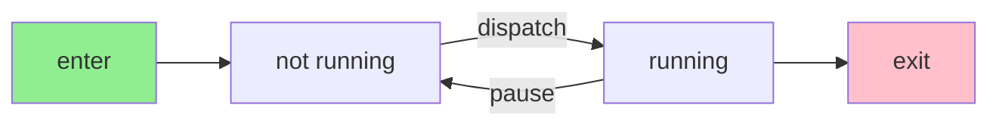
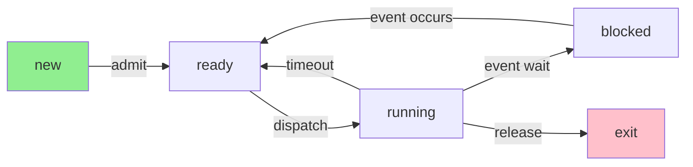
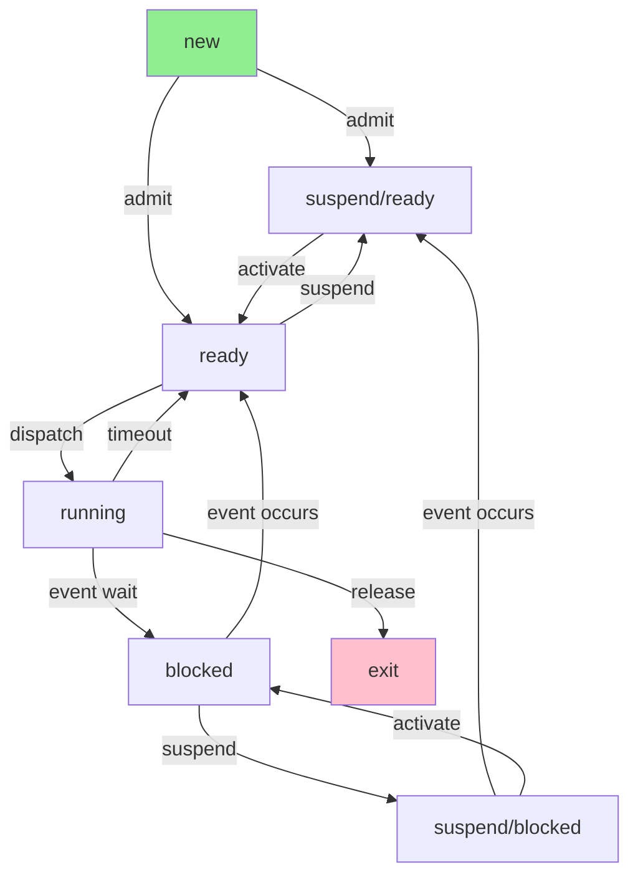
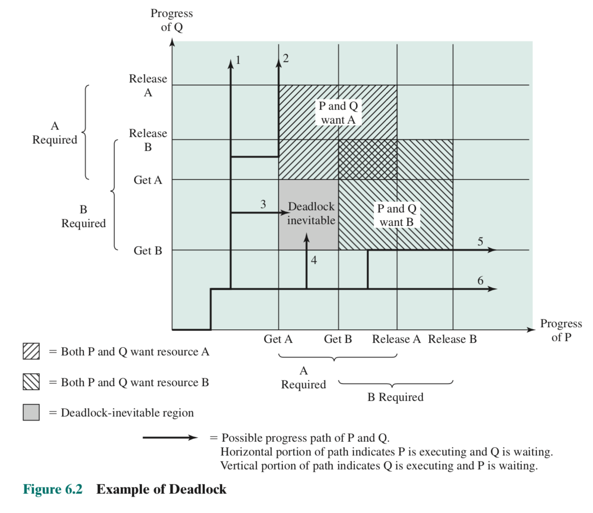
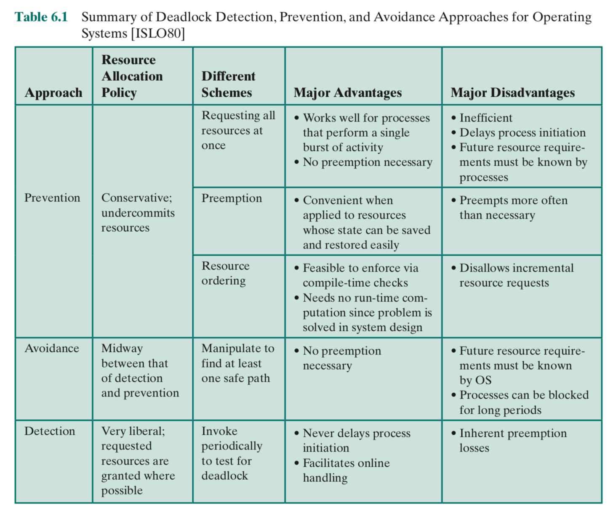
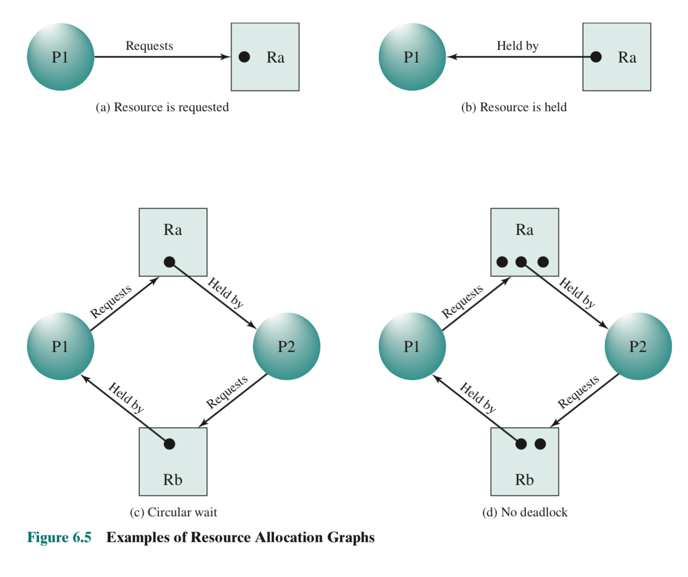
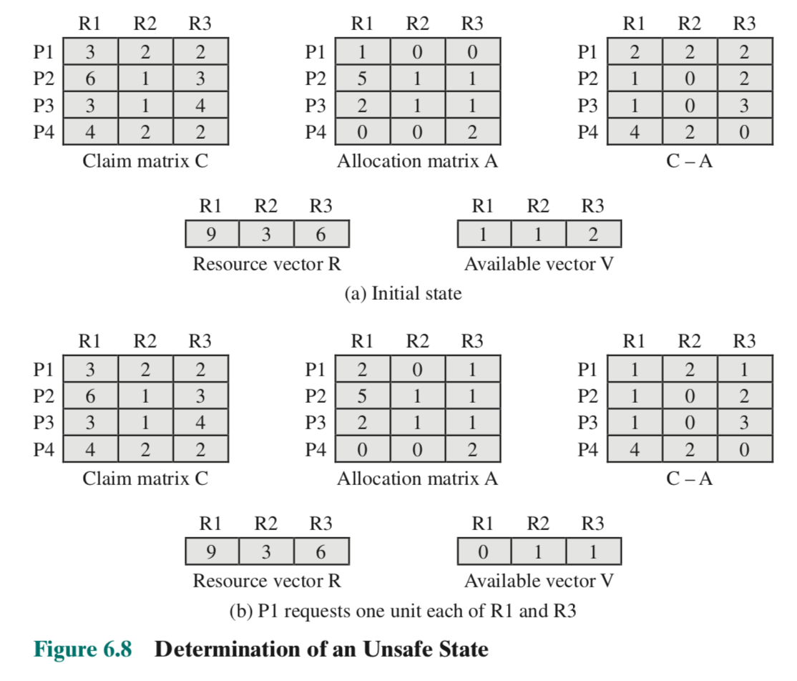
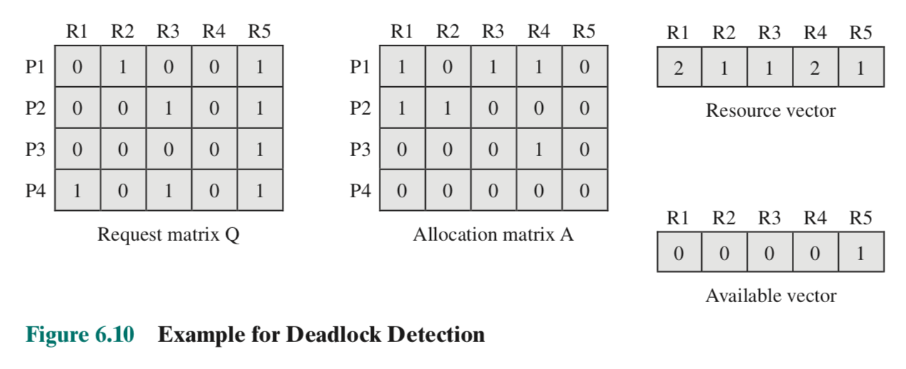
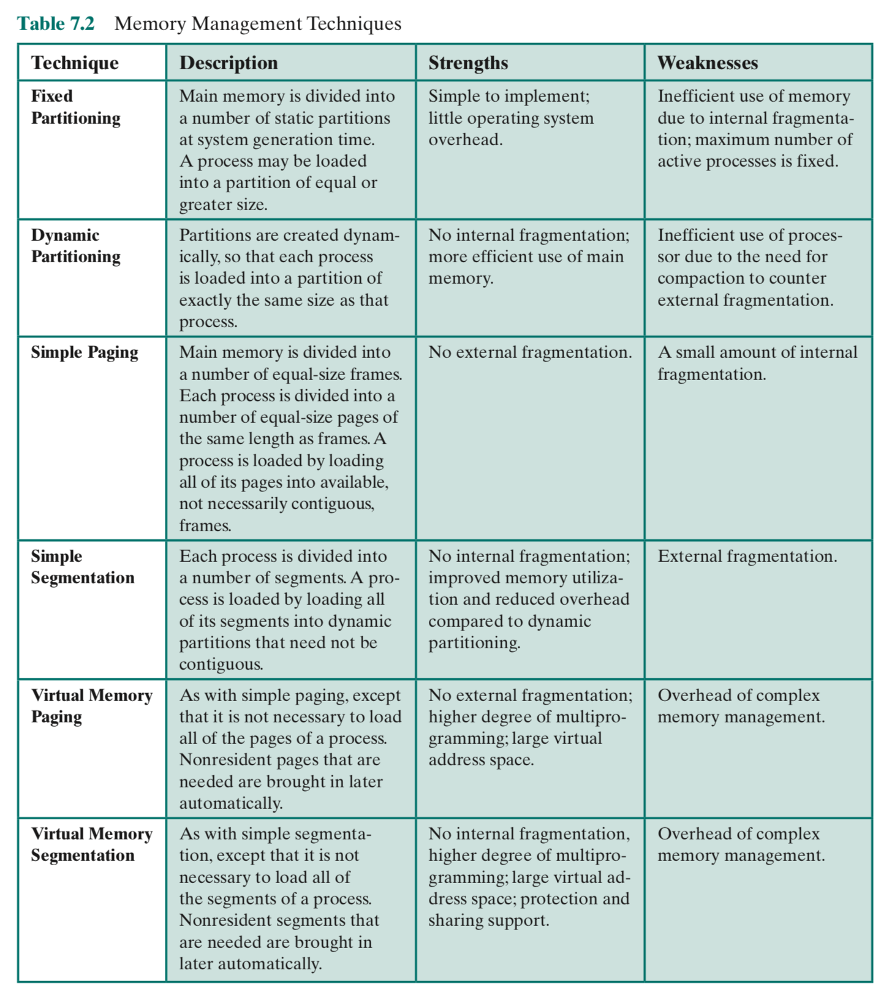
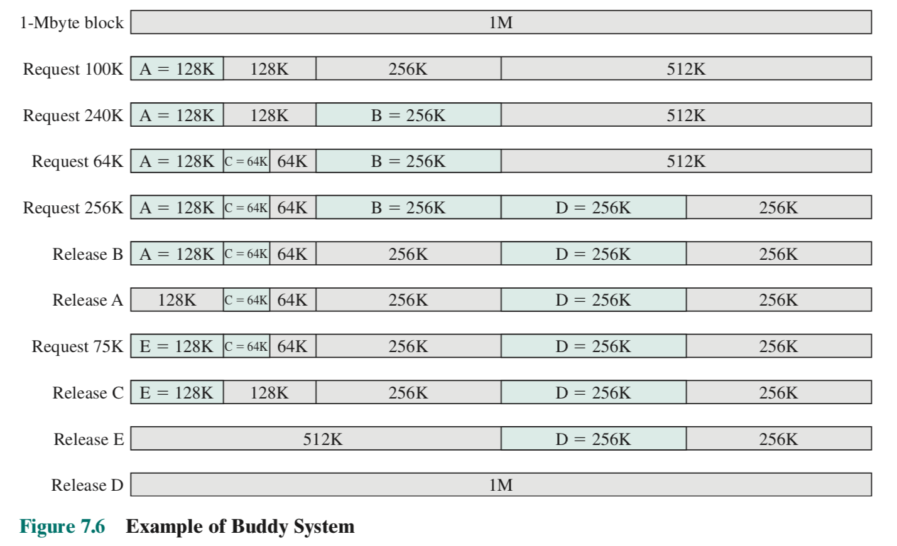

## Chapter 1 - Computer System Overview

### 1.1 Basic Elements

**OS:** uses hardware resources of one or more processors to provide a set of services to system users, manages secondary memory and I/O devices

A computer consists of processor, memory, and I/O components.

**processor:** controls operation of computer and performs processing, (single processor = CPU). It contains:

- the program counter
- instruction regiester
- memory address register (specifies address in memory for the next read/write)
- memory buffer register (data to be written in memory or data received from memory)
- I/O address register (specified I/O module address for the next read/write)
- I/O buffer register (data to be written to I/O module or data received from I/O module)

**main memory:** stores data and programs, and is typically volatile (data is lost when computer shuts down)

**I/O modules:** move data between processor and external devices e.g. secondary memory, monitors, etc. It contains temporary buffers in which external devices can write their data

**System bus:** provides communication between processors, main memory, and I/O modules

### 1.2 Evolution of the Microprocessor

**microprocessor:** processor or multiple processors (core) on a single chip (socket), enabled desktop and mobile computing

Microprocessors are the fastest general purpose processors. They can be multiprocessors (multiple processors/cores), with each core having multiple levels of large memory caches and multiple logical processors sharing the execution units of each core.

**graphical processing unit (GPU):** provides efficient computation on arrays of data using Single Instruction Multiple Data (SIMD) techniques. They are used for rendering graphics, general numerical processing, physics simulations, or computations on large spreadsheets.

CPUs are becoming better at computations on arrays of data as well—x86 and AMD64 processor architectures achieve this by integrating vector units into the CPU

**digital signal processors (DSP):** process streaming signals such as audio or video

CPUs can have **fixed function units** which deal with specialized computations such as encoding/decoding speech and video (codecs), or providing support for encryption and security.

**System on a Chip (SoC):** CPUs, caches, DSPs, GPUs, I/O devices, and main memory all exists on the same chip. This technology may replace microprocessors in the future.

### 1.3 Instruction Execution

The simplest instruction processing cycle is:

1. Fetch stage: A processor reads (fetches) one instruction from memory

   - Read the address of the next instruction to be executed from the PC, and load the instruction at that address into the instruction register
   - Increment the PC

2. Execute stage: The processor executes that instruction.

   The instruction generally falls into one of these 4 categories, or some combination of them:

   - Processor-memory: data transferred between processor and memory
   - Processor-I/O: data transferred between processor and I/O module
   - Data processing: perform arithmetic or logic operation on data
   - Control: alter the sequence of execution

The program halts if the processor is turned off, an error occurs, or a program execution which halts the processor is executed.

### 1.4 Interrupts

**interrupts:** a way for other modules (e.g. I/O modules, main memory) to interrupt the normal sequence of execution of the CPU, increases processor utilization while other modules run long operations

The most common types of interrupts are:

| Class            | Description                                                                                                                                                                                           |
| :--------------- | :---------------------------------------------------------------------------------------------------------------------------------------------------------------------------------------------------- |
| Program          | Generated by the result of an instruction execution e.g. arithmetic overflow, division by zero, attempt to execute an illegal machine instruction, or reference outside a user's allowed memory space |
| Timer            | Generated by a timer within the processor                                                                                                                                                             |
| I/O              | Generated by an I/O controller, to signal normal completion of an operation or an error                                                                                                               |
| Hardware failure | Generated by hardware failure, e.g. power failure or memory parity error                                                                                                                              |

When an interrupt returns, the I/O module sends an **interrupt request** signal to the processor. The processor then suspends operation of the current program, pushes its state to a stack, and then executes the interrupt handler. After execution of the handler, the processor returns to normal execution.

Interrupts add an interrupt stage to the instruction cycle:

1. Fetch next instruction

2. Execute instruction

3. If interrupts are disabled, go back to 1.

   If interrupts are enabled, then check for the interrupt request signal and initiate the interrupt handler if there is an interrupt. Once finished executing the interrupt handler, go back to 1.

There is overhead in this approach from storing the state of the current program, checking for an interrupt signal, and within the interrupt handler. However, the overall gains in efficiency are much better.

Interrupt processing consists of hardware and software steps:

1. Hardware

   1. Device controller or other hardware issues an interrupt request signal

   2. Processor finishes execution of current instruction

   3. Processor signals acknowledgement of interrupt to the device, which allows the device to remove its interrupt request signal

   4. Processor pushes PSW (program status word) and PC onto control stack

      The **program status word (PSW)** contains status information about the currently running process, including memory usage information, condition codes, interrupt enable/disable bit, and a kernel/user mode bit.

   5. Processor loads new PC value based on the entry address of the interrupt handler. If there is more than one interrupt handler, the processor needs to decide which to execute first. This information may be in the original interrupt request signal, or the processor might have to request this information from the device.

2. Software

   1. Save remainder of process state information (e.g. registers) onto control stack
   2. Process interrupt: examine status information relating to the I/O operation, send additional commands/acknowledgements to device, execute interrupt handler
   3. Restore process state information (e.g. registers) from the control stack
   4. Restore old PSW and PC from the control stack

There are two approaches when dealing with multiple interrupts:

1. Disable interrupts when an interrupt is being processed. When the interrupt is finished processing, reenable interrupts.

   This means that interrupts will always execute sequentially, which means that it doesn't take into account relative priority or time-critical needs. For example, if an interrupt is left pending for too long, it might have the data in its buffer overwritten by the next interrupt which comes in.

2. Define priorities for interrupts and to allow an interrupt of higher priority to interrupt an interrupt of lower priority.

   This makes interrupt handlers very difficult to debug.

### 1.5 The Memory Hierarchy

There are three key characteristics of memory: capacity, access time, and cost. There are tradeoffs between these characteristics:

- Faster access time means greater cost per bit (fast RAM is expensive)
- Greater capacity means smaller cost per bit (big hard drives are cheap)
- Greater capacity means slower access speed (big hard drives are slow)

We need some memory with very fast access times, and we need a lot of memory for cold storage. So, we use a **memory hierarchy** to determine what to store where. As you go down the hierarchy:

- the cost per bit decreases
- the capacity increases
- the access time increases
- the frequency with which the processor accesses that memory decreases
  - This is true due to the **locality of reference**, which is the idea that more frequently used instructions and data tend to cluster together. For example, a loop has repeated references to a small set of instructions, and an array is stored together in memory. Thus, we can store more frequently used clusters on top levels in order to get faster processing times.

A typical memory hierarchy:

1. Inboard memory
   1. Registers
   2. Cache
   3. Main memory
2. Outboard storage
   1. Magnetic disk, CD ROM, CD-RW etc.
3. Offline storage (auxiliary memory)
   1. Magnetic tape

To access memory lower down in the hierarchy, we first transfer that memory over to a higher memory level. We can also add levels to the hierarchy by using a portion of memory in a higher level as a buffer for memory in a lower level.

**hit ratio:** the fraction of all memory accesses that are found in some given level of memory

### 1.6 Cache memory

Cache memory is invisible to the OS, transferring data between main memory and the processor, to speed up main memory.

The cache starts off as a copied chunk of main memory. When the processor asks for data from main memory, a check is made first to see if the word is in the cache. If so, the word goes to the processor. If not, a block of main memory containing the requested word is read into the cache and then the word is delivered to the processor. We copy a whole block near the requested word so we can take advantage of the locality of reference.

There are sometimes multiple levels of caches (L1, L2, L3). The lower your level number, the smaller and the faster your cache.

Main memory is stored as M blocks of K words of each. Cache is stored as C slots of K words each, where C is much less than M. Thus, each cache slot needs to store a tag (usually a number of higher order bits of the address) which stores which of the M blocks that slot refers to.

There are several cache design issues:

- cache size, the size of the total cache
- block size, the size of data exchanged between the cache and main memory
- mapping function, determines which cache location a new block will occupy i.e. what cache slot to replace
- replacement algorithm, chooses what cache slot to replace within the constraints of the mapping function e.g. least recently used (LRU) algorithm
- write policy, determines when to write back an altered/dirty cache block back into main memory
- number of cache levels

### 1.7 Direct Memory Access

There are three techniques for I/O operations:

- **programmed I/O:** the processor issues a command to an I/O module, which then performs the requested action and sets the appropriate bits in the I/O status register. The I/O module does not interrupt the processor, so the processor has to poll the I/O module to check if it has finished the operation. This is bad for performance.

- **interrupt-driven I/O:** the processor issues an I/O command to a module and then goes on to do other work. The I/O module will interrupt the processor when it is ready to exchange data with the processor.

Programmed I/O and interrupt-diven I/O both need to be serviced by the processor at some point, so they both suffer from 2 drawbacks:

1. The I/O transfer rate is limited by the speed with which the processor can test and service a device
2. A number of instructions must be executed on the processor for each I/O transfer

- **direct memory access (DMA):** used to efficiently move large volumes of data by having the processor send a DMA module

  - Whether a read or write is requested
  - The address of the I/O device requested
  - The starting location in memory to read from or write to
  - The number of words to be read or written

  The DMA module then transfers the block of data specifed from the I/O module to memory without going through the processor. It notifies the processor only when the job is complete. The drawback is that the DMA may take control of the bus when the processor needs it. However, the processor never needs to save its state, so it is still more efficient than interrupt-drien I/O.

### 1.8 Multiprocessor and Multicore Organization

We want to perform as many operations in parallel as we can. There are 3 popular ways to do this: symmetric multiprocessors, multicore computers, and clusters.

#### Symmetric Multiprocessors (SMP)

An SMP is a standalone computer system with the following characteristics:

1. There are two or more similar processors of comparable capability

2. These processors share the same main memory and I/O facilities, and are interconnected by a bus such that the memory access time is the same for each processor

3. All processors share access to I/O devices

4. All processors can perform the same functions

5. The system is controlled by an integrated operating system that provides interaction between processors and their programs at the job, task, file and data element levels.

   If the system had an operating system which provided interaction between processors and their programs at the message/file level, then it would be a loosely coupled multiprocessing system rather than an SMP.

The advantages of an SMP over a uniprocessor organization are:

- **Performance:** If the work can be parallelized, more work can be done in parallel
- **Availability:** All processors can perform the same functions, so the failure of one processor doesn't halt the machine.
- **Incremental growth/Scaling:** A user can increase the performance of the system by adding more processors or by buying a new machine with more processors

In an SMP, processors each have their own cache, control unit, arithmetic logic unit, and registers. They communicate with each other by leaving messages and status information in shared address spaces, or by exchanging signals directly. Memory is organized so that multiple simultaneous accesses to separate blocks of memory are possible, since one main memory and all I/O modules are shared between the processors. Having multiple caches introduces cache coherence problems between processors when a cache is altered in one processor but not in another. This problem is addressed in the OS.

#### Multicore Computers

A multicore computer (or a chip multiprocessor) combines two or more processors (core) on a single piece of silicon (die). Each core has its own registers, ALU, pipeline hardware, control unit, and caches. When multiple processors and a larger amount of cache is placed on the same chip, it improves performance.

Additional technologies which can speed up processing on multicore computers include prefetching cache, bringing the memory controller onto the chip instead of using the bus, and the QuickPath Interconnect (which allows for communication between connected processor chips).

## Chapter 2 - Operating System Overview

### 2.1 Operating System Objectives and Functions

An operating system can be thought of as having 3 objectives:

- **Convenience:** An OS makes a computer more convenient to use
- **Efficiency:** An OS allows the computer system resources to be used in an efficient manner
- **Ability to evolve:** An OS should allow new system functions to be added without interfering with service

We want the user to look at a computer as a series of applications. We want the applications programmers to focus on developing their application, rather than writing new filesystems for each application. So, an OS has to provide services to application programmers and to users:

- **Program development:** The OS has a variety of libraries/utilities (e.g. editors and debuggers) offered as applications packaged with the OS.
- **Program execution:** The OS handles loading instructions and data into main memory, initializing I/O devices and files, as well as allocating other resources before and after a program is run
- **Controlled access to files:** The OS handles I/O modules for files as well as the structure of how files are stored (e.g. folders don't exist in main memory). If there are multiple users, the OS provides protection mechanisms for controlling access to files.
- **System access:** For shared or public systems, the OS controls access to the system as a whole and to specific system resources. For example, it can't allow unauthorized users to gain access and it has to resolve resource conflicts between users.
- **Error detection and response:** The OS has to detect errors (e.g. internal and external hardware errors, software errors) and deal with them
- **Accounting:** The OS collects usage statistics for various resources and monitors performance parameters such as response time
- **Instruction set architecture (ISA):** The ISA defines the set of machine language instructions that the computer can follow. Application programs and utilities can access a subset of the ISA called the user ISA. The OS has access to the full system ISA.
- **Application binary interface (ABI):** Defines standard for binary portability across programs, defines what resources and services are available in the user ISA
- **Application programming interface:** Gives a program access to hardware resources and services available in a system through the user ISA and high level language (HLL) library calls

It's important to note that the OS is not an omnipresent resource manager! It is a program, so it has to cease executing on a processor in order for it to run client applications.

**kernel:** most frequently used functions of the OS which other parts of the OS use

An OS evolves for reasons including: hardware upgrades or new types of hardware, new services, and fixes. So, an OS should be modular.

### 2.2 History

##### Serial Processing

In the earliest computers developed in the late 1940s to the mid 19050s, there was no OS. The programmer interacted directly with the computer hardware through some sort of input device (e.g. physical switches) and read output from a console of display lights and/or a printer.

These systems had two main problems:

- **Scheduling:** Time on the machines was scheduled in blocks beforehand, but people often didn't know if they would finish early or run out of time
- **Setup time:** A single program (job) involved loading the compiler with the source program into memory, saving the compiled object program, and then loading and linking together the source and object programs. All of this was done physically, so if an error occurred, people had to go back and start the setup again.

This type of computing was called serial processing, since users have access to the computer in series.

##### Simple Batch Systems

Batch systems were invented to deal with the time wasted on serial processing machines due to scheduling and setup time. People created a monitor program to schedule and setup jobs instead of having to do it manually each time.

In a batch system, the user submits the job on cards or tape to a computer operator, who batches the jobs together sequentially and places the entire batch on an input device. A monitor program will then read in and execute each job. At the end of its execution, each job branches back to the monitor so that the monitor can load the next job. The results of each job are sent to an output device, such as a printer.

The monitor queues up jobs and sets them up according to instructions provided along with the job in **job control language**.

The batch OS introduced several desirable hardware features of operating systems:

- **Memory protection:** user programs should not alter the memory in which the code for the batch OS is stored
- **Timer:** a single job should only be allowed a fixed amount of time
- **Privileged instructions:** User programs should not be allowed to execute certain machine instructions. For example, they should not be allowed to access I/O devices.
- **Interrupts:** This gives the OS more flexibility in relinquishing control and regaining control from user programs. For example, they can implement a timer using interrupts.

##### Multiprogrammed Batch Systems

Multiprogrammed batch systems improved on the performance of batch systems by allowing them to execute another job while the current one was blocked on I/O.

##### Time-sharing Systems

For many jobs, it's preferable to have a model where the user interacts with the computer rather than giving it massive batch jobs ahead of time. In the 1960s, time-sharing systems were developed which handle multiple interactive jobs using multiprogramming. Each user would get a certain amount of processor time, so that multiple users could use the same expensive machine.

In the CTSS system, user memory would stay in a certain location in memory until new user memory needed to come in to overwrite it. If only a chunk of the user memory needs to be overwritten, the monitor would write out just the overwritten portion to disk instead of replacing the user memory in full and writing the whole thing to disk. In this way, CTSS minimized slow disk operations.

Time-sharing and multiprogramming runs into many more problems, like protection of user data, access control to files, and contention for resources.

### 2.3 Major Achievements

There are four major theoretical advances in development of operating systems: processes, memory management, information protection and security, and scheduling and resource management.

##### Processes

As people tried to developed multiprogrammed batch systems, time-sharing systems, and real-time transactions systems (like time-sharing systems but users primarily only use one application on the OS), they ran into a lot of problems. There were four main causes of such errors:

- **Improper synchronization:** If interrupt signals are lost or duplicated, then a routine could be stuck forever waiting for a data in a buffer to become available, or continually execute the same interrupt handler.
- **Failed mutual exclusion:** This occurs when the OS does not block two users accessing the same resource at the same time.
- **Indeterminate program operation:** Programs are meant to be determinate, meaning that they should always give the same output when given the same input. But, since programs in a multiprogramming environment share memory, improper usages of that memory cause indeterminate programs, where the order in which various programs are scheduled affects the output of those programs.
- **Deadlocks**

To solve this, people came up with the idea of a process, which has 3 components:

- an executable program
- associated data needed by the program
- the execution context of the program e.g. the contents of various processor registers, the program counter, priority of the process, and whether the process is waiting for an I/O event

To manage processes, we create a process list which records an entry for each process. The entry contains a pointer to the location of the block of memory which holds the instructions for the process. The process entry has an execution context, which can be stored with the process entry itself or in a separate region of memory (and the process entry has a pointer to it).

The process index register contains the index of the process in the process list which is currently executing. The base register is the starting address of the region of memory used by the process and the limit register is the size of the region. To prevent interprocess interference, we simply check whether the program counter and all data references are within the limit register's limit relative to the base register.

##### Memory Management

The OS has 5 principal storage management responsibilities:

- **Process isolation:** The OS must precent processes from interfering with each other's memory, both data and instructions
- **Automatic allocation and management:** Programs must be dynamically allocated across the memory hierarchy
- **Support of modular programming:** Programmers should be able to define program modules, and to create, destroy, and alter the size of modules dynamically
- **Protection and access control:** Processes may share memory, but they must do it in a controlled way which does not corrupt other programs or the OS
- **Long-term storage:** Many applications require data to persist after the computer has powered down

**virtual memory:** allows programs to address memory without regard to the amount of main memory physically available. Memory is of varying sizes, so it is stored in main memory as a number of fixed-size blocks called pages. To access a word in memory, the user program specifies a **virtual address** consisting of a page number and an offset within the page, and then the paging system will translate that to a **real address** in main memory. This translation is called dynamic mapping.

Not all the pages of the virtual memory reside in main memory simultaneously. In fact, when no process is executing, all the pages of virtual memory reside on disk. When a process is executing, the paging system loads some of its pages into main memory, and when the process makes a reference to a page not in main memory, the paging system will then load it in, sometimes replacing an existing page in main memory.

The virtual processor is a processor which has access to virtual memory.

We can achieve process isolation by giving each process its own non-overlapping virtual memory, and we can achieve memory sharing by overlapping portions of virtual memory.

##### Information protection and security

Information protection and security work falls into 4 categories:

- **Availability:** The system should not be interrupted
- **Confidentiality:** Users should not read data for which they are not authorized
- **Data integrity:** Data should not be modified without authorization
- **Authenticity:** the identity of users and the validity of data should be verified

##### Scheduling and Resource Management

Scheduling and resource management should consider 3 factors:

- **Fairness:** All processes competing for the use of a resource should get equal use of that resource if they are of a similar priority and demand
- **Differential responsiveness:** If there are different jobs with different requirements, the OS may want to schedule some first. For example, the OS might want to schedule a process waiting for an I/O device as soon as possible so that the I/O device can become freed for other processes
- **Efficiency:** The OS should try to maximize throughput and minimize response time. In the case of time-sharing, it should try to accommodate as many users as possible

When scheduling processes, the OS maintains a number of queues of processes waiting for some resource. The short-term queue consists of processes in main memory which are ready to run as soon as the processor is available. The short-term scheduler/dispatcher picks which process in the short term queue to run next. There are many algorithms for picking which algorithm to use. Two examples would be round robin (circular queue) and by priority.

The long-term list is a list of new jobs waiting to use the processor. The OS adds jobs by transferring a process from the long-term queue to the short-term queue. During the transfer, the OS will allocate a portion of main memory for the new process.

There is an I/O queue for each I/O device, and processes are added to the I/O queue of the I/O device that they need to use.

### 2.4 Developments leading to modern operating systems

Until recently, most operating systems used a large monolithic kernel. The large kernel provides OS functionality such as scheduling, file systems, networking, device drivers, and memory management. A monolithic kernel is implemented as a single process, with all elements sharing the same address space.

A microkernel architecture assigns a few essential functions to the kernel e.g. address spaces, interprocess communication, and basic scheduling. Other OS services are provided by processes, called servers, which run in user mode and are treated like an application. This simplifies implementation as it decouples server processes and the kernel. It's also suited to a distributed environment, since the microkernel would interact with local and remote server processes in the same way.

**multithreading:** dividing the execution of an application into threads which can run concurrently

**thread:** some unit of work which knows its processor context and its own data area. A thread can be interrupted, so a processor can work on another thread

**process:** a collection of one or more threads and associated system resources

Multithreading is useful for applications which perform independent tasks which don't need to be in sequence. An example would be a database, switching between servicing multiple client requests, each of which are threads. Switching between threads within the same process has involves less overhead than switching processes.

In symmetric multiprocessing (SMP), the OS aims to schedule processes or threads across all processors. However, to the user, it looks as if one unified process is running on one large processor.

This is similar to multicomputer systems, which have to present the illusion of a single system. It's also similar to **distributed operating systems**, which give the illusion of a single memory space, as well as providing services as if it were one system e.g. a single file system.

Object oriented design is the idea of adding modular extensions to a small kernel. Object oriented design makes the development of distributed tools and distributed operating systems easier.

### 2.5 Fault Tolerance

**fault tolerance:** the ability of an OS to continue execution despite software or hardware faults

**realitability $R(t)$:** probability of a system operating correctly up to time $t$ given that the system was operating correctly at time $t = 0$

**mean time to failure (MTTF)**: MTTF = $\int_{0}^{\infty} R(t)$, also called the mean uptime

**mean time to repair (MTTR):** average time it takes to repair or replace a faulty element, also called the mean downtime

**availability:** the fraction of time the system is available to service requests, or the probability that the system is available

$A = \frac{MTTF}{MTTF + MTTR}$

**downtime:** time in which system is not available

**uptime:** time in which system is available

**fault:** erroneous hardware or software state resulting from component failure, operator error, physical interference from the environment, design error, program error, or data structure error. Faults fall into the following categories:

- **Permanent:** a fault that is always present once it occurs unless the component is replaced or repaired e.g. disk head crashes, software bugs
- **Temporary:** a fault that is not present all the time for all operating conditions. They come in two categories:
  - **Transient**: a fault that only occurs once e.g. radiation that alters a memory bit
  - **Intermittent:** a fault that occurs at multiple random intervals e.g. loose connection

Fault tolerance is built up by adding redundancy. Methods of redundancy include:

- **Spatial/physical redundancy:** using multiple components that perform the same function simultaneously or as a backup e.g. backup nameserver
- **Temporal redundancy:** repeating a function or operation when an error is detected until the correct behaviour is produced e.g. retransmitting a block of data when an error is detected
- **Information redundancy:** replicating or coding data such that bit errors can be detected and corrected e.g. error-control coding circuitry used in memory systems, error-correction techniques used with RAID disks

The OS also has techniques which support fault tolerance. Some examples are:

- **process isolation:** processes with faults are prevented from affecting other processes
- **concurrency controls:** techniques used to deal with problems arising from processes communicating with each other, e.g. deadlock
- **virtual machine:** provide a greater degree of application isolation and can be used to provide redundancy
- **checkpoints and rollbacks:** a checkpoint is a copy of an application's state saved in memory which should not also fail e.g. database and traction processing systems. The OS can then rollback an application to a good checkpoint.

### 2.6 OS Design considerations for multiprocessor and multicore

#### Symmetric Multiprocessor OS Considerations

An SMP kernel can execute on any processor as multiple processes or multiple threads. The SMP OS designed has to deal with the sharing resources and co-ordinating actions from multiple parts of the OS executing at the same time.

An SMP OS also has to manage the processor and other computer resources so that the user may view the system in the same fashion as a multiprogramming uniprocessor system. Thus, a multiprocessor OS must design a multiprogramming system with multiprocessor considerations.

The key design issues are:

- **Simultaneous concurrent processes or threads:** Kernel routines need to be reentrant to allow several processors to execute the same kernel code simultaneously. The OS must manage kernel tables and management structures properly to avoid data corruptions or invalid operations
- **Scheduling:** All processors perform their own scheduling, which complicates enforcing a scheduling policy. The OS has to ensure that scheduling data structures are not corrupted.
- **Synchronization:** Since multiple processes have access to the address space and I/O resources, we have to enforce mutual exclusion and event ordering. For example, we can use locks.
- **Memory management:** In addition to regular memory management, an SMP OS has to deal with parallelism problems. For example, the paging mechanisms on different processors must be consistent when one processor needs to replace a page. The OS has to guarantee that a processor can't access a page with its old contents before the new contents are transferred in.
- **Reliability and fault tolerance:** The OS should be able to deal with the loss of a processor.

#### Symmetric Multicore OS Considerations

Recall that the difference between multiprocessor and multicore systems is that multicore systems have multiple processors on the same chip. So, all the design issues that plague SMP systems also apply to multicore systems. There are also additional issues since there are 3 kinds of parallelism available in multicore systems:

- Hardware parallelism within each core processor, known as instruction level parallelism
- Multiprogramming and multithreaded execution within each processor
- A single application can execute in concurrent processes or threads across multiple cores

There are two approaches to how we an extract more parallelism from multicore systems:

##### Parallelism within applications

Most applications can be broken up into multiple tasks that can execute in parallel, with those tasks being implemented as multiple processes, and each process having multiple threads. The developer and the compiler do the work to split up the application into multiple tasks. The OS allocates resources among parallel tasks as defined by the developer.

##### Virtual machines

Since we have so many cores, we could also use a core as a hypervisor which allocates other cores to different processes. If we dedicate a core to a process, we don't have all the overhead of context-switching and scheduling decisions. The process allocates resources for itself within the bounds of the memory and processor given to it by the hypervisor using metadata generated by the compiler.

The reasoning is that all the context-switching was done in order to give the illusion of having a dedicated processor to your process anyways, so now that we have multiple cores, it's not necessary to do all that.

## Chapter 3 - Process Description and Control

### 3.1 What is a process?

**process control block:** metadata about a process which is created and managed by the OS. It contains:

- **identifier:** unique, nonsequential identifer of the process
- **state:** whether the process is currently executing or not
- **priority:** priority level relative to other processes
- **program counter:** the address of the next instruction in the program to be executed
- **memory pointers:** pointers to the program code and data associated with this process, pointers to shared data process
- **context data:** data that are present in registers in the processor while the process is executing
- **I/O status information:** outstanding I/O requests, I/O devices assigned to this process, a list of files in use by the process
- **accounting information:** amount of processor time and clock time used, time limits, etc.

The process control block is used to store the state of the process and then restore it after an interrupt occurs.

### 3.2 Process States

**trace:** sequence of instructions which execute for a given process

#### Two-State Process Model

The simplest process model has 2 states for processes: a running state and a not running state. We keep the not running processes in a queue (of process control blocks) to be dispatched to the processor. Processes can enter the queue either as a new process or as a process from paused from the processor.



**Reasons why a process is created:** new batch job, interactive log-on, created by the OS, or created by an existing user process.

**process spawning:** when a process is created at the explicit request of another process. The requested process is the child process and the requesting process is the parent process

**Reasons why a process is terminated:** normal completion, time limit exceeded, memory unavailable, bounds violation (read access error), protection error (write access error), arithmetic error, time overrun (too much time spent waiting), invalid instruction (executing non-existent instruction), privileged instruction (executing OS-only instruction), operator or OS intervention, parent process termination, parent process request.

#### Five State Model

The two-state process is model is inefficient when processes in the queue are not ready to run yet. Each time we look for a process from the Not Running queue, we would have to do a pass through the queue to find the first unblocked process. To deal with this, we split the Not Running state into a Blocked state and a Ready state.

We also add a new state and an exit state into the model. The new state represents processes that the OS has created a process control block for, but has not yet loaded into main memory. The exit state represents the point where the OS has not yet deallocated all of the program's memory, so that auxiliary processes can go in and grab information from the terminated process as needed.



We maintain a blocked queue for each type of waiting event (so that we don't have to do a pass through the blocked queue when an event occurs), and as many ready queues as there are priorities in our operating system.

###### Swapping

Consider when all the processes are in the blocked state. Then, we would have to wait for all of the blocked processes, and the processor would be idle. So instead, we'll create a suspended queue on disk, so we can transfer processes from the blocked queue there. This way, we can free up main memory to bring in another new process or try to bring in a process from the suspended queue.

Note that we'd like to have all the processes that we bring in from the suspended queue to be in the ready state. So, to account for this, we'll further split the suspended state into a suspended-ready state and a suspended-blocked state, each with their own queues.



> We assume here virtual memory is not used (a process is either entirely in main memory or it is entire on disk). If virtual memory is used, we have to make considerations on the number of processes allowed, since it's possible that too many processes will cause the OS to make too many I/O calls. We discuss this in later chapters.

**Reasons why a process is suspended:** swapping out to free memory for a ready process, OS suspects a problem in the OS, user request, timing, parent process request

### 3.3 Process Description

The OS constructs and maintains tables of information about processes and resources that it manages. It has four types of tables: memory tables, I/O tables, file tables, and process tables. These tables have references to each others data, and are initialized via configuration data.

**memory tables:** keeps track of main memory and secondary memory. It tracks the allocation of the main memory, the allocation of the secondary memory, protection attributes of memory, and any information needed to manage virtual memory.

**I/O tables:** keeps track of the I/O devices and channels. It has information on the status of the I/O operations in progress and the location in main memory being used as the source/destination of the I/O transfer.

**file tables:** keep track of the location of files in memory and the status of those files. The OS does not have a file table if it has a file management system instead.

**process tables:** keeps track of process location, process ID, and process state

**process image:** process control block + user program in memory + stack memory for parameters and calling addresses + user data (user stack + program data)

The process table's entry for each process must contain a pointer to the process image of that process.

### 3.4 Process Control

**trap:** interrupt which occurs due to error

**mode switch:** toggling between kernel mode and user mode

#### 3.5 Execution of the Operating System

Recall that the OS is a collection of programs itself. So, how is it controlled and executed?

##### Nonprocess kernel

It is common on many older operating systems to execute the kernel of the OS outside of any process. The OS has its own region of memory and its own system stack for controlling procedure calls. So, when a user makes a call to the OS, a process switch occurs to switch to the OS, and then once the call has completed, the OS will process switch back to the user process.

##### Execution within user processes

We can also view the operating system as a collection of routines which the user can call. Thus, when an OS method is called, the OS routine executes with the user process environment. This eliminates the need for process switching and is secure since in user mode, the user process cannot modify the OS address space or code, even though it can execute it.

##### Process-based operating system

We can also view the individual components of an OS as processes. This allows for the OS to be modular, assigning certain tasks at a higher or lower priority, and take advantage of having multiple processors.

## Chapter 4 - Threads

### 4.1 Processes and threads

We dispatch a thread, and we allocate resources to a process. Each process has associated with it a process image and protected access to processors, other processes, files, and I/O resources. Each thread has a thread execution state, an execution stack, a saved thread context (when not running), thread level storage for local variables, and access to the memory/resources of process.

The benefit of using threads is that they involve much less overhead than processes. They are faster to create/terminate than a process, they are faster to switch between than processes, and it is faster for threads to access resources within the same process than it is to request a resource from the OS.

### 4.2 Types of threads

###### User level threads

**user level threading (ULT):** all thread management is done by the application using a threading library, so the kernel is not aware of threads

This means that the threading library is assigning states to each thread, so the assigned thread state may not correspond to the thread's actual state in the OS. For example, an thread might request system I/O, causing the kernel to take over and block the process. In this case, the thread would never get the chance to set its state to blocked, so the internal state of the thread inside the blocked process would be Running.

**Advantages**:

- Thread switching does not involve kernel mode privileges
- Scheduling can be application specific
- User level threading code is not OS-specific

**Disadvantages**:

- When one thread of the application makes a blocking call to the OS, the whole application becomes blocked. Since many system calls are blocking, this happens often. We can use **jacketing** to solve this.
- Each single application cannot take advantage of multiple processors, since a process is assigned a single processor by the kernel regardless of how many threads it can create.

**jacketing:** handling a blocking system call within the threading library. For example, a thread will call a jacket I/O routine instead of the system I/O routine. The jacket routine will check if the I/O device is busy, and if it is, it will block the thread and pass control to another thread through the threading library. When the thread is given control again, the jacket routine can check the I/O device status again.

###### Kernel level threads

**kernel level threading (KLT):** all thread management is done by the kernel

User applications can create threads using the thread API provided by the kernel, and the kernel will schedule these threads.

**Advantages:**

- Applications can take advantage of multiple processors, since the kernel can schedule threads from the same process to different processors.
- If one thread of the application is blocked, the kernel can schedule another thread of the application.
- Kernel routines can be multithreaded.

**Disadvantages:**

- Switching control from one thread to another when both threads are within the same process requires the use of kernel mode, which involves more overhead than ULT

So, whether we use ULT or KLT depends on the kinds of applications we're running. If, under ULT, we were switching threads with a need for kernel mode very often anyways, then KLT would perform better.

###### Combined approach

In a combined approach, the application can create as many threads, schedule threads, and otherwise manage them, but each of those multiple ULT threads will be mapped onto a smaller or equal number of KLT threads. Thus, we can run ULT threads on different processors using different KLT threads, and a single blocking ULT thread need not block the whole application. Furthermore, we can switch control easily between the component ULT threads of a KLT thread.

So far, we have looked at threads as components of processes, meaning that threads and processes are in a 1:1 relationship or a many:1 relationship. But we could also have one thread corresponding to many processes, or many threads corresponding to many processes.

###### Many to many relationship

Many threads corresponding to many processes allow for threads to "move between" processes, and thus between address space domains. For example, this is useful for small I/O subprograms which need to be shared between applications or are frequently used (since they would be have to be frequently destroyed and created).

###### One to many relationship

One thread corresponding to multiple processes is a way to implement distributed programming, since the single thread can move between computers with minimal complexity.

### 4.3 Multicore and multithreading

Amdahl's Law states that the speedup of using multiple cores can be measured as the time it takes to execute a program on a single processor over the time it takes to execute that program on $N$ processors.

Thus, $\text{speedup} = \frac{1}{(1 - f) + \frac{f}{N}}$, where $f$ is the percentage of code which can be parallelized.

$(1 - f)$ is the run time of the serialized, non-parallelized code, and $f/N$ is the runtime of the parallelized code, which we assume has no scheduling overhead and is parallelizable up to $N$.

By Amdahl's Law, even a small amount fraction of serialized code will affect the overall performance of the processors. In addition, if we account for the overhead of scheduling between processors, adding additional processors past a certain point actually makes performance worse than before.

We can write applications which specifically deal with these issues by fully utilizing parallelized code. For example, database applications, Java applications multiprocess applications, multithreaded applications, and multi-instance applications all benefit from a multicore environment.

### 4.6 Linux process and thread management

A process in Linux is represented by a `task_struct` data structure. It contains:

- state, which is one of:
  - **Running:** process is executing
  - **Ready:** process is ready to execute
  - **Interruptible:** blocked state in which the process is waiting for an event i.e. the end of an I/O operation, availability of a resource, or a signal from another process
  - **Uninterruptible:** blocked state in which the process is waiting on hardware conditions, so it doesn't handle any signals from other processes
  - **Stopped:** the process has been halted and can only resume by another process
  - **Zombie:** the process has been terminated, but still needs to have its task structure in the process table
- information needed for scheduling i.e. priority
- process identifier, user identifier, group identifier (used to assign resource access among a group of processes)
- information for interprocess communication
- link to parent process, links to sibling processes, links to child processes
- process creation time, amount of processor time used by process so far, interval timers for periodic tasks
- pointers to files opened by process, pointers to current and root directories of the process
- address space
- processor-specific context i.e. registers and stack information

#### Linux Threads

Early versions of Linux did not support KLT, so applications used user-level threading libraries. The most popular of those libraries is pthread, which maps all of the ULT threads into a single KLT thread.

Modern versions of Linux do support KLT, but they don't make a distinction between ULT and KLT. Instead, all ULT threads from the same process are mapped into a single KLT process which has some common group ID. This way, you can switch ULT threads from the same process without context switching, and ULT threads from the same process can share resources.

##### Fork vs. Clone

`fork` creates a child process from the current calling process. After the `fork()` call is made, the child process will get a deep copy of the address space of its parent (i.e. all variable values prior to the `fork()` statement will be the same), and its own user stack. Then, both the parent and the child process execute the line _after_ the `fork` statement in the program. Calling `fork()` also changes the process ID given from the `getpid()` call.

- If the process ID returned is 0, then the currently executing process is the child.
- If the process ID returned is negative, then a child process was not successfully created and the currently executing process is the parent.
- If the process ID returned is positive, then a child process was successfully created and the currently executing process is the parent

Linux extends `fork()` using `clone` by adding some optional flag parameters to it.

- CLONE_NEWPID: creates a new process ID namespace
- CLONE_PARENT: parent and child process share the same parent process
- CLONE_SYSVSEM: shares System V SEM_UNDO semantics (?)
- CLONE_THREAD: inserts this process into the same thread group of the parent, implicitly enforces CLONE_PARENT
- CLONE_VM: shares the same address space (rather than a copy of the address space)

If CLONE_VM is true, then switching between a child and parent process would be as simple as jumping from one location in code to another.

#### Linux Namespaces

**namespace:** restricts a process to have a certain "view" of the system which doesn't allow it to affect other processes with a different namespace. This implements control groups (cgroups) of processes which operate as if they are the only processes in the system.

When a process is cloned, it can be put in a namespace using a flag parameter to the `clone` call. A process can also put itself in a namespace using the `unshare` call with a flag parameter.

###### Mount namespace

The mount namespace provides a specific view of the filesystem. So, two different processes with different mount namespaces cannot cause filesystem changes which are visible to each other.

###### UTS namespace

The unix time sharing (UTS) namespace determines the information returned by the `uname` system call. This call returns the name and information about the current kernel, as well as high level information about the nodename and the system name of the system network (e.g. NIS network).

###### IPC namespace

The interprocess communication (IPC) namespace determines which concurrency mechanisms (e.g. semaphores) are available to the process.

###### PID namespace

The Checkpoint/Restore in Userspace (CRIU) tool allows you to freeze a running application (or some part of it) and checkpoint it to a hard drive. The PID namespace allows you to implement this by allowing you to isolate a process within a certain namespace.

###### Network namespace

Network namespaces determine which network devices, IP addresses, IP routing tables, port numbers etc. a process has access to. Network resources are virtualized so that a given network device or socket can belong to at most one network namespace at a time.

###### User namespace

User namespaces are the namespaces for cloned processes. They can be different from their parent namespace, or the same.

## Chapter 5 - Concurrency

Concurrency needs to be considered in at 3 levels:

- **Single application:** if the application is modular, then we can use multiple processes within the same application program
- **Multiple applications:** multiprogramming, sharing between programs
- **Operating system:** if operating systems are constructed as multiple programs or multiple processes within (multiple) programs

**mutual exclusion:** the ability to exclude all other processes from executing a block while one process gets to execute that block (block is called a critical section)

Concurrent processes have to support mutual exclusion.

### 5.1 Principles of Concurrency

When you have multiple programs running at the same time, or if you have multiple programs that you switch between in general, you're going to run into problems:

- Sharing global resources: If two programs are writing and reading from a shared resource, then the order in which they do this causes a race condition and changes the result of the program execution (makes the program non-deterministic)
- Deadlocks: If a process A requests and gets access to a shared resource, and then gets interrupted by another process B, then that resource is in a locked state until process A resumes. If B also needs access to that shared resource, then nothing can run on the processor at all.
- Debugging gets really hard, because where the error presents itself and where the error originates are really different.

> ##### Example
>
> Consider the following program, running on two applications in a single-processor multiprogramming system which supports 1 user:
>
> ```c++
> void echo() {
>   chin = getchar();
>   chout = chin;
>   putchar(chout);
> }
> ```
>
> Since both applications need access to this program, we load only 1 copy of the program code into global memory to save space. We also share memory between applications, i.e. multiple processes would have access to the same global memory location of `chin`.
>
> This then causes problems. Suppose the following sequence of events, where the user inputs 'x' and then 'y':
>
> 1. Process P1 invokes `echo` and is interrupted after `chin = getchar()`. So, `chin` holds the value 'x' at this point.
> 2. Process P2 invokes `echo` and runs to conclusion, printing 'y' to the screen. When P2 does this, it also overwrites the value in `chin` with y.
> 3. Process P1 is resumed, and runs to conclusion, printing 'y'.
>
> So, we lost the first character inputted.
>
> We solve this by making the procedure `echo` atomic, or a **critical section** which only one program can execute at a time.
>
> Notice that we would get the same problem if we had a multiprocessor system as well.

Recall that an OS needs to ensure that the output/speed of a process must not depend on the speed of execution of any other concurrent process. We can examine the different kinds of concurrent processes and the concurrency problems that can arise for each:

- Processes compete for the same resource e.g. deadlock when two processes wait for the resource of the other, starvation when one process is forever waiting for a resource
- Processes access the same shared memory e.g. shared memory becomes corrupted
- Processes communicate between each other e.g. deadlock when two processes wait for a message from one another, starvation when one process never gets its message read

#### Mutual Exclusion Requirements

- Mutual exclusion must be enforced e.g. via semaphore, or hardware support
- A process that halts in its noncritical section must do so without interfering with other processes
- No deadlock or starvation
- When no process is in a critical section, any process that needs to enter its critical section should be able to do so right away
- Mutual exclusion should not depend on the speed of each process or the number of processors
- A process remains inside its critical section for a finite time only => this is impossible in practice, since once a process is inside its critical section, it should not be forcibly halted by the OS in case deadlocks occur

We can achieve these requirements by leaving them up to the software developer who wants have concurrent processes (software approach), by using special-purpose machine instructions, or by providing support through the OS or a programming language.

### 5.2 Hardware Support

##### Interrupt disabling

In a uniprocessor system, you cannot run two processes at the same time, so you only have to worry about a concurrent process getting interrupted while executing its critical section. We can ensure that this doesn't happen by simply disabling interrupts before a critical section and then enabling interrupts afterwards.

However, this is slow, since the processor now has restrictions on how it can switch between processes. Also, this approach doesn't work in a multiprocessor system.

##### Special Machine Instructions

We can implement special machine instructions for reading/writing memory atomically per instruction (i.e. no other process can access that memory during instruction execution).

###### Compare and Swap

```c++
int compare_and_swap (int *word, int testval, int newval) {
  int oldval;
  oldval = *word
  if (oldval == testval)
    *word = newval;
  return oldval;
}
```

Notice that if we compare the value of the shared memory to the value we think it had previously, we will never do an update that we don't mean to. We can implement this as above, by using the old value of the variable, or we can have a shared `bolt` variable. A process only enters its critical section if `bolt` is 0.

```c++
int const n = /* number of processes */;
int bolt;

// n processes P can run
void P(int i) {
    while (true) {
        int keyi = 1;
        // stuck in the do while section while the bolt is not 1
        // P is "spin-waiting", or "busy-waiting"
        do {
          exchange (&keyi, &bolt)
          /**
            if the value in bolt is 0,
            then 0 <-> 1 and we can continue to critical section
            if the value in bolt is 1,
            then 1 <-> 1 and no change, bolt is still locked
          **/
        } while (keyi != 0);

        /* critical section */

        bolt = 0;

        /* remainder */
   }
}

// Exchanges the value in bolt to be the value of keyi
void exchange (int *register, int *memory) {
  int temp;
  temp = *memory;
  *memory = *register;
  *register = temp;
}

void main() {
  bolt = 0;
  parbegin (P(1), P(2), ..., P(n));
}
```

We use busy-waiting here to test the value of `bolt`, which is not good since processes which are waiting for a resource will still take up processor time.

Starvation is possible, since the first process who manages to do the compare and swap while `bolt` is 0 will be able to enter the critical section, and there could be one process which is always the slowest.

Deadlock is possible, since a lower priority process could be interrupted in the middle of executing its critical section, and so the higher priority process could be stuck there busy-waiting for the lower priority process to give up its resource.

### 5.3 Semaphores

A **counting semaphore** has a integer variable, initialized to a non-negative value. It has two atomic operations:

- `semWait`, which decrements the semaphore value. If the value after decrementing is negative, then we know that the resource is unavailable, so the process becomes blocked and is added to a blocked queue. Otherwise, the process can execute its critical section.
- `semSignal`, which increments the semaphore value. If the value after incrementing is less than or equal to 0, then we know that there was a previously waiting process, so a process is removed from the blocked queue and readied for execution.

The value that the counting semaphore is initialized to represents the maximum number of processes which can run their critical sections concurrently. So, if you initialize the counting semaphore value to 0, then no processes can run their critical section until somebody calls `semSignal`.

When the value of the counting semaphore is positive, it represents the number of new processes that can run concurrently without being blocked. When the value of the counting semaphore is negative, it represents the number of processes waiting to be unblocked.

```c++
struct semaphore {
  int count;
  Queue<Process> queue;
}

void semWait(semaphore s) {
  s.count--;
  if (s.count < 0) {
    /* place this process in s.queue */
    /* block this process */
  }
}
void semSignal(semaphore s) {
    s.count++;
    if (s.count <= 0) {
      /* remove a process P from s.queue */
      /* place process P on ready list */
    }
}
```

We can also implement a **binary semaphore**, which only takes on the values 0 and 1. It has two operations:

- `semWaitB`: If the semaphore value is 0, then the process executing `semWaitB` is blocked. Otherwise, the semaphore value is set to 0 and the process can execute its critical section.
- `semSignalB`: If the semaphore value is 0, then there may be some process blocked already. (There's not always a process blocked when the semaphore value is 0, since a binary semaphore can be initialized to 0.) If there is a process blocked, then that process will be unblocked. If no processes are blocked, the semaphore value is set to 1.

So, in this case when the semaphore value is 1, it means that the resource is free and there are no processes currently waiting to use it. If the value is 0, that means that there may be 1 or more processes currently waiting for it. There's no way to know how many processes are waiting, unlike with a counting semaphore.

```c++
struct binary_semaphore {
  enum {zero, one} value;
  Queue<Process> queue;
}

void semWaitB(binary_semaphore s) {
  if(s.value == one) {
    s.value = zero;
  } else {
    /* place this process in s.queue */
    /* block this process */
  }
}
void semSignalB(semaphore s) {
  if(s.queue.empty()) {
    s.value = one;
  } else {
    /* remove a process P from s.queue */
    /* place process P on ready list */
  }
}
```

> The process that sets a binary semaphore to 0 does not have to be the process which sets the semaphore back to 1. Consider the following scenario:
>
> 1. Semaphore S is initialized to 1.
> 2. Process P1 calls `semWaitB`, S is set to 0
> 3. Process P2 calls `semWaitB`, P2 added to `s.queue` and then blocked
> 4. Process P1 calls `semSignalB`, but since `s.queue` contains P2, S is not set to 1. Process P2 is removed from `s.queue` and placed on the OS's ready list.
> 5. Process P2 calls `semSignalB`, and S is set to 1
>
> So, P1 set the semaphore to 0, but P2 set the semaphore back to 1. This is different from how we locked with a `bolt` variable (which is called a mutual exclusion lock, or a **mutex**), since in that case, the process which locks the mutex has to be the process which unlocks the mutex.
>
> This is because the mutex maintains no memory of what processes are blocked by the resource it's locking. So, we can think of semaphores as mutexes which don't lose extra signals.

**strong semaphore:** semaphore which defines the order in which processes are removed from the semaphore queue, guarantees no starvation

**weak semaphore:** semaphore which does not define the order in which processes are removed from the semaphore queue

#### Producer Consumer Problem

Suppose producers generate some kind of data and place them on a buffer. Suppose consumers then take data out of the buffer, one data item at a time. Only one agent (producer or consumer) can access the buffer at any time. How do we ensure that the producer doesn't add data into a buffer which is already full, and that the consumer doesn't remove data from an empty buffer?

##### Binary Semaphore Solution

We could use two binary semaphores, `s` and `delay`, in order to solve this problem. `s` will ensure mutual exclusion for the producer and consumer processes, and `delay` will force the consumer to wait if the buffer is empty.

Let's call the size of the buffer n. If a producer wants to add to the buffer, they will execute `semWaitB(s)` to wait to execute their critical section. After incrementing, if n is 1, then we know that the buffer was empty prior to this, so we should notify any waiting consumers. We do this by calling `semSignalB(delay)`.

If a consumer wants to take from the buffer, they'll call `semWaitB(delay)` to wait for the producer to add items to the buffer. Then, once items are available in the buffer, the consumer can call `semWaitB(s)` to access the buffer. Once the buffer is available, the consumer can then access an item from the buffer and decrement n. If, after decrementing, there are no more items left in the buffer, then the consumer will execute `semWaitB(delay)` in order to wait for the next item from the producer.

An implementation follows:

```c++
/* program producerconsumer */
int n;
// we initialize delay to be 0 so that the consumer will always be waiting for the producer to start
binary_semaphore s = 1, delay = 0;

void producer() {
  while(true) {
    produce();
    semWaitB(s);
    append();
    n++;
    if(n == 1)
      semSignalB(delay);
      semSignalB(s);
    }
}

void consumer() {
  semWaitB(delay);
  while(true) {
    semWaitB(s);
    take();
    n--;
    semSignalB(s);
    consume();
    if(n == 0)
      semWaitB(delay);
    }
}

void main() {
    n = 0;
    parbegin (producer, consumer);
}
```

Ideally, the producer will be able to stay ahead of the consumer, and `semWaitB(delay)` will never block for any consumer (consumers never have to wait for an item to be produced).

Suppose though, that the consumer gets ahead of the producer and empties the buffer. So, the consumer is right before the `if(n == 0)` stage of the process. Notice that at this point, the consumer could be interrupted before executing `if(n == 0) semWaitB(delay)`, since this part is outside of the critical section.

Suppose that it was interrupted by a producer process, which adds one more item to the buffer. Now, since n = 1, the producer assumes that there are waiting consumers and it calls `semSignal(delay)`.

Then, the OS should return control to the original consumer. Now, since n = 1, the consumer will not execute `semWaitB(delay)`. Then on the next iteration of the while loop, the consumer will take `take()` the last remaining element on the buffer. When it executes `if(n == 0)`, this will be true, since n = 0, but `semWaitB(delay)` will return instantly due to the prior `semSignal(delay)` call from the producer. This results in the consumer taking another nonexistent element from the buffer.

A simple solution to this would be to move the `if(n == 0) semWaitB(delay);` statement inside the critical section, so that it can't be interrupted. However, this can cause deadlocks. Consider a producer, which produces one element into the buffer, and then switches over control to a consumer process.

Note that the consumer process starts with `semWaitB(delay)`, thus consuming the `semSignal(delay)` left by the producer for the first element. Then, the consumer process would then take an element out of the buffer, and execute `semWaitB(delay)`, since n = 0 after taking an element out of the buffer. But, since `semWaitB(delay)` is now inside a critical section, there is no way that the producer can interrupt the consumer in order to produce another element and call `semSignal(delay)` in order for the consumer to continue execution. This causes the whole system to become deadlocked.

The correct solution is to introduce an auxiliary variable to save the value of n. This way, the value of n cannot change when the consumer is interrupted by a producer, so the consumer will not ingest elements past its limit. Recall that the problem started when a consumer consumed an item when n = 0 due to the producer updating n.

```c++
/* program producerconsumer */
int n;
binary_semaphore s = 1, delay = 0;

void producer() {
  while(true) {
    produce();
    semWaitB(s);
    append();
    n++;
    if(n == 1)
      semSignalB(delay);
      semSignalB(s);
    }
}

void consumer() {
  int m; // a local variable
  semWaitB(delay);
  while(true) {
    semWaitB(s);
    take();
    n--;
    m = n;
    semSignalB(s);
    consume();
    // semWaitB(delay) is outside the critical section
    // so it can be interrupted by the producer
    if(m == 0) {
      semWaitB(delay);
    }
}
```

#### General Semaphore Solution

We can get a cleaner solution along the same lines if we use a counting semaphore initialized to 1 for signaling that the buffer is available. We'll again use two semaphores, s for marking the critical section and n for tracking the number of items in the buffer.

```c++
/* program producerconsumer */
semaphore s = 1, n = 0;

void producer() {
  while(true) {
    produce();
    semWait(s);
    append();
    semSignal(s);

    // a producer or a consumer can interrupt here
    // this doesn't matter since the consumer must wait for n, s
    // before continuing execution anyways
    // it's also OK for another producer to interrupt here
    // since we assume an infinite buffer which always writes to the correct index

    // you could switch the order of semSignal(s) and semSignal(n)
    // to guarantee that the producer and the consumer wait for n, s

    semSignal(n);
  }
}

void consumer() {
	while(true) {
    // Suppose we switched the order of semWait(n) and semWait(s) here.
    // This means that we would have critical section code which waits on n
    // This would cause a deadlock if n = 0 since the producer cannot produce without s

    semWait(n);
    semWait(s);
    take();
    semSignal(s);
    consume();
  }
}
```

Suppose that we had a non-infinite circular buffer. Then, to block the producer when the buffer is full, we can introduce another semaphore e to track the number of empty spaces left in the buffer.

```c++
/* program bounded producerconsumer */
const int sizeOfBuffer = BUFFER_SIZE;
semaphore s = 1, n = 0, e = sizeOfBuffer;

void producer() {
  while(true) {
    produce();
    semWait(e);
    semWait(s);
    append();
    semSignal(s);

    // another producer could interrupt here, but it would be
    // unable to continue past BUFFER_SIZE due to semWait(e)

    semSignal(n);
  }
}

void consumer() {
	while(true) {
    semWait(n);
    semWait(s);
    take();
    semSignal(s);

    // another producer could interrupt at this point, but it wouldn't be able to
    // do anything, since it has to wait for s, e anyways
    // another consumer could interrupt here, but it has to wait for n, which
    // is the correct behavior

    semSignal(e);
    consume();
  }
}
```

#### Implementation of Semaphores

For semaphores to function correctly, `semWait` and `semSignal` must be atomic functions. We could implement this by using hardware methods such as disabling interrupts (for a uniprocessor system) or by compare and swap. The busy-waiting concerns we had before shouldn't matter since `semWait` and `semSignal` are so short.

### 5.4 Monitors

Semaphores are difficult to program since they're scattered in different places in programs and it's tough to understand their overall effect. So, people developed monitors for concurrency control instead.

**monitor:** keeps shared data inside itself for concurrency control. Its chief characteristics are:

- The data of a monitor is private.
- A process enters the monitor by invoking one of its procedures. A process can only read/write the data of a monitor by entering it.
- Only one process may be executing in the monitor at a time (enforces mutual exclusion)

Clearly, the monitor enforces mutual exclusion, since only one process can access its private data at any one point. The monitor provides synchronization (ability to release the monitor to a waiting process) via

**condition variable (or condition):** special data type inside monitors which is only accessible to processes inside the monitor. It provides synchronization (ability to release the monitor to a waiting process) through two functions:

- `cwait(c)`: Suspend execution of the calling process on condition c. The monitor is now available for use by another process.
- `csignal(c)`: Resume execution of some process blocked after a `cwait` on the same condition, if there is such a process.

Notice this is slightly different from a semaphore, since we don't keep track of a counting variable, so multiple consecutive `csignal` have no effect when there are no processes blocked on that condition.

A monitor has multiple condition variables, so it keeps track of multiple condition queues of processes blocked on that condition. It also keeps track of a queue of processes which have not been processed by the monitor. The monitor can then pick a process out of the condition queues or the entry queues to process depending on what resources are available.

Let's try to solve the bounded buffer problem using monitors. We will track two conditions, `notfull` (which is true when we can add one more item to the buffer) and `notempty` (which is true when there is at least one character in the buffer).

The producer will first `cwait(notfull)` in order to make sure they don't add to an empty buffer. Then, they will add an item to the buffer and call `csignal(notempty)` in order to alert the consumer to the new item. The consumer does the inverse of this.

```c++
/* program producerconsumer */
monitor boundedbuffer;
char buffer [N]; /* space for N items */
int nextin = 0, nextout = 0; /* buffer pointers */
int count = 0; /* number of items in buffer */
cond notfull, notempty; /* condition variables for synchronization */

void append(char x) {
  if(count == N)
    cwait(notfull);

  buffer[nextin] = x;
  nextin = (nextin + 1) % N;
  count++;

  csignal(notempty);
}
void take(char x) {
  if(count == 0)
    cwait(notempty);

  x = buffer[nextout];
  nextout = (nextout + 1) % N);
  count--;

  csignal(notfull);
}

void producer() {
  char x;
  while(true) {
    produce(x);
    append(x);
    }
}
void consumer() {
  char x;
  while(true) {
    take(x);
    consume(x);
  }
}
```

##### Alternate model of Monitors with Notify and Broadcast

When a process inside a monitor issues a `csignal(c)` call and there is another process waiting on condition `c`, that process must be blocked or exit the monitor (depending on whether the process has finished). There are drawbacks to this:

- If the process has not finished, then we will require a process switch to block the process and a process switch to resume the process once the monitor becomes available again.

  To deal with this, we might implement an urgent queue within the monitor so that the interrupted process has a higher priority than other processes which have not yet entered the monitor. Or, we might not allow `csignal` calls which are not the last call in the process.

- Process scheduling can never fail. For example, if we have a producer process which appends to an empty buffer and it fails before it can signal, then all consumer processes would be permanently hung up before another producer process enters the monitor.

To deal with this, the Mesa monitor was developed. It has 2 operations:

- `cnotify(c)`: the condition queue for `c` is notified, but the process calling `cnotify` continues to execute.

  This means that there another process can interrupt before the waiting process on the condition queue, so waiting processes which have been resumed must recheck their `cwait` before continuing execution. For example, in the bounded buffer problem above, we can replace the if statements with while statements.

- `cbraodcast(c)`: causes all processes in the condition queue `c` to be placed in the Ready state. This is useful for when we don't know exactly how many new processes should be reactivated. For example, think of producers which add blocks of variable lengths to the buffer. In this case, all consumers should be alerted to try to consume.

To solve the issue of process scheduling, we can implement a watchdog timer associated with each condition. Whenever a process has waited for a maximum timeout interval, it will be placed in a Ready state regardless of whether it has received a notification or not. This ensures that processes will not starve when some process fails to signal.

### 5.5 Message Passing

Basic message passing is defined as two operations:

- `send(destination, message)`
- `receive(source, message)`

##### Synchronization

There are 3 variations on how synchronization works for message passing:

- **blocking send, blocking receive:** both the sender and the receiver are blocked until the message is delivered i.e. the sender cannot send any more messages and the receiver cannot receive any other messages.

- **non-blocking send, blocking receive:** the sender can send other messages while the receiver waits until it has its requested message. For example, this is useful for servers where many processes can make a request to a server at any time, and the server will address those requests one at a time.

  We don't want a sender to be stuck sending messages forever, since this consumes system resources. So, some sort of reply message must be implemented so that the sender knows the message was received.

- **non-blocking send, non-blocking receive:** both the sender and the receiver are required to wait, so missed messages are lost

The point of a non-blocking receive is to allow for the receiving process to be unblocked when the original message it has requested was lost. However, if a message is sent after a receiver has already received a message, then that message will be lost.

##### Addressing

###### Direct addressing

Direct addressing requires that the sender specifies an identifier for the destination process. The receiver could ask for a explicit identifier as well (meaning that the receiver knows what sender should send it a message) or it could accept a message from any source and notify that source that it has accepted a message.

###### Indirect addressing

Messages are sent to a shared list of queues called mailboxes. For two processes to communicate, one process sends a message to the appropriate mailbox and the other process picks up the message from the mailbox.

Using a shared mailbox allows senders and receivers to have different relationships between senders and receivers depending on who has access to a mailbox:

- **one-to-one:** private communication between two processes
- **many-to-one:** many senders to one receiver models a client-server interaction
- **one-to-many:** one sender can send to multiple receivers, useful for message broadcasting
- **many-to-many:** many senders can send to many receivers, models a system with multiple servers and multiple clients

The association of a sender to a receiver can be static (fixed as constant) or dynamic (changing as program executes by connecting and disconnecting senders and receivers). The mailboxes themselves may be owned and destroyed by the receiving process, or owned and destroyed by the OS only.

##### Message format

A typical message format:

1. Header
   1. Message type
   2. Destination ID
   3. Source ID
   4. Message length (for variable length messages)
   5. Control information (e.g. for a linkedlist of messages, a pointer to the next message)
2. Body - Message contents

##### Queueing discipline

We could use FIFO, or we could use a priority queue based on the priority of the messages.

##### Mutual exclusion

We can use message passing to enforce mutual exclusion by passing around a single message where ownership of that message means ownership of that mutually exclusive resource. Assume that we are using non-blocking send and blocking receive with a single shared mailbox.

We initialize the mailbox to have a single null message. Then, a process which wishes to enter its critical section attempts to receive a message. If the mailbox is empty, then the process is blocked. If not, then the process is able to receive the message, perform the critical section, and then send the message back to the mailbox.

Let's use message passing to solve the bounded buffer problem. As the producer generates data, it is sent to the mailbox `mayconsume`. As long as a consumer can receive messages from `mayconsume`, it can continue consuming items. As the consumer consumes data, it sends a message to `mayproduce`. As long as a prodcuer can receive messages from `mayproduce`, it can continue producing items. Initially, we fill `mayproduce` with a number of messages which is the same the capcaity of the buffer.

```c++
const int capacity = /* buffering capacity */;
const int null = /* empty message */;
int i;

void producer() {
  message pmsg;
  while(true) {
    receive(mayproduce, pmsg);
    pmsg = produce();
    send(mayconsume, pmsg);
  }
}

void consumer() {
  message cmsg;
  while(true) {
    receive(mayconsume, cmsg);
    consume(cmsg);
    send(mayproduce, null);
  }
}

void main() {
  create_mailbox (mayproduce);
  create_mailbox (mayconsume);
  for(int i = 1; i<= capacity; i++)
    send(mayproduce, null);
  parbegin(producer, consumer);
}
```

### 5.6 Reader/Writers Problem

We define the readers writers problem as:

- Any number of readers can simultaneously read the file
- Only one writer at a time can write to the file
- If a writer is writing to a file, no reader can read that file

So, writers are mutually exclusive to both writers and readers, but readers are not. This might sound like the producer/consumer problem, but the reader/writer problem is not a special case of producer/consumer. The producer must adjust queue pointers in order to determine where to write the next item, and it needs to consider whether the buffer is full. The consumer must adjust queue pointers to show that it has removed an item from the buffer.

Here is a solution to this problem using semaphores.

```c++
/* program readersandwriters */
int readcount; // tracks number of readers
semaphore x = 1; // mutual exclusion for updating readcount
semaphore wsem = 1; // mutual exclusion for writing to the file
void reader() {
  while(true) {
    semWait(x);
    readcount++;

    // If there were no readers before this,
    // then we have to wait for the writer to write something
    if(readcount == 1)
      semWait(wsem);
    semSignal(x);

    // But if not, then there is at least one other reader
    // And we can continue reading directly
    READUNIT();

    semWait(x);
    readcount--;
    if(readcount == 0)
      semSignal(wsem);
    semSignal(x);
  }
}
void writer() {
  while(true){
    semWait(wsem);
    WRITEUNIT();
    semSignal (wsem);
  }
}

void main() {
  readcount = 0;
  parbegin(reader, writer);
}
```

Notice that in this implementation, readers have priority, since readers can continue to control the buffer as long as there is at least one reader which is currently reading the buffer. So, writers are subject to starvation.

So, to give writers priority over readers, we will introduce new variables:

- semaphore `rsem` which inhibits all readers while there is at least one writer desiring access to the data area
- an integer `writecount` which counts the current number of writers
- a semaphore `y` which controls the updating of `writecount`
- a semaphore `z` which contains all other readers which are queuing in order to wait for a writer (only one reader is allowed to queue on `rsem` since otherwise, writers would not be able to jump `rsem`)

```c++
/* program readersandwriters */
int readcount;
int writecount;
semaphore x = 1;
semaphore y = 1;
semaphore z = 1;

semaphore wsem = 1
semaphore rsem = 1;
void reader() {
  while(true){
    semWait(z); // do not continue if there are more readers waiting on the aux queue
    semWait(rsem); // do not continue if there is a waiting writer

    // original code for reader
    semWait(x);
    readcount++;
    if(readcount == 1)
      semWait(x);
    semSignal(x);

    // the current reader is no longer on the aux queue
    semSignal(z);

    // original code for reader
    READUNIT();

    semWait(x);
    readcount--;
    if(readcount == 0)
      semSignal(wsem);
    semSignal(x);
  }
}
void writer() {
  while(true) {
    semWait(y);
    writecount++;
    // If I am the first writer, block rsem so that no new readers can come in
    if(writecount == 1)
      semWait(rsem);
    semSignal(y);

    // original code for writer
    semWait(wsem);
    WRITEUNIT();
    semSignal(wsem);

    semWait(y);
    writecount--;
    // If there are no more readers then unblock rsem
    if(writecount == 0)
      semSignal(rsem);
    semSignal(y);
  }
}
void main() {
  readcount = writecount = 0;
  parbegin(reader, writer);
}
```

We can also implement the readers writers problem using message passing. We create one controller process which has access to the buffer. To access the data, a process needs to send a write/read request message to the controller and then send back a finished message indicating that it has completed access. The controller will manage 3 mailboxes: one for read, one for write, and one for finished.

```c++
void reader(int i) {
  message rmsg;
  while(true) {
    rmsg = i;
    send(readrequest, rmsg);
    receive(mailbox[i], rmsg);
    READUNIT();
    rmsg = i;
    send(finished, rmsg);
  }
}

void writer(int j) {
  message rmsg;
  while(true) {
    rmsg = j;
    send(writerequest, rmsg);
    receive(mailbox[j], rmsg);
    WRITEUNIT();
    rmsg = j;
    send(finished, rmsg);
  }
}

// count refers to the a number greater than the maximum possible number of readers
void controller() {
  while(true) {
    // no writer is waiting and there may or may not be readers active
    if(count > 0) {
      if(!empty(finished)) {
        receive(finsihed, msg);
        count++;
      } else if(!empty(writerequest)) {
        receive(writerequest, msg);
        writer_id = msg.id;
        count = count - 100; // 100 - 100 = 0
      } else if(!empty(readrequest)) {
        receive(readrequest, msg);
        count--;
        send(msg.id, "OK");
      }
    }

    // only outstanding request is a write request
    if(count == 0) {
      send(writer_id, "OK");
      receive(finished, msg);
      count = 100;
    }

    // a writer has made a request and is waiting to clear all active readers
    while(count < 0) {
      receive(finished, msg);
      count++;
    }
  }
}
```

## Chapter 6: Deadlock and Starvation

### 6.1 Principles of Deadlock

**deadlock:** permanent blocking of a set of processes which are either competing for resources or trying to communicate with one another

A **joint process diagram** for 2 processes P and Q:



There are 6 paths of execution in the figure:

1. Q acquires B and then A and then releases B and A. When P resumes, it's able to run to completion.
2. Q acquires B and A. P executes and is blocked on A. Q then finishes execution and P is able to finish after Q.
3. Q acquires B. P executes and acquires A. Now, the P and Q have entered the gray **fatal region** and are deadlocked.

Paths 4, 5, and 6 are the mirror images of paths 1, 2, and 3.

#### Reusable Resources

**resuable resource:** resource which can be used by one process at a time without being depleted by the use e.g. processors, I/O channels, memory

**consumable resource:** resource which is destroyed when a process uses it e.g. interrupts signals, messages



A **resource allocation graph**:



3 conditions are necessary for deadlock, but do not imply deadlock:

1. **Mutual exclusion:** only one process can use a resource at a time
2. **Hold and wait:** processes can continue to hold on to their existing resources when they are blocked
3. **No preemption:** no resource can be forcibly removed from a process holding it

If we add another condition, then all 4 are sufficient for deadlock and deadlock exists:

4. **Circular wait:** there is a closed chain of processes such that each process holds at least one resource needed by the next process

### 6.2 Deadlock prevention

**deadlock prevention:** design a system in which deadlock is impossible either by:

1. **indirect deadlock prevention:** prevent one of 3 necessary conditions
2. **direct deadlock prevention:** prevent circular wait

Considering each of the 4 conditions:

- **mutual exclusion:** We cannot disallow mutual exclusion since many resources are required to be mutually exclusive.

- **hold and wait:** We can prevent this by requiring that all processes ask for all necessary resources at one time and blocking them if the resources are not available. This way, a blocked process never holds resources.

  This is really bad because processes can proceed with only some of their resources and we might not know in advance what resources a process is going to need.

- **no preemption:** We can force a blocked process to release all of its held resources and request them from scratch next time. Or, we can steal resources from processes as necessary.

  This approach is only practical if we can save the state of a resource before stealing it.

- **ciruclar wait:** We can define a linear ordering of resource types, and require that all processes request resources in that order.

  This is inefficient since we have to deny resource access unnecessarily.

### 6.3 Deadlock avoidance

**deadlock avoidance:** evaulates every new allocation to decide whether it will lead to deadlock. Since it allows for 3 of the necessary conditions for deadlock, it allows for more concurrency than deadlock prevention.

Two approaches to deadlock avoidance

1. Do not start a process if its demands may lead to deadlock (process initiation denial)
2. Do not grant an resource request to a process if it may lead to deadlock (resource allocation denial)

#### Process Initiation Denial

Consider a system of n processes and m different types of resources (assume all resources of the same type are identical). We can define the following matrices:

**Resource:** $R = [R_1, R_2, \dots, R_m]$, where $R_i$ represents the total amount of resource type $i$

**Available:** $V = [V_1, V_2, \dots, V_m]$, where $V_i$ represents the total amount of resource type $i$ which is not allocated to any process

**Claim:** $C = \begin{bmatrix}  c_{11}       & c_{12} & c_{13} & \dots & c_{1m} \\    c_{21}       & c_{22} & c_{23} & \dots & c_{2m} \\   \vdots & \vdots & \vdots & \ddots & \vdots \\    c_{n1}       & c_{n2} & c_{n3} & \dots & c_{nm}\end{bmatrix}$

where each $c_{ij}$ represents the requirement of process $i$ for resource type $j$

**Allocation:** $A = \begin{bmatrix}  a_{11}       & a_{12} & a_{13} & \dots & a_{1m} \\    a_{21}       & a_{22} & a_{23} & \dots & a_{2m} \\   \vdots & \vdots & \vdots & \ddots & \vdots \\    a_{n1}       & a_{n2} & a_{n3} & \dots & a_{nm}\end{bmatrix}$

where each $a_{ij}$ represents the allocation of process $i$ for resource type $j$

Then, we will only start a new process if the maximum claim of all current processes plus that of the new process can be met. This is not optimal because we assume that all processes will make their maximum claims together.

#### Resource Allocation Denial

**state:** the current allocation of the system (i.e. the Resource, Available, Claim, and Allocation matrices)

**safe state:** at least 1 process can be run to completion with the resources available

**banker's algorithm:** strategy of resource allocation denial where we compute the new state of the system according to a new allocation, and we grant it if the new state is a safe state. We check for each process $i$, $c_{ij} - a_{ij} \le V_j, \forall j$.

In the figure below, 6.8 (a) is a safe state but 6.8 (b) is an unsafe state.



Notice an unsafe state doesn't imply a deadlocked state, it just means that deadlock _could_ occur.

We require the following when using deadlock avoidance:

- the maximum resource requirement for each process for the future must be given
- the processes under consideration must be independent (i.e. no two processes want to use a resource at the same time)
- there must be a fixed number of resources to allocate
- no process may exit while holding resources

### 6.4 Deadlock Detection

**deadlock detection:** allow all allocations and periodically run an algorithm which detects circular wait

We detect a deadlock by considering the Allocation and Available matrices, as well as a request matrix Q, where $Q_{ij}$ represents the amount of resources of type $j$ requested by process $i$. Q is distinct from Claim because it represents all resources which are still needed by a process. Claim = Allocation + Q.

We will mark all processes which are not deadlocked. To begin, we assume all processes are deadlocked.

1. Mark each process that has a row in the Allocation matrix of all zeros. A process that has no allocated resources cannot participate in a deadlock.
2. Create a temporary vector W initialized to the same values as the Available vector.
3. Find a process i which is currently unmarked and has all elements in the i-th row of Q less than or equal to their corresponding available resources in W. If no such process is found, terminate.
4. If we have found a process i, it is not currently deadlocked. So, we will mark process i and add the its corresponding row of the allocation matrix to W (assume that process i then releases all of its resources back into the Available pool). Then, return to step 3.

A deadlock exists if and only if there are unmarked processes at the end of the process.

> Let's check the following example for deadlock.
>
> We first mark P4, since it has no allocated resources.
>
> Then, we set W = [0, 0, 0, 0, 1].
>
> Notice that P3 $\le$ W, so we add the allocation row of P3 to W, giving W = [0, 0, 0, 1, 1]. We mark P3.
>
> No other process has a row $\le$ to W, so we terminate with P1 and P2 unmarked. Thus, P1 and P2 are deadlocked.

Strategies for deadlock recovery:

- Abort all deadlocked processes
- Backup each deadlocked process to some previously defined checkpoint. This requires rollback and restart mechanisms, plus we don't know whether the deadlock will just reoccur.
- Successively abort deadlocked processes until deadlock no longer exists.
- Successively preempt resources until deadlock no longer exists.

### 6.5 An integrated deadlock strategy

Sometimes it's more efficient to use several strategies to deal with deadlock at once. Suppose you had multiple resource classes. We could use the linear ordering strategy to prevent deadlocks between resource classes, and then pick a deadlock strategy based on the kind of resource.

Consider the following classes of resource:

- **swappable space:** blocks of memory. We can prevent deadlock by requiring that all the required resources be allocated at one time using the hold-and-wait prevention strategy. This is fine because we know the maximum allowable memory request anyways.
- **process resources:** devices e.g. drives and files. We can prevent deadlock using deadlock avoidance since it's reasonable to expect processes to declare ahead of time that they need a device resource.
- **main memory:** pages/segments. We can prevent deadlock by preemption of the memory.
- **internal resources:** I/O channel. We can prevent deadlock by linear ordering of resources.

### 6.6 Dining Philosophers Problem

In the dining pihosophers problem, 5 philosophers sit around a table set as below. Each philosopher can either think or eat, and each philosopher must eat. A philosopher can only eat if they have both forks.


We could lock each fork using a semaphore, but if each philosopher reached for their left fork and then their right fork, every philosopher would be deadlocked.

Instead, we'll use a monitor with a condition variable for each fork. Recall when a philosopher process enters a monitor and tries to fetch its forks, it will either succeed, or it will become blocked and get queued on the condition variable queue for the appropriate fork. Notice that this doesn't get deadlocked because only one philosopher is allowed in the monitor at a time, and so the first philosopher will always be able to eat.

### 6.7 Unix Concurrency Mechanisms

**pipes:** circular buffer allowing two processes to communicate using the producer consumer model. Unnamed pipes can only be shared by related processes but named pipes are open to all processes.

**messages:** a block of bytes which has a type. Unix provices `msgsnd` and `msgrcv`, and each process has a message queue which functions like a mailbox.

**shared memory:** common block of virtual memory shared by multiple processes

**semaphores:** a regular semaphore, and it tracks the process ID of the last process to operate on the semaphore

**signals:** software mechanism that informs a process of the occurence of asynchronous events with no priority

### 6.8 Linux Kernel Concurrency Mechanisms

Linux has all concurrency mechanisms found in UNIX.

It also supports real-time (RT) signalling, which allows for signal delivery in priority order, queuing signals, and sending a message value along with the signal.

**atomic operations:** a set of operations on variables (integers or booleans) which are guaranteed atomic e.g. `atomic_add`. If you need to do an atomic integer operation, the variable must be declared as `atomic_t`, which is a special data type that disallows any nonatomic operations.

**spinlocks:** only one thread at a time can acquire a spinlock, and any other thread will have to keep trying to acquire the lock.

There are 4 kinds of basic spinlocks:

- **plain:** used if interrupts are disabled, doesn't affect interrupt state
- **\_irq:** used if interrupts are enabled
- **\_irqsave:** used if we don't know whether interrupts are disabled or not, saves and resumes interrupt state for when lock is released
- **\_bh:** used to enable and disable the **bottom half** (the rest of the work required to service an interrupt) in order to avoid conflict with the critical section

Spinlocks in a uniprocessor systems compiled away to code which enables and disables interrupts. If a system has no preemption, then spinlocks won't work at all and they're just deleted. However, the API for spinlocks is the same, no matter whether it's an multiprocessor or a uniprocessor system.

A reader-writer spinlock allows multiple concurrent reads but only one writer. There are the same 4 kinds of reader-writer spinlocks as basic spinlocks.

**semaphores:** binary semaphore, counting semaphore, and reader-writer semaphores (counting semaphore for readers and binary semaphore for writers)

**barriers:** enforces order in which instructions are executed. `rmb` operation insures no reads occurr after the `rmb` call, and `wmb` ensures no writes occur after the `wmb` call.

## Chapter 7: Memory Management

### 7.1 Memory Management Requirements

**frame:** fixed length block of main memory

**page:** fixed length block of data which resides in secondary memory (e.g. disk). A page can be brought into a frame.

**segment:** a variable length block of data which resides in secondary memory. If we copy the whole segment into main memory that's segmentation. If we divide the segment up into pages before we copy it that's combined segmentation and paging

Memory management requires:

- **relocation:** processes can be relocated to secondary memory and to main memory. Programs don't know ahead of time where their memory resides, so it's up to the processor to translate relative addresses in the code to actual addresses.
- **protection:** processes should have independent memory (unless they need to share), user processes should not be able to access the OS processes or data. We rely on hardware to check this at runtime, since memory actual addresses are dynamic (only generated at runtime).
- **sharing:** processes should be able to share memory e.g. several processes running the same program should share memory for the code of that program
- **logical organization:** programs are organized as modules, while memory is organized linearly in hardware. We should be able to write/compile modules at compile time, assign different levels of protectino to modules, and share modules. Segmentation does this well.
- **physical organization:** program memory may reside in main memory and/or secondary memory

### 7.2 Memory Partitioning

The following table describes ways that main memory can be partitioned.



The difference between simple paging and fixed partitioning is fixed partitioning always uses one partition per program and we can provide a number of preset partition sizes. The difference between simple segmentation and dynamic partitioning is the segments for one program in simple segmentation need not be stored contiguously.

Placement/replacement algorithms don't matter for simple paging or fixed partitioning, since all pages are identical. For dynamic partitioning and simple segmentation we can use **best-fit**, **first-fit**, **worst fit**, or **next-fit** (first fit starting from the last allocation we made).

The **Buddy System** is a way to use fixed partitioning in a dynamic way. We recursively split memory by halves until the next halving would create blocks which are too small for the request, and when memory is released, we coalesce as needed.



**logical address:** reference to memory location from code

**relative address:** type of logical address in which address is expressed as as a location relative to some known point

**physical address:** location in memory

### 7.3 Paging

## Chapter 8: Virtual Memory

### 8.1 Hardware and Control structures

We can lazy load pieces of memory because of how paging and segmentation break up the memory of a process. When running a process, the OS will load some initial pages for the program into main memory, and then generate an interrupt when the process requires some memory which the OS has not yet loaded. This blocks the process while the OS fetches the remaining memory from disk (and performs other operations while the I/O call is happening).

There are two benefits to memory virtualization (lazy loading):

- We can maintain more processes in main memory. This improves processor utilization since it is more likely that a process will be able to execute if we have a large number of processes.
- We can have a process which is larger than all of _main_ memory

**real memory:** memory for a process in main memory

**virtual memory:** memory for a process on disk, or it can refer to the whole virtual memory allocation scheme

**thrashing:** writing memory out to disk which is then soon required to be loaded back in, system spends most of its time swapping out pieces of memory rather than executing instructions

Virtual memory works because of the **principle of locality**, which states that program and data references within a process tend to cluster. So, when executing a process, only a few pieces of memory for that process should be needed at any one time, so we should use virtual memory to avoid loading in unused data.

##### Paging

Recall that for paging, each process requires its own paging table full of page table entries which map a page number specified by the process to a frame number. Then, to compute the real address of memory used by a process, we add the frame number to an offset specified by the process's logical memory address.

When we use virtual memory with paging, we store present bit (P) in the page table entry table which tracks whether that page currently resides in that frame or not. If P is not set, then we will need to load the page into the associated frame. We also store a modify bit (M) to track whether we have modified that page since it was last loaded from disk. If M is set, then we need to write the page back into memory before we discard it. Other control bits for protection or sharing may be specified.

Page tables can become extremely large depending on the number of pages available for a process. This means that we will no longer be able to keep them in main memory. In fact, we will have to store the page table for each user process into virtual memory (i.e. on disk) and attempt to fetch it using a smaller root page table stored in main memory.

Suppose addresses are 32 bits long in a system with pages that are size $2^{12}$ bytes. Then, the total address space is $2^{32}$ bytes, so there must be $2^{20}$ pages in the system. If we mapped each of those pages into a user page table where each entry was 4 bytes long, then the user page table for those $2^{20}$ pages would take up $2^{22}$ bytes of memory. If we then indexed these pages using a root page table (where pages are size $2^{12}$ byes), then we would need $2^{10}$ pages. So, we keep the user page in virtual memory as a set of $2^{10}$ pages, and we keep the root table, which is of size $2^{10} \cdot 4 = 2^{12}$ bytes in main memory (assuming that each page table entry is 4 bytes long).

When a process calls for a virtual memory address, it first uses its first 10 bits to index into the correct entry into the root page table that specifies the memory address of the user page table for that process. We then use the next 10 bits in conjunction with the user page table memory address in order index into the user process page table to find the real address.

##### Inverted page table

Clearly, the size of the page table is proportional to the virtual address space, which does not scale well. To deal with this, we will use an inverted page table structure instead.

For an inverted page table, we store a page table entry for every frame rather than every virtual page, and we translate a page number (from a virtual address) to a frame number using a hashing function rather than trying to match up page numbers. So, we will always have a set size for the page table.

Notice that in this case, more than one page number can map to the same frame number, so we use chaining to manage the overflow. This means that we will store a pointer to another page table entry for the frame which stores the overflowing page number.

Instead of storing a page table for every process, we will store one inverted page table which has a process identifier for each frame.

##### Translation lookaside buffer

Since we have implemented virtual memory, every memory access will require at least 2 memory accesses: one to fetch the appropriate page table entry and another to fetch the desired data. To speed this up, we create a translation lookaside buffer which caches page table entries which have been most recently used. This way, it is not necessary to fetch the page table from disk all the time.

Since we don't store all the page table entries in the TLB, we can't index into it by page number like we did the page table. Instead the processor has special hardware which searches for a page number match across all entries in the TLB at the same time using a technique called associative mapping.

Notice that the TLB is distinct from the main memory cache, which is consulted once we have determined the real address from the virtual address and we want to check whether or not it is necessary to load it from main memory.

##### Page size

The smaller your page size, the lesser the amount of internal fragmentation and the greater number of pages required per process (and thus, the larger your page tables). The inverse is true for larger page size.

We would like to minimize the page fault rate by changing page size. If your page size is very small, then a large number of pages should be available in memory for a process and the page fault rate should be low. This is because all the pages in memory should have portions near recent references, and by principle of locality, we are more likely to reference recent references.

As the size of the page increases, each page will include locations which are further and further from any particular recent reference, so the page fault rate will rise. The page fault rate will fall when the size of the page approaches the size of the entire process.

The page fault rate is also affected by the number of frames allocated to a process. For a fixed page size, you will have less page faults as the number of frames allocated to a process increases, since you have more memory of the process available.

The principle of locality does not hold under object oriented techniques where we use a large number of modules in a short period of time, or under multithreaded applications.

As the memory size of processes grows and locality decreases, the hit ratio on the TLB also declines. We could simply use a larger TLB, but since the TLB interacts with hardware, this may be diffuclt to implement. We could also use a larger page size in order to have the TLB address more memory, but this can lead to more page faults, as discussed earlier.

We could also use multiple page sizes.

##### Segmentation

Recall that for segmentation, we represent memory as a variable length segments. Its advantages are:

- Simplifies handling of growing data structures since we can just allocate a new segment for a data structure that has grown too large
- Allows programs to be altered and recompiled independently, since you can recompile programs segment by segment
- It allows for sharing among processes, since multiple programs can access the same data in a segment
- It allows for protection, since we can protect a segment of memory

Each process has a segment table which is loaded into main memory. Each segmentation table entry contains the starting address and length of the segment along with a present bit and a modify bit (same as in paging table).

When we request some virtual address, we add the segment number to the segment table's starting address in order to index into the correct segment table entry. This entry then gives us the length and base of the segment (assuming that the segment is currently in main memory). We can then add the offset from the virtual address to the base address in order to get the real address (assuming that the real address is within the length of the segment).

##### Combined Segmentation and Paging

We can combine the strengths of paging and segmentation. We will first break up memory into a number of variable sized segments which is specified by the programmer. Then each segment is broken up into a number of fixed size pages which are the size of one memory frame.

So, from the programmer's point of view, every memory address they have consists of a segment number and a segment offset. From the system's point of view, the segment offset is viewed as a page number and a page offset for a page in the specified segment. Notice that in the segment table, we will not need a modify or a present bit, but we will have to record it in the page table.

### 8.2 Operating system software

We would like policies for pages that have a minimum page fault rate, since page faults involve a lot of overhead (i.e. determining what page to replace, I/O call, process switching).

##### Fetch Policy

The fetch policy determines when a page should be brought into main memory. We have two options:

- **demand paging:** only bring in a requested page when a page fault occurs. The idea is that over time due to the principle of locality, we will have brought in enough similar pages that less page faults will occur.
- **prepaging:** bring in pages other than the requested page when a page fault occurs. This optimizes for the case when the _required_ memory is continguous, so it's faster to bring in the memory as a chunk rather than one at a time. If we don't require the extra memory, it's dead weight.

##### Placement Policy

The placement policy determines where in real memory to place a piece of memory required by a process. For pure segmentation systems we discussed possible placement policies such as best-fit, first-fit, and worst-fit. However, if we're using paging, we don't need to consider placement since we only translate a page number to a frame location which can be anywhere in memory, and most forms of translation are equally efficient.

##### Replacement Policy

The replacement policy determines what page of memory should be replaced in order to bring in a new page. We can replace a page from **local scope**, which is the resident set of the process currently requesting memory, or from **global scope**, which is the resident set of any process. We cannot replace any frame which has been **locked** (i.e. a frame in which the kernel resides).

Some basic replacement algorithms:

- **optimal:** replace the page which we will need furthest away in the future

- **least recently used:** replace the oldest page in terms of access time. This is very close to optimal since it uses the principle of locality, but it is difficult to implement since you would have to tag each page with the time of last reference which is a lot of wasted memory.

- **FIFO:** replace the oldest page. We assume that the oldest page referenced shouldn't be used anymore. This is often wrong, since we often used regions of memory at regular interval, meaning that the memory would constantly be replaced and brought back in.

- **clock:** approximates LRU. We store an additional use bit for each page which is set to 1 each time the page is brought in. Then, we use a clock pointer to rotate through the list of pages, each time testing if the page's use bit is 1 or 0. If it is 1, then we decrement the bit to 0 and move on. If it is 0, then we replace that page and set the clock pointer to point at the page after it. Every time we use a page, we set its use bit to 1.

  We can make the clock algorithm more powerful by taking into account the use bit. Essentially, we try to replace a page which is not recently used and has not been modified: To replace a page:

  1. Try to find a page with use bit = 0, modify bit = 0. Replace that page.
  2. Try to find a page with use bit = 0, modify bit = 1. As we iterate through the pages, set the use bit to 0 on each frame which is bypassed
  3. Repeat step 1 and step 2.

##### Page buffering

We can use page buffering in order to improve on the FIFO replacement algorithm. When a page needs to be replaced, we add its page table entry to the free page list if the page has not been modified or the modified page list if the page has been modified. Then, we remove the page table entry at the head of the free page list and read the requested page into the frame specified by the page table entry. If we have no pages in the free page list, we will use the modified page list. We may also remove multiple pages from the free page list, in which case we replace a block of pages.

Clearly, this technique is only useful if we have multiple free pages, so we should try to keep some pages free at all times. If this is the case, then the "replaced" page chosen by FIFO gets to stay in memory in a sort of cached state, so that if it is referenced again, we can load it from main memory and remove it from the free page list (i.e. restore its status). In addition, since we have a modified page list, we can write out modifications to disk in a chunk rather than one at a time, which reduces the number of I/O operations necessary.

##### Replacement policy and cache size

As cache size increases, the possibility of having to write out memory from a cache block due to a page replacement increases and becomes more expensive. To fix this, we could supplement the replacement policy used with a policy for page placement in the page buffer, so that we don't need to write out the memory in the cache and we have fewer cache misses.

##### Resident set mangement

We need to decide how large the resident set for each process should be. Two allocation policies:

- **fixed-allocation:** gives each process a fixed number of frames in main memory
- **variable-allocation:** allows the number of pages allocated to a process to change over the course of process execution

Keep in mind that we want to give processes a minimum amount of memory, since then we can keep more processes in main memory at a time and thus have a better chance of having a process we are not blocked on be loaded. However, if the amount of memory is too small or too large (before a certain point), we could have frequent page faults. The same arguments as page size apply.

Let's examine the allocation policies with regards to scope (local or global).

- **fixed allocation, local scope:** Processes have a fixed resident set size, and they pick one of their own pages to replace when they need new memory. This requires that we know the resident size ahead of time, but this can be hard to determine.

- **variable allocation, global scope:** Processes can grow or shrink their resident set size, and they can choose to replace a page from another process when they need new memory. To implement this, the OS maintains a list of free frames which it adds to the resident set of a process when it needs a new page brough in. When there are no free frames, the OS has to choose among all frames in all resident sets. Here, if we choose an a process which will need that memory the next time we try to execute it, we will have thrashing.

  We can use page buffering to make the choice of a frame less important, since we can reclaim pages from the free page list as long as we reference that memory before the next time we need to write out a block of pages.

- **variable allocation, local scope:** We load a process of variable size into memory, and pick pages of its own memory to replace when the process requests new memory. We will re-evaluate the amount of memory that the process needs by examining the page fault rate of each process.

  We could do this using the page fault frequencey (PFF) algorithm.
