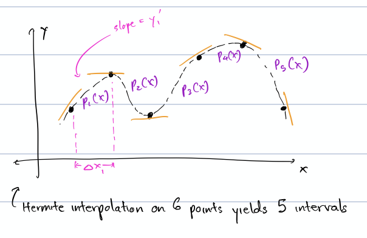
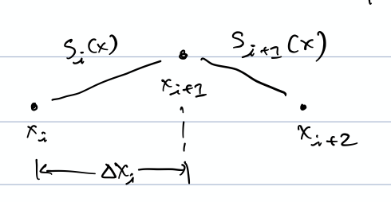
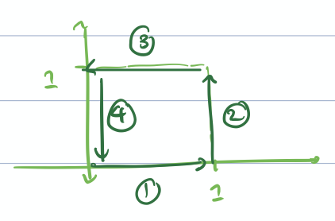
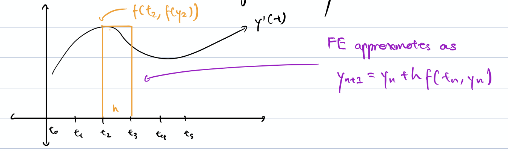

> Markdown transcription of my handwritten CS 370 notes. Spelling and wording are preserved where legible; diagrams are described in brackets, and editorial clarifications are also in brackets.

# Floating Point

Normalized form of a real number $F=\lbrace\beta,t,L,U\rbrace$:

$$
0.d_1d_2d_3\ldots d_t\times\beta^p
$$

where $d_i$ are digits in base $\beta$ ($0\leq d_i<\beta$), $d_1\neq0$, and $p$ is an integer where $L\leq p\leq U$.

$$
\begin{aligned}
\beta&=\text{base}, & L&=\text{lower limit on exponent }p,\\
t&=\text{number of digits}, & U&=\text{upper limit on exponent }p.
\end{aligned}
$$

- IEEE single precision: $\lbrace2,24,-126,127\rbrace$
- IEEE double precision: $\lbrace2,53,-1022,1023\rbrace$
- If $p>U$: overflow.
- If $p<L$: underflow.



**Question:** For $F=\lbrace2,3,-1,2\rbrace$, list the first six numbers.

**Answer:**
{: .note-example__answer-label}

1. $0$
2. $0.100_2\times2^{-1}=0.25$
3. $0.101_2\times2^{-1}=0.3125$
4. $0.110_2\times2^{-1}=0.375$
5. $0.111_2\times2^{-1}=0.4375$
6. $0.100_2\times2^1=1$

Notice that numbers are not evenly spaced as they would be in fixed-point representation, e.g. $0.001,0.002,0.003$, etc.



## Rounding Modes for FP Conversion

Rounding modes for FP conversion:

1. Round to nearest number available in $F$ ($0.5$ rounds up).
2. Truncation: discard all digits after the $t$th.



**Question:** Convert:

1. $253.9$ to $\lbrace10,6,-5,5\rbrace$
2. $8.25$ to $\lbrace2,7,-5,5\rbrace$
3. $1030.9671$ to $\lbrace10,6,-5,5\rbrace$

**Answer:**
{: .note-example__answer-label}

$$
\begin{aligned}
253.9&=0.2539\times10^3=0.253900\times10^3,\\
8.25\text{ in base 2}&=1000.01_2=0.1000010_2\times2^4,\\
1030.9671&=0.10309671\times10^4.
\end{aligned}
$$

For the third number:

1. With rounding: $0.103097\times10^4$.
2. With truncation: $0.103096\times10^4$.



$x_{\text{exact}}$ means the true solution. $x_{\text{approx}}$ means the approximate, representable solution.

$$
E_{\text{abs}}=|x_{\text{exact}}-x_{\text{approx}}|,
\qquad
E_{\text{rel}}=\frac{|x_{\text{exact}}-x_{\text{approx}}|}{|x_{\text{exact}}|}.
$$



**Question:** Compute $E_{\text{abs}}$ and $E_{\text{rel}}$ for $x_{\text{exact}}=220$, $x_{\text{approx}}=198$.

**Answer:**
{: .note-example__answer-label}

$$
E_{\text{abs}}=22,
\qquad
E_{\text{rel}}=\frac{2}{220}=9.\overline{09}\times10^{-3}.
$$

Relative error is more useful and independent of magnitude.



A result is correct to approximately $s$ digits if

$$
0.5\times10^{-s}\leq E_{\text{rel}}<5\times10^{-s},
$$

or equivalently

$$
5\times10^{-(s+1)}\leq E_{\text{rel}}<5\times10^{-s}.
$$

Therefore,

$$
5\times10^{-3}\leq9.\overline{09}\times10^{-3}<5\times10^{-2},
$$

so about two digits are correct.



**Question:** Compute the number of digits correct for:

1. $E_{\text{rel}}=0.8\times10^{-3}$
2. $E_{\text{rel}}=4\times10^2$

**Answer:**
{: .note-example__answer-label}

For (1),

$$
5\times10^{-4}\leq0.8\times10^{-3}<5\times10^{-3},
$$

so three digits are correct.

For (2),

$$
5\times10^{-(-2+1)}\leq4\times10^2<5\times10^{-(-2)},
$$

that is,

$$
5\times10^1\leq4\times10^2<5\times10^2,
$$

so $-2$ digits are correct.



For an FP system $F$, $E_{\text{rel}}$ is bounded such that for any $x\in\mathbb R$ and its FP representation $\operatorname{fl}(x)$,

$$
(1-E)|x|\leq|\operatorname{fl}(x)|\leq(1+E)|x|,
$$

where $E$ is machine epsilon and is defined as the smallest number such that

$$
\operatorname{fl}(1+E)>1.
$$

Therefore,

$$
\operatorname{fl}(x)=x(1+\delta)\quad\text{for some }|\delta|\leq E.
$$

For an FP system $F=\lbrace\beta,t,L,U\rbrace$:

1. Under rounding, $E=\frac12\beta^{1-t}$.
2. Under truncation, $E=\beta^{1-t}$.



**Question:** What is $E$ for $F=\lbrace10,3,-5,5\rbrace$?

**Answer:**
{: .note-example__answer-label}

Consider the smallest representable number greater than or equal to $1$ in FP.

$$
1=0.100\times10^1.
$$

The next larger number should be $0.101\times10^1=1.01$, so $E=0.01=1\times10^{-2}$. However, notice under rounding that...

$$
1.005\approx1.01,
$$

so $E=0.005=5\times10^{-3}$ suffices. Thus,

$$
E=\frac12(10)^{1-3}=\frac12(10^{-2})=5\times10^{-3}
$$

is correct for rounding, and

$$
E=(10)^{1-3}=10^{-2}=1\times10^{-2}
$$

is correct for truncation.



IEEE requires that

$$
w\oplus z=\operatorname{fl}(w+z)=(w+z)(1+\delta).
$$

Here $w+z$ is the exact real result represented as FP. But in sequences of operations, error compounds:

$$
(a\oplus b)\oplus c\neq a\oplus(b\oplus c)\neq\operatorname{fl}(a+b+c).
$$



**Question:** What is the worst relative error for $(a\oplus b)\oplus c$?

**Answer:**
{: .note-example__answer-label}

$$
\begin{aligned}
E_{\text{rel}}
&=\frac{|x_{\text{exact}}-x_{\text{approx}}|}{|x_{\text{exact}}|}\\
&=\frac{|x_{\text{approx}}-x_{\text{exact}}|}{|x_{\text{exact}}|}\\
&=\frac{|(a+b)(1+\delta_1)\oplus c-[a+b+c]|}{|a+b+c|}\\
&=\frac{|[(a+b)(1+\delta_1)+c](1+\delta_2)-a-b-c|}{|a+b+c|}\\
&=\frac{|[a+b+\delta_1(a+b)+c](1+\delta_2)-a-b-c|}{|a+b+c|}\\
&=\frac{|\delta_1(a+b)+\delta_1\delta_2(a+b)+\delta_2(a+b+c)|}{|a+b+c|}.
\end{aligned}
$$

By the triangle inequality, this is less than

$$
\frac{|\delta_1(a+b)|}{|a+b+c|}
+\frac{|\delta_1\delta_2(a+b)|}{|a+b+c|}
+\frac{|\delta_2(a+b+c)|}{|a+b+c|}.
$$

Since $\lvert\delta_1\rvert\leq E$ and $\lvert\delta_2\rvert\leq E$,

$$
E_{\text{rel}}
\leq\frac{|a+b|}{|a+b+c|}E
+\frac{|a+b|}{|a+b+c|}E^2+E
\leq\frac{|a|+|b|}{|a+b+c|}(E^2+E)+E.
$$

Symmetrically, $E_{\text{rel}}$ for $a\oplus(b\oplus c)$ is

$$
E_{\text{rel}}
\leq\frac{|b+c|}{|a+b+c|}(E^2+E)+E
\leq\frac{|b|+|c|}{|a+b+c|}(E^2+E)+E.
$$

Therefore, the general bound on $a\oplus b\oplus c$ is

$$
\begin{aligned}
E_{\text{rel}}
&\leq\frac{|a|+|b|+|c|}{|a+b+c|}(E^2+E)
+\frac{|a+b+c|}{|a+b+c|}E\\
&\leq\frac{|a|+|b|+|c|}{|a+b+c|}(E^2+E)
+\frac{|a|+|b|+|c|}{|a+b+c|}E\\
&\leq\frac{|a|+|b|+|c|}{|a+b+c|}(E^2+2E).
\end{aligned}
$$

$E_{\text{rel}}$ can become very large when

$$
|a+b+c|\ll|a|+|b|+|c|.
$$

This can happen when $a,b,c$ have differing signs, leading to cancellation.





**Question:** Compute $(a\oplus b)\oplus c$ with $a=2000$, $b=-3.234$, $c=-2000$ for $F=\lbrace10,4,-10,10\rbrace$ with rounding. Find the error bound.

**Answer:**
{: .note-example__answer-label}

$$
\begin{aligned}
a\oplus b
&=2000-3.234=1996.766\\
&=0.1996766\times10^4\\
&\Rightarrow0.1997\times10^4,\\
(a\oplus b)\oplus c&\Rightarrow1997-2000=-3.
\end{aligned}
$$

This is catastrophic cancellation error.

$$
(a\oplus b)\oplus c=-0.3000\times10^1,
\qquad
a+b+c=-0.3234\times10^1.
$$

$$
E_{\text{rel}}=0.072=7.2\times10^{-2},
$$

so one digit is correct.

From the formula for the error bound of $a\oplus b\oplus c$,

$$
E_{\text{rel}}
\leq\frac{|a|+|b|+|c|}{|a+b+c|}(2E+E^2)
=1.238,
$$

so the bound guarantees zero digits right, where

$$
E=\frac12\beta^{1-t}=\frac12(10)^{1-4}=5\times10^{-4}.
$$





**Question:** Compute $(a\oplus c)\oplus b$ for $a=2000$, $b=-3.234$, $c=-2000$, where $F=\lbrace10,4,-10,10\rbrace$. Find the error bound.

**Answer:**
{: .note-example__answer-label}

$$
a\oplus c\Rightarrow2000-2000=0.
$$

This is benign cancellation. Therefore,

$$
(a\oplus c)\oplus b\Rightarrow0-3.234=-0.3234\times10^1=a+b+c,
$$

so $E_{\text{rel}}=0$. The error bound is $1.238$, as before.





**Question:** Compute $(a\oplus b)\oplus c$ for $a=-2000$, $b=-3.234$, $c=-2000$, where $F=\lbrace10,4,-10,10\rbrace$ with rounding. Find the error bound.

**Answer:**
{: .note-example__answer-label}

$$
\begin{aligned}
a\oplus b
&\Rightarrow-2000-3.234=-2003.234\\
&=-0.2003234\times10^4\\
&\Rightarrow-0.2003\times10^4,\\
(a\oplus b)\oplus c
&\Rightarrow-0.2003\times10^4-2000=-4003\\
&=-0.4003\times10^4.
\end{aligned}
$$

Thus $E_{\text{rel}}=5.845\times10^{-5}$, which is a much better error.

$$
\text{Error bound}
=\frac{|a|+|b|+|c|}{|a+b+c|}(2E+E^2)
=10^{-3}.
$$

The error bound is much better when cancellation is avoided.



Catastrophic cancellation error: subtracting input numbers with error of about the same magnitude.

Benign cancellation: subtracting input numbers with no error of about the same magnitude.

Rules of thumb:

1. Sum numbers of the same sign and magnitude.
2. If input numbers contain error, reformulate to avoid cancellation.

Consider two formulas for the Taylor series for $e^x$, where $x<0$:

$$
\text{i.}\quad e^x\approx1+x+\frac{x^2}{2!}+\frac{x^3}{3!}+\cdots
$$

$$
\text{ii.}\quad e^x\approx\frac1{e^y}
=\frac1{1+y+y^2/2!+y^3/3!+\cdots},
\qquad y=|x|.
$$

The second is much better because it avoids cancellation.

Compare

$$
f(x)=\frac{1-\cos^2x}{x^2}
\quad\text{and}\quad
g(x)=\frac{\sin^2x}{x^2}
$$

as $x\to0$.

$$
\lim_{x\to0}\frac{1-\cos^2x}{x^2}
=\lim_{x\to0}\frac{\sin^2x}{x^2}=1,
$$

but $f(x)$ approximates this much worse because $\cos^2x\approx1$.

Other types of error:

- round-off error (FP representation);
- truncation error (i.e. after $n$ terms of Taylor);
- uncertainty/error in input;
- error/approximation in the model of the situation.

## Conditioning and Stability

For a problem $P$ with input $I$ and output $O$, if small $\Delta I$ results in small $\Delta O$, then $P$ is well-conditioned. Otherwise, $P$ is ill-conditioned.

If an algorithm is unstable, any error in the input is magnified.

Conditioning and stability are independent properties.



**Question:** Analyze the stability of using the recursive algorithm

$$
I_0=\log\frac{1+\alpha}{\alpha},
\qquad
I_n=\frac1n-\alpha I_{n-1}\quad\text{for }n\geq0
$$

to approximate

$$
I_n=\int_0^1\frac{x^n}{x+\alpha}\,dx.
$$

Assume some error $E_0$ in $I_0$, i.e.

$$
E_0=(I_0)_A-(I_0)_E.
$$

What is $E_n$ after $n$ steps? Does $E_n$ grow?

**Answer:**
{: .note-example__answer-label}

Both exact and approximate follow the recurrence relation. Therefore,

$$
\begin{aligned}
E_n
&=(I_n)_A-(I_n)_E\\
&=\left[\frac1n-\alpha(I_{n-1})_A\right]
-\left[\frac1n-\alpha(I_{n-1})_E\right]\\
&=-\alpha\left[(I_{n-1})_A-(I_{n-1})_E\right]\\
&=(-\alpha)^n\left[(I_0)_A-(I_0)_E\right]\\
&=(-\alpha)^nE_0.
\end{aligned}
$$

Therefore, if $\lvert\alpha\rvert\leq1$, then the algorithm is stable.



# Intro to Interpolation

Given a set of data points from an unknown function $y=p(x)$, can we approximate $p$'s value at other points?

**Univalence theorem:** Given $n$ pairs $(x_i,y_i)$ where $1\leq i\leq n$, there exists a unique polynomial $p(x)$ of degree $\leq n-1$ that interpolates the data.

For $n$ points, find all coefficients $c_i$ of

$$
p(x)=c_1+c_2x+c_3x^2+c_4x^3+\cdots+c_nx^{n-1}.
$$

Plugging in each $(x_i,y_i)$ gives one linear equation:

$$
y_i=c_1+c_2x_i+c_3x_i^2+c_4x_i^3+\cdots+c_nx_i^{n-1}.
$$

This gives an $n\times n$ linear system,

$$
\begin{bmatrix}
1&x_1&x_1^2&\cdots&x_1^{n-1}\\
1&x_2&x_2^2&\cdots&x_2^{n-1}\\
\vdots&\vdots&\vdots&&\vdots\\
1&x_n&x_n^2&\cdots&x_n^{n-1}
\end{bmatrix}
\begin{bmatrix}c_1\\c_2\\\vdots\\c_n\end{bmatrix}
=
\begin{bmatrix}y_1\\y_2\\\vdots\\y_n\end{bmatrix},
$$

or $V\vec c=\vec y$, where $V$ is the Vandermonde matrix.

$$
\det V=\prod_{i<j}(x_i-x_j)\neq0,
$$

which means there must be a solution. This proves the univalence theorem.

**Monomial form:**

$$
p(x)=c_1+c_2x+c_3x^2+\cdots+c_nx^{n-1}
=\sum_{i=1}^nc_ix^{i-1}.
$$

Monomial basis functions: $1,x,x^2,\ldots$

## Lagrange Basis Function

$L_k(x)$:

$$
L_k(x)=
\frac{(x-x_1)\cdots(x-x_{k-1})(x-x_{k+1})\cdots(x-x_n)}
{(x_k-x_1)\cdots(x_k-x_{k-1})(x_k-x_{k+1})\cdots(x_k-x_n)}.
$$

There is no $x-x_k$ or $x_k-x_k$ entry.

Notice:

$$
L_i(x_j)=1\text{ where }i=j
$$

since numerator/denominator $=1$, and

$$
L_i(x_j)=0\text{ where }i\neq j
$$

since $x_j-x_j$ will occur in the numerator.

## Lagrange Form

$$
p(x)=y_1L_1(x)+y_2L_2(x)+\cdots+y_nL_n(x)
=\sum_{k=1}^ny_kL_k(x).
$$

$p(x)$ interpolates each $(x_i,y_i)$ by definition. For example,

$$
p(x_i)=y_1L_1(x_i)+\cdots+y_iL_i(x_i)+\cdots+y_nL_n(x_i)=y_i.
$$



**Question:** Find the Lagrange polynomial $p(x)$ interpolating $(x_1,y_1)=(1,2)$ and $(x_2,y_2)=(-1,4)$.

**Answer:**
{: .note-example__answer-label}

$$
L_1(x)=\frac{x-x_2}{x_1-x_2}=\frac{x-(-1)}{1-(-1)}=\frac{x+1}{2},
$$

$$
L_2(x)=\frac{x-x_1}{x_2-x_1}=\frac{x-1}{-1-1}=\frac{x-1}{-2}=\frac{1-x}{2}.
$$

Therefore,

$$
p(x)=2\left(\frac{x+1}{2}\right)+4\left(\frac{1-x}{2}\right)
=x+1+2-2x=3-x.
$$

No need to solve a linear system!



## Runge's Phenomenon

Fitting a high-degree polynomial (many points) often gives excessive oscillation.

We solve this with piecewise functions.

## Hermite Interpolation

Fit a cubic to each interval given values and derivatives at each point.

We use the same strategies as in Vandermonde to determine the coefficients of each cubic.



**Question:** Fit a cubic function $p(x)=a+bx+cx^2+dx^3$ given Hermite data for two points:

$$
p(x_1)=y_1,\quad p'(x_1)=s_1,
\qquad
p(x_2)=y_2,\quad p'(x_2)=s_2.
$$

**Answer:**
{: .note-example__answer-label}

Plugging into $p(x)$,

$$
\begin{aligned}
y_1&=a+bx_1+cx_1^2+dx_1^3,\\
y_2&=a+bx_2+cx_2^2+dx_2^3.
\end{aligned}
$$

We know $p'(x)=b+2cx+3dx^2$, so

$$
\begin{aligned}
s_1&=b+2cx_1+3dx_1^2,\\
s_2&=b+2cx_2+3dx_2^2.
\end{aligned}
$$

Thus,

$$
\begin{bmatrix}
1&x_1&x_1^2&x_1^3\\
1&x_2&x_2^2&x_2^3\\
0&1&2x_1&3x_1^2\\
0&1&2x_2&3x_2^2
\end{bmatrix}
\begin{bmatrix}a\\b\\c\\d\end{bmatrix}
=
\begin{bmatrix}y_1\\y_2\\s_1\\s_2\end{bmatrix}.
$$

If we had $n$ points, we would have to solve $n-1$ of these systems, or $(n-1)(4)=4n-4$ equations. We can skip this work by using the Hermite closed form.



*Hermite interpolation on six points yields five intervals. Cubics $p_1(x)$ through $p_5(x)$ join at the data points with prescribed slopes.*



Define $p_i(x)$ as the polynomial on the $i$th interval, between points $x_i$ and $x_{i+1}$:

$$
p_i(x)=a_i+b_i(x-x_i)+c_i(x-x_i)^2+d_i(x-x_i)^3,
$$

where

$$
\begin{aligned}
a_i&=y_i,& \Delta x_i&=x_{i+1}-x_i,\\
b_i&=s_i,& y_i'&=\frac{y_{i+1}-y_i}{\Delta x_i},\\
c_i&=\frac{3y_i'-2s_i-s_{i+1}}{\Delta x_i},&&\\
d_i&=\frac{s_{i+1}+s_i-2y_i'}{(\Delta x_i)^2}.&&
\end{aligned}
$$

$y_i'$ refers to the linear slope, not derivative $s_i$.



**Question:** Find the Hermite polynomial for $x_1=0$, $y_1=0$, $s_1=1$, $x_2=1$, $y_2=3$, $s_2=0$.

**Answer:**
{: .note-example__answer-label}

$$
a_1=y_1=0,\qquad b_1=s_1=1,
$$

$$
\Delta x_1=x_2-x_1=1,
\qquad
y_1'=\frac{3-0}{1}=3,
$$

$$
c_1=\frac{3(3)-2(1)-0}{1}=7,
\qquad
d_1=\frac{0+1-2(3)}{1^2}=-5.
$$

Therefore,

$$
p_1(x)=0+1(x-0)+7(x-0)^2-5(x-0)^3=x+7x^2-5x^3.
$$



**Knots:** points where the interpolant transfers from $p_i(x)$ to $p_{i+1}(x)$.

**Nodes:** points where data for the interpolant is specified, i.e. slope.

Hermite interpolation removes discontinuities at each control point by definition, since it creates some polynomial $p_i(x)$ with derivatives $s_i,s_{i+1}$ at each control point. Therefore it creates a smooth curve.

## Cubic Splines

Fit a cubic $S_i(x)$ on each interval; require matching first and second derivatives; require only points as input.

For each interval $[x_i,x_{i+1}]$ for $S_i(x)$ and $S_{i+1}(x)$:



*$S_i(x)$ joins $S_{i+1}(x)$ at $x_{i+1}$; the interval from $x_i$ to $x_{i+1}$ is $\Delta x_i$.*

Require:

$$
\begin{aligned}
S_i(x_i)&=y_i, &(1)\\
S_i(x_{i+1})&=y_{i+1}, &(2)\\
S_i'(x_{i+1})&=S_{i+1}'(x_{i+1}), &(3)\\
S_i''(x_{i+1})&=S_{i+1}''(x_{i+1}). &(4)
\end{aligned}
$$

Two equations are needed for boundary conditions $(x_1,x_n)$:

- Clamped: $S'(x_1)=c_1$ and $S'(x_n)=c_2$, where $c_1,c_2$ are given constants.
- Free: $S''(x_1)=S''(x_n)=0$.
- Periodic: $S_1'(x_1)=S_n'(x_n)$ and $S_1''(x_1)=S_n''(x_n)$ - wrap around.
- “Not a knot”: $S_1'''(x)=S_2'''(x)$ and $S_{n-1}'''(x)=S_{n-2}'''(x)$ - the last two segments on an end become the same polynomial.

To solve for a cubic spline over $n$ points, we need:

- two equations per interpolating interval, $(1)$ and $(2)$, for $n-1$ intervals;
- two equations per interior point, $(3)$ and $(4)$, for $n-2$ interior points;
- two boundary equations.

Therefore,

$$
2(n-1)+2(n-2)+2=4n-4=4(n-1)
$$

equations total, to solve in one system.

Compare with Hermite interpolation over $n$ points with $n$ slopes, where we solve $n-1$ systems of four equations, also $4(n-1)$ equations total.

Notice cubic splines also produce smooth curves.

### Cost of Computing Cubic Splines

We have to solve $4n-4$ equations for $4(n-1)$ unknowns, since each of the $n-1$ intervals involves a cubic

$$
S_i(x)=a+bx+cx^2+dx^3
$$

with four unknowns.

$A$ has size $(4n-4)^2$, which costs $O(n^3)$ to compute naively and $O(n)$ to compute in a smart way.

**$O(n)$ strategy:** Compute cubic splines using Hermite interpolation.

1. Write each spline $S_i(x)$ in Hermite closed form:

$$
S_i(x)=a_i+b_i(x-x_i)+c_i(x-x_i)^2+d_i(x-x_i)^3,
\qquad i=1\text{ to }n-1,
$$

where

$$
\begin{aligned}
a_i&=y_i,& \Delta x_i&=x_{i+1}-x_i,\\
b_i&=s_i,& y_i'&=\frac{y_{i+1}-y_i}{\Delta x_i},\\
c_i&=\frac{3y_i'-2s_i-s_{i+1}}{\Delta x_i},&&\\
d_i&=\frac{s_{i+1}+s_i-2y_i'}{(\Delta x_i)^2}.&&
\end{aligned}
$$

2. Find $s_i$ such that $S_i''(x)=S_{i+1}''(x)$ at interior points, i.e. second derivative matches. We do not require first derivative matching because it is satisfied by the Hermite equation.

$$
S_i'(x)=b_i+2c_i(x-x_i)+3d_i(x-x_i)^2,
$$

$$
S_i''(x)=2c_i+6d_i(x-x_i).
$$

Plugging in definitions for $c_i,d_i$,

$$
S_i''(x)=2\left(\frac{3y_i'-2s_i-s_{i+1}}{\Delta x_i}\right)
+6\left(\frac{s_{i+1}+s_i-2y_i'}{(\Delta x_i)^2}\right)(x-x_i).
$$

Now force $S_i''(x_{i+1})=S_{i+1}''(x_{i+1})$ for $i=1$ to $n-2$:

$$
S_i''(x_{i+1})
=2\left(\frac{3y_i'-2s_i-s_{i+1}}{\Delta x_i}\right)
+6\left(\frac{s_{i+1}+s_i-2y_i'}{(\Delta x_i)^2}\right)(x_{i+1}-x_i),
$$

$$
S_{i+1}''(x_{i+1})
=2\left(\frac{3y_{i+1}'-2s_{i+1}-s_{i+2}}{\Delta x_{i+1}}\right).
$$

Equating and simplifying,

$$
\frac{-3y_i'+s_i+2s_{i+1}}{\Delta x_i}
=\frac{3y_{i+1}'-2s_{i+1}-s_{i+2}}{\Delta x_{i+1}},
$$

so

$$
(\Delta x_{i+1})s_i
+2(\Delta x_i+\Delta x_{i+1})s_{i+1}
+(\Delta x_i)s_{i+2}
=3(\Delta x_{i+1})y_i'+3(\Delta x_i)y_{i+1}'.
$$

Reindexing with $i\to i-1$, from $i=2$ to $n-1$, gives an equation per interior node:

$$
\Delta x_i s_{i-1}
+2(\Delta x_{i-1}+\Delta x_i)s_i
+\Delta x_{i-1}s_{i+1}
=3(\Delta x_i)y_{i-1}'+3(\Delta x_{i-1})y_i'.
$$

To find $s_i$, we need boundary conditions.

1. Clamped:

$$
S_1'(x_1)=s_1^*=s_1,
\qquad
S_{n-1}'(x_n)=s_n^*=s_n,
$$

where $s_1^*,s_n^*$ are given.

2. Free:

$$
S_1''(x_1)=0 \quad (1),
\qquad
S_{n-1}''(x_n)=0 \quad (2).
$$

Subbing the Hermite closed form into (1),

$$
S_1''(x_1)=2c_1+6d_1(x_1-x_1)=2c_1=0,
$$

so $c_1=0$. Applying the definition for $c_i$,

$$
0=\frac{3y_1'-2s_1-s_2}{\Delta x_1},
$$

therefore

$$
s_1+\frac12s_2=\frac32y_1'.
$$

Subbing the Hermite closed form into (2),

$$
S_{n-1}''(x_n)=2c_{n-1}+6d_{n-1}(x_n-x_{n-1}),
$$

which simplifies to

$$
s_n+\frac12s_{n-1}=\frac32y_{n-1}'.
$$

### Cubic Spline Equations

For each interior node $(i=2,\ldots,n-1)$,

$$
\Delta x_i s_{i-1}
+2(\Delta x_{i-1}+\Delta x_i)s_i
+\Delta x_{i-1}s_{i+1}
=3(\Delta x_i y_{i-1}'+\Delta x_{i-1}y_i'). \tag{1}
$$

Boundary conditions $(i=1,i=n)$:

Clamped:

$$
s_1=s_1^*,\qquad s_n=s_n^*.
$$

Free:

$$
s_1+\frac{s_2}{2}=\frac32y_1',
\qquad
\frac{s_{n-1}}2+s_n=\frac32y_{n-1}'.
$$

In matrix form,

$$
T\vec s=\vec r,
\qquad
\vec s=\begin{bmatrix}s_1&\cdots&s_n\end{bmatrix}^T,
$$

where $\vec r$ is the right-hand side of the equation.

For $T$, each $T_{i,j}$ describes the $i$th equation of (1), or a boundary-condition equation, and describes the coefficient of $s_j$ in that equation. For $i=2,\ldots,n-1$,

$$
T_{i,i-1}=\Delta x_i,
$$

$$
T_{i,i}=2(\Delta x_{i-1}+\Delta x_i),
$$

$$
T_{i,i+1}=\Delta x_{i-1},
$$

and $T_{i,k}=0$ for $k\neq i-1,i,i+1$.

For clamped conditions:

$$
T_{1,1}=1,\quad T_{1,k}=0\ (k\neq1),\quad r_1=s_1^*,
$$

$$
T_{n,n}=1,\quad T_{n,k}=0\ (k\neq n),\quad r_n=s_n^*.
$$

For free conditions:

$$
T_{1,1}=1,\quad T_{1,2}=\frac12,\quad r_1=\frac32y_1',
$$

$$
T_{n,n-1}=\frac12,\quad T_{n,n}=1,\quad r_n=\frac32y_{n-1}'.
$$

Notice $T$ always has a solution and is a tridiagonal matrix, which can be solved/stored efficiently.



**Question:** Find a linear system for a cubic spline through the points $(0,1)$, $(2,1)$, $(3,3)$, $(4,-1)$ with clamps $S_1'(x_1)=1$ and $S_3'(x_4)=-1$.

**Answer:**
{: .note-example__answer-label}

$$
\begin{array}{c|c|c|c}
i&x_i&y_i&\Delta x_i\text{ and }y_i'\\\hline
1&0&1&\Delta x_1=2,\ y_1'=0\\
2&2&1&\Delta x_2=1,\ y_2'=2\\
3&3&3&\Delta x_3=1,\ y_3'=-4\\
4&4&-1&
\end{array}
$$

For $i=1$, $s_1=1$. For $i=4$, $s_4=-1$.

For $i=2$,

$$
(\Delta x_2)s_1+2(\Delta x_1+\Delta x_2)s_2+\Delta x_1s_3
=3(\Delta x_2y_1'+\Delta x_1y_2'),
$$

so

$$
s_1+6s_2+2s_3=12.
$$

For $i=3$,

$$
\Delta x_3s_2+2(\Delta x_2+\Delta x_3)s_3+\Delta x_2s_4
=3(\Delta x_3y_2'+\Delta x_2y_3'),
$$

so

$$
s_2+4s_3+s_4=-6.
$$

In $T\vec s=\vec r$ form,

$$
\begin{bmatrix}
1&0&0&0\\
1&6&2&0\\
0&1&4&1\\
0&0&0&1
\end{bmatrix}
\begin{bmatrix}s_1\\s_2\\s_3\\s_4\end{bmatrix}
=
\begin{bmatrix}1\\12\\-6\\-1\end{bmatrix}.
$$

Solve for $s_i$'s.



Using cubic splines with Hermite interpolation, we solve one equation in $s_1,\ldots,s_n$ variables for each of the $n$ nodes, giving an $n\times n$ linear system. Therefore, total size of system is $n^2$.

Recall that using cubic splines requires solving a linear system of size $(4n-4)^2$. Therefore cubic splines plus Hermite interpolation is approximately four times smaller.



**Question:**

$$
S(x)=
\begin{cases}
\frac53+\frac{16}{3}x+ax^2+x^3,&[-1,1],\quad S_1(x),\\
-\frac73+bx+\frac{22}{3}x^2+\frac23x^3,&[1,2],\quad S_2(x).
\end{cases}
$$

Is there a choice of $a,b$ to make $S(x)$ a cubic spline?

**Answer:**
{: .note-example__answer-label}

Cubic spline definition: match first and second derivatives at each given inner point and copy all $y$-values at each given point.

Require $S_1(1)=S_2(1)$:

$$
S_1(1)=\frac53+\frac{16}{3}(1)+a(1)^2+(1)^3=a+8,
$$

$$
S_2(1)=-\frac73+b+\frac{22}{3}+\frac23=b+\frac{17}{3}.
$$

Therefore,

$$
a+8=b+\frac{17}{3}. \tag{*}
$$

Require $S_1'(1)=S_2'(1)$:

$$
S_1'(x)=\frac{16}{3}+2ax+3x^2,
\qquad
S_1'(1)=2a+\frac{25}{3},
$$

$$
S_2'(x)=b+\frac{22}{3}(2x)+2x^2,
\qquad
S_2'(1)=b+\frac{40}{3}.
$$

Therefore,

$$
2a+\frac{25}{3}=b+\frac{40}{3}. \tag{*}
$$

Require $S_1''(1)=S_2''(1)$:

$$
S_1''(x)=2a+6x,
\qquad
S_1''(1)=2a+6,
$$

$$
S_2''(x)=\frac{44}{3}+4x,
\qquad
S_2''(1)=\frac{44}{3}+4=\frac{56}{3}.
$$

Therefore,

$$
2a+6=\frac{56}{3}. \tag{*}
$$

These three starred equations are not solvable for $a,b$, so there is no cubic spline possible.



# Parametric Curves and ODEs

Parametric curves: $p(t)=(x(t),y(t))$. This allows for points that have the same $(x,y)$ coordinate.



**Question:** Parameterize $y=3x+2$.

**Answer:**
{: .note-example__answer-label}

$$x(t)=t,\qquad y(t)=3t+2.$$





**Question:** Parameterize the top half of the semicircle $x^2+y^2=1$.

**Answer:**
{: .note-example__answer-label}

$$x(t)=\cos(\pi t),\qquad y(t)=\sin(\pi t),\qquad0\leq t\leq1.$$

Or, in the reverse direction,

$$x(t)=\cos(\pi(1-t)),\qquad y(t)=\sin(\pi(1-t)),\qquad0\leq t\leq1.$$

Or,

$$x(t)=\cos(\pi t^2),\qquad y(t)=\sin(\pi t^2),\qquad0\leq t\leq1,$$

which covers the curve faster.





**Question:** Parameterize the unit square.

**Answer:**
{: .note-example__answer-label}

$$
\begin{array}{lll}
(1)&x(t)=t,&y(t)=0,\quad0\leq t\leq1,\\
(2)&x(t)=1,&y(t)=t-1,\quad1\leq t\leq2,\\
(3)&x(t)=1-(t-2),&y(t)=1,\quad2\leq t\leq3,\\
(4)&x(t)=0,&y(t)=1-(t-3),\quad3\leq t\leq4.
\end{array}
$$



*The four numbered parameterizations travel counterclockwise around the unit square.*



A common parameterization is to use arc length as $t$. We can use interpolation on parameterized curves $x(t)$ and $y(t)$ as well.

Given $(x_i,y_i)$ data points, parameterize $t_i$ with $(x_0,y_0)$ and $(x_n,y_n)$ by:

1. Use node index as parameterization, e.g. $t_i=i$.
2. Approximate arc-length parameterization: set $t_0=0$ at the first node, then

$$t_{i+1}=t_i+\sqrt{(x_{i+1}-x_i)^2+(y_{i+1}-y_i)^2}.$$

We can apply curve concepts to surfaces by subdividing them.

An ordinary differential equation is a function $f$ relating a variable and its derivative:

$$y'(t)=f(t,y(t)).$$



**Question:** Model a mouse population $y(t)$ over time $t$.

**Answer:**
{: .note-example__answer-label}

1. With enough food, say the population changes as $y'(t)=ay(t)$, where $a$ is constant. Suppose $y_0=y(t_0)$. Then

$$y(t)=y_0e^{a(t-t_0)}.$$

Proof:

$$y'(t)=y_0e^{a(t-t_0)}a=ay_0e^{a(t-t_0)}=ay(t).$$

This is exponential growth in population.

2. With food constraints modelled by $b$,

$$y'(t)=y(t)(a-by(t)).$$

Notice the population drops as $y(t)>a/b$. Suppose $y_0=y(t_0)$. The closed form is

$$y(t)=\frac{ay_0e^{a(t-t_0)}}{by_0e^{a(t-t_0)}+(a-y_0b)},$$

which is logistic population growth.

3. Another model:

$$y'(t)=y(t)[a(t)-b(t)y(t)].$$

There is no general closed-form solution.



Most ODEs are too complex to have simple closed forms, so we develop methods to find approximates $(t_i,y_i)$ where $y_i\approx y(t_i)$. Given $(t_i,y_i)$ pairs, use interpolation methods to derive a full solution for all times.

**Initial-value problem (IVP):**

$$y'(t)=f(t,y(t))\quad\text{(dynamics function, in standard form)},$$

$$y(t_0)=y_0\quad\text{(initial condition)}.$$

Find/approximate $y(t)$.

**Time-stepping:** Given initial conditions, step to the next time endpoint using the dynamics function and time step $h$.

Set $n=0$, $t=t_0$, $y=y_0$:

1. Compute $y_{n+1}$.
2. Increment time, $t_{n+1}=t_n+h$.
3. Advance $n=n+1$.

## Forward Euler

- Single-step: use information from the current time only.
- Multistep: use information from previous steps.
- Implicit: solve the given function to find $y_{n+1}$.
- Explicit: evaluate the given function for $y_{n+1}$.
- Time step $h$ can be constant or vary.

Explicit, single-step scheme; more accurate as $h\to0$.

$$y_n'=f(t_n,y_n),$$

$$y_{n+1}=y_n+hy_n'=y_n+hf(t_n,y_n).$$



**Question:** For $y'(t)=2y(t)$, $t_0=1$, $y(t_0)=3$:

1. Write the FE recurrence for $h=1$ and $h=1/2$.
2. Use FE to approximate $y$ at $t=4$.
3. Compare against $y(t)=3e^{2(t-t_0)}$.

**Answer:**
{: .note-example__answer-label}

$$h=1:\quad y_{n+1}=y_n+2y_n=3y_n.$$

$$h=\frac12:\quad y_{n+1}=y_n+y_n=2y_n.$$

$$
\begin{array}{c|c|c||c|c|c}
n&t&y_n(h=1)&n&t&y_n(h=1/2)\\\hline
0&1&3&0&1&3\\
1&2&9&1&1.5&6\\
2&3&27&2&2&12\\
3&4&81&3&2.5&24\\
&&&4&3&48\\
&&&5&3.5&96\\
&&&6&4&192
\end{array}
$$

The true value is $y(4)\approx1210.3$. Notice $81$ and $192$ are both terrible approximations, but $192$ is better.



## ODEs - Forward Euler

We can think of time stepping as finding an approximate integral for $y'$, since we approximate $y$ and

$$y=\int y'\,dt.$$

Geometrically, FE approximates using the tangent height $f(t_n,y_n)$:

$$y_{n+1}=y_n+hf(t_n,y_n).$$



*A smooth solution curve with a Forward Euler step of width $h$, using the slope $f(t_2,y(t_2))$ to approximate the next value.*

FE applies to systems:

$$x'(t)=f_x(t,x(t),y(t)),\quad x(t_0)=x_0,$$

$$y'(t)=f_y(t,x(t),y(t)),\quad y(t_0)=y_0.$$

In vector notation,

$$
\begin{bmatrix}x_{n+1}\\y_{n+1}\end{bmatrix}
=\begin{bmatrix}x_n\\y_n\end{bmatrix}
+h\begin{bmatrix}f_x(t_n,x_n,y_n)\\f_y(t_n,x_n,y_n)\end{bmatrix}.
$$

Example:

$$
\begin{bmatrix}x_{n+1}\\y_{n+1}\end{bmatrix}
=\begin{bmatrix}x_n\\y_n\end{bmatrix}
+h\begin{bmatrix}-ay_n+\sin t_n\\x_n\end{bmatrix},
\qquad
\begin{bmatrix}x_0\\y_0\end{bmatrix}
=\begin{bmatrix}2\\3\end{bmatrix}.
$$



**Question:** For a particle with $x'=-y$, $y'=x$, $x(0)=2$, $y(0)=0$, write FE with $h=2$ and apply it to $t=6$.

**Answer:**
{: .note-example__answer-label}

$$
\begin{bmatrix}x_{n+1}\\y_{n+1}\end{bmatrix}
=\begin{bmatrix}x_n\\y_n\end{bmatrix}
+2\begin{bmatrix}-y_n\\x_n\end{bmatrix}
=\begin{bmatrix}x_n-2y_n\\2x_n+y_n\end{bmatrix}.
$$

$$
\begin{array}{c|c|c|c}
n&t&x_n&y_n\\\hline
0&0&2&0\\
1&2&2&4\\
2&4&-6&8\\
3&6&-22&-4
\end{array}
$$

This gives another very bad approximation.



Recall the Taylor series

$$f(x)=f(a)+f'(a)(x-a)+\frac{f''(a)}{2!}(x-a)^2+\frac{f'''(a)}{3!}(x-a)^3+\cdots.$$

It approximates a function by knowing $f(a)$ and derivatives at $x=a$.

**Deriving FE, 1:** Approximate $y'$ using a finite difference:

$$y'(t_n)=\frac{y_{n+1}-y_n}{t_{n+1}-t_n}.$$

Since $y'(t_n)=f(t_n,y(t_n))$,

$$f(t_n,y(t_n))=\frac{y_{n+1}-y_n}{t_{n+1}-t_n}=\frac{y_{n+1}-y_n}{h},$$

so

$$y_{n+1}=hf(t_n,y(t_n))+y_n.$$

**Deriving FE, 2:** Approximate $y'$ with a simplified Taylor series. Center at $t_n$ and evaluate at $t_{n+1}$:

$$y(t_{n+1})=y(t_n)+hy'(t_n)+\frac{h^2}{2!}y''(t_n)+\cdots.$$

Dropping $h^2$ and above,

$$y_{n+1}\approx y_n+hy'(t_n)=y_n+hf(t_n,y_n).$$

Absolute/global error at step $n$ is $\lvert y_n-y(t_n)\rvert$. We do not know $y(t_n)$, so approximate it using Taylor series.

Local truncation error is the error at each step.

**Error of Forward Euler:**

$$y_{n+1}=y_n+hf(t_n,y_n).$$

The Taylor series centered at $t_n$ and evaluated at $t_{n+1}$ is

$$y(t_{n+1})=y(t_n)+hy'(t_n)+\frac{h^2}{2}y''(t_n)+O(h^3).$$

Assuming exact data at $t_n$, local error is the difference between FE and the Taylor series.

$$
\begin{aligned}
y_{n+1}-y(t_{n+1})
&=y_n+hy'(t_n)-\left(y(t_n)+hy'(t_n)+\frac{h^2}{2}y''(t_n)+O(h^3)\right)\\
&=-\frac{h^2}{2}y''(t_n)-O(h^3)=O(h^2).
\end{aligned}
$$

Thus local error of FE is $O(h^2)$.

**Trapezoidal:** keep the $y''(t_n)$ term, approximating

$$y''(t_n)=\frac{y'(t_{n+1})-y'(t_n)}h+O(h).$$

Then

$$y_{n+1}=y_n+\frac h2[f(t_{n+1},y_{n+1})+f(t_n,y_n)],$$

with $O(h^3)$ LTE. Intuition: evaluate slope at both ends and step according to average slope. Trapezoidal is implicit because it requires $f(t_{n+1},y_{n+1})$.

Explicit schemes are simpler/faster per step and less stable. Implicit schemes are more complex/expensive per step and more stable, so can use larger time steps.

**Improved Euler:** avoid implicitness by estimating the endpoint with FE:

$$y_{n+1}^*=y_n+hf(t_n,y_n),$$

$$y_{n+1}=y_n+\frac h2[f(t_n,y_n)+f(t_{n+1},y_{n+1}^*)],$$

with LTE $O(h^3)$.

## ODEs - More Schemes

Recall multivariable Taylor expansion:

$$f(x+h_x,y+h_y)=f(x,y)+h_xf_x+h_yf_y+O(h_x^2)+O(h_y^2).$$

Beginning with

$$y(t_{n+1})=y(t_n)+hy'(t_n)+\frac{h^2}{2}y''(t_n)+O(h^3),$$

and using

$$y''(t_n)=\frac{y'(t_{n+1})-y'(t_n)}h+O(h),$$

gives

$$y_{n+1}=y_n+\frac h2[y'(t_n)+y'(t_{n+1})]+O(h^3),$$

which is the trapezoidal rule.

For Improved Euler, use the FE estimate $y_{n+1}^*=y_n+hf(t_n,y_n)$ and expand $f$ in the $y$ variable:

$$f(t_{n+1},y_{n+1})=f(t_{n+1},y_{n+1}^*)+O(h^2).$$

Substitution in trapezoidal gives the explicit Improved Euler formula with $O(h^3)$ LTE.



**Question:** Apply Improved Euler to $x'=-y$, $y'=x$, $x(0)=2$, $y(0)=0$, with $h=2$ to find $(x,y)$ at $t=4$. Also write time-stepping equations for trapezoidal.

**Answer:**
{: .note-example__answer-label}

For Improved Euler,

$$
\begin{aligned}
x_{n+1}^*&=x_n-2y_n,& y_{n+1}^*&=y_n+2x_n,\\
x_{n+1}&=x_n-(y_n+y_{n+1}^*),&
y_{n+1}&=y_n+(x_n+x_{n+1}^*).
\end{aligned}
$$

$$
\begin{array}{c|c|c|c}
n&t&x_n&y_n\\\hline
0&0&2&0\\
1&2&-2&4\\
2&4&-6&-8
\end{array}
$$

Generic trapezoidal:

$$y_{n+1}=y_n+\frac h2[f(t_n,y_n)+f(t_{n+1},y_{n+1})].$$

For the system,

$$x_{n+1}=x_n-\frac h2(y_n+y_{n+1}),$$

$$y_{n+1}=y_n+\frac h2(x_n+x_{n+1}).$$



**Backward Euler:** Forward Euler, but take the height at $t_{n+1}$ instead of $t_n$, making it implicit; LTE $O(h^2)$:

$$y_{n+1}=y_n+hf(t_{n+1},y(t_{n+1})).$$

Remember sign of $h$ alternates [when deriving backward differences].

## Runge-Kutta

**RK2 / midpoint:** Take an FE step to the halfway point, evaluate slope there as $k_2$, then use it to take a full step:

$$k_1=hf(t_n,y_n),$$

$$k_2=hf\left(t_n+\frac h2,y_n+\frac{k_1}{2}\right),$$

$$y_{n+1}=y_n+k_2.$$

Equivalently,

$$y_{n+1/2}=y_n+\frac h2f(t_n,y_n),$$

$$y_{n+1}=y_n+hf(t_n+h/2,y_{n+1/2}).$$

LTE is $O(h^3)$.

**Fourth-order Runge-Kutta:** Evaluate $y'(t)=f(t,y)$ at intermediate positions $k_1,\ldots,k_4$ and combine to find $y_{n+1}$. Fits a quadratic; LTE $O(h^5)$.

$$
\begin{aligned}
k_1&=hf(t_n,y_n),\\
k_2&=hf(t_n+h/2,y_n+k_1/2),\\
k_3&=hf(t_n+h/2,y_n+k_2/2),\\
k_4&=hf(t_n+h,y_n+k_3),\\
y_{n+1}&=y_n+\frac16(k_1+2k_2+2k_3+k_4).
\end{aligned}
$$

For constant step $h$, number of steps is $O(h^{-1})$. Therefore global error is local error times all steps, so the global order is one degree less:

$$
\begin{array}{lll}
\text{FE:}&O(h^2)O(h^{-1})=O(h),&\text{first-order accurate},\\
\text{Trapezoidal:}&O(h^3)O(h^{-1})=O(h^2),&\text{second-order accurate},\\
\text{RK4:}&O(h^5)O(h^{-1})=O(h^4),&\text{fourth-order accurate}.
\end{array}
$$

## Backward Differentiation Formulas

BDF1, BDF2, etc.; the number indicates global-error order. Generalizes Backward Euler using previous time steps.

$$\text{BDF1:}\quad y_{n+1}=y_n+hf(t_{n+1},y_{n+1}),$$

$$\text{BDF2:}\quad y_{n+1}=\frac43y_n-\frac13y_{n-1}+\frac23hf(t_{n+1},y_{n+1}).$$

Derive by interpolation:

1. Fit an interpolant $p(t)$ with Lagrange polynomials to unknown $(t_{n+1},y_{n+1})$ and one or more earlier points.
2. Determine $p'(t)$ by differentiating.
3. Require endpoint slope to match: $p'(t_{n+1})=f(t_{n+1},y_{n+1})$.
4. Rearrange for BDF.

For BDF1, fit $(t_n,y_n)$ and $(t_{n+1},y_{n+1})$:

$$p(t)=y_n\frac{t-t_{n+1}}{t_n-t_{n+1}}+y_{n+1}\frac{t-t_n}{t_{n+1}-t_n}.$$

Then

$$p'(t_{n+1})=\frac{y_{n+1}-y_n}{t_{n+1}-t_n}=f(t_{n+1},y_{n+1}),$$

so $y_{n+1}=y_n+hf(t_{n+1},y_{n+1})$.

For BDF2, fit $(t_{n-1},y_{n-1})$, $(t_n,y_n)$, $(t_{n+1},y_{n+1})$. At $t_{n+1}$,

$$p'(t_{n+1})=\frac1{2h}y_{n-1}-\frac2h y_n+\frac3{2h}y_{n+1}.$$

Set equal to $f(t_{n+1},y_{n+1})$ and rearrange to obtain BDF2.

**Second-order Adams-Bashforth:** explicit, multistep, LTE $O(h^3)$:

$$y_{n+1}=y_n+\frac32hf(t_n,y_n)-\frac12hf(t_{n-1},y_{n-1}).$$

Scheme summary:

$$
\begin{array}{l|l|l|l}
\text{scheme}&\text{step}&\text{explicit/implicit}&\text{global error}\\\hline
\text{Forward Euler}&\text{single}&\text{explicit}&O(h)\\
\text{Improved Euler}&\text{single}&\text{explicit}&O(h^2)\\
\text{Midpoint/RK2}&\text{single}&\text{explicit}&O(h^2)\\
\text{RK4}&\text{single}&\text{explicit}&O(h^4)\\
\text{Trapezoidal/Improved Euler}&\text{single}&\text{implicit/explicit}&O(h^2)\\
\text{Backward Euler/BDF1}&\text{single}&\text{implicit}&O(h)\\
\text{BDF2}&\text{multi}&\text{implicit}&O(h^2)\\
\text{2-step Adams-Bashforth}&\text{multi}&\text{explicit}&O(h^2)\\
\text{3rd-order Adams-Moulton}&\text{multi}&\text{implicit}&O(h^3)
\end{array}
$$

## ODEs - Higher-Order Systems and Stability

Order of an ODE: highest derivative appearing in it. Convert higher-order ODEs into first-order ODEs:

1. For each variable $y$ with more than a first derivative, introduce $y_i=y^{(i-1)}$ for $i=1$ to $n$.
2. Substitute new $y_i$'s into the original ODE.
3. Relate the $y_i$'s through new equations.



**Question:** Convert $y''(t)=ty(t)$, $y(1)=1$, $y'(1)=2$ to a first-order system.

**Answer:**
{: .note-example__answer-label}

$$y_2=y',\quad y_1=y,$$

$$y_2'=ty_1,\quad y_1'=y_2,$$

with $y_2(1)=2$, $y_1(1)=1$.





**Question:** Convert

$$y^{(5)}(t)-3y'(t)y'''(t)+\sin(t)y''(t)-t[y^{(4)}(t)]^2=e^t$$

to a first-order ODE.

**Answer:** Let $y_5=y^{(4)}$, $y_4=y'''$, $y_3=y''$, $y_2=y'$, $y_1=y$. Then
{: .note-example__answer-label}

$$y_5'=e^t+3y_2y_4-\sin(t)y_3+t(y_5)^2,$$

$$y_4'=y_5,\quad y_3'=y_4,\quad y_2'=y_3,\quad y_1'=y_2.$$





**Question:** Convert

$$x''+y'x+2t=0,$$

$$y''+(y')^2x+t=0$$

to four first-order equations.

**Answer:** Let $x_2=x'$, $x_1=x$, $y_2=y'$, $y_1=y$:
{: .note-example__answer-label}

$$x_2'=-y_2x_1-2t,\quad x_1'=x_2,$$

$$y_2'=-(y_2)^2x_1-t,\quad y_1'=y_2.$$



Unstable: error $\epsilon$ in initial conditions leads to error growing exponentially as steps $n\to\infty$.

Use the test equation $y'=-\lambda y$. Exact $y(t)=y_0e^{-\lambda t}\to0$ as $t\to\infty$. A numerical approximation should also have $y_n\to0$.

To test stability: apply a time-stepping scheme, find a closed form for solution/error behaviour, and find conditions on $h$ ensuring error approaches zero.

## ODEs - Stability and Truncation Error

For Forward Euler on $y'=-\lambda y$, $\lambda>0$:

$$y_{n+1}=y_n(1-h\lambda),\qquad y_n=(1-h\lambda)^ny_0.$$

It goes to zero only when

$$|1-h\lambda|<1\Longleftrightarrow0<h\lambda<2.$$

If $y(t_0)=y_0+E_0$, then

$$E_n=(1-h\lambda)^nE_0.$$

FE is conditionally stable.

For Backward Euler,

$$y_{n+1}=y_n-h\lambda y_{n+1},$$

$$y_{n+1}=\frac1{1+h\lambda}y_n,\qquad y_n=\frac1{(1+h\lambda)^n}y_0.$$

For $\lambda>0,h>0$, both solution and error go to zero. BE is stable.

For Improved Euler,

$$y_{n+1}^*=y_n(1-h\lambda),$$

$$y_{n+1}=y_n\left(1-h\lambda+\frac{h^2\lambda^2}{2}\right).$$

Stability requires

$$\left|1-h\lambda+\frac{h^2\lambda^2}{2}\right|<1,$$

which gives $0<h\lambda<2$, as in FE. It has the same stability range for this problem even though LTE is $O(h^3)$.

For linear test equations, the bound relates to $h\lvert f_y\rvert$, e.g. $\lvert h(-a)\rvert<1$ for $y'=-ay$. For nonlinear problems it depends on $f_y$ at some point. For systems it depends on eigenvalues of the Jacobian

$$J(y_1,\ldots,y_n)=\left[\frac{\partial f_i}{\partial y_j}\right].$$

To find local truncation error for $y_{n+1}=\mathrm{RHS}$:

1. Replace approximations on RHS with exact versions, e.g. $y_n\to y(t_n)$ and $f(t_{n+1},y_{n+1})\to y'(t_{n+1})$.
2. Taylor-expand all RHS quantities about $t_n$.
3. Taylor-expand exact $y(t_{n+1})$ to compare.
4. Compute $y(t_{n+1})-y_{n+1}$. Lowest-degree non-cancelling power of $h$ gives LTE.

For FE,

$$y_{n+1}=y(t_n)+hy'(t_n),$$

whereas

$$y(t_{n+1})=y(t_n)+hy'(t_n)+\frac{h^2}{2}y''(t_n)+\cdots,$$

so LTE is $\frac{h^2}{2}y''(t_n)=O(h^2)$.

For trapezoidal,

$$y_{n+1}=y(t_n)+\frac h2[y'(t_n)+y'(t_{n+1})].$$

Taylor-expanding $y'(t_{n+1})$ gives

$$y_{n+1}=y(t_n)+hy'(t_n)+\frac{h^2}{2}y''(t_n)+O(h^3),$$

so LTE is $O(h^3)$.

For BDF2,

$$y_{n+1}=\frac43y(t_n)-\frac13y(t_{n-1})+\frac23hy'(t_{n+1}).$$

Using

$$y(t_{n-1})=y(t_n)-hy'(t_n)+\frac{h^2}{2}y''(t_n)-\frac{h^3}{6}y'''(t_n)+O(h^4),$$

$$y'(t_{n+1})=y'(t_n)+hy''(t_n)+\frac{h^2}{2}y'''(t_n)+O(h^3),$$

gives

$$y_{n+1}=y(t_n)+hy'(t_n)+\frac{h^2}{2}y''(t_n)+\frac49h^3y'''(t_n)+O(h^4).$$

Comparing with Taylor, the difference is $O(h^3)$.

## Adaptive Time Stepping

Smaller time steps mean less error but larger computational cost. Vary $h$ with adaptive time stepping:

1. Compute approximate solutions with two schemes of different orders.
2. Estimate error by taking their difference.
3. While error $>$ tolerance, set $h:=h/2$ and recompute.
4. Estimate the error coefficient and predict a good next step $h_{\text{new}}$.
5. Repeat until end time.

At the same time, let

$$y_{n+1}^{(A)}=y(t_{n+1})+Ch^p+O(h^{p+1}),$$

$$y_{n+1}^{(B)}=y(t_{n+1})+O(h^{p+1}).$$

Then

$$|y_{n+1}^{(A)}-y_{n+1}^{(B)}|=Ch^p+O(h^{p+1}),$$

so the dominant term matches method A's true error.

Estimate

$$C\approx\frac{|y_{n+1}^{(A)}-y_{n+1}^{(B)}|}{h_{\text{old}}^p}.$$

Assume $C$ changes slowly. Set

$$\mathrm{err}_{\text{next}}\approx C(h_{\text{new}})^p=\mathrm{tol}$$

and solve:

$$h_{\text{new}}=h_{\text{old}}\left(\frac{\mathrm{tol}}{|y_{n+1}^{(A)}-y_{n+1}^{(B)}|}\right)^{1/p}.$$

Scale this back by a factor, e.g. $1/2$ or $3/4$, because the estimate will not be exact.

**Stiff problem:** an interesting aspect of the solution changes slowly, so we want big time steps, but a stability condition forces small time steps. Time-stepping schemes designed for this are called stiff solvers.

# Fourier Transforms - Introduction

Fourier analysis:

1. Apply a Fourier transform to discrete data or a continuous function in the time/space domain to get Fourier form in the frequency domain.
2. Process/analyze in the frequency domain, e.g. sharpen an image.
3. Transform back.

For a continuous Fourier series,

$$f(t)=a_0+\sum_{k=1}^{\infty}a_k\cos(kt)+\sum_{k=1}^{\infty}b_k\sin(kt).$$

$a_k,b_k$ indicate amplitude for period $2\pi/k$ or frequency $k/(2\pi)$.

Orthogonality identities over $[0,2\pi]$:

$$\int_0^{2\pi}\cos(kt)\sin(jt)\,dt=0,$$

$$\int_0^{2\pi}\cos(kt)\cos(jt)\,dt=0\quad(k\neq j),$$

$$\int_0^{2\pi}\sin(kt)\sin(jt)\,dt=0\quad(k\neq j),$$

$$\int_0^{2\pi}\sin(kt)\,dt=0,\qquad\int_0^{2\pi}\cos(kt)\,dt=0.$$

To determine $a_0$, integrate over $2\pi$:

$$\int_0^{2\pi}f(t)\,dt=2\pi a_0,$$

so $a_0=(2\pi)^{-1}\int_0^{2\pi}f(t)\,dt$, the average value. Multiplying by $\cos(\ell t)$ or $\sin(\ell t)$ and integrating isolates

$$a_\ell=\frac{\int_0^{2\pi}f(t)\cos(\ell t)\,dt}{\int_0^{2\pi}\cos^2(\ell t)\,dt},
\qquad
b_\ell=\frac{\int_0^{2\pi}f(t)\sin(\ell t)\,dt}{\int_0^{2\pi}\sin^2(\ell t)\,dt}.$$

For $z=a+bi$, $\bar z=a-bi$, $\lvert z\rvert=\sqrt{a^2+b^2}$, and $\arg z=\operatorname{atan2}(b,a)$. Euler's formula is $e^{i\theta}=\cos\theta+i\sin\theta$, hence

$$\cos\theta=\frac{e^{i\theta}+e^{-i\theta}}2,\qquad
\sin\theta=\frac{e^{i\theta}-e^{-i\theta}}{2i}.$$

Complex Fourier form:

$$f(t)=\sum_{k=-\infty}^{\infty}c_ke^{ikt},\qquad
c_k=\frac1{2\pi}\int_0^{2\pi}e^{-ikt}f(t)\,dt.$$

For $k>0$, $c_k=(a_k-ib_k)/2$, $c_{-k}=(a_k+ib_k)/2$, and $c_0=a_0$. $\lvert c_k\rvert$ is amplitude and $\arg(c_k)$ is phase. Truncate to $-M\leq k\leq M$ for an approximation.

## Discrete Fourier Transform

Suppose $f_n=f(t_n)$ for $N$ points, $t_n=2\pi n/N$, with $N$ even. The inverse discrete Fourier transform approximates

$$f_n=\sum_{k=0}^{N-1}F_k\omega^{nk},\qquad\omega=e^{2\pi i/N}.$$

The $\omega^k$ are the $N$th roots of unity. Define coefficients periodically, $F_{j+N}=F_j$.

Orthogonality:

$$\sum_{j=0}^{N-1}\omega^{j(k-\ell)}=N\delta_{k\ell}.$$

For $k=\ell$, the sum is $N$. Otherwise, use the geometric-series identity and $\omega^{N(k-\ell)}=1$ to get zero.

Multiply the inverse relation by $\omega^{-nk}$ and sum over $n$ to isolate the DFT:

$$F_k=\frac1N\sum_{n=0}^{N-1}f_n\omega^{-nk}.$$



**Question:** Perform IDFT on $F=[-2,2+i,-2,2-i]$, $N=4$, $\omega=e^{2\pi i/4}=i$.

**Answer:**
{: .note-example__answer-label}

$$f_0=0,\qquad f_1=-2,\qquad f_2=-8,\qquad f_3=2.$$





**Question:** For $f_n=\cos(2\pi n/N)$, show $F_1=F_{N-1}=1/2$ and all other $F_k=0$.

**Answer:** Using $\cos\theta=(e^{i\theta}+e^{-i\theta})/2$ and orthogonality,
{: .note-example__answer-label}

$$F_k=\frac1{2N}\sum_{n=0}^{N-1}\left(\omega^{n(1-k)}+\omega^{-n(1+k)}\right)
=\frac12\delta_{k,1}+\frac12\delta_{k,N-1}.$$



DFT properties:

1. $\{F_k\}$ is doubly infinite and periodic with period $N$: if $k=mN+p$, then $\omega^{-k}=\omega^{-p}$ and $F_k=F_p$.
2. Conjugate symmetry: for real data, $\overline{F_k}=F_{N-k}$, using $\overline{\omega^j}=\omega^{-j}$.

Power spectrum: plot $\lvert F_k\rvert$. A smooth bump indicates one dominant frequency; a rough bump indicates more active frequencies; symmetry indicates real data.

In matrix form $F=Mf$, where the $k$th row is $N^{-1}[1,\omega^{-k},\ldots,\omega^{-(N-1)k}]$. Orthogonality gives $M^TM=I/N$, so $M^{-1}=NM^T$ [with conjugation understood for the complex matrix]. Thus IDFT is $f=M^{-1}F$.

## Fast Fourier Transform Derivation

Slow Fourier transform costs $O(N^2)$: for each $k$, sum all $N$ samples.

For the FFT, rewrite one DFT as two half-length DFTs:

$$F_k=\frac1N\sum_{n=0}^{N/2-1}(f_n+f_{n+N/2}\omega^{-Nk/2})\omega^{-nk}.$$

Since $\omega^{-Nk/2}=(-1)^k$,

$$F_{2j}=\frac1N\sum_{n=0}^{N/2-1}(f_n+f_{n+N/2})(\omega^2)^{-nj},$$

$$F_{2j+1}=\frac1N\sum_{n=0}^{N/2-1}(f_n-f_{n+N/2})\omega^{-n}(\omega^2)^{-nj}.$$

Define $g_n=(f_n+f_{n+N/2})/2$ and $h_n=(f_n-f_{n+N/2})\omega^{-n}/2$. Then $F_{2j}=G_j$ and $F_{2j+1}=H_j$, two DFTs of length $N/2$. Each stage applies even/odd splitting; bit-reverse the output to recover original indices. This works when $N$ is a power of two.

Splitting costs $O(N)$ per stage, and $N=2^m$ gives $m=\log_2N$ stages, hence $O(N\log N)$. The inverse transform has the same form, with signs reversed and the corresponding normalization.



**Question:** Perform FFT on $[1,2,3,4,1,2,3,4]$.

**Answer:** The notes carry the vector through three butterfly stages ($N=8,4,2$), pairing the repeated halves; the final coefficients are assembled from the even and odd transforms.
{: .note-example__answer-label}



## Two-Dimensional FFT and Aliasing

For a one-dimensional grayscale image, take DFT of pixel values. For compression, throw away $F_k$ where $\lvert F_k\rvert<\text{tol}$, then reconstruct with IDFT.

For an $N\times M$ image,

$$F_{k,\ell}=\frac1{NM}\sum_{n=0}^{N-1}\sum_{j=0}^{M-1}f_{n,j}\omega_N^{-nk}\omega_M^{-j\ell}.$$

Apply FFT to each of $M$ rows, costing $O(MN\log N)$, then each of $N$ columns, costing $O(NM\log M)$: total $O(MN\log(MN))$. Divide images into blocks for compression because pixels in a block often have similar data.

**Aliasing:** a high-frequency signal appears as low frequency due to sample spacing. Anti-aliasing filters high frequencies. Sampling rate is $f_s=N/T$ samples/second; Fourier frequency is $k/T$ cycles/second.

Sampling the continuous series at $t_n=nT/N$ gives $f_n=\sum_kc_k\omega^{nk}$. Substituting into the DFT and using orthogonality gives

$$F_k=c_k+c_{k+N}+c_{k-N}+c_{k+2N}+\cdots.$$

Thus DFT coefficients sum Fourier-series coefficients including arbitrarily high frequencies.

## Fourier Correlation Function

High frequencies outside $[-N/2,N/2]$ alias as low frequencies inside it. Once sampled, there is no way to distinguish aliased frequencies. Partial solutions:

1. Increase sampling rate.
2. Filter before sampling to remove high frequencies, e.g. optical low-pass filter.

For two real periodic data sets $y_i,z_i$, define circular correlation

$$\phi_n=\frac1N\sum_{i=0}^{N-1}y_{i+n}z_i.$$

The maximizing $n$ shifts $y$ into maximum dot product with $z$.



**Question:** For $[1,2,3,4,0,3,4]$ and $[0,2,4,2,1,2,4]$, find $\phi_n$.

**Answer:** At $n=0$,
{: .note-example__answer-label}

$$\phi_0=(1\cdot0+2\cdot2+3\cdot4+4\cdot2+0\cdot1+3\cdot2+4\cdot4)/7=46/7.$$



Naively trying all shifts costs $O(N^2)$. With FFT:

1. $Y=\operatorname{FFT}(y)$, $Z=\operatorname{FFT}(z)$: $O(N\log N)$.
2. $\Phi_k=\overline{Y_k}Z_k$ for $k=0,\ldots,N-1$: $O(N)$.
3. $\phi=\operatorname{IFFT}(\Phi)$: $O(N\log N)$.

The notes derive step 2 by substituting the inverse DFTs for $y_{i+n}$ and $z_i$ into the correlation DFT and applying roots-of-unity orthogonality.

# Numerical PageRank

Degree: number of links leaving a node. Adjacency matrix: $G_{i,j}=1$ if link $i\to j$ exists and $0$ otherwise. Degree of node $i$ is the sum of entries in its column [under the transition-matrix orientation used here].

Heuristics: nodes with lots of incoming links, and nodes related to nodes with lots of incoming links, are important.

**Random-surfer model:** Start at some page and follow links at random for $K$ steps. Rank page $i$ by visits$(i)$/total visits. Problems: cycles, dead ends, and large $K$.

Define

$$P_{j,i}=\begin{cases}1/\deg(i),&i\to j,\\0,&\text{otherwise}.
\end{cases}$$

Let $d_i=1$ if $\deg(i)=0$, otherwise $0$. Let $R$ be the number of pages and $e=(1,\ldots,1)^T$. Define

$$P'=P+\frac1R ed^T,$$

so a dead end transitions to all pages with equal chance. Define

$$M=\alpha P'+(1-\alpha)\frac1R ee^T.$$

The first term follows links without dead ends; the second teleports randomly to avoid cycles. $0\leq M_{i,j}\leq1$ and $\sum_iM_{i,j}=1$: properties of a Markov matrix.



**Question:** Construct $M$ for the displayed six-node directed web with $\alpha=1/2$.

**Answer:** First write $P$, $e$, and $d$, then add the uniform teleportation matrix.
{: .note-example__answer-label}



For probability vector $p=(q_1,\ldots,q_R)^T$, $q_i\geq0$, $\sum_iq_i=1$,

$$p^{n+1}=Mp^n$$

is the probability of being on each page after $n+1$ transitions. It remains a probability vector because entries are nonnegative and

$$\sum_i p_i^{n+1}=\sum_jp_j^n\sum_iM_{i,j}=1.$$

We estimate $p^\infty=\lim_{k\to\infty}M^kp^0$; higher probability means greater importance.

```text
p0 = e/R
for k = 1, ...
    pk = M p(k-1)
    if max_i |pk_i - p(k-1)_i| < tol, quit
```

Compute PageRank once and store it; keyword searches find matching pages and rank by $p^\infty$. Exploit sparsity without building dense $M$:

$$Mp^n=\alpha Pp^n+\frac\alpha R e(d^Tp^n)+\frac{1-\alpha}{R}e(e^Tp^n).$$

Since $e^Tp^n=1$, the final term is $(1-\alpha)e/R$.

## Eigenvalues/Eigenvectors Review

To incorporate other factors, use

$$M=\alpha(P+vd^T)+(1-\alpha)ve^T,$$

where $v$ places extra weight on preferred sites.

An eigenvalue/eigenvector satisfies $Qx=\lambda x$, or $(\lambda I-Q)x=0$. A nonzero solution requires $\det(\lambda I-Q)=0$.



**Question:** For $Q=\begin{bmatrix}2&2\\5&-1\end{bmatrix}$, find its eigenvalues and eigenvectors.

**Answer:**
{: .note-example__answer-label}

$$\det(\lambda I-Q)=\lambda^2-\lambda-12=(\lambda-4)(\lambda+3).$$

For $\lambda=4$, eigenvectors are $c[1,1]^T$. For $\lambda=-3$, they are $c[-2/5,1]^T$, $c\neq0$.



Properties of Markov matrices:

1. Every Markov matrix $Q$ has $1$ as an eigenvalue.
2. Every eigenvalue satisfies $\lvert\lambda\rvert\leq1$, so $1$ is largest.
3. $Q$ is positive if $Q_{i,j}>0$ for all $i,j$.
4. If $Q$ is positive Markov, there is only one linearly independent eigenvector for $\lambda=1$.

For (1), $Q^Te=e$ because rows of $Q^T$ sum to one. Since $\det Q=\det Q^T$, $1$ is also an eigenvalue of $Q$. For (2), choose the largest-magnitude component $x_k$ of an eigenvector of $Q^T$:

$$|\lambda||x_k|=\left|\sum_jQ_{j,k}x_j\right|
\leq\sum_jQ_{j,k}|x_j|
\leq|x_k|\sum_jQ_{j,k}=|x_k|,$$

so $\lvert\lambda\rvert\leq1$.

## PageRank Convergence

If $M$ is positive Markov, PageRank converges uniquely for any $p^0$. Write $p^0=\sum_ic_ix_i$, with $\lvert\lambda_1\rvert\geq\lvert\lambda_2\rvert\geq\cdots$:

$$M^kp^0=\sum_ic_i\lambda_i^kx_i=c_1x_1+\sum_{i\geq2}c_i\lambda_i^kx_i.$$

$\lambda_1=1$, and the other terms vanish. Uniqueness follows because two scalar multiples of the unique eigenvector cannot both be distinct probability vectors summing to one. Convergence rate is proportional to $\lvert\lambda_2\rvert$. In PageRank, $\alpha$ approximates $\lvert\lambda_2\rvert$; e.g. $0.85^{144}\approx10^{-8}$. Smaller $\alpha$ converges faster at the cost of accuracy due to more random jumps.

# Numerical Linear Algebra

Solve $Ax=b$ by:

1. Factor $PA=LU$, where $U$ is triangular: $O(n^3)$.
2. Solve $Lz=Pb$ by forward substitution: $O(n^2)$.
3. Solve $Ux=z$ by back substitution: $O(n^2)$.

LU factorization core:

```text
for k = 1, ..., n
    for i = k+1, ..., n
        m_ik = a_ik / a_kk
        for j = k+1, ..., n
            a_ij = a_ij - m_ik a_kj
```

Store the multipliers inside $U$. The right-hand side is unnecessary for factoring; new $b$ values require only $O(n^2)$ triangular solves.

Forward substitution:

```text
for i = 1, ..., n
    z_i = b_i
    for j = 1, ..., i-1
        z_i = z_i - L_ij z_j
```

Back substitution similarly proceeds from $i=n$ down to $1$ and divides by $U_{ii}$.

Division by zero or near zero causes large factors that magnify floating-point error. A permutation matrix is an identity matrix with rows swapped; partial pivoting swaps rows so the largest-magnitude entry in the current column is in the pivot row. The notes work a $PA=LU$ example and define FLOP as a floating-point addition, subtraction, multiplication, or division. Useful sums include $\sum_{i=1}^ni=n(n+1)/2$ and $\sum_{i=1}^ni^2=n(n+1)(2n+1)/6$.

Ignoring pivots,

$$M^{(n-1)}\cdots M^{(2)}M^{(1)}A=U,$$

so

$$A=(M^{(1)})^{-1}\cdots(M^{(n-1)})^{-1}U=LU.$$

The inverse of an elimination matrix negates its off-diagonal multiplier. Solving by explicitly computing $A^{-1}$ costs more and incurs more floating-point error: factor $A=LU$, solve $LUx=e_i$ for every identity column, then compute $x=A^{-1}b$.

## Norms and Conditioning

Norm means size/magnitude:

$$\|x\|_1=\sum_i|x_i|\quad\text{(Manhattan)},$$

$$\|x\|_2=\sqrt{\sum_ix_i^2}\quad\text{(Euclidean)},$$

$$\|x\|_\infty=\max_i|x_i|,$$

and generally $\lVert x\rVert_p=(\sum_i\lvert x_i\rvert^p)^{1/p}$.

Properties: $\lVert x\rVert=0\Leftrightarrow x=0$; $\lVert\alpha x\rVert=\lvert\alpha\rvert\lVert x\rVert$; $\lVert x+y\rVert\leq\lVert x\rVert+\lVert y\rVert$.

Matrix norm:

$$\|A\|=\max_{\|x\|=1}\|Ax\|.$$

$$\|A\|_1=\max_j\sum_i|A_{i,j}|\quad\text{(maximum absolute column sum)},$$

$$\|A\|_\infty=\max_i\sum_j|A_{i,j}|\quad\text{(maximum absolute row sum)},$$

$$\|A\|_2=\sqrt{\lambda_{\max}(A^TA)},$$

$$\|A\|_F=\sqrt{\sum_i\sum_jA_{i,j}^2}.$$

Matrix-norm properties: positivity, homogeneity, triangle inequality, $\lVert Ax\rVert\leq\lVert A\rVert\lVert x\rVert$, $\lVert AB\rVert\leq\lVert A\rVert\lVert B\rVert$, and $\lVert I\rVert=1$.

For $Ax=b$, ask how perturbing $b$ or $A$ changes $x$.

## Conditioning - Perturbing b

$$A(x+\delta x)=b+\delta b.$$

Subtract $Ax=b$: $A\delta x=\delta b$, so $\delta x=A^{-1}\delta b$. From

$$\|b\|=\|Ax\|\leq\|A\|\|x\|$$

and

$$\|\delta x\|\leq\|A^{-1}\|\|\delta b\|,$$

obtain

$$\frac{\|\delta x\|}{\|x\|}
\leq(\|A^{-1}\|\|A\|)\frac{\|\delta b\|}{\|b\|}
=\kappa(A)\frac{\|\delta b\|}{\|b\|}.$$

## Conditioning - Perturbing A

$$(A+\delta A)(x+\delta x)=b.$$

Expanding and subtracting $Ax=b$ gives

$$A\delta x=-\delta A(x+\delta x),$$

so

$$\frac{\|\delta x\|}{\|x+\delta x\|}
\leq\kappa(A)\frac{\|\delta A\|}{\|A\|}.$$

Condition number $\kappa$ bounds relative change in $x$ due to relative change in $A$ or $b$. If $\kappa\approx1$, $A$ is well-conditioned; if $\kappa\gg1$, it is ill-conditioned. If unspecified, use the 2-norm. Norm equivalence: $C_1\lVert x\rVert_a\leq\lVert x\rVert_b\leq C_2\lVert x\rVert_a$.

## Residual

$$r=b-Ax_{\text{approx}}.$$

It stands in for error in $x$ and can be reduced until $r<$ tolerance. If $x_{\text{approx}}=x+\delta x$, then $A(x+\delta x)=b-r$, so

$$\frac{\|\delta x\|}{\|x\|}\leq\kappa(A)\frac{\|r\|}{\|b\|}.$$



**Question:** Given $A$ and $A^{-1}$ in the notes, find $\kappa_1(A)$ and $\kappa_\infty(A)$.

**Answer:** Maximum column/row sums give $\kappa_1(A)=1\cdot3=3$ and $\kappa_\infty(A)=1\cdot3=3$.
{: .note-example__answer-label}



If $Ax=\lambda x$, then $A^{-1}x=\lambda^{-1}x$: eigenvalues of $A^{-1}$ are reciprocals of those of $A$.



**Question:** What is $\kappa_2(A)$ if eigenvalues of $A^TA$ are $1,9,9$? Assume $A$ symmetric.

**Answer:**
{: .note-example__answer-label}

$$\|A\|_2=\sqrt{\max_i\lambda_i(A^TA)}=\sqrt9=3.$$

For $\lVert A^{-1}\rVert_2$, eigenvalues of

$$[A^{-1}]^TA^{-1}=(AA^T)^{-1}$$

are $1,1/9,1/9$, since $A$ symmetric and $AA^T=A^TA$. Thus

$$\|A^{-1}\|_2=\sqrt1=1,$$

and

$$\kappa_2(A)=3\cdot1=3.$$



**Exercises:**

1. Prove $\kappa(A^{-1})=\kappa(A)$:

$$\kappa(A^{-1})=\|A^{-1}\|\,\|(A^{-1})^{-1}\|=\|A^{-1}\|\,\|A\|=\kappa(A).$$

2. Prove $\kappa(A)\geq1$:

$$\kappa(A)=\|A\|\|A^{-1}\|\geq\|AA^{-1}\|=\|I\|=1.$$

3. Decide whether the displayed diagonal/near-diagonal example matrices are ill-conditioned or well-conditioned.
