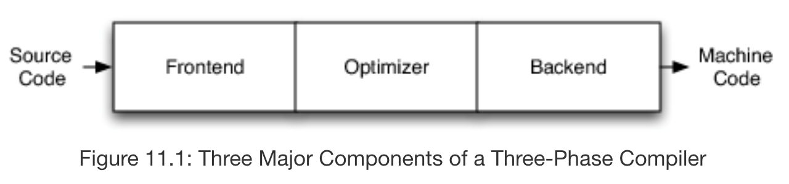
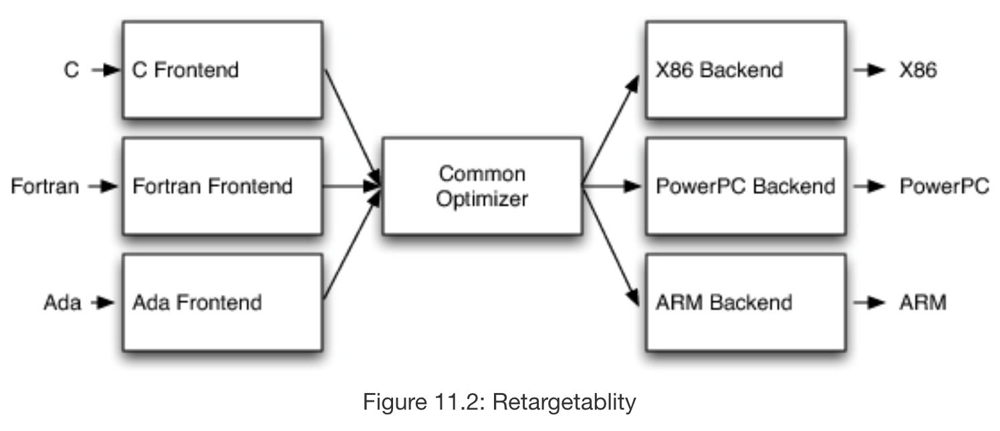
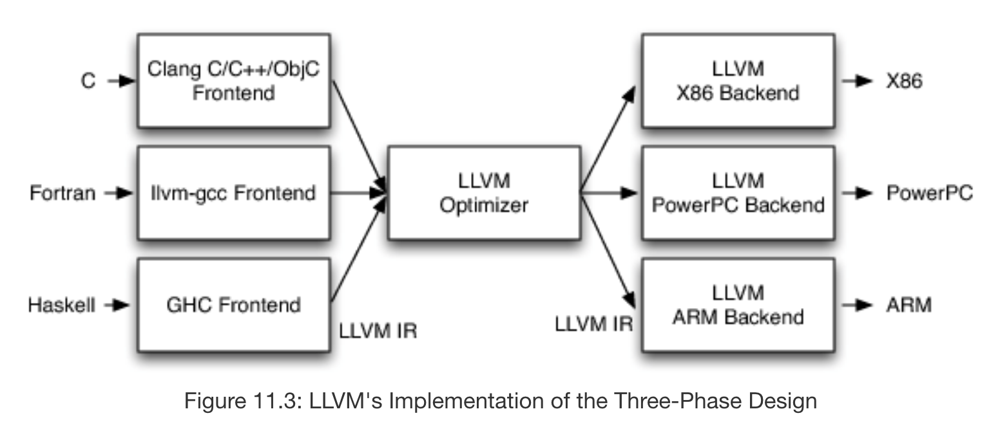
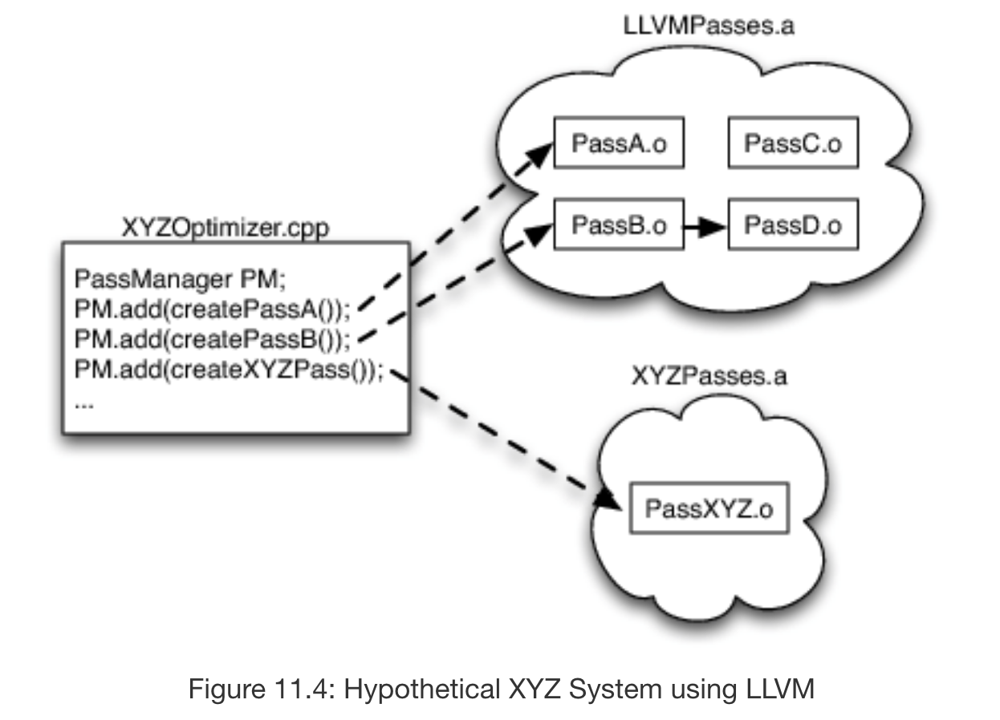
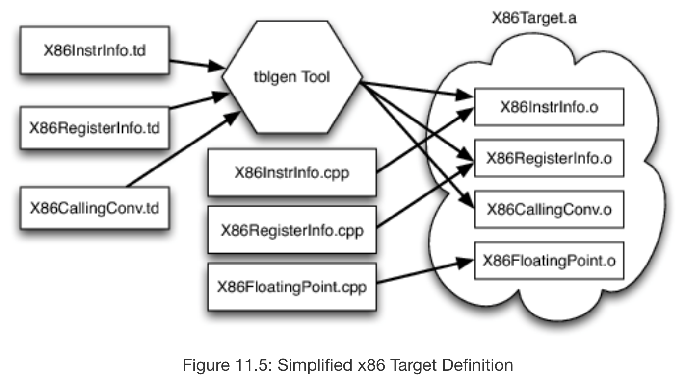
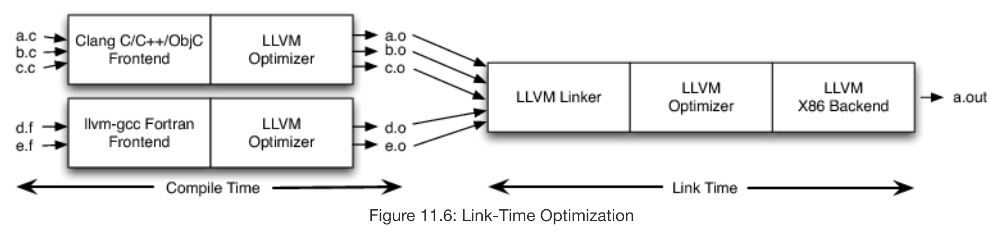
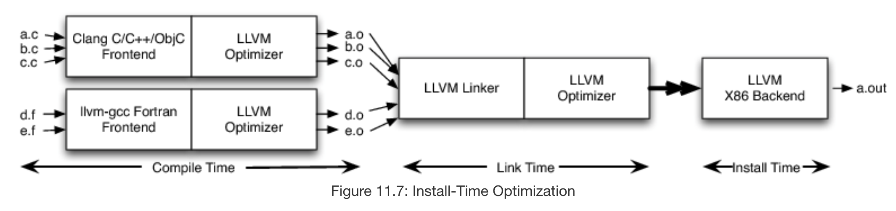

### Problem

LLVM, which originally stood for Low Level Virtual Machine, was a research project into compiler framework design created by Chris Lattner and Vikram Adve at the University of Illinois in 2004. Today, the acronym LLVM has no meaning and instead refers to a collection of open source libraries that provides compilers, compiler toolchains, and compiler frameworks. It is widely known for being the platform that provides Clang, the very fast C/C++/Objective-C compiler used by Apple in their iOS and macOS software development kits.

LLVM's original aim was to allow for the compilation of both statically compiled and dynamically compiled languages in a modular and reusable way. Existing compilers at the time rarely supported both kinds of compilation, and in the cases where they did, there was very little sharing of code. In solving this problem, LLVM introduced a new architecture for compilers that also allowed for easier development, better optimization due to delayed compilation, and better unit testing of the compiler.

### Functional and Nonfunctional Properties

A functional property of LLVM is that it allows for the compilation of C/C++/Objective-C code through its provided Clang compiler. A non-functional property of LLVM is that is very fast. For instance, the Clang compiler provided by LLVM is roughly 3 times faster than GCC for compiling Objective-C code in the default configuration for each.

### Architecture

Compiler architecture is generally organized as a 3 phase design with a frontend, an optimizer, and a backend. The frontend of the compiler is a parser responsible for building an abstract syntax tree (AST) from the grammar defined by the programming language. An optimizer uses that AST (creating a new representation if necessary in the case of dynamic compiler architecture) in order to transform the code in such a way to improve its runtime and/or memory usage. Then, the backend of the compiler translates the code into machine code and applies further optimizations based on the instruction set available to the target.

This design allows for support of multiple source languages and targets, which greatly expands the capability of the compiler and thus is likely to increase the popularity of the open source project. Ideally, the distinction in responsibility between the 3 sections would also aid development and reuse, since code relating to the frontend should be completely independent of code written for the backend. For instance, a developer working to develop new support for C should simply have to write a C frontend, without changing the rest of the compiler.

However, this is rarely the case. In practice, many compiler projects have dependencies between their 3 phases of compilation, making it extremely difficult to pull out parts of these compilers for use in libraries without pulling in the full source of the compiler. In GCC, for example, the backend of the compiler is dependent on the AST generated by the frontend in order to get debugging info, and global variable use is rampant. This criticism is also true of the Java and .NET virtual machines, which force garbage collection and JIT compilation on any source language it compiles.

In order to solve these problems, LLVM introduced intermediate representation (IR), which is a language designed to be used by all 3 phases. The frontend parses source code into IR, validating the source code as it does so, and then turns over the IR to the optimizer. The optimizer then performs a series of configurable passes over the IR, each of which transforms the IR according to the the optimization specific to that pass. For example, we might configure the optimizer to optimize for speed of execution, but not memory usage. Finally, the optimized IR is handed off to the backend, which also performs multiple configurable passes on the IR in order to translate it into into machine code. For example, we might configure the backend to compile for a case where there are very few registers available.

Under this design, each phase of the compiler is completely independent of the other phases, meaning that frontends and backends to LLVM can be cleanly interchanged in a way that was impossible for earlier compilers. For instance, a developer writing a LLVM frontend for a new source language only has to understand LLVM and the source language being added in order add support for that source language over all of the existing LLVM backends.

Furthermore, each pass within the optimizer is created as a C++ subclass of the LLVM Pass class, making it easy to package each pass as a separate library that a developer aiming to write a compiler on top of the LLVM infrastructure can include as necessary. For example, if we were to build a JIT compiler for image processing, we could forgo passes that increase compile-time latency as needed and those excluded passes would not be linked into the finished executable compiler, resulting in a much smaller custom build specific for image processing.

It is similarily easy to use components of an LLVM backend as separate LLVM libraries. To store information about the target being compiled to, LLVM introduces a target description (.td) file format, a set of which can describe specific properties about the target. For instance, a .td file might contain a list of all 16 32-bit registers available to a target, or describe a custom instruction available to the target. Thus, LLVM backends can easily share information in the form of .td files between differing targets. Since .td files contain purely declarative information, sometimes they must be augmented with C++ support routines that are specific to the architecture. An example of this would be code that handles x87 floating point stack. In the future, the LLVM community would like to expand the definition of .td files to eliminate such support routines and further increase the usability of .td files.

Another significant benefit of the independence between the phases is the ease with which the LLVM compiler can be unit tested. LLVM IR is much easier to unit test than traditional compilers because you can load LLVM IR specific to the piece of the compiler that is broken, rather than create a source file which runs through the whole compiler in an effort to test one crashing optimizer. Furthermore, to find which specific component is offending, you can use the LLVM BugPoint tool which reduces a list of crashing optimizers and/or backend passes from some faulting input to a minimum test case.

### Why is LLVM fast?

There are many contributing factors to the speed of compilers, from social factors such as the size of the LLVM community and the popularity of LLVM as a compiler infrastructure to technical factors such as the implementation of the optimizer's PassManager or tblgen, LLVM's provided .td file reader. We will focus here on one of the most interesting and most unique ways that LLVM is able to increase performance, and that is through optimization through delayed compilation.

LLVM IR can be serialized into a binary format called LLVM bitcode, which can also be deserialized into LLVM IR. Serializing to bitcode at an intermediate step rather than creating object code right away allows us to delay code generation to link time or even install time to get better optimizations.

In the figure above, we have instructed the LLVM optimizer to emit bitcode rather than object code to each of the .o files pictured, so that the LLVM linker can then deserialize the bitcode into LLVM IR, link them, and then run an LLVM optimizer that has a scope over multiple files rather than just a.c or just d.f. This allows for file-wide optimizations such as inlining, eliminating dead code, and propagating constants.

We can further delay compilation to install time by instructing the LLVM optimizer behind the LLVM linker to emit bitcode which is then sent to an LLVM backend hosted on the machine the compiler is being installed on. This is useful because many targets contain variability that is impossible to predict before install time. For example, the x86 family of targets is implemented on a variety of chips with differing characteristics and by delaying the selection of exactly which instructions to use in the machine code to install time, LLVM can adapt to such differences in targets very easily and provide further optimization.

#### Works Cited

Lattner, C. (n.d.). LLVM. Retrieved from http://aosabook.org/en/llvm.html

The LLVM Compiler Infrastructure Project. (n.d.). Retrieved from https://llvm.org/
