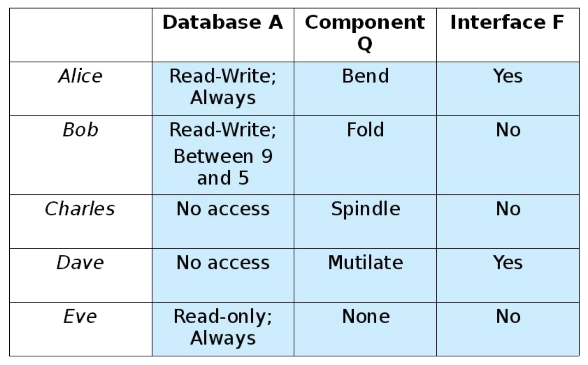

> Professor Werner Dietl, Fall 2018

I attended almost no lectures for this course, so notes are organized by slides. These notes turned out to be way more detailed than necessary.
{:.warning}

# Intro

**software architecture:** set of principal design decisions about the system, blueprint for software construction and evolution. It has 3 aspects: structure/behaviour/interaction of system, communication, non-functional requirements.

Non-functional requirements define the behaviour of a system (e.g. system should be fast and secure). Functional requirements define what a system is supposed to do (e.g. system should book me Fedbus tickets).

We want *practical* ways to *guarantee* that software is correct. The different ways that we can do this fall on a spectrum.


Ways to achieve practical guarantees on software quality

In the top right corners we have specialized type systems like Android's SPARTA (Static Program Analysis for Reliable Trusted Apps) which guarantee no leakage of private information.

Something with high practicality but low guarantees would be crowd-sourced verification.

Another approach is MUSE (Mining and Understanding Software Enclaves). This program mines specifications from a code base continuously, automates finding/repairing program errors, and synthesizes new programs from the existing codebase using mined specifications. It's composed of open source software projects.

# Architecture

We choose a design based on the following factors (among others):

- fitness for purpose,
- cost of production (parts, labour, capital/tools)
- cost of operation
- fitness for future

Steps of the design process:

1. Ideation
2. Analysis: determine and apply criteria
3. Selection of design
4. Elaboration/Refinement
5. Iteration

*Radical components* are components that haven't been invented yet. *Radical configurations* are designs that haven't been tried yet. As designers, we want to take radical problems (problems solvable with radical configurations/designs) and solve them with existing/standard/normal solutions.

All of architecture involves design, but not all of design involves architecture (i.e. art).

The same system can have multiple architectures i.e. logical web architecture (class diagrams) vs. physical web architecture (server map) vs. dynamic web architecture (realtime map of requests sent/received).

Stakeholders in a system's architecture include: architects, developers, testers, managers, customers, users, and vendors. These people define the goals of the system and then make principal architecture decisions that achieve those goals.

**prescriptive architecture:** design decisions made prior to the system's construction, as-intended design

**descriptive architecture:** describes how the system has been built, as-implemented architecture

**architectural evolution:** when a system needs to be changed. Ideally we would go back to modify a system's prescriptive architecture (i.e. change the overall design of the system to fit). In practice, the descriptive architecture (the system) is directly modified. This happens because of: developer sloppiness, short deadlines, lack of documented prescriptive architecture, need/desire for code optimizations, inadequate techniques or tool support.

**architectural degradation:** introduction of principal design decisions into a system that *don't* violate the original prescriptive architecture

**architectural erosion:** introduction of architectural design decisions into a system that *do* violate the original prescriptive architecture

**architectural recovery:** process of determining a system's architecture from its implementation artifacts e.g. source code, executable files, bytecode. Used to recover architecture from architectural degradation/erosion.

A software architecture should be a composition of multiple interacting elements. There are 3 types of elements: processing, data/state, interaction.

**components:** software elements that encapsulate processing and data. They perform data hiding, have an interface, and have explicitly defined dependencies e.g. a software class. They provide application services.

**connectors:** regulates interactions among components e.g. procedure call connectors, shared memory connectors, message passing connectors, streaming connectors, distribution connectors, wrapper/adapter connectors. They provide application specific interaction.

**configuration:** topology of components and connectors in a system's architecture

The *deployment view* of an architecture is the description of how that architecture has been physically placed on hardware. We can assess it through its available memory, power consumption, required network bandwidth etc.

Building software is hard because:

- It's a young field
- There are high user expectations
- Software relies on software relies on hardware
- Complexity increases non-linearly with program size
- Conformity, system state depends on its environment
- Changeability, software is too easily modified
- Intangibility, follows no laws

Ways we can make it less hard:

- High level languages
- Development tools and environments
- Component based reuse
- Development strategies
  - Incremental, iterative method
  - Waterfall: requirements to design to implementation to verification to maintenance
  - Evolutionary prototyping: build robust prototype and refine it so that users can have access to it before final system is created
  - The spiral model, which examines the risks of a project and picks another development strategy that best fits the risk
- Emphasis on designing software before we implement it

# Views and Non-functional Properties

Recall that architecture composes components and connectors. From a topological standpoint, we want to:

- minimize coupling (information hide between components)
- maximize cohesion within each component (each component is one logical service)

**abstraction:** remove unnecessary detail. You can abstract away control (e.g. do-while loop) and you can abstract away data types e.g interfaces.

**decomposition:** top-down abstraction where we break problem into independent components and we describe each component

**architectural representations:** technical communication about a system between stakeholders, has properties: ambiguity, accuracy, and precision

- Reading Assignment: 4 + 1 View Model

  [](https://www.cs.ubc.ca/~gregor/teaching/papers/4+1view-architecture.pdf)

  A system has a logical view (object model), a development view (classes), a process view (runtime, concurrency), and a physical view (maps software onto hardware). Each is appropriate for some stakeholder and scenario.

**architectural model:** an artifact documenting some or all of the architectural design decisions about a system

**architecture visualization:** way of depicting some or all of the architectural design decisions about a system to a stakeholder

**architecture view:** subset of related architectural design decisions

**component diagram:** captures components and static relationships between components

**sequence diagram:** captures behaviour of system for a specific runtime scenario

**deployment diagram:** mapping between components and physical devices

**statechart diagram:** formal description of system behaviour through states, doesn't map well to components


Classifications of non-functional properties

**non-functional property (NFP):** constraint on the way a system is implemented or delivers its functionality e.g. efficiency, scalability, evolvability, complexity, heterogenity, dependability

A system has to be designed for functional properties (FPs) to be correct and designed for NFPs to be usable. Each stakeholder has their own opinion on what NFPs matter most e.g. QA interested in testability more than sales, developers interested more about maintainability than customer.

Challenges to ensuring NFPs:

- Some are only partially understood by other stakeholders
- They can be qualitative rather than quantitative
- They frequently depend on many variables
- Non-technical pressures e.g. time-to-market of functional features

#### Design Guidelines for Ensuring NFPs

| Guideline                                                                                                                   | Components                                                                                                                                                                                            | Connectors                                                                                                                                                          | Topology                                                                                                                              |
| --------------------------------------------------------------------------------------------------------------------------- | ----------------------------------------------------------------------------------------------------------------------------------------------------------------------------------------------------- | ------------------------------------------------------------------------------------------------------------------------------------------------------------------- | ------------------------------------------------------------------------------------------------------------------------------------- |
| Efficiency: system's ability to meet performance requirements                                                               | - Keep them small<br />- Simple and compact interfaces<br />- Allow multiple interfaces to the same functionality <br />- Separate data from processing compoents <br />- Separate data from metadata | \- Carefully select connectors <br />- Be careful of broadcast connectors <br />- Encourage async interaction <br />- Be wary of location/distribution transparency | \- Keep frequent collaborators close (e.g. in memory) <br />- Consider efficiency impact of selected style                            |
| Complexity: the size of a system, its volume of constituent elements, their internal structure, and their interdependencies | \- Separate concerns <br />- Isolate functionality from interaction <br />- Ensure cohesiveness <br />- Insulate processing from data format changes                                                  | \- Isolate interaction from functionality <br />- Restrict interactions provided by each connector                                                                  | \- Eliminate unnecessary dependencies <br />- Use hierarchical decomposition                                                          |
| Scalability: capability of system to meet new size/scope requirements                                                       | \- Keep components focused <br />- Simplify interfaces <br />- Avoid unnecessary heterogeneity <br />- Distribute data sources <br />- Replicate data                                                 | \- Use explicit connectors <br />- Use simplest connectors                                                                                                          | \- Avoid bottlenecks<br /> - Place data close to consumer <br />- Location transparency                                               |
| Heterogeneity: ability of system to be compose of or execute in disparate parts                                             | \- Same as scalability                                                                                                                                                                                | \- Same as scalability                                                                                                                                              | \- Same as scalability                                                                                                                |
| Portability: ability of system to execute on multiple platforms while retaining FPs and NFPs of original                    | \- Same as scalability                                                                                                                                                                                | \- Same as scalability                                                                                                                                              | \- Same as scalability                                                                                                                |
| Evolvability: ability to change to satisfy new requirements and environments                                                | \- Same as for complexity <br />- Isolate modifications to reduce risks                                                                                                                               | \- Clearly define responsibilities <br />- Make connectors flexible                                                                                                 | \- Avoid implicit connectors<br /> - Encourage location transparency                                                                  |
| Dependability: ability of a system to respond to failures (from environment, components, connectors) to failures at runtime | \- Control external component dependencies <br />- Support reflection<br /> - Support exception handling                                                                                              | \- Use explicit connectors <br />- Provide interaction guarantees                                                                                                   | \- Avoid single points of failure <br />- Enable back ups <br />- Support system health monitoring <br />- Support dynamic adaptation |
| Survivability: ability to resist, recover and adapt to threats (i.e. prevent future threats)                                | \- Same as dependability                                                                                                                                                                              | \- Same as dependability                                                                                                                                            | \- Same as dependability                                                                                                              |
| Safety: ability to avoid failures that will cause loss of life, injury, or loss of property                                 | \- Same as dependability                                                                                                                                                                              | \- Same as dependability                                                                                                                                            | \- Same as dependability                                                                                                              |


# Architectural Styles

We can classify ways to design software in terms of the scope of that design and the amount of domain specific knowledge that that design uses.


**Reading Assignment:** [Contrasting architecture patterns with design patterns](https://www.oreilly.com/ideas/contrasting-architecture-patterns-with-design-patterns)

Architecture design differs from design patterns in that:

- They talk about overall components rather than classes e.g. in layered architecture pattern, we talk about the presentation layer and the business layer rather than a Button class

- Design patterns only talk about one type of entity e.g. a Builder class, whereas architectural patterns can talk about many components e.g. in microkernel architecture, the core system component and the plugin component
  - Architectural patterns have many variants and hybrids. For example, event driven architectures has a mediator variant (events passed through central mediator) and a broker variant (forwards requests).
  - Architectural patterns operate at a higher level of abstraction, are scaffolding frameworks
  

**Reading Assignment:** [seL4: Formal Verification of an OS](https://www.sigops.org/s/conferences/sosp/2009/papers/klein-sosp09.pdf)

seL4 is an OS microkernel design which was formally verified in C to satisfy its spec (i.e. terminate, execution safety, access control) through machine assisted proof techniques. This was done by prototyping the kernel in a subset of Haskell which can be translated into the language used by the theorem prover Isabelle/HOL. The prototype of the kernel can be run in a virtual environment to aid debugging. Then, a C implementation of the Haskell prototype is created for better model memory management within the OS and provide low level performance benefits. 

The kernel is modeled within the theorem prover as a series of layers (abstract layer describing what the kernel does, executable specification layer, and the C implementation layer).

# **Architectural Patterns**

**architectural pattern:** set of architectrual design decisions that are applicable to a recurring design problem and parameterized to account for different contexts in which that problem appears

## **Three Tiered Pattern**

Front tier: contains user interface functionality

Middle tier: contains application’s major functionality

Back tier: contains application's data access and storage functionality

## **MVC**

3 components

- Model for core functionality and data
- Views for displaying information to user
- Controllers for handling user input


## Sense-Compute-Control


## Design Recovery

To do design recovery, we can either do syntactic clustering or semantic clustering.

### Syntactic Clustering

Static code analysis done without running the program. We can identify coupling and cohesion from descriptions of components, but we may miss some purely dynamic relationships e.g. exception handling.

### Semantic Clustering

Use domain knowledge about the application and behavioural similarity of its entities to infer their meaning. We can verify that these inferred meanings are correct through executing the system on a representative set of inputs. This is tough to automate.

### Greenfield Design

Sometimes, we just start over from scratch to find out what the architecture of the system should be without looking that much at the existing source code. To do this, we can look for analogies for the system in real life, brainstorm, search existing literature, create morphological charts (list all necessary functions and possible implementations) etc.

# Architectural Styles

**architectural styles:** collection of architectural design decisions for a system that constrain further decisions about that system. It can be implemented with some subset of architectural patterns, and it will have its own design vocabulary in terms of custom components and connectors.

We use them because:

- Design/code reuse
- Understandability of system through standardization (known invariants)
- Interoperability
- Style specific analyses are already known (advantages/disadvantages)
- Ways to visualize are already known

Properties of good architecture:

- Results in a consistent set of principled decisions
- Resilient to change
- Source of guidance through product lifetime
- Reuses established engineering knowledge

We rarely use only one unmodified (pure) architectural style in a system.


## Layered Style

Has a hierarchical system organization, each layer acts as a server for layers above and a client for layers below. Connectors are thought of as protocols of layer interaction.

For instance, in a virtual machine, client software runs on an opaque layer of virtualized hardware.


Layered architectural style

Advantages:

- Abstraction increases up the layers
- Evolvability
- Changes in a layer affect at most the adjacent two layers, so aids reuse
- Low coupling since a layer only interacts with layers above and below it
- Standardized layer interfaces

Disadvantages:

- Not universally applicable
- Performance (may force high level layers to be coupled with lower ones)

### Client-Server Style

Layered architecture with only 2 layers, a client layer and a server layer. Servers don't know the number of identity of clients, but clients know their server's identity. Connectors are remote procedure calls on the network according to some protocol.

Advantages:

- Abstraction between servers and clients (servers don't care about the state of the client)
- Redundancy in that new connections can easily be set up
- One change to a server can affect all of its clients (evolvability)
- Standardized protocol between servers and clients
- Ease in scaling

Disadvantages:

- Performance (server can become bottleneck)
- Easy point of attack at server

## Data Flow Styles

### Batch Sequential

Separate programs executed in order, data is passed as an aggregate from one to the next. The connectors between programs is the physical process of loading the next program in (no concurrency, non-interactive). These systems are still used in transaction processing.

### Pipe and Filter Style

Components are filters which do some transformation on their input stream and produce an output stream. Connectors are the pipes which allow the streams to travel from filter to filter. Each filter has no knowledge of other filters or their state. Examples include the unix shell (ls to grep), distributed systems, signal processing, compilers, and parallel programming.

3 variations on pipe and filter: bounded pipe (only allow a certain amount of data), pipelines (only linear), and typed pipes (only allow data of a certain type).


We might think of the pipe and filter style as a layered architecture turned sideways.

Advantages:

- Simple composition
- Reuse
- Prototyping
- Easy growth and evolution (evaluating for bottlenecks is easy)
- Filters can be easily re-implemented without affecting the rest of the system
- Concurrency and parallelism

Disadvantages

- Poor performance: each filter has to parse data, sharing global data is difficult
- Not appropriate for interaction
- Low fault tolerance threshold (e.g. what happens when a filter crashes)
- Data transformation to stream to accomodate filters
- Increases complexity and computation

## Shared Memory

### Blackboard

A central data structure (the blackboard) holds all state and controls the whole system. Components then operate on the blackboard. Connections are either active, as in incoming streams of transactions on a database, or passive as in changes on a blackboard trigger other processes. Examples of this include AI systems, integrated software environments, and compiler architecture (imagine stack).

Advantages:

- Efficient when dealing with large amounts of data
- Clients are loosely coupled

Disadvantages:

- Data model is static, bounded by defined schema, resistant to change since many clients depend on it
- Difficult to distribute


### Rule-based style

An inference engine parses user input and determines whether it's a fact/rule or a query. If it's fact/rule, it adds it into its knowledge base. If it's a query, it looks for relevant rules to produce an fact for the query. This approach has many applications in artificial intelligence, since the rules approximate how humans think.

Thus, we can easily change the system by changing its rules. When there's a large number of rules, they may conflict in the fact that they produce based on the facts/query given.

Advantages:

- Can easily build very flexible evolvable systems by changing rules
- Systems can be very lightweight and scalable
- We can use formal logic to verify coverage of rules

Disadvantages:

- It's hard to come up with rules, we may run into conflicts

## Interpreter

### Interpreter style

Dynamically add to the set of commands possible in the system, good for end user programmability. Examples of this are LISP and Scheme. Suitable for applications in which the most appropriate language or machine for executing the solution is not directly available. Components are an interpretation engine, memory, and state. Connectors are procedure calls and direct memory access. Examples include programming language compilers and scripting languages.


Advantages:

- High evolvability due to ability to add new capabailities dynamically
- Simulation of non-implemented parts
- Portability

Disadvantages:

- Can be slow due to computational complexity

## Implicit Invocation

Method calls are explicit invocations. Triggering a registered listener's handler with an event is an implicit invocation. Event broadcasters don't know anything about the event consumers, the effects of the events, or the ordering of the events.

### Publish-subscribe style

Components register for events, which are then published by different sources or by a centralized system e.g. news, fire alarms, MVC, IDEs, database systems, user interfaces


### Event based style


Advantages:

- Scalable, new listeners can just register themselves
- Minimal dependency and loose coupling, components can be added/removed, components don't directly interact with each other
- Highly reusable, can easily reimplement without chaining interface

Disadvantages:

- Loss of execution control
- Data exchange has to be in terms of events, which has a hit on performance
- Hard to debug, as contracts between components are not formalized and any event can set off a chain of side effects

## Peer-to-Peer Style

State and behaviour are distributed among peers which can act as either clients or servers. Each peer is a component with their own state. Connectors consist of network protocols and data elements are network messages. Skype used to have this sort of architecture.

Advantages:

- Hard to attack, since there's no central server
- Arguably more secure/performant communication, again since no central server is involved

Disadvantages:

- Client machines are often much less reliable than a central server

**Common Object Request Broker Arhcitecture (CORBA):** allows for communication between systems deployed on different OS's, programming languages, and hardware

CORBA places a different **distributed object** on each platform they're trying to support. These objects can share data and invoke methods on other objects through a well-defined API. In CORBA, the components are the distributed objects, the connectors are the RPC invocations, and the data elements are the arguments to methods, return values, and exceptions.

If architectures use differing architectural styles, they'll differ greatly. If they have the same architectural style, they can still be different variations.

# Architectural Styles 2

**Reading Assignment:** [The Architecture of Open Source Applications: Eclipse](http://aosabook.org/en/eclipse.html)

Eclipse was first organized as a lot of plugins.

**Reading Assignment:** [LLVM](http://aosabook.org/en/llvm.html)

Compiler architecture is generally organized as 3 phase design: a frontend for AST building, an optimizer, and a backend for machine code generation. These 3 sections are rarely separated cleanly due to implementation e.g. in GCC, the backend walks the frontend AST for debugging info, the frontend generate backend data strcutures, and global data structures are used throughout.

LLVM uses an intermediate representation (IR) which is a step above machine code. Front end produces IR, the optimizer optimizes IR into better IR through multiple passes, and the backend converts IR to machine code in multiple passes. We can configure which passes are done for a specific compilation case e.g. not many registers available.

The backend uses target description `.td` files to describe specific properties about the target being compiled to e.g. a list of all 16 32-bit registers available. We can augment this information with C++ code specific to the architecture e.g. for handling x87 floating point stack.

LLVM IR can be (de)serialized into a binary format called LLVM bitcode. Serializing to bitcode at an intermediate step rather than creating object code right away allows us to delay code generation to link time or even install time to get better optimizations.

LLVM IR is much easier to unit test because you can load LLVM IR specific to the piece of the compiler that is broken, rather than create a `.c` file which runs through the whole compiler in an effort to test one crashing optimizer. To find which optimizer is offending, you can use the LLVM BugPoint tool which reduces a list of crashing optimizers and input to a minimum test case.

#### Question

Consider a development environment capable of integrating a set of tools (e.g., compiler, editor, debugger, etc.) produced by different vendors. What is the architectural style most appropriate for the system? Give a sketch of the system and explain the interaction between parts of the architecture. Give one advantage and one disadvantage of the given choice.

##### Answer

The architectural style most suitable would be the layered virtual machine architectural style. The editor and the debugger would both be layers on top of the compiler layer, and would use the compiler as a blackbox on top of which they can call functions. One advantage of this is that it is a very decoupled design, which is advantageous since there are multiple vendors. One disadvantage may be the performance, which can be impacted as we get higher and higher level tools.

# Architectural Modeling

**architectural model:** artifact that captures the documented design decisions in a system's architecture

**architectural modelling notation:** language/means used by an architectural model

Stakeholders in the system have to determine what should be modelled, at what level of detail, and with how much rigor. They should do a cost-benefit analysis on what to model.

Things we can model:

- Basic architectural elements
  - Components
  - Connectors
  - Interfaces
  - Configurations
  - Rationale (reason behind decisions)
- Elements of architectural style
  - Specific basic architectural elements relevant to the style
  - Component, connector, interface types
  - Constraints on interactions, behavioural constraints, concurrency constraints
- Static and Dynamic aspects
  - Static aspects of a system don't change as the system runs e.g. logical topologies, deployment map
  - Dynamic aspects of the system change as the system runs e.g. state of individual componetns or connectors, state of a data flow through the system
- Functional and non-functional aspects of a system

**view:** subset of a architectural model according to a *viewpoint*, which is a set of criteria that restrict the design decisions captured in the view e.g. logical, physical, deployment, concurrency, behavioural

We use several views from different viewpoints to capture a single model, because using one large view would be infeasible and impractical.

Views can contain overlapping and related design decisions. If decisions presented by one view conflict with those of another view, those two views are inconsistent. Otherwise, they're consistent.

Types of inconsistencies:

- direct inconsistencies e.g. the system runs on 2 hosts vs. the system runs on 3 hosts
- refinement inconsistencies, meaning the high level and the low level views of the same parts of a system conflict

We should consider a model's ambiguity, accuracy, and precision.

- static (topology) or dynamic (behaviour) aspects inconsistencies, e.g. different description of system behaviour in 2 different views, different topologies described in 2 different views
- functional or non-functional inconsistencies

Sometimes, inconsistencies are OK, but most of the the time, it means there's some problem with your system.

To evaluate a modelling approach, consider:

- Scope and purpose, what is modelled (or not modelled) by the approach?
- Basic elements of the model
- Style, how well the model fits with the underlying architectural style
- Static/dynamic aspects
- Dynamic modelling, how the model change as the system changes
- Non-functional aspects
- Ambiguity
- Accuracy
- Precision
- Viewpoints
- Viewpoint consistency

Approaches to modelling:

- Generic approaches e.g. natural language, powerpoint, UML
- Early architecture description languages e.g. Darwin, Rapide, Wright
- Domain/style specific languages e.g. Koala, Weave, AADL
- Extensible architecture description languages e.g. Acme, ADML, xADL

**Unified Modelling Language (UML):** widespread notations for modelling static and dynamic aspects of systems

Static aspect views in UML:

- Component diagrams

  

- Deployment diagrams

  

- Class diagrams

  

Dynamic aspect views in UML:

- Sequence diagrams

  

- Use case diagrams

  

- State machine diagrams

  

Advangtages of UML:

- Support for many viewpoints relevant to software engineering
- Ubiquity improves comprehensibility, extensive documentation and tool support

Disadvantages of UML:

- Very ambiguous if not enough detail is given
- Difficult to assess consistency between views
- Difficult to capture new concepts or views

# Security and Chrome

**security:** maintaining integrity (only authorized modifications), availability (accessible by authorized parties), and confidentiality (prevent access/knowledge from unauthorized parties) of system resources (hardware, software, firmware, data, communications etc.)

Design principles for security:

- Least privilege: give each component only the privileges it requires
- Fail-safe defaults: deny access if explicit permission is absent
- Economy of mechanism: adopt simple security mechanisms
- Complete mediation: ensure every access is permitted
- Open design: do not rely on secrecy for security
- Separation of privilege: introduce multiple parties with differing privileges
- Least common mechanism: limit critical resource sharing to only a few mechanisms
- Psychological acceptability: make security mechanisms usable
- Defense in depth: have multiple layers of countermeasures

## Architectural Access Control Models

**discretionary access control:** allow access to a resource based on the resource, the identity of the requestor, and whether the requestor has permission



**mandatory access control:** define policies for resource access, i.e. users have classification hierarchy which correspond to resource classification hierarchy


Types of attacks:

- Impersonation of an authorized user
- Fradulent actions e.g. seller does not ship items bought
- Misrepresentation, delegitimize an authorized user
- Collusion, delegitimize an authorized user as a part of group
- Addition of users who have no information on other users in the system, where existing users on the system also don't know about them

**trust:** the probability that an agent A asseses that another agent B will perform a particular action  in a context where it affects A i.e. A trusts B to do X in matters Y affecting A

**reputation:** expectation about entity's future behaviour based on its past behaviour

#### Chrome architecture

**Reading assignment:** [Browser security in Chrome](https://queue.acm.org/detail.cfm?id=1556050)

**Reading assignment:** [Security architecture of the Chromium Browser](http://seclab.stanford.edu/websec/chromium/chromium-security-architecture.pdf)

Chrome deals with accesses of insecure online content that can compromise:

- confidentiality: leak user data
- integrity: read/write arbitrary data on disk
- availability: crash Chrome application or OS

Chrome relies on least privilege, separation of privilege, and defence in depth. They sandbox to reduce severity of vulnerabilities, auto-update to reduce window of vulnerability, and warn about malicious sites before accessing them to reduce frequency of exposure to attacks.


# Design Introduction

Analysis models an existing system to deal with its functional challenges, while design creates a model to implement a new system to deal with its implementation challenges. The design of a system maps responsibilities to objects.

Design process loop:

1. Build
2. Measure
3. Learn

We want to reuse designs in order to use previous experience and promote: abstraction, flexibility, modularity, and elegance.

We have to consider dynamic behaviour as well static relationships from examining just the code. As we increase abstraction, we have less control over the behaviour of the system.

## **Design Principles**

Don't be STUPID, be SOLID.

STUPID:

- Singleton
- Tight coupling
- Untestable
- Premature Optimization
- Indescriptive naming
- Duplicates

SOLID

- Single reponsibility prinicple
- Open/closed principle: classes should be open for extension but closed to modification
- Liskov Substitution Principle: subtypes should behave as their parent types
- Interface Segregation: only place key methods in interfaces
- Dependency Inversion Principle: higher level modules should not depend on lower level modules

Lower level principles:

- Encapsulate what varies
- Program to abstractions not implementations
- Favour composition over inheritance (enables runtime behaviour changes and makes code easier to evolve in the future)
- Strive for loose coupling

Quality attributes:

- Simplicity: Don't Repeat Yourself (DRY), Keep it Simple, Stupid (KISS)

- Cohesion

  

- Coupling

  

- There is incoherency in an operation if it has too many "and" clauses (temporal cohesion, logical cohesion), and if it has too many "if...then...else" clauses (control coupling, coincidental cohesion, logical cohesion).


**Cognitive dimensions:**

- premature commitment: decision made with insufficient data that constrains future choices
- hidden dependencies
- secondary notation: non-obvious relationships may be meaningful or provide context
- viscosity: reistance to change

We want design patterns for the same reasons as we wanted architectural styles:

- Ease communication with a shared vocabulary
- Leverage existing design knowledge
- Enhance flexibility for future change
- Increase reusability of developed code

**design patterns:** common solutions to recurring design problems (will have tradeoffs). They describe a class/object with well defined dependencies, structures, interactions, and convensions. They're language independent and can be considered micro-architectures.

# Design Patterns

**double dispatch:** decide which version of a method implemented to call at runtime i.e. in visitor pattern when calling the visit method on either a root node or a leaf node

## Creational Patterns

**creational patterns:** ways to encapsulate construction logic for and defer class instantiation until runtime

### Singleton Pattern

Use when you need global access to a single instance of something

Example: Everyone needs to access the official government.


Pros:

- Guarantees class only has single instance
- Global access point to instance
- Singleton has lazy instantiation

Cons:

- Violates SRP
- Masks bad design e.g. high coupling
- Hard to implement in multithreaded environment
- Difficult to mock Singleton for unit tests since constructor is private

### Factory Pattern

Create different kinds of an AbstractProduct using an Factory implemented by ConcreteFactory classes

Example: Create Ships and Trucks as Transport.


Pros:

- Avoid tight coupling between client of Factory and ConcreteProducts
- SRP, product creation code in one one place
- Open/closed, easy introduction of new Products into the code

Cons:

- More complicated due to addition of classes

### Abstract Factory

Introduce AbstractFactory over 2 or more existing ConcreteFactories that are each capable of producing a related family of ConcreteProduct classes. The client then configures the AbstractFactory to use the right ConcreteFactory and only deals with the Product interfaces.

Example: Create IKEA chairs, desks, lamps or Victorian chairs, desks, lamps.


Pros:

- Products from a Factory are guaranteed to be related
- Avoids tight coupling between concrete products and client
- SRP, product creation code all in one place
- Open/Closed Principle, easy addition of new families of Products

Cons:

- More complicated due to addition of classes

### Builder Pattern

Build different kinds of a complex object using configuration methods on an Builder implemented by ConcreteBuilder classes. Optionally, use a Director to wrap what kind of Builder you're using.

Example: Building a house, you need to configure whether the house has a garden, garage, swimming pool, whether it's made of wood/stone etc.


Pros:

- Construct objects step by step
- Reuse construction code when constructing different objects
- SRP, object creation code all in one place

Cons:

- More complicated due to addition of classes

### Prototype Pattern

If you need a copy of an object, make the object copy itself, since it will have access to its own private members.

Example: Copy Rectangle and Circle subclasses of Shape, but only interact with Shape code by forcing Shape to have a `clone` method.


Pros:

- Avoids tight coupling between client code and ConcretePrototype classes
- Can remove repeated/complex initialization code when copying
- Alternative to inheritance when dealing with configuration presets for prototypes

Cons:

- Cloning complex objects that have circular references is tricky

## Structural Patterns

**structural patterns:** ways to make the relationships between entities more flexible

### Adapter

Create a wrapper around the methods of one or more classes to make it compatible with a client specified interface.

Example: You need an adapter for a wall socket in Europe in order to use your chargers built for US sockets.

If the Adapter has Adaptees, it's an Object Adaptor. If the Adapter is an Adaptee, it's a Class Adaptor.


Pros:

- SRP, since interface conversion code is separate
- Open/Closed, since new adapters can be introduced without breaking existing code

Cons:

- Complexity increases due to more classes

### Bridge Pattern

Create interfaces for each separate characteristic a class can have i.e. Color for a Shape, and then make that class own one or more of their characteristic classes.

Example: Different remotes kinds can be for different devices. Create a Device interface which a Remote has 1 or more of.


Pros:

- Client code works with abstraction over class characteristics
- Open/closed, can introduce new classes or new characteristics
- SRP, focus on implementation in characteristic classes

Cons:

- Makes code more complicated when abstraction and implementation are closely related

### Decorator Pattern

Wrap classes in other classes which own them and provide more functionality

Example: Russian nesting doll where each layer is constructed by passing in another layer or the core of the doll.


Pros:

- Extend object's behavior without making a subclass
- Add or remove capabilities at runtime
- Combine several behaviors by wrapping an object in multiple decorators
- SRP, divide large class into many smaller decorators

Cons:

- Hard to remove specific wrapper from decorator stack
- Hard to implement a decorator where behavior doesn't change based on order in which decorators stack
- Initial configuration code for layers is ugly

### Facade

Provide an interface over many disparate classes like Adaptor, but it doesn't kill its classes at the end

Example: Wedding planner needs to coordinate bakery, florist, caterer etc.


Pros:

- Isolates code from complexity of subsystem

Cons:

- Facade becomes God Object coupled to all classes

### Proxy

Wrap access to a real object for performance reasons

Example: Write a proxy over a video downloading service that acts like the video downloading service but only downloads the video when it doesn't have it cached.


Pros:

- Control service object without clients knowing about it
- Manage lifecycle of the service object
- Proxy works even if service object isn't ready
- Open/closed, can introduce new proxies without changing service

Cons:

- More complicated due to extra classes
- Delay in service response

### Composite

Use for tree structures

Example: File system with folders and files


Pros:

- Can work with tree structures
- Open/closed, can introduce new component types

Cons:

- May be tough to have common interface for differing components

### Flyweight

If you have a lot of objects with the same unchanging internal state, you can create a Flyweight class encapsulating that state which all the objects can then share. You can also create a Factory that dispenses a particular Flyweight you need for an object. This saves on memory. In the diagram, the object you're creating a lot of is the Context.

Example: Creating a ton of instances of a Particle class, each with their own color, coordinates, and speed is a lot of duplicated individual data. Instead, make Particles share a reference to a Flyweight Particle, which consists of data they keep constant e.g. all bullets have the same color.


Pros:

- Saves memory

Cons:

- Code is complicated because state of Flyweight object is separated out into Context and Flyweight

## Behavioral Patterns

**behavioral patterns:** identify common communication patterns between objects and make them more flexible

### Visitor Pattern

Because elements visited can be polymorphic (i.e. we have to call different visit methods on them), we do a double dispatch, meaning we make the accept method on each element call the correct visit implementation on the Visitor object it is passed.

Example: Insurance guy visits different buildings, each of accepts the visitor and then asks them for a kind of insurance specific to that building


Pros:

- Open/Closed, can introduce new components/visitors
- SRP, can move multiple versions of the same behavior into the same class

Cons:

- Need to update all visitors each time a class gets added or removed from the component hierarchy
- Visitors might not have access to members of components they visit

### Observer Pattern

Publishers and subscribers


### Interpreter Pattern


Implement a specialized computer language to rapidly solve a specific set of problems

### Template Method Pattern

Describes the program skeleton of a program


# Code Smells

**code smells:** indications in source code that there is a design problem e.g.

- Large classes and methods
- Deep nesting of control
- Duplicate code
- Casts to implementation classes
- Static state
- No information hiding, bad encapsulation
- Many parameters

**refactoring:** restructuring existing code to improve abstraction, code reuse, cohesion, coupling, naming, usage of design patterns etc. Good test coverage ensures restructured code still has the same external behavior.

## MVC

Smalltalk was one of the first languages used to implement MVC. It's used in Java UI frameworks, enterprise Java beans (EJB), in Google Web Toolkit (GWT, a Java library that compiles to Javascript web applications), and in .NET programming (software framework for programming applications on Windows).

**model:** contains application data, subjects in the observer pattern that don't know anything about views (have only an abstract reference to views)

**view:** presents model to user, receives events from the user to manipulate data but doesn't store data, can be configured by the user to show different data

**controller:** updates model when view receives user event, view is tightly coupled with controller


### Interaction mechanism:

1. User interacts with View
2. View notifies Controller, which processes event and calls the Model as needed
3. If the Model changes, it notifies its observers, the Views

### Benefits

- Decouple models and views
  - Supports multiple views
  - Maintainability (easy to add new views to the same model)
  - Split teams (UI can be developed separately from business logic)
- Testability (UI can be tested separate from business logic)

### Cons

- Complexity (use of abstractions and events)
- Efficiency (large models, frequent updates)

**compound pattern:** pattern that relies on several other design patterns

MVC is a compound pattern because:

- View and Controller use Strategy Pattern
- View and Model use the Observer Pattern
- View is often a Composite pattern

## Model View Presenter (MVP)

MVP further separates the View from the Model by moving the code that handles Model updates from the View to the Controller, and then calling the Controller the Presenter.

**model:** same as in MVC, often fires events to an event bus

**view:** same as in MVC, but never receives update events from the Model or tries to get data from model objects (only interacts with primitives) e.g. `setUser(String)` instead of `setUser(User)`

**presenter:** updates the view when the model changes, updates the model when view receives user event


### Benefits

- The same as MVC, with better:
  - Ability to split teams (UI can be better separated)
  - Testability (UI can be better tested alone)
  - Less complexity due to fewer events

### Cons

- The same as MVC, but less complexity

## Model View View-Model (MVVM)

MVVM was built specifically for the WPF and Silverlight environments on the .NET platforms.

Introduces a ViewModel that tracks relevant changes to model for a specific View (i.e. data binding between model and view model). The ViewModel also extends the Model for Views. Like in MVC, there can be multiple Views for the same ViewModel.


MVP Topology (left) vs. MVVM topology (right)

#### Question

Design a simple account creation feature. Draw class diagrams and write pseudocode. Compare MVC and MVP.

Data: user name, password, country, language

##### Answer

MVC:


MVP:


# Dependency Injection

## Dependency Inversion (D from SOLID)

- High level modules should not depend on low level modules, both should depend on abstractions
- Minimizes direct coupling between concrete classes
- Program to interfaces not to implementations!

But, even if we use abstractions between objects, at object creation we will have to specify a concrete class (e.g. `Foo f = new ConcreteFoo();`). Furthermore, if we want to use a different concrete class implementation as a dependency, we have to recompile the code.

Dependency injection:

- Takes a set of components (classes and interfaces)
- Adds a set of configuration metadata
- Provides the metadata to an injection framework
- Bootstraps object creation with a configured injector

Dependency injection is **inversion of control (IoC)**, because the library doing dependency injection calls into the application code, instead of the application code calling a library as usual.

Other examples of IoC:

- Factory pattern
- Service loader pattern
- Template method design pattern
- Strategy design pattern

#### Example

A BillingService relies on an Order and a CreditCard.

Google Guice (IoC framework) configures which abstract classes get bound to which concrete classes through the use of a module.

```java
// Automatically instantiates the objects as needed
public class BillingModule extends AbstractModule {
	@Override
	protected void configure() {
		bind(TransactionLog.class).to(DatabaseTransactionLog.class);
		bind(CreditCardProcessor.class).to(CheapCreditCardProcessor.class);
		bind(BillingSerivce.class).to(RealBillingService.class);
	}
}
```

`@Inject` tells Guice to instantiate the correct concrete class based on the configuration of the module.

```java
public class RealBillingService implements BillingSerivce {
	// Interact with abstractions
	private final CreditCardProcessor processor;
	private final TransactionLog transactionLog;
	
	@Inject
	public RealBillingService(CreditCardProcessor processor, 
														TransactionLog transactionLog) {
		this.processor = processor;
		this.transactionLog = transactionLog;
	}
}
```

Then, application code simply needs to instantiate the injector.

```java
public static void main(String [] args) {
	Injector injector = Guice.createInjector(new BillingModule());
	BillingService billingSerivce = injector.getInstance(BillingService.class);
}
```

Dependency inversion is not the same as abstraction! Consider the following class.


In this case, changing Bar can require in changing IBar and thus in changing Foo. But Foo should not be dependent on Bar since it is a higher level module! Thus, we have abstraction but not dependency inversion.

We can solve this issue by having Foo define IBar. Now, Bar depends on Foo instead of Foo depending on Bar through the wrapper IBar. Now, if Foo changes, then IBar may change and thus Bar may need to change. Thus we have dependency inversion.


Now, Foo can be placed in its own package independent of Bar.

# Cloud/Web Services

### Cloud Precursors

**grid computing:** using a combination of computing resources from multiple administrative domains, forms a "super computer"

**utility computing:** billing model where service provider offers set computing resources e.g. computation, storage, and services, charged by usage

## Cloud Computing

**cloud computing:** model for enabling on-demand  network access to a shared pool of configurable computing resources that can be rapidly provisioned and released (i.e. can scale up or down, unlike utility computing), promotes availability

Important characteristics of cloud computing, as defined by National Institute of Standards and Technology (NIST):

- On-demand self service: consumers get computing capabilities without human interaction
- Broad network access: capabilities are available over the network
- Resource pooling: computing resources are pooled to serve multiple consumers, location independence (performance/security)
- Rapid elasticity: resources easily added and removed
- Measured service: metering of storage, processing, bandwidth etc.

### Benefits

- Agility, quick to respond to changes
- Scalability, resources can be added for peak load
- Cost, resources can be released, multi-tenancy
- Reliability, different sites, computation centers controlled by experts
- Security

### Technology

**thin client:** designed to be especially small so that the bulk of computation occurs on the server

**thick client:** designed to host the bulk of computation so that there is no need for continuous server communication

Clouds have created a shift towards thin clients, since servers can be hosted on clouds.

**data centers:** large capacity computation warehouses which are globally distributed

Clouds have created APIs for:

- Administration
- Development
- Resource migration

**virtualization:** decoupling physical and computing resources. Kinds:

- Emulation: VM simulates partial hardware e.g. QEMU
- Paravirtualization: Software interface to VM e.g. Xen
- Full: Complete simulation of hardware e.g. VMWare

Network virtualization can be created through using VPNs.

### Layers of Control

Software as a Service (SaaS) 

- Example: Google Docs, a collaborative document editor
- vendor controlled remote applications
- concerns: control, performance, security, privacy

Platform as a Service (PaaS)

- Example: Google App Engine, a deployment management service for applications
- vendor controlled environment
- concerns: SaaS ones, limited choice in technology on platform

Infrastructure as a Service (IaaS)

- Example: Amazon EC2, a hardware service for applications
- vendor provided resources; consumer provisions VM
- concerns: SaaS ones, more expertise needed to leverage flexibility


**serverless computing:** cloud provider acts as the server, i.e. consumer does not create a server on the cloud

Function as a Service (FaaS)

- Consumers define a function to be run on a cloud provided server rather than writing a server to be deployed as in PaaS

### Cloud Security Non-Functional Properties

- Confidentiality (keep unauthorized users out)
- Integrity (data was not altered)
- Authenticity (data modifications belong to the correct users)
- Anonymity (users of the service are anonymous to the cloud provider)
- Privacy (user data is properly controlled)

The last 2 are a concern with regards to data remanence, since you have to be able to ensure that the cloud is purged of data.

### Representational State Transfer (REST)

Client/server model where servers don't maintain session state, and clients communicate using a uniform server interface e.g. URI endpoints and a payload.  You can version URIs and test REST using the endpoints.

REST Operations:

- GET: list items
- PUT: replace items
- POST: append to items
- DELETE: delete items

REST is used in many web frameworks.

**web service:** software functionality offered over the web

**Web Services Description Language (WSDL):** XML format describing the functionality of a web service

**Simple Object Access Protocol (SOAP):** XML message protocol used to call web services

**microservices:** architecture that structures an application as a collection of loosely coupled services

# Checker Framework 1

Pluggable type checking:

1. Design a type system to solve a problem
2. Write type qualifiers in code e.g. `@Immutable` or use type inference
3. Type checker warns about violations at compile time

```java
// Example 1
@Immutable Date date = new Date();
date.setSecond(0); // Immutable error

// Example 2
String op(@NonNull Data in) {
	return "transform: " + in.getF();
}
```


Static type system, plugs into compiler

Static type systems pluggable into the compiler don't impact method binding, memory consumption, or execution.

Benefits of type systems:

- Finds bugs in programs, gives guarantees
  - No bugs of some type e.g. no null dereferences
  - No wrong annotations
  - Limitations: you have to compile all of your program with CF, without suppressing warnings, CF has false positives and is unsound in places
- Improves documentation
- Aids compilers, optimizers and analysis tools (e.g. can reduce the number of runtime checks)
- Type checking is familiar to programmers
  - Annotations are not too verbose, easier to do than formal verification

Cons of type systems:

- Must use types into source (use type inference)
- False positives are possible (can be suppressed)

The Checker Framework is a framework for pluggable type checkers that plugs into the OpenJDK or OracleJDK compiler. It integrates into build tools like Maven, Ant, and Gradle, as well as IDEs like Eclipse, IntelliJ and NetBeans.


Example type systems, with their corresponding annotations:

- Error types

  - Null dereferences, @NonNull

  - Equality tests, @Interned (variable refers to the canonical representation of the object, only 1 copy of the variable's value is stored)

    This allows safe comparisons with the `==` operator. Compare with @InternedDistinct variables which are not `equals()` to any other value.

    ```java
    @Interned String i = "22";
    // i is not @InternedDistinct because i.equals(s) is true.
    String s = new Integer(22).toString();
    ```

  - Concurrency/locking, @GuardedBy

  - Fake enumerations/typedefs, @Fenum

- String types

  - Regular expression syntax, @Regex
  - printf format strings, @Format
  - Method signature format, @FullyQualified
  - Compiler messages, @CompilerMessageKey

- Security types

  - Command line injection vulnerabilities, @OsTrusted
  - Information flow privacy, @Source

# Checker Framework 2

Java 5 defines declaration annotations such as @Deprecated, which apply to a class, method, or field but do not apply to the method's return type or the field's type.

Java 8 defines type annotations.

```java
// Java 8 annotations
@Interned String intern() { ... }               // return value
int compareTo(@NonNull String other) { ... }    // parameter
String toString(@Tainted MyClass this) { ... }  // receiver ("this" parameter)
@NonNull List<@Interned String> messages;       // generics:  non-null list of interned Strings
@Interned String @NonNull [] messages;          // arrays:  non-null array of interned Strings
myDate = (@Initialized Date) beingConstructed;  // cast
```

When using external libraries, you need the library to be annotated correctly in order to use the Checker Framework. If the library distribution has been annotated already, the Checker Framework can look up the annotations automatically. Otherwise, you can annotate the library yourself manually or you can supply CF with a specification stub file.

Checker Framework provides:

- Generics (type polymorphism), subclasses must respect superclass annotations (this is not enabled by default)

- Full type systems

  ```java
  // This means that the Regex annotation class is a subtype of UnknownRegex annotation class
  @SubtypeOf(UnknownRegex.class)
  public @interface Regex {}
  
  // You can get checker specific errors
  void visitSynchronized(SynchronizedTree node) {
  	ExpressionTree expr = node.getExpression();
  	AnnotatedTypeMirror type = getAnnotatedType(expr);
  	if(!type.hasAnnotation(NONNULL)) {
  		checker.report(Result.failure(...), expr);
  	}
  }
  ```

- Qualifier polymorphism (e.g. @PolyNull)

  ```java
  // Cast returns null if and only if the argument is null
  @PolyNull T max(@PolyNull T x, T y) { ... }
  
  // Equivalent to this, which is not legal Java
  @NonNull T max( @NonNull T x,  @NonNull T y);
  @Nullable T max(@Nullable T x, @Nullable T y);
  ```

- Qualifier defaults: what qualifiers are used when no annotation is provided

  ```java
  // Fields defaulted to @Nullable instead of @NonNull
  @DefaultQualifier(value = Nullable.class, locations = TypeUseLocation.FIELD)
  class MyClass {
      Object nullableField = null;
      @NonNull Object nonNullField = new Object();
  }
  // Not pictured: 
  // enum values, string literals, and method receivers are always non null
  // string literals and enum values are always interned
  ```

  Compare with implicit annotations, which are default annotations for a specified type. This is an example of a type introduction rule, since we introduce a type based on some rule.

  ```java
  // Denotes that the literal "null" always has the type qualified @Nullable
  @ImplicitFor(literals = { LiteralKind.NULL } 
  							typeNames = { java.lang.Void.class })
  @Target(ElementType.TYPE_USE, ElementType.TYPE_PARAMETER});
  public @interface Nullable {}
  ```

- Pre/postconditions

- Warning suppression

  ```java
  // might return null
  @Nullable Object getObject(...) { ... }
  
  void myMethod() {
  @SuppressWarnings("nullness") // with argument x, getObject always returns a non-null value
  @NonNull Object o2 = getObject(x);
  ```

## DataFlow Framework

CF performs flow-sensitive type refinement using dataflow analysis, CF decides the most precise type of expressions.

```java
// It's more general but also correct to say here that s is String
void m3(@Nullable String s, @NonNull String nn, @Nullable String nble) {
        ... // s has type @Nullable String
        s = nn;
        ... // s has type @NonNull String
        s = nble;
        ... // s has type @Nullable String again
}

void main() {
	...
	@Nullable String s;
	// s is a @Nullable
	if(s != null) {
		// s is a @NonNull
		...
	} else {
		...
	}
	...
}
```

The aim is to write a runtime check or operation that helps DataFlow refine types.

Steps to use DataFlow

1. Create required classes and configure them to be used

   1. Create a subclass extending CFAbstractTransfer
   2. Configure CF to use the subclass

2. Override methods that handle Nodes of interest

   1. Override visit method in subclass to handle an AST node (e.g. EqualToNode, LeftShiftNode, VariableDeclarationNode) of interest

   ```java
   // Vistor method to override for method invocation
   public TransferResult<CFValue, CFStore> visitMethodInvocation(
      MethodInvocationNode n, TransferInput<CFValue, CFStore> in)  { … }
   ```

3. Determine which expressions will be refined

   Say for example you're trying to refine op(a, b). You can either update the result type op(a, b) by returning some specific TransferResult from your visit method, or you can update the CFStore of a or b in order to refine their types. Updates automatically persist for the rest of the scope.

4. Implement the refinement

   1. Check that you have the correct visited node. For example, visitMethodInvocation is called for ever method invocation, but you likely only want to refine for a specific method e.g. RegexUtils.asRegex

      ```java
      if(ElementUtils.matchesElement(method, IS_REGEX_METHOD_NAME, String.class, int.class)) {
      	// ...
      }
      ```

   2. Determine what the refinement type should be e.g. RegexUtils.asRegex("(some)||(regex)", 2) should refine to Regex type with 2 groups, or @Regex{2}

   3. Return a TransferResult with the refined types and/or modify the CF store

CF uses jtreg, which is a lightweight regression test harness used by OpenJDK. It has tests that look like this:

```java
// Expected error is written as comment
String s = "%+s%";
//:: error: (format.string.invalid)
f.format (s, "illegal");
```

# Code Quality and Programming Languages

Bug finders:

- C linters
- FindBugs
- CheckStyle
- PMD
- Google Error Prone: type checking system

Optional/Gradual Type Systems:

- TypeScript (typed programming language that compiles to JavaScript, also can do type inference)
- Flow (static type checker for JavaScript, uses static type annotations and type inference)
- Python 3 (object types such as `int` are built in to interpreter)

Newer type systems with option type or none type built in (i.e. `int?` in Swift)

- Scala
- Kotlin
- F#
- Swift
- Julia
- Reason

Concurrency safety can be built into programming languages:

- Erlang
- Go
- Rust
- Pony

# Optional Type Systems

Generics enable types to be parameters when defining classes, interfaces, and methods.

```java
List<String> list = new ArrayList<String>();
list.add("hello");
String s = list.get(0);   // no cast
```

You can restrict the types that can be used as the generic by subclassing the generic using extends. Your generic can extend multiple types.

```java
public class Box<T> {
    private T t;          

    public void set(T t) { this.t = t; }
    public T get() { return t; }
		
		// Can also do U extends A, B, Comparable<U>
    public <U extends Number> void inspect(U u){
        System.out.println("T: " + t.getClass().getName());
        System.out.println("U: " + u.getClass().getName());
    }

    public static void main(String[] args) {
        Box<Integer> integerBox = new Box<Integer>();
        integerBox.set(new Integer(10));
        integerBox.inspect("some text"); // error: this is still String!
    }
}
```

Consider using T as Apple, which is a subclass of Fruit.

**covariance:** If a generic interface only has methods that return objects of type T, but don't consume objects of type T e.g. Iterable<T>, Iterator<T>

We should be able to use Iterable<Apple> as Iterable<Fruit>, since we can't change Iterable<Fruit> to contain anything but Apples.

You should be able to use a Child as a Parent.

**contravariance:** If a generic interface has methods that consume objects of type T but don't return objects of type T e.g. Comparable<T>

We should be able to use Comparable<Fruit> as a  Comparable<Apple>.

You should be able to use a Parent as a Child.

**invariant:** If a generic interface has methods that both return and consume objects of type T e.g. List<T>, Set<T>

We cannot use a List<Apple> as a List<Fruit> because we can add an Orange to the List<Fruit> and make the original List<Apple> inconsistent.

## Use site variance

Java doesn't allow generics to have covariance or contravariance by default. You can express it using **wildcards** like <? extends A> and <? super B>.

```java
// Covariance
Producer<B> producerOfB = /*...*/;
// Annotation ? extends A is at the USE SITE
// ? extends A is a Parent, B is a Child
Producer<? extends A> producerOfA = producerOfB; // legal
A a = producerOfA.produce();
// producerOfB = producerOfA; // still illegal
 
// Contravariance
Consumer<A> consumerOfA = /*...*/;
// ? super B is a Child, A is a Parent
Consumer<? super B> consumerOfB = consumerOfA; // legal
consumerOfB.consume(new B());
// consumerOfA = consumerOfB; // still illegal
```

## Declaration site variance

Kotlin uses declaration site variance.

```java
// Producer = object you only read from
interface IProducer<out T> // Covariant
{ ... }

// Consumer = object you only write to
interface IConsumer<in T> // Contravariant
{ ... }
 
val producerOfB: IProducer<B> = /*...*/;
val producerOfA: IProducer<A> = producerOfB;  // now legal
// producerOfB = producerOfA;  // still illegal
 
val consumerOfA: IConsumer<A> = /*...*/;
val consumerOfB: IConsumer<B> = consumerOfA;  // now legal
// consumerOfA = consumerOfB;  // still illegal
```

Using a generic that extends multiple types in Kotlin is expressed using the `where` clause.

```java
fun <T> copyWhenGreater(list: List<T>, threshold: T): List<String>
    where T : CharSequence,
          T : Comparable<T> {
    return list.filter { it > threshold }.map { it.toString() }
}
```

# Nullness in the Checker Framework

Due to side effects in methods, it's tough to know if something's null or not after you've called a method. We can use annotations to help.

```java
if(myField != null) {
	method1();
	// Is myField null now?
	myField.hashCode();
}

// 3 ways to ensure non-null
@SideEffectFree void method1() { ... }  
@MonotonicNonNull myField; 
@EnsuresNonNull(“myField”) method1() {...}
```

| Name                         | Meaning                                                                |
| ---------------------------- | ---------------------------------------------------------------------- |
| @SideEffectFree              | Doesn't modify external state                                          |
| @Deterministic               | Same args gives same result                                            |
| @Pure                        | @Deterministic and @SideEffectFree                                     |
| @MonotonicNonNull            | Null or non-null value that can only be reassigned to a non-null value |
| @RequiresNonNull             | Precondition on method requiring non-null on some specified parameter  |
| @EnsuresNonNull              | Postcondition on method ensuring non-null on some specified parameter  |
| @Initialized                 | Constructor has completed                                              |
| @UnderInitialization         | Constructor currently executing                                        |
| @UnknownInitialization       | Might be initialized or under intialization                            |
| @KeyFor(String [] keys)      | Each of keys is a key in the given maps                                |
| @SuppressWarnings("warning") | Suppress warning                                                       |

Java 8 introduced Optional<T> type. If you use optionals in a bad way, i.e. using  `Optional.get()` when you don't know whether or not it's present, you should be punished with a compiler error. We can implement some of those errors using type systems in CF.

Define @MaybePresent and @Present, @Present is a @SubtypeOf(@MaybePresent).

```java
// Enforces never using Optional.get() unless Optional is present
class Optional<T> {
	// When a method is called, this is implicitly passed
	T get(@Present Optional<T> this) { ... }
	T orElseThrow(@Present Optional<T> this, ...) {...}
	@Present Optional<T> of(T value) {...}
	Optional<T> ofNullable(@Nullable T value){...}
}
```

We can also use Dataflow to create a runtime test like `x.isPresent()` in order to refine types.