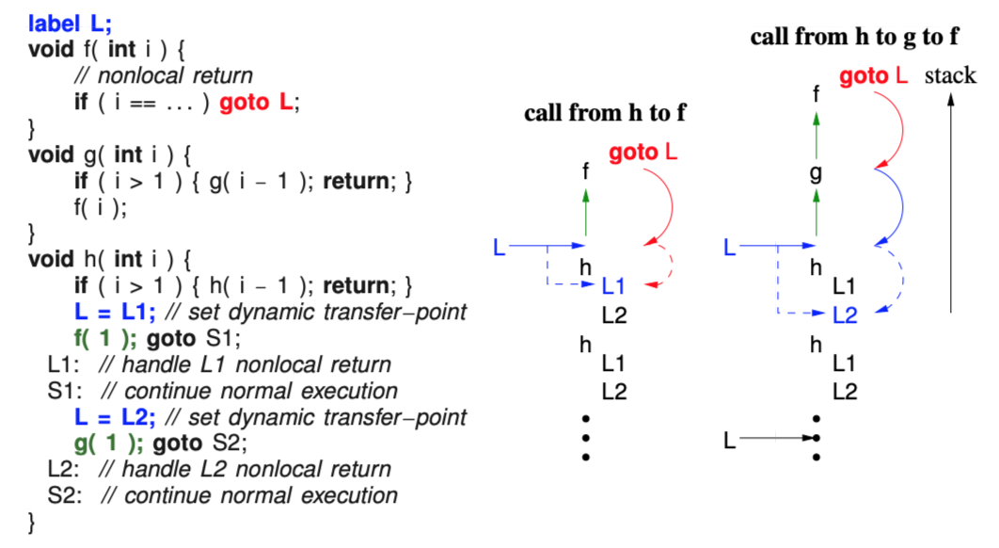
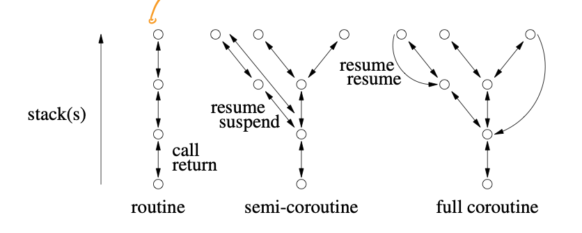

> Professor Peter Buhr, Winter 2018

These notes are incomplete and only cover pre-midterm content.
{:.warning}

## 1. Advanced Control Flow

- Use breaks and while to avoid flag variables, flag variables are basically gotos since they can be set/reset/tested at arbitrary points in a program

- Don't do things like

  ```
  for (;;) {
      s1
      if(c1) {
          s2 // s2 is loop body, no relation to c1
      } else {
          break; // should just break on !c1
      }
  }
  ```

#### 1.1 Static multi-level exits

- static multilevel exit: exit multiple control structures where exit points are known at compile time
- should label all exits if syntax allows i.e. `L1: if(...) {... break L1 ...}`
- breaks are gotos with 2 limitiations:

  - cannot loop
  - cannot branch into a control structure

- only use gotos as breaks and continues

#### 1.2 Dynamic Memory Allocation

- use the stack, you don't need to manage storage and it's more efficient than heap
- you need to use the heap only when
  - variable's storage must outlive the block it's allocated in
  - when the amount of data that needs to be stored is unkown
  - when an array of objects must be initialized via the object's constructor
  - when large local variables are allocated on a small stack (since having a large stack that fits the variable would waste space and dynamic stack growth is complicated)

## 2. Dynamic Multi-level Exit

- modularization: contiguous code block that can be factored into a helper method

- Sometimes we can't modularize code blocks with multi-levle exits into routines because they use labels that have scope outside of the routine

- dynamic multi-level exit: allows nonlocal transfers (jump to any statement, rather than the statement right after the call as with normal return transfer, or to some statement NOT after the call as in exceptional return transfer)

  In the example below, we use a label `L` in order the skip over g when `goto L` is called in f to return to `L = L2` set in h. This automatically causes g to terminate as well as f.

  

- label variable in nonlocal transfer contains:

  - pointer to a block activation on the stack (used in recursion)
  - transfer point with in the block (set as the line `L = L2`)

- nonlocal transfer is possible in C using:
  - `jmp_buf` to declare a label
  - `set_buf` to set a label
  - `longjump` to goto a label variable
- nonlocal transfer is too general, like goto

#### 2.1 Traditional approaches

- return code: return value indiciating normal or exceptional execution e.g. printf()
- status flag: set shared global variable indicating normal or exceptional execution e.g. errno in UNIX
- fix-up routine: global and/or local routine passed in to use in case of exception
- return union: mimics normal return type but actually has a return code inside of it sometimes instead of a result e.g. return an optional that the caller can check with holds_alternative
- drawbacks of traditional approaches
  - Checking return code or status flag is optional
  - Return code mixes exceptional and normal values, makes type larger than it should be
  - Testing return code or status flag is often done inline, makes code difficult to read and sometimes you can't handle an error yourself at all (e.g. if you're a library)
  - Status flag can be overwritten before being examine, can't use it in concurrent environments
  - local fix-up routine increases the number of parameters, thus increasing the cost of each call and requiring passing through multiple levels even if only one routine needs it
  - global fix-up routines can't be used in concurrent environments
  - return codes are flags, they're ugly to use rather than dynamic multi-level exits

#### 2.2 Exception Handling

- exceptional event: error event known to exist but isn't relevant to the algorithm, i.e. they're not errors with the algorithm
- exception handling mechanism (EHM): handle exception using control flow

#### 2.3 Execution Environment

- EHM has to handle `finally` clauses, which always execute regardless of exception
- EHM has to handle object destructors, which always execute regardless of exception
- If there are multiple stacks, EHM has to find the correct handler on one of the stacks
- EHM has to handle errors thrown by different coroutines

#### 2.4 Terminology

- execution: where an exception can be raised i.e. any entity with a runtime stack
- exception type: kind of exception
- exception: instance of an exception type
- raise: throw, creates an exception
- source execution: execution creating exception
- faulting execution: execution handling exception
- local exception: exception where source and faulting are the same
- nonlocal exception: exception where source and faulting are not the same (delivery of error to faulting necessary)
- concurrent exception: nonlocal exception where source and faulting are executing concurrently
- propagation: directs control from a raise in the source to a handler in the faulting
- propagation mechanism: rules used to locate a handler:
  - predence to handlers higher in the call stack
- handler: inline routine responsible for handling raised exception, matches one or more exception types, can return/reraise/raise new
- guarded block: block of code with associated handlers e.g. try catch
- ungarded block: block of code with no handlers

- termination: control cannot return to the raise point
- stack unwinding: all blocks on faulting stack from the raise block to the handling block are terminated
- resumption: control returns to the raise point i.e. no stack unwinding

#### 2.5 Static/Dynamic Call/Return

- static call: compile time lookup of routine/exception name
- dynamic call: runtime lookup of routine/exception name
- static return: after a routine/hander completes, it returns to its static definition
- dynamic return: after a routine/handler completes, it returns to its dynamic call context
- 4 possible combinations:
  - static call, static return: sequel
  - static call, dynamic return: routine
  - dynamic call, static return: termination exception (i.e. exception raised without resumption)
  - dynamic call, dynamic return: routine pointer, virtual routine, resumption

#### 2.6 Static Propagation (Sequel)

- sequel: routine with no return value where control returns to the **end** of the block in which the sequel was declared, equivalent to breaking to a label, static call + static return

```c++
// label A:
for(;;) {
    sequel S1(...) {...}
    void M1(...) { // modularization of if(...) break A;
    	...
        if(...) S1(...); // like writing if(...) break A;
        ...
    }
    // label B
    for(;;) {
    	sequel S2(...) {...}
        C: for(;;) {
            M1(...);
            if(...) S2(...); // like writing break B
            if(...) break C;
        } // break C comes out here
    } // end of block in which S2 is defined, therefore S2(...) comes out here
} // end of block in which S1 is defined, therefore M1() comes out here
```

- sequel makes it possible to modularize code with static exits
- sequel causes stack unwinding, since loops have scope and can declare variables
- advantages of sequel:
  - returning to sequel is efficient since handler is statically known
- disadvantages of sequel:
  - cannot be used in library code since sequel defined in user code is not visible inside library code

#### 2.7 Dynamic Propagation

- dynamic propagation is another name for dynamic call + static return (termination exception)
- advantages of dynamic propagation:
  - works for separately compiler programs
- disadvantages of dynamic propagation:
  - have to lookup handler at runtime

##### 2.7.1 Termination

- 3 termination forms after non-recoverable exception:

  - nonlocal transfer: goto handler

  - terminate: limited transfer

    ```c++
    struct E {} // label
    void f(...) {
        ... throw E(); ...
    }
    int main() {
        try { // declare sequel
            f(...);
        } catch(E) {...}
        // Finding this catch(E) handler is dynamic call
        // Return from this handler goes to after try, like a sequel, so it's a static return
    }
    ```

  - retry: terminate everything, then restart the guarded block which caught the exception (can simulate with a while true around a try catch)

##### 2.7.2 Resumption

- resumption: dynamic call (call to handler) + dynamic return (return to line right after raise), so the handler acts like a fix-up

#### 2.12 Inherited Members

- Exception is a type, exceptions are objects (construct them before you throw them!)
- Exceptions in C++ do object slicing (i.e. if passed a child class as a parent class, you can only throw the child as the parent), but uC++ doesn't

#### 2.13 Handler

- In uC++, order your \_CatchResume clauses before your catch clauses
- If you have a `catch(...)` or a `_CatchResume(...)` put it at the end of your `catch` or your `_CatchResume` clauses respectively
- Resumption handlers can access variables in their local scope because they have a lexical link to the block they were declared in
- Resumption handlers can't break/continue (static return)
- When a resume exception propagates without a handler, the defaultResume handler is invoked, which does a throw on the exception instead

## 3. Coroutine

- coroutine: routine that can be suspended at some point and resumed from that point

- coroutine state:
  - execution location: current point of execution of a coroutine
  - execution state: coroutine stack, allows for calls to routines defined inside coroutine and variables
  - execution status: active or inactive or terminated
- coroutines handle problems that need to retain state between calls e.g. finite state machine, device driver receiving input stream
- semi-coroutine: implcitly reactivate coroutine that activated it via suspend
- full-coroutine: coroutine A explicitly activating coroutine B through a member of B, which then activates coroutine A again at some point (cycle)

#### 3.1 Semi-coroutine

- coroutines are classes that replace internal state with execution flow and allow multiple coroutines to run at a time

  ```c++
  _Coroutine Fibonacci {
      int fn; // communication variable
      void main() {
          int fn1, fn2;
          fn = 0; fn1 = fn;
          suspend();
          fn = 1; fn2 = fn ; fn1 = fn;
          suspend();
          for(;;) {
              fn = fn1 + fn2;
              fn2 = fn1;
              fn1 = fn;
              suspend();
          }
      }
      public:
      int next() {
          resume();
          return fn;
      }
  }
  ```

- coroutine becomes an object on first resume, coroutine becomes an object when main ends

- coroutine main is usually private or protected so that others only interact with the coroutine through its interface members, so suspend/resume() must be protected as well

- when deleted, a coroutine's stack is always unwound and any destructors are executed to prevent memory leaks

- we can put a resume() in the coroutine's constructor to initialize it

- coroutine stack does not grow, so you may have to adjust the stack size through the constructor or call `verify()` to check for stack overflow

- EX: Iterator to return every element of a binary tree in order

  ```c++
  template<typename T> class Btree {
      struct Node {...};
      public:
      _Coroutine Iterator {
          Node *cursor;
          void walk(Node *node) {
              if(node == nullptr) return;
              // If the node is a leaf, return it
              if(node -> left == nullptry && node -> right == nullptr) {
                  cursor = node;
                  suspend()
              } else {
                  // recurse using coroutine stack!
                  walk(node -> left);
                  walk(node -> right);
              }
          }
          void main() {
              walk(cursor);
       		cursor = nullptr;
          } // last action is a suspend that resumes the coroutine's starter()
          public:
          Iterator(Btree<T> &btree) : cursor(&btree.root) {}
          T *next() {
              resume();
              return cursor;
          }
      }
  }
  ```

- EX: Device driver that parses messages between STX and ETX pairs and then checks a final 2 byte CRC. If there's an ESC before an ETX, don't count it as an ETX.

  ```c++
  _Coroutine DeviceDriver {
      enum { STX = '\002', ESC = '\033', ETX = '\003' }
      unsigned char byte;
      unsigned char *msg;
      public:
      DeviceDriver(unsigned char *msg) : msg(msg) { resume(); }
      void next(unsigned char b) {
          byte = b;
          resume();
      }
      private:
      void main() {
          // usable for multiple messages
          msg: for(;;) {
              int length = 0, checkval;
              // find STX
              do {
                  suspend();
              } while (byte != STX);
              eom: for(;;) {
                  suspend();
                  switch (byte) {
                      case STX:
                          ... // protocol error
                          continue msg; // start looking for new STX
                      case ETX:
                     		break eom;
                      case ESC:
                          suspend();
                          break;
                  } // end switch
                  if(length >= 64) {
                      ... // buffer full, length error
                      continue msg; // start looking for new STX
                  } // end if
                  msg[length] = byte;
                  length++;
              } // end eom for
              suspend();
              checkval = byte;
              suspend();
              checkval = (checkval << 8) | byte;
              if(!crc(msg, length, checkval)) {
                  ... // handle CRC error
              }
          } // end msg for
      } // end main
  } // end DeviceDriver
  ```

- EX: Producer consumer (modified with exceptions, a concept from 3.2 and also it's a full coroutine)

  ```c++
  _Event Stop {}; // replaces bool done flag in Consumer
  _Coroutine Cons {
      Prod &p;
      int p1, p2, status = 0;
      void main() {
          // Count up total amount of money consumer has paid
          int money = 1, receipt;
          try {
              cout << "cons " << p1 << " " << p2;
              status += 1; // pass arbitrary message between producer and consumer
              receipt = p.payment(money); // suspend to get next items
              cout << " paid $" << money << endl;
              money += 1;
              // Ensure that previous transaction is finished before we end
              _Enable {}
          } catch(Stop) {}
          cout << "cons stops" << endl;
      }
      public:
      Cons(Prod &p) : p(p) {}
      int delivery(int p1, int p2) {
          this -> p1 = p1; this -> p2 = p2;
          resume(); // activate Consumer main
          return status;
      }
  }

  _Coroutine Prod {
      Cons &c;
      // Count up total amount of money producer has received
      int N, money, receipt = 0;
      void main() {
          // Produce N times
          for(int i = 0; i < N; i++) {
              // Produce p1, p2
              int p1 = rand() % 100;
              int p2 = rand() % 100;
              cout "prod " << p1 << " " << p2 << endl;
              // Resume Consumer so it can receive p1 and p2
              int status = c.delivery(p1, p2);
              cout << "prod received $" << money << " stat " << status << endl;
              receipt += 1;
          }
          _Resume Stop() at resumer();
          suspend();
          cout << "prod stops" << endl;
      }
      public:
      Prod(Cons &c) : c(c) {}
      int payment(int money) {
          this -> money = money;
          resume();
          return receipt; // The first thing a consumer does when it wakes up is pick up its receipt
      }
      void start(int N, Con &c) {
          this -> c = c;
          this -> N = N;
          resume();
      }
  }
  ```

#### 3.2 Nonlocal Exceptions

- nonlocal exceptions are raised using `_Resume ... _At ...`
- To catch nonlocal excpetions, you need an `_Enable {} ` block for all exceptions or a`_Enable <E1><E2> {}` block for E1, E2 only
- `_Disable {}` blocks are allowed within enable blocks and vice versa
- Once you've raised an exception at a coroutine, you should suspend back to it or call a member on it which does a `resume()`
- Multiple nonlocal exceptions are queued and delivered in FIFO order
- When a coroutine doesn't handle an exception, it terminates and then throws an `UnhandledException` at its last resumer. `UnhandledException` is always enabled

#### 3.3 Full Coroutines

- Each circle below is a method call

  

- resume(): make the currently executing coroutine inactive and make whatever the `this` variable refers to active

- suspend(): make the currently executing coroutine inactive and make whatever the lastResumer is active

- Exception: last resumer is not changed when you're resuming to yourself because that's not useful

- 3 phases to full coroutine program

  1. Starting the cycle (pairing everybody up requires a special case to close the cycle due to mutually recursive references)
  2. Executing the cylce
  3. Stopping the cycle (returning to main)

- EX: Pingpong

  ```c++
  _Coroutine PingPong {
      const char *name;
      const unsigned int N;
      PingPong *partner;
      void main() {
          for(unsigned int i = 0; i < N; i += 1) {
              cout << name << endl;
              partner -> cycle();
          }
      }
      public:
      PingPong(const char *name, unsigned int N, PingPong &partner)
      	: name(name), N(N), partner(&partner) {}
      PingPong(const char *name, unsigned int N) : name(N), N(N) {}
      void cycle() { resume(); };
      void partner(PingPong &partner) {
          this -> partner = partner;
          resume();
      }
  }

  int main() {
      enum { N = 20 };
      PingPong ping("ping", N), pong("pong", N, ping);
      // Ping will end first because it started first and resume to main
      ping.partner(pong);
      // Main ends with ping terminated and pong unterminated
  }
  ```

- A semi-coroutine never calls resume() in somebody else's method

#### 3.4 Coroutine Languages

- Coroutine implementations can be stackless (can't call other routines) or stackful
- `yield v` means I suspend and return you `v`
- `(yield)` means I suspend and you need to pass me a new value using `send(v)`
- You can do generators/iterators in a stackless coroutine with yield
- Simula, CLU, C#, Ruby, Python, JavaScript, Lua, F#, Boost all support yield

- Python has stackless semi-coroutines which are routines instead of instances of a class (but you refer to an "instance" of a routine with dot notation in python)
- C++ Boost Library has stackful, semi/full coroutines

## Exceptions

#### 4.4 Exception List

- exception list: the list of exceptions that a routine might through
  - allows for static detection of no handler for exception (Java) or runtime detection where the exception can be converted into a special failure exception (C++)
- Determining exception lists is hard because:
  - if you have a routine for some template class T, you'd have to list all exceptions possible for all classes T
  - if you're passed some routine pointer, you have to list all exceptions possible for all routines
  - if your parent says that this method doesn't throw exceptions, you can't override the method and say it throws exceptions
  - concurrent programs can throw any exceptions at any time

#### 4.5 Destructor

- You can't raise exceptions in a destructor if there's already exception propagation happening (check this with `uncaught_exception()`)
  - Suppose you raise an exception on x, which causes x to unwind and it's destructor to be called. If x's destructor raises an exception, then you can't start the second exception without finding a handler to deal with the first exception because the second exception might remove the handlers for the first

#### 4.6 Implementation

- Approach 1:

  - associate a label variable with each exception type
  - set label variable on entry to each guarded block with handler for the type
  - reset label variable on exit to previous value

  For termination, you can't just call the handler because you have to go through and destruct everybody first. But for resumption, you can do it.

- Approach 1 is expensive because setting/resetting label variables is expensive

- Approach 2:

  - Store catch/destructor data externally for each block and then do a linear search for a handler along the stack

- Approach 2 has 0 cost on entering try-catch but is expensive on raise

## Concurrency

- thread: path of execution
- process: thread + state information e.g. stack
- task: lightweight process i.e. shares memory with other tasks, therefore can pass pointer between tasks
- thread < task < process
- parallel execution: 2 or more operations occur simultaneously, only possible with 1 or more CPUs
- concurrent execution: 2 or more operations appear to be performed in parallel, therefore possible with 1 CPU

#### 5.3 Concurrent hardware

- Tasks can context switch at non-deterministic program locations due to preemptive scheduling

#### 5.5 Threading Model

- threading model: maps threads to CPUs by mapping threads to kernel threads (virtual processors) that are scheduled across the CPUs
- a process can own multiple kernel threads to provide parallelism within the process
- a program may schedule user threads on the kernel thread
- user:kernal:CPU mappings:
  - kernal threading (1:1:C): 1 user thread maps to 1 kernel thread
  - generalized kernel threading (M:M:C): create M threads, each of which map 1:1 between user and kernel
  - user threading (N:1:C): N user threads map to 1 kernel thread (no parallelism)
  - user threading (N:M:C) N user threads map to M kernel threads
- You can add nano threads on top of user threads and virtual machine above OS

#### 5.6 Concurrent Systems

- concurrent system types:
  - discover concurrency in otherwise sequential program
  - provide concurrency through implicit constructs
  - provide concurreny through explicit constructs

#### 5.7 Speedup

- program speedup $S_C = T_1 / T_C$ where $C$ is the number of CPUs, $T_1$ is the number of newly concurrent instructions, $T_C$ is the time it taks $C$ CPUs to execute 1 instruction
- Aspects affecting speedup
  - amount of concurrency
  - critical (slowest) path among concurrency (due to dependencies between threads)
  - scheduler efficiency (starvation possible)
- Amdahl's Law: maximum speedup $S_C = \frac{1}{(1 - P) + P/C}$, where P is the concurrent section of the program, and we're using C CPUs

#### 5.8 Concurrency

- implicit concurrency:

  COBEGIN

- explicit concurrency:

  START/WAIT

#### 5.20 Hardware Solutions

- if we have an atomic read and write, we solve a lot of critical section problems
