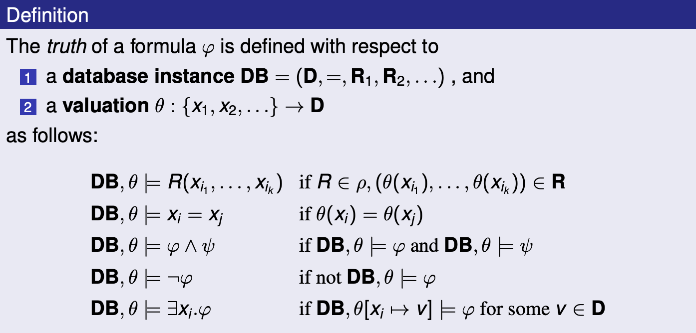
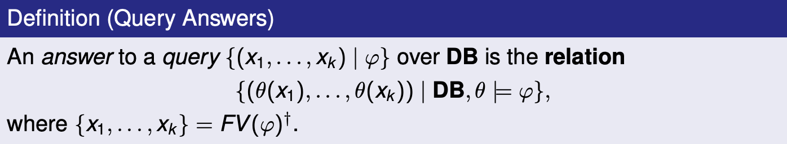
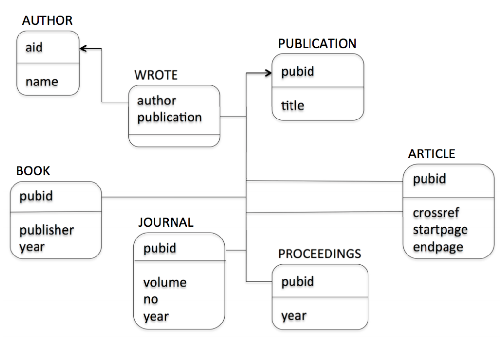
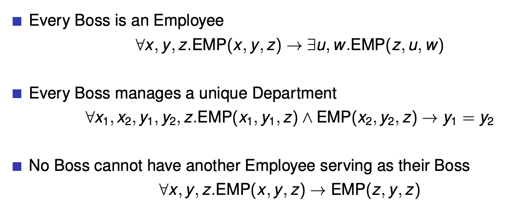
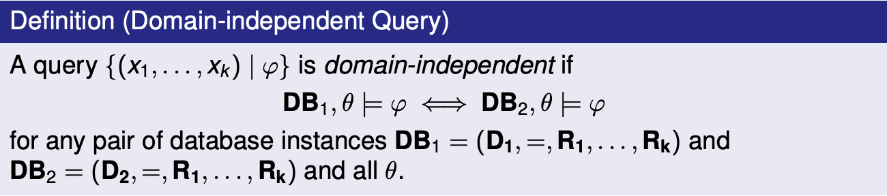
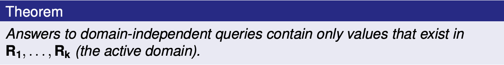
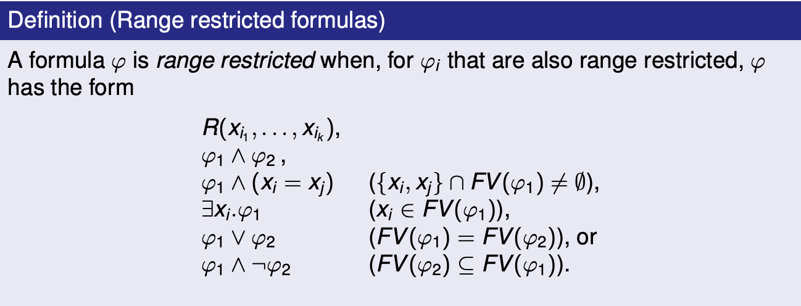
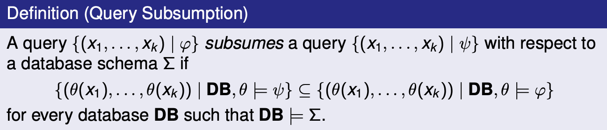

## Overview of Data Management

**data:** formalized representation of information about some entity (e.g. a person)

#### History of Data Management

1. **Magnetic tapes:** Every program only uses 1 tape at a time, so programs cannot manage the same data at the same time. Data set 1, 2, and 3 are duplicates.

2. **File management:** Multiple programs can use the system file I/O to access the same file data at the same time. Concurrent reads can happen, concurrent writes can't.

3. **Hierarchical data model:** IBM's IMS organizes data in a tree structure, allows concurrent access

4. **Network data model:** Bachman's IDS organizes data as sets of records, pointers between records represent relationships

5. **Relational data model:** Proposed by Codd in 1970, Entity-Relationship model proposed by Chen in 1976, implemented by IBM system R and UC Berkeley's Ingres systems in late 1970s

   In the 1980s, commercial relational technology is developed and SQL is standardized. We start to see object oriented databases. In the 1990s, object oriented databases come to the relational model.

### Database defintions

**database:** large, persistent collection of data and metadata organized for retrieval and revision e.g. file cabinet, libaray system, inventory control system

**data model:** specifies what types of metadata/data can be stored and specifies how to query/modify data e.g. relational data model

**database management system (DBMS):** program that implements a data model e.g. SQL implements the relational data model.

The DBMS needs to have:

- A data model
- Access control
- Concurrency control
- Database recovery
- Database maintenance (e.g. revise schema within the bounds of the data model)

**schema:** definition of what metadata is stored for some use case of a data base e.g. EMP(ENO, ENAME, TITLE), PROJ(PNO, PNAME, BUDGET) is a schema for an employee records database

**instance:** collection of data stored according to some schema e.g. the EMP and PROJ tables

### Three Level Schema architecture

1. **External schema:** the view of the schema that users see (e.g. some tables may be restricted due to access control)
2. **Conceptual schema:** the full schema of the database
3. **Physical schema:** how the data is phyiscally persisted e.g. file mappings and storage algorithms

**data independence:** accessing data through an abstract data model rather than directly. On the _physical_ level, this means that applications will be immune to changes in storage structures. On the _logical_ level, this means that data can be stored and access in a modular, user defined way (i.e. payroll and inventory control apps can exist on the same database, accessing different tables).

**transaction:** some sequence of instructions provided to the DBMS. The DBMS must ensure that transactions are **ACID**; **A**tomic (transactions occur entirely or not at all), **C**onsistent (the database is the same in between transactions), **I**solated (concurrent transactions cannot interfere with each other), and **D**urable (once completed, a transaction is permanent)

**Data Definition Langauge (DDL):** language for specifying schemas at each level

**Data Manipulation Language (DML):** language for querying and modifying data.

The DML can be navigational, meaning we write a _procedure_ telling the database how to fetch the data.

```
get department with name='Sales'
get first employee in set department-employees
until end-of-set do {
  get next employee in set department-employees
  process employee
}
```

The DML can also be non-navigational, meaning we write a _declaration_ of what we would like to fetch from a database e.g. SQL

```sql
select * from employee
	left join department on employee.department_code = department.code
	where department.name = 'Sales'
```

Database users: end user, application developer, database administrator

## Relational Model

Set comprehension syntax: all k-tuples that satisfy some condition.

$$
\{ (x_1, x_2, \dots, x_k) \mid <\text{condition} >\}
$$

Imagine we have an infinite table `PLUS` with columns x, y and sum, where x + y = sum for every record. We can express all pairs of natural numbers that add to 5 as the following:

$$
\{ (x, y) \mid \text{PLUS}(x, y, 5) \}
$$

All pairs of numbers that add to the same number they subtract to:

$$
\{ (x, y) \mid \exists z \cdot \text{PLUS}(x, y, z) \and \text{PLUS}(x, -y, z)\}
$$

Imagine we have an employee table `EMP(name, dept, boss)`.

All employees that work for "Bob":

$$
\{ (x, y) \mid \text{EMP}(x, y, \text{Bob})\}
$$

All pairs of employees working for the same boss. Each pair must be distinct and contain 2 different employees i.e. no (Sue, Bob) and (Bob, Sue), no (Sue, Sue).

$$
\{ (x_1, x_2) \mid \exists y_1, y_2, z \cdot
	\text{EMP}(x_1, y_1, z) \and \text{EMP}(x_2, y_2, z)
		\and x_1 < x_2
\}
$$

All employees who are their own bosses:

$$
\{ (x) \mid
	\exists y \cdot \text{EMP}(x, y, x)\}
$$

**Relational model** components:

- **Universe:** a set $D$, with equality defined on its elements
  - **Relation:** a predicate name $R$ with arity k (k is the number of columns). An instance of a relation is a table e.g. `PLUS`, `TIMES`. Columns are labelled by identifiers called attributes e.g. x, y in `PLUS`.
- **Database:** a finite set $p$ of predicate names, $p = (R_1, R_2, \dots, R_n)$. An instance of a database is a set of tables e.g. DB = (Z (integers), equals operation, `PLUS`, `TIMES`)

A relation is a predicate because we assume the database contains all data. Therefore if a relationship is in a relation/table, it is true and if it is absent it is false e.g. John is an author with ID 1 because $(1, John) \in \text{AUTHOR}$, and John has not written "Trans. Databases" because $(1, 3) \notin \text{WROTE}$.

Using first order logic and relations in condition $\varphi$:

$$
\varphi := R_i(x_i, \dots, x_k) \mid x_i = x_j \mid \varphi \and \varphi
				\mid \exists x_i \cdot \varphi \mid \varphi \or \varphi
            \mid \neg \varphi
$$

A valuation is a function $\theta$ that maps free variables $x_1, x_2, \dots$ to values $v_1, v_2, \dots$ in the universe e.g. $\theta[x_i \rightarrow v_i ]$ e.g. `EMP`, $\{x \rightarrow \text{Sue} \}$ is the mapping in `EMP` where the employee name is Sue. Queries are answered by results from a valuation that satisfy a given condition.

All syntax for conditions:






#### Query examples

1. Over numbers:

   1. List all composite numbers
   2. List all prime numbers

2. Over bibliography database:

   

   1. List titles of all publications

      $$
      \{ (t) \mid
      	\exists p \cdot \text{PUB}(p, t)\}
      $$

   2. List titles of all books

   3. List all publications without authors

   4. List pairs of coauthor names

      $$
      \{ (an1, an2) \mid
      	\exists aid_1, aid_2, p \cdot
      	\text{AUTHOR}(aid_1, an1) \and \text{AUTHOR}(aid_2, an2) \\
      	\and aid_1 < aid_2
          \and \text{WROTE}(aid_1, p) \and \text{WROTE}(aid_2, p)
      \}
      $$

   5. List titles of publications written by a single author
      $$
      \begin{align}
      \{ (t) \mid
      	\exists p &\cdot \text{PUB}(p, t) \\
      	&\begin{aligned}
      	  \and \exists a &\cdot (\text{WROTE}(a, p) \\
      			& \and \neg \exists a_2 \cdot \text{WROTE}(a_2, p) \and a_2 \ne a \\) \}  \end{aligned}
      \end{align}
      $$

**integrity constraints:** yes/no conditions (first order forumlas) that must be true in every valid database instance

Examples of integrity constraints:



There are many kinds of constraints: typing, domain, uniqueness of values/ID, referential integrity, foreign keys etc.

A **relational database schema** is a signature $p$ and a set of integity constraints $\Sigma$ over $p$.

Views are answers to queries that can themselves be queried. They're like a specific view of the database created by a query.





Safe queries are both domain independent and occur over a finite database. Examples of unsafe queries:




A query being range restricted implies that it is domain independent. Every domain independent query can be written as a range restricted query.



We use query subsumption for simplifying queries, since we can replace a query A with a query B which subsumes A. Given any queries A, B it is generally undecidable to write an algorithm which would compute whether B subsumes A.

Because relational calculus is not Turing complete, there are computable queries that it cannot express. These include: ordering, arithmetic, string operations, counting/aggregation, reachability/connectivitiy etc.

We can extend the relational model to account for incompleteness/inconsistency by allowing for:

- tuples with null values
- incomplete relations and open world assumption
- conflicting information from different data sources

## Introduction to SQL - The Good Parts

There are 3 major parts of SQL:

- DML for query and update, also embedded SQL and ODBC for application development
- DDL for defining schema for relations
- DCL (Data Control Language) for access control

SQL data types:

```sql
integer -- integer (32 bit)
smallint -- integer (16 bit)
decimal(m,n) -- fixed decimal, m total digits with precision of n
float -- IEEE float (32 bit)
char(n) -- character string (length n)
varchar(n) -- variable length string (at most n)
date -- year/month/day
time -- hh:mm:ss.ss
```

SQL is not case sensitive.

### Examples

The bibliography database in SQL:

```sql
AUTHOR(aid integer, name char(20))
WROTE(author integer, publication char(8))
PUBLICATION(pubid char(8), title char(70))
BOOK(pubid char(8), publisher char(50), year integer)
JOURNAL(pubid char(8), volume integer, no integer, year integer)
PROCEEDINGS(pubid char(8), year integer)
ARTICLE(pubid char(8), crossref char(8), startpage integer, endpage integer)
```

> List all authors in database.

```sql
select distinct * from author
```

`R [as] p` in SQL stands for $R(p.a_1, p.a_2, \dots, p.a_n)$ in RC, where $a_1, \dots, a_n$ are attribute names declared for $R$. We call p a _corelation_ because it's a variable that appears in the $R$ tuple.

> List all publications with at least 2 authors.

```sql
select distinct r1.publication
	from wrote r1, wrote r2
		where r1.publication = r2.publication
				and r1.author != r2.author
```

> List titles of all books.

```sql
select distinct title
	from publication, book
		where publication.pubid = book.pubid
```

Notice that `publication` is a corelation because we're doing `publication.pubid` with it, but it's also the name of the publication relation. So, relation names can serve as corelations when the name is unambiguous.

> For every article list the number of pages.

```sql
select distinct pubid, endpage - startpage + 1 from article
```

> For every article list the number of pages, and name the resulting attributes

```sql
select distinct pubid as id, endpage - startpage + 1 as numberofpages from article
```

The `where <condition>` clause accepts atomic conditions that have:

- `<>, !=` as not equal, `=` as equal, `>, <=, >, >=` as less than, less than or equal, greater than, greater than or equal to

> Find all journals printed since 1997

```sql
select * from journal where year >= 1997
```

> Find all articles with more than 20 pages

```sql
select * from article where endpage - startpage + 1 > 20
```

Atomic conditions can be combined using boolean connectives (`AND, OR, NOT`).

> List all publications with at least 2 authors

```sql
select distinct from w1.publication from wrote w1, wrote w2
where w1.publication = w2.publication and not w1.author = w2.author
```

Results of `select` blocks are relations, so we can apply set operations (`UNION, EXCEPT, INTERSECT`) on them when they have the same number and types of attributes. Notice, `OR` doesn't return any results when one of the sets it's operating on has no elements, so it's not the same as `UNION`.

> List all publication ids for books or journals.

```sql
(select distinct pubid from book) union (select distinct pubid from journal)
```

> List all publication ids except those for articles

```sql
(select distinct pubid from publication) except (select distinct pubid from article)
```

Subqueries are `select` blocks used as arguments. We can name them using `with`, or just use them inline as unnamed arguments for `from`, `union`, etc.

> List all publications for books or journals

```sql
with bookorjournal(pubid) as
	(
        (select distinct pubid from book) union (select distinct pubid from journal)
    )
select distinct title
from publication, bookorjournal
where publication.pubid = bookorjournal.pubid
```

> List all publication titles for journals or books

```sql
select distinct title from publication, (
	(select distinct pubid from journal) union (select distinct pubid from book)
) as bookorjournal where publication.id = bookorjournal.pubid
```

First Order SQL covers all of relational calculus, and is efficient (PTIME, LOGSPACE). However, some queries are hard to write, there's no aggregation (e.g. grouping, count, sum, max, min), and there's no recursion (e.g. is there a friend of mine who's name is Mark, if all of my friends' friends are also my friends?).

More things we can put in the `where` condition:

- `<attr> in ( <query> )`, `<attr> not in ( <query> )`
- `<attr> <op> some ( <query> )`, `<attr> <op> all ( <query> )`, where op is one of `<>, !=, =, <, <=` etc.
- `exists ( <query> )`, `not exists ( <query> )`

To use `in, not in, some, all`, your query must only return one thing.

> List all titles for articles.

```sql
select distinct title from publication where pubid in (select pubid from article)
```

> List all author-publication ids for all publications except books or journals

```sql
select * from wrote where publication not in (
	( select pubid from book )
	union
	( select pubid from journal )
)
```

```sql
select * from wrote
where publication not in (
	select pubid from book
) and not in (
	select pubid from journal
)
```

> Find the longest articles (a way expressing max):

```sql
select distinct pubid from article where endpage - startpage >= all (
	select article.endpage - article.startpage from article
)
```

A parametric subquery can mention attributes defined in the main query it is used in. Attributes in a subquery only have scope of the subquery.

> List all publications with at least 2 authors.

```sql
select * from wrote r where exists (
	select * from wrote s where
		s.publication = r.publication and s.author <> r.author
)
```

```sql
select * from wrote r where publication in (
	select publication from wrote s where s.author <> r.author
)
```

> List all publications with only 1 author

```sql
select * from wrote r where exists (
	select * from wrote s where
		s.publication = r.publication and s.author <> r.author
)
```

> List all authors who always publish with someone else.

```sql
select distinct a1.name from author a1, author a2
where not exists (
    select * from publication p, wrote w1
    where p.pubid = q1.publication and a1.aid = w2.author
    	and a2.aid not in (
            select author from wrote publication = p.pubid
            	and author <> a1.aid
        )
)
```

### Modifying a DB

`insert into <R> values (<v1, v2, v3, ... vk>)`, or `insert into <R> ( query )`

> Add a new author

```sql
insert into author values(4, 'JK Rowling', 'hp.com')
```

> Add a new author without looking up author id

```sql
insert into author (
	select max(aid) + 1, 'JK Rowling', 'hp.com' from author
)
```

`delete from <R> where <condition>`

> Delete all publications that are not articles or the collections an article appears in

```sql
delete from publication
where pubid not in (
	select pubid from article
) and pubid not in (
	select crossref from article
)
```

`update r set <attribute = value> where <condition> `

> Update the author Toman to a have a new url of `pokemon.com`

```sql
update author
set url = 'pokemon.com'
where aid in (
	select aid from author
	where name like 'Toman%' -- % is a wildcard
)
```

Database transactions continue until `commit` (make changes permanent) or `rollback` (revert changes).

### Aggregation

`select <x1, x2 ... xk, agg1, ... aggn> from <query> group by <x1, x2, ... xk> `

Any `xi` not being used in some aggregate function `aggi` must appear in the group by. `aggi` can be `count(*), count(<expr>), sum(<expr>), min(<expr>), max(<expr>), avg(<expr>)`.

> For each publication, count the number of authors.

```sql
select publication, count(author) from wrote
group by publication
```

> For each author, count the number of article pages

```sql
select author, sum(endpage - startpage + 1) as pgs from wrote, left join article
where publication = pubid
group by author
```

`having` is `where` for aggregate values.

> List publications with exactly 1 author

```sql
select publication, count(author) from wrote
group by publication
having count(author) = 1
```

> For every author count the number of books and articles

```sql
select distinct aid, name, count(publication)
from author, (
	( select distinct author, publication
		from wrote, book
		where publication = pubid )
	union all
	( select distinct author, publication
		from wrote, article
		where publication = pubid )
) as ba where ba.author = aid
group by name, aid
```

## Normalization Theory

- Anomalies are caused by integrity constraints, and are repaired by schema decompositions

- Change anomalies:

  - update: one or more records in the database are updated, but not all
  - deletion: deletion of a record results in removal of all information about some entity
  - insertion: even if you only have information about 1 attribute of a relation, you have to update the table with information on all attributes

- If X determines Y then every X has at most 1 Y e.g. each course has only 1 teacher

- If X multivalue determines Y then every X has at most N Ys e.g. each course has some class times

- Armstrong's axioms

  - completeness: Anything in F+ can be be derived from F
  - soundness: Any FD derived from F is in F+

- superkey: key K $\subseteq$ R s.t. K determines R

- candidate key: minimal superkey

- primary key: candidate key chosen by DBA

- If X determines Y, then Y is in Compute(X+). We find X+ by looking at every functional dependency of X contained in a given set F, and adding its right sides to X+ if the left side exists in X. We do this until there are no more FDs in F that are eligible.

- decomposition: $R_1$, $R_2$, ... $R_n$, such that the union of the $R_i$'s is R

- loseless decomposition: the intersection of the decomposition determines some element of the decomposition e.g. $R_1\cap R_2$ determines either $R_1$ or $R_2$.

- dependency preserving decomposition: testing FDs in F on the decomposition doesn't require joins between the tables

- BCNF decomposition: For all X determines Y in F+ where X, Y is in some $R_i$, either X determines Y is trivial or X is a superkey of $R_i$

- Computing BCNF decomposition:

  ```
  // Lossless
  Given R, F:
  set result = {}
  // Not efficient, depends on order in which FDs in F+ are examined
  while there is X -> Y in F+ s.t. X is not a superkey of R and X -> Y not trivial
  	R -= Y - X // removes results of X from R
  	result += (XY) // XY becomes an element of the decomp
  return result
  ```

- 3rd Normal form: For all X determines Y in F+ where X, Y is in some $R_i$, either X determines Y is trivial or X is a superkey for $R_i$ or $Y - X$ is contained in a candidate key for $R_i$

- Sometimes there are no lossless dependency preserving BCNFs.

  R = {A, B, C}, F = {AB -> C, C -> B} has possible decompositions

  None of these are dependency preserving due to AB -> C.

  1. R = {BA, BC}

     $R_1 \cap R_2 = B$, not lossless because B doesn't determine either BA or BC. BCNF because C -> B has C a superkey of BC, AB -> C doesn't apply to BA.

  2. R = {CA, CB}

     $R_1 \cap R_2 =C $, lossless because C determines CB. BCNF because C -> B has C a superkey of BC, AB -> C doesn't apply to CA.

  3. R = {AC, AB}. not lossless because A doens't determine AB or AC. BNCF because neither AB -> C nor C -> applies to AC or AB.

  > A 2 element decomposition in the form $R_i = AB$ is always BCNF.

- Minimal cover:

  - Every RHS is a single attribute
  - No X -> A can be removed from F
  - Every component of X is necessary (X is minimal)

- Computing minimal cover for F

  ```
  Given F:
  // Step 1, decomp every compound RHS
  for every X -> AB in F
  	replace X-> AB with X -> A and X -> B

  // Step 2,
  for every X -> A in F
  	if A in computeX+(X, F - (X -> Y)) // A is in X+
  		remove X -> A from F

  // Step 3
  for every X -> A in F
  	for every component A of X
  		Z = X - {A}
  		if A in computeX+(Z, F)
  			replace X -> A in F with Z -> A

  // Step 4
  for every X -> A, X -> B in F
  	replace X -> A, X -> B with X -> AB
  ```

- Computing a dependency preserving 3NF decomp: add each FD from minimal cover of F to the result (dependency preserving)

- Definition of 4th normal form is the same as BCNF except it tests MVDs instead of FDs

- 1st normal form: every attribute lies in a single valued domain

## Optimization

- **Clustering index** - tuples in the relation with similar values for A are stored together in the same block
- **Non-clustering** - Other indices that are not clustering indices (also called secondary indices)

- Equivalences
- Operator implementation

- Not computationally possible to find an optimal plan

##### Simple Cost Model for disk I/O

**Uniformity**: All possible values of an attribute are equally likely to appear in a relation

**Independence** - the likelihood that an attribute has a particular value does not depend on values of other attributes

### Join Order

- Try to order intermediate results
- Nested loop join's cost is not symmetric

### Pipelined Plans

- All operators (except sorting) operator without storing intermediate results
  - No recomputation for left-deep plans

### Temporary Store

- General pipelined plans lead to recomputation

- Introduce store operator
  - Store intermediate result in a relation
  - Build a hash index

### Hardware Parallelism

- Multiple mass storage units
- Relational operators amenable to parallel execution

## Concurrency

### ACID Requirements

**Atomicity** - all or nothing execution

**Consistency** - execution preserves database integrity

**Isolation** - transaction execute independently

**Durability** - update made by a committed transaction will not be lost of subsequent failure

#### Implementation of Transaction Depends on

- **Concurrency control** - transactions do not interfere

- **Recovery Management** - committed transactions are durable, aborted transactions have no effect on the database

### Serializable Schedules

- An execution is serializable if it is equivalent to a serial execution of the same transactions

### Conflict Equivalence

- Two operations conflict if they
  - Belong to different transactions
  - Access the same data item
  - At least one of them is a write operation

### Recoverable Schedules

1. $$T_j$$ reads a value $$T_i$$ has written
2. $$T_j$$ succeeds to commit
3. $$T_i$$ tries to abort

- In this situation we need to undo the effects of $$T_j$$ before we can abort $$T_i$$

- To avoid this, we should commit only in order of the read-from dependency

### Cascadeless Schedules

- Referring to the previous example, by aborting one transaction, it may lead to cascading aborts of many other transactions

- No reading of uncommitted data

### Get Serializable Schedule

- Operations that a scheduler can perform

  - Execute
  - Delay
  - Reject
  - Ignore

- Two main kinds of schedulers
  - **Conservative** - favours delaying operations
  - **Aggressive** - favours rejecting operations

### Two Phase Locking

- Transactions must have a lock on objects before access

- **Shared lock** - required to read an object

- **Exclusive lock** - required to write an object

- A transaction has to _acquire_ all locks before it _releases_ any of them

- **Theorem**: Two-phase locking guarantees that the produced transaction schedules serializable

**STRICT 2PL** - locks held till commit; guarantees ACA

### Deadlocks

- **Deadlock Prevention**

  - Locks granted only if they can't lead to a deadlock
  - Ordered data items and locks granted in this order

- **Deadlock Detection**
  - Wait for graphs and cycle detection
  - Resolution: the system aborts one of the offending transactions

### Different Locks

- **Multi-granularity locking**

  - Not all locked bojects have the same size
  - Advantageous in presence of bulk vs. tiny updates

- **Predicate locking**

  - Locks based on selecrtion predicate rather on a value

- **Tree locking**
  - Tries to avoid congestion in roots of B-trees
  - Allows relaxation of 2PL due to tree structure of data

### Inserts and Deletes

- Plain 2PL does not handle variable sets of data

- This is called the **phantom problem**

- **Solution**: operations that ask for all records have to lock against insertion/deletion of a qualifying record
  - Locks on tables
  - Index locks

### Isolation Levels

**Level 3** - serializability

    - Table-level strict 2PL

**Level 2** - repeatable read

    - Tuple-level strict 2PL

**Level 1** - cursor stability - Tuple-level exclusive-lock only strict 2PL - Reading the same object twice

**Level 0** - Neither read nor write locks are required - Transaction may read uncommitted updates

### Recovery: Goals and Setting

1. Allow transactions to be

   - Committed (with a guarantee that the effects are permanent)
   - Aborted (with a guarantee that the effects disappear)

2. Allow the database to be recovered to a consistent state in case on HW/power/... failure

### Approaches to Reovery

#### Shadowing

    - Copy-on-write and merge-on-commit approach
    - Poor clustering
    - Used in system R, but not modern systems

#### Logging

    - Use of LOG to avoid forced writes
    - Good utilization of buffers
    - Preserves original clusters

    - A **log** is a read/append only data structure
    - Transactions add logs records about what they do

- Log records
  - UNDO information
  - REDO information
  - BEGIN/COMMIT/ABORT

### Write-Ahead Logging (WAL)

- Make sure LOG is consistent with the main database

- Requires

  - **UNDO rule** - a log record for an update is written to log disk before the corresponding data is written to the main disk

  - **REDO rule** - all log records for a transaction are written to log disk before commit

## Database Tuning

- **Physical Design** - the process of selecting a physical schema (collection of data structures) to implement the conceptual schema

- **Tuning** - periodically adjusting the physical and/or conceptual schema of a working system to adapt to changing requirements and/or performance characteristics

### Workload

- **Workload Description**
  - The most important queries and their frequency
  - The most important updates and their frequency
  - The desired performance goal for each query or update

##### Example

- Query

  - which relations are accessed
  - which attribute are retrieved
  - which attributes occur in selection/join conditions? how selective is each condition

- Update
  - Type of update and relations/attributes affected
  - Which attributes occur in selection/join conditions? How selective is each condition

### Tuning

- Make a set of application execute as fast as possible

### Overheads

##### Table Scan

- e.g. SELECT blocks will require DBMS to search the blocks of the database to find a match
- Assuming not sorted, all blocks of the file must be scanned if the entry is not found

##### Creating Indexes

- Substantially reduce execution time for selection
- Increase execution for insertions
- Increase or decrease execute time for updates or deletions
- Increase required space

##### Clustering vs. Non-clustering Indexes

- relation may have at most one clustering index, and any number of non-clustering indices

##### Co-Clustering Relations

- Two relations are co-clustered if their tupes are interleaved within the same file

- Can speed up joins (particularly foreign key joins)
- Sequential scans of either relation become slower

##### Range Queries

- B-trees can help for range queries
  - Using forward pointers in the leaf blocks when finding the first qualifying entry

##### Multi-Attribute Indices

- It is possible to create an index on several attributes of the same relation

- e.g. `CREATE INDEX NamerIndex ON Employee(Lastname,Firstname)`

- order matters
- ordered first by Lastname, then Firstname

### More Complex Designs

##### Multi-Attribute Indices

- Complex search/join conditions
- Join indices
- Materialized views

##### Join indices

- Allow replacing joins by index looups

##### Materialized views

- Allow replacing subqueries by index lookups

### Physical Design Guidelines

1. Use index only if performance increase outweighs update overhead

2. Attributes mentioned in WHERE clauses are candidates for index search keys

3. Multi-attribute search keys should be considered when

   - A WHERE clause contains several conditions
   - Enables index-only plans

4. Choose indexes that benefit as many as queries as possible

5. Each relation can have at most one clustering theme; therefore choose it wisely

   - Target important queries that would benefit the most

     - Range queries benefit the most from clustering
     - Join queries benefit the most from co-clustering

   - A multi-attribute index that enables an index only plans does not benefit from being clustered

### Index Selection and Tools

- Convert physical design into another optimization problem

### Tuning Conceptual Design

- To avoid expensive operations in query execution
- Retrieve related data in fewer operations

##### Techniques

- Alternative normalization/weaker form
- Co-clustering of relations
- Vertical/horizontal partitioning of data
- Avoiding concurrency hot-spots

### Denormalization

- **Normalization** - the process of decomposing schema to reduce redundancy

- **Denormalization** - the process of merging schema to intentionally increase redundancy

- Redundancy increase update overhead but decreases query overhead

### Partitioning

- Splitting a table into multiple tables for the purpose of reducing I/O cost or lock contention

- **Horizontal Partitioning**

  - Each partition has all original columns and subset of original rows
  - Often used to separate operational from archival data

- **Vertical Partitioning**

  - Each partition has a subset of the original columns and all the original rows

  - Used to separate frequently used columns from each other

### Tuning Queries

1. Sorting is expensive. Avoid unnecessary uses of ORDER BY, DISTINCT or GROUP BY
2. Whenever possible, replace subqueries with joins
3. Whenever possible, replace correlated subqueries with uncorrelated subqueries
4. Use vendor-supplied tools to exmaine generated plan. update and/or create statistics if poor plan is due to poor cost estimation

### Tuning Applications

1. Minimize communication costs

   - Return the fewest columns and rows necessary
   - Update multiple rows with a WHERE clause

2. Minimize lock contention and hot-spots
   - Delay updates as long as possible
   - Delay operation son hot-spots as long as possible
   - Shorten or split transactions as much as possible
   - Perform insertions/updates/deletions in batches
   - Consider lower isolation levels
