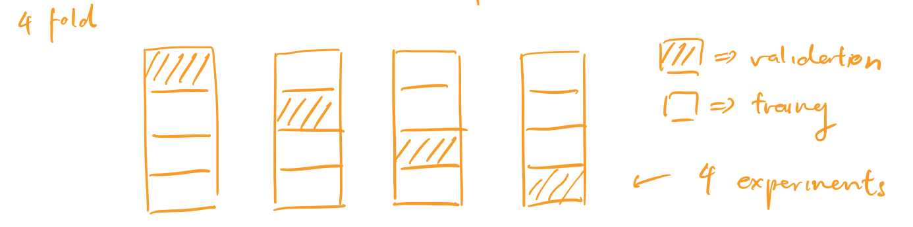
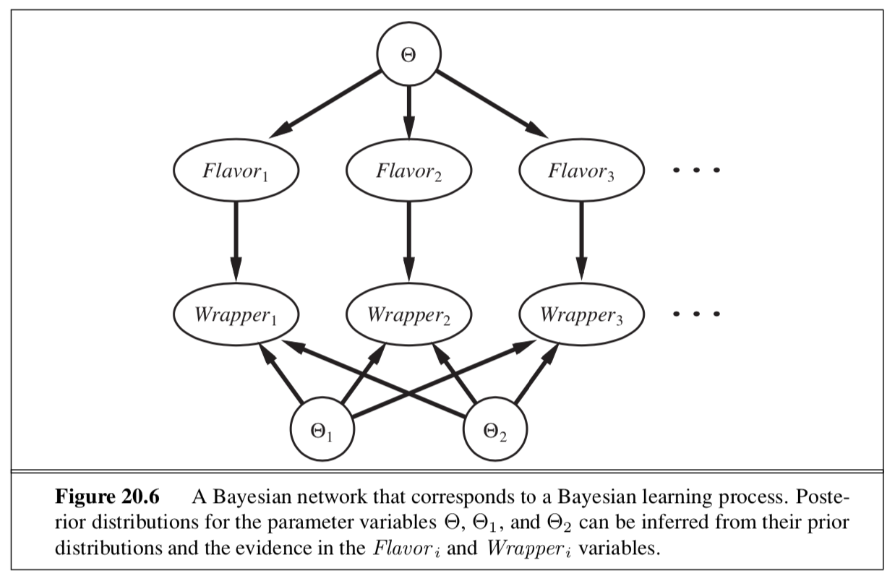
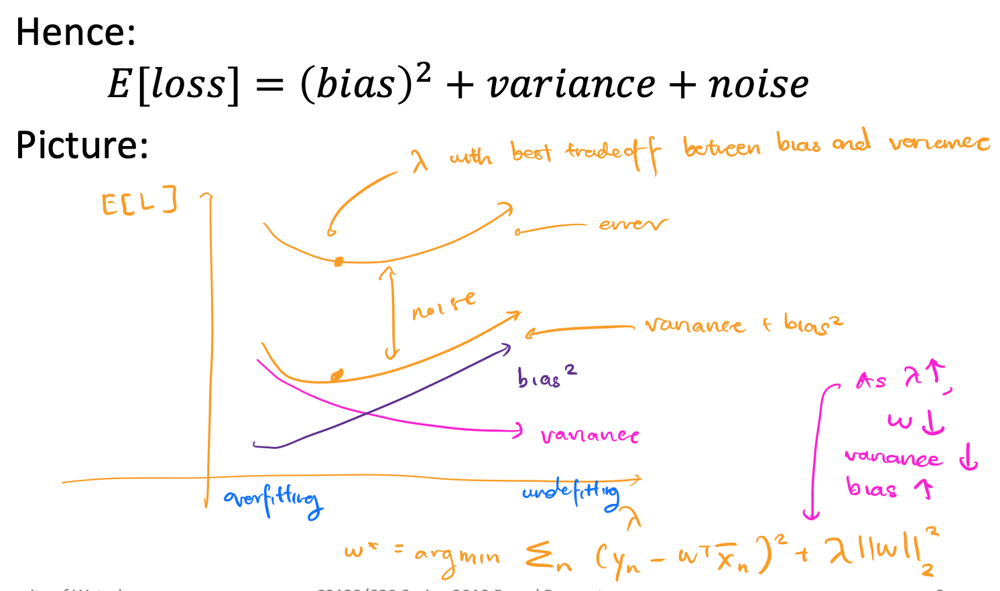
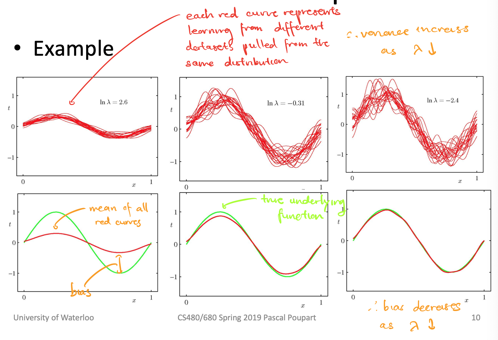
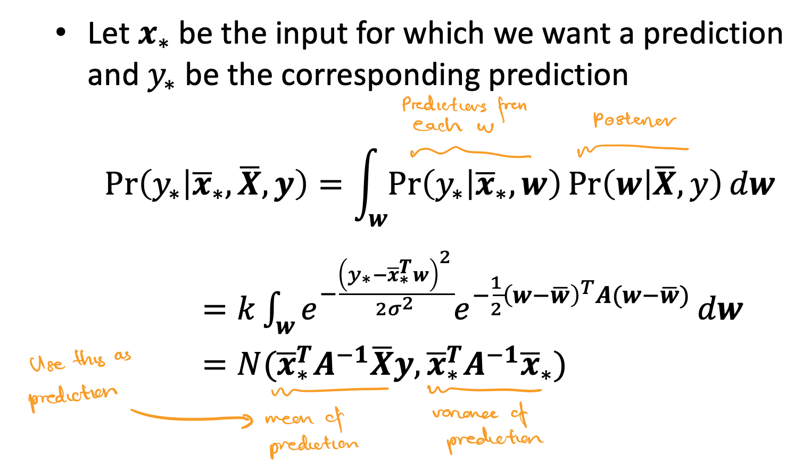
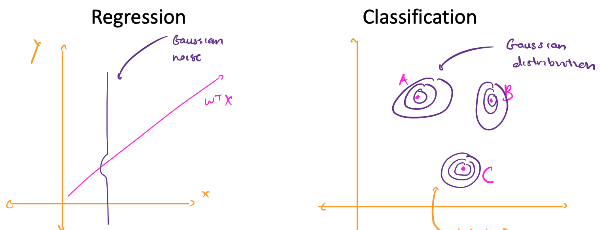
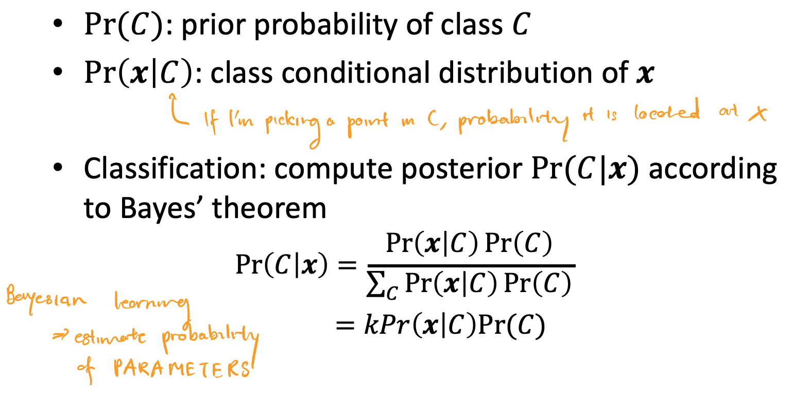
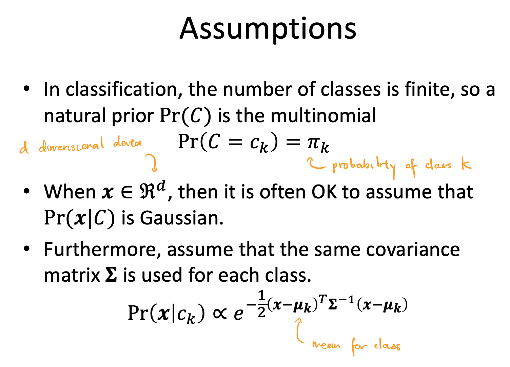
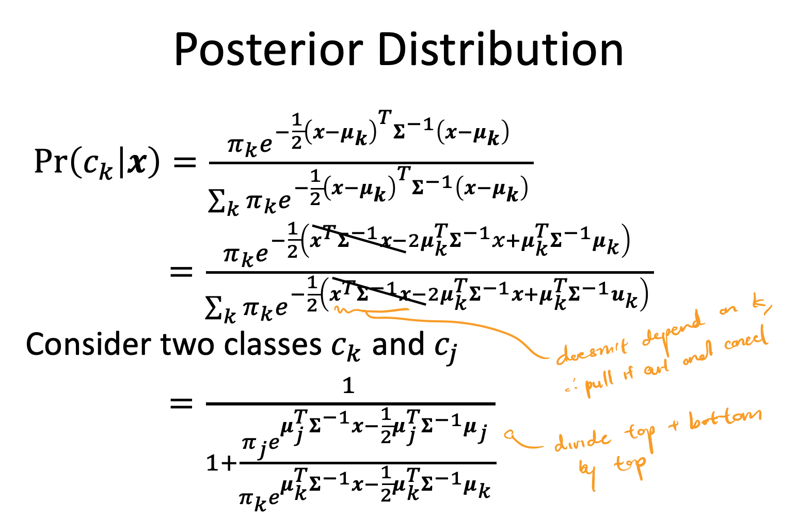

These notes are incomplete and only cover pre-midterm content.
{:.warning}

## Lecture 2

### Lecture

- **inductive learning:** given a training set of examples of the form $(x, f(x))$, return a function $h$ that approximates $f$
- **deductive learning:** given the rule + practice exercises, deduce $h$, inverse of inductive learning
- 2 types of problems
  1. Classification ⇒ range of f is categorical, can use discrete math
  2. Regression ⇒ range of f is continuous
- **hypothesis space (H):** set of all hypotheses h that learner can consider
- We want an h that:
  - minimizes an error function w.r.t. the training data (no underfitting)
  - generalizes well over test data (no overfitting)
- As the number of training examples grows, and hypothesis h that fits the training data well will also fit the test data well
- If h agrees with f on all training examples, then h is **consistent**
- Sometimes this is impossible due to insufficient H (learning problem is **unrealizable**) or noisy data
- As the size of H increases, it becomes more expressive but it also becomes harder to find a good hypothesis in H

- **underfitting:** occurs when algorithm finds h with training accuracy lower than test accuracy of some other h'

  - common causes: classifier is not expressive enough

- **overfitting:** occurs when algorithm finds h with high training accuracy than its test accuracy

  - common causes: classifier too expressive, noisy data, lack of data

- Choosing k based on validation set

  ```python
  k = 1 # Number of neighbours
  for k in range(1, MAX_NEIGHBOURS)
  	h_k = train(k, trainingData)
    accuracy_k = test(h_k, validationData)
  k_star = argmax_k(accuracy_k) # returns best k that maximizes accuracy_k
  h = train(k_star, trainingData.union(validationData))
  accuracy = test(h, test_data)
  return k_star, h, accuracy
  ```

- **cross validation:** split training data into N folds, and rotate over which fold to use as the validation set

  - report the average validation accuracy over N trainings
  - deals with noisy/small validation set

  

- Choosing k with cross validation

  ```python
  k = 1 # Number of neighbours
  N = 10 # Number of folds
  for k in range(1, MAX_NEIGHBOURS)
  	for i in range(1, N):
      h_ki = train(k, trainingData[:i] + trainingData[i+1:])
      accuracy_ki = test(h_ki, trainingData[i])
    accuracy_k = average(accuracy_ki)
  k_star = argmax_k(accuracy_k) # returns best k that maximizes accuracy_k
  h = train(k_star, trainingData)
  accuracy = test(h, test_data)
  return k_star, h, accuracy
  ```

- We can improve KNN by weighting a neighbor's vote based on how close that neighbor is

- We can use KNN for regression by returning the average of the neighbors

### 18.8.1 Nearest Neighbor Models

- **K Nearest Neighbors:**

  - Given a query $x_q$, find the k examples that are nearest to $x_q$.

  - Nearest often means **Minkowski distance** ($L^p$ norm)

    $$
    L^p(x_j, x_q) = (\sum_{i} |x_{j, i} - x_{q, i}|^p)^{1/p}
    $$

    If p = 2, Euclidean distance (used for measuring similar features).

    If p = 1, Manhattan distance (used for measuring dissimilar features).

    Often, we **normalize** features so that scaling a feature differently doesn't change our nearest neighbors result.

    $$
    x_{j,i} \leftarrow \frac{x_{j, i} - \mu_i}{\sigma_i}
    $$

    where $u_i$ is the mean of feature $i$, $\sigma_i$ is the standard deviation of feature $i$

  - Answer to $x_q$ is:
    - If regression, mean of the neighbors
    - If classification, majority vote of the neighbors (k odd to avoid ties in vote)

- When K = 1, we have overfitting. If K is too large, we will have underfitting

- **curse of dimenionality:** as the number of features increases, there are more points that could be considered along the "edge" of counting as a neighbor, thus KNN gives a worse fit

- KNN runs in O(N) time

## Lecture 3

### Lecture

- Assume that h is linear:

  $$
  y(x, w) = w_0 + w_1x_1 + \dots + w_Mx_M = \pmb{w^T}\begin{bmatrix}1 \\ \pmb{x} \end{bmatrix}
  $$

  We want to minimize Euclidean loss:

  $$
  w^* = argmin_w \frac{1}{2}\sum_{n = 1}^{N} (t_n - \pmb{w^T}\begin{bmatrix}1 \\ \pmb{x} \end{bmatrix})^2
  $$

  $L_2$ loss is quadratic, so it's convex, with one global optimum.

  Let $\pmb{\bar{x}} = \begin{bmatrix}1 \\ \pmb{x} \end{bmatrix}$. Taking the derivatave of $L_2$ with respect to each component of $w$:

  $$
  \begin{align*}
  \frac{\partial L_2}{\partial w_j} &= \sum_{n = 1}^N (t_n - \pmb{w^T\bar{x}_n})\bar{x}_{nj} = 0 \space \space \space \space \forall j \\
   \therefore 0 &= \sum_{n = 1}^N (t_n - \pmb{w^T\bar{x}_n})\pmb{\bar{x}_{n}} \\
  & \text{where } \pmb{\bar{x}_{n}} = \begin{bmatrix} 1 \\ \dots \\ x_{n} \end{bmatrix}

  \end{align*}
  $$

  We can rewrite this equation as $\pmb{Aw} = \pmb{b}$, where $\pmb{A} = \sum_{n = 1}^N \pmb{\bar{x}}_n\pmb{\bar{x}}_n^T$, $\pmb{b} = \sum_{n = 1}^N t_n\pmb{\bar{x}}_n$

  $$
  \begin{align*}
  0 &= \sum_{n = 1}^N (t_n - \pmb{w^T\bar{x}_n})\pmb{\bar{x}_{n}} \\
  0 &= \sum_{n = 1}^N t_n\pmb{\bar{x}_{n}} - \pmb{w^T\bar{x}_n}\pmb{\bar{x}_{n}} \\
  \sum_{n = 1}^N \pmb{w^T\bar{x}_n}\pmb{\bar{x}_{n}} &= \sum_{n = 1}^N t_n\pmb{\bar{x}_{n}} \\
  \sum_{n = 1}^N \pmb{\bar{x}}_n\pmb{\bar{x}}_n^T \cdot \pmb{w}& = \sum_{n = 1}^N t_n\pmb{\bar{x}}_n \\
  \pmb{Aw} &= \pmb{b}
  \end{align*}
  $$

  If the training instances span $R^{M + 1}$ then $\pmb{A}$ is invertible, and $\pmb{w} = \pmb{A^{-1}b}$.

- **Regularization:** solution may not be stable (overfitting), so we add a constant to deal with noisy inputs

  - Ridge regression: Add Tikhonov regularization term ($L_2$ norm of **w** squared).
    $$
    w^* = argmin_w \frac{1}{2}\sum_{n = 1}^{N} (t_n - \pmb{w^T}\begin{bmatrix}1 \\ \pmb{x} \end{bmatrix})^2 + \frac{\lambda}{2}||\pmb{w}||_2^2
    $$
    Solution: $(\lambda \pmb{I} +  \pmb{A})\pmb{w} = \pmb{b}$

### 18.6.1 Univariate Linear Regression

- A _univariate linear function_ is of the form $h_\textbf{w}(x) = w_1x + w_0$, where **w** $= [w_0, w_1] $.

- **linear regression:** learn the best **w** for $h_\textbf{w}(x)$ that minimizes a loss function

- Squared loss function, $L_2$

  - If $y_j$ values have normally distributed noise, then we get the maximum likelihood **w** by minimizing $L_2$

  $$
  Loss(h_\textbf{w}) = \sum_{j = 1}^{N} (y_j - h_\textbf{w}(x_j))^2
  $$

- We can minimize squared loss by taking partial derivative w.r.t. each $w_i$ and setting to 0

  - This gives a unique, optimal solution because the loss function is convex for univariate regression
  - Closed form solution for **w** = $[w_0, w_1]$:

  $$
  w_1 = \frac{N(\sum x_jy_j) - (\sum x_j)(\sum y_j)}{N(\sum x_j^2) - (\sum x_j)^2}
  $$

  $$
  w_0 = \frac{\sum y_j - w_1\sum x_j}{N}
  $$

- **gradient descent:** choose any starting point in the weight space and move in a direction opposite to the gradient (partial derivative) with a given learning rate (step size)

  - learning rate can be constant or decaying

  ```python
  w = any point in parameter space
  while not convergence:
    for each w_i in w:
      w_i = w_i - alpha * partial_derivative_loss(i, w)
  ```

  - Batch gradient descent:
    - Guaranteed to find global minimum as long as $\alpha$ is small enough, may be slow

  $$
  w_0 \leftarrow w_0 + \alpha \sum_{j} (y_j - h_{\textbf{w}}(x_j))
  $$

  $$
  w_1 \leftarrow w_1 + \alpha \sum_{j} (y_j - h_{\textbf{w}}(x_j))x_j
  $$

  - Stochastic gradient descent:
    - Consider only 1 training point at a time
    - Good for an online setting (new data coming in, we may want to see old data again)
    - Faster, but doesn't guarantee convergence without decaying learning rate

## Lecture 4

### Lecture

- **probability distribution:** specification of probability for each event in sample space, must integrate to 1

- **joint probability distribution:** specification of probabilities for all combinations of events

- Think of random variables as model features

- Conditional probability:

- $$
  P(A|B) = \frac{P(A\land B)}{P(B)} \\
  P(A \land B) = P(A|B)P(B)
  $$

- Bayes Rule:

  $$
  P(B|A) = \frac{P(A|B)P(B)}{P(A)}
  $$

- Bayesian Learning

  $$
  P(H|e) = \frac{P(e|H)P(H)}{P(e)}
  $$

  where $P(H|e)$ is the posterior distribution, $P(e|H)$ is the likelihood distribution, $P(H)$ is the prior probability, $P(e)$ evidence

  $$
  P(H|\pmb{e}) = kP(\pmb{e}|H)P(H)
  $$

- Suppose we want to make a prediction about a dataset query X:

  $$
  P(X|e) = \sum_i P(X|e, h_i)P(h_i|e)
  $$

- Assume prior $P(H) = [0,1, 0,2 0,4, 0,2, 0.1]$. Assume candies are i.i.d. (identically and independently distributed).

### 20.1 Statistical Learning

- **Bayesian learning:** calculates probability of each hypothesis given all seen data

  $$
  P(h_i, \textbf{d}) = \alpha P(\textbf{d}|h_i)P(h_i)
  $$

  where **d** is seen data, pulled from **D**, all data

  $$
  P(X|\textbf{d}) = \sum_{i} P(X|\textbf{d}, h_i)P(h_i|\textbf{d}) = \sum_{i} P(X|h_i)P(h_i|\textbf{d})
  $$

  where X is an unknown query we want to make a prediction on

- **hypothesis prior:** $P(h_i)$

- **likelihood:** probability of data under each hypothesis $P(\textbf{d} | h_i)$

  Assuming that observations are identically and independently distributed:

  $$
  P(\textbf{d} | h_i) = \prod_{j} P(d_j | h_i)
  $$

- Given hypothesis prior, Bayesian prediction is optimal ⇒ any other prediction given hypothesis prior is expected to be correct less often
- Hypothesis space is often very large or infinite, impossible to carry out summation
- **maximum a posteriori (MAP):** make predictions based on single maximum likelihood ($P(\textbf{d} | h_i)$) hypothesis, Bayesian learning with 1 term (no summation)
  - Bayesian learning and MAP have more complex hypotheses paired with lower priors ⇒ penalizes complexity to reduce overfitting
  - MAP chooses maximum compression (minimum bits to represent hypothesis, minimum bits to represent data given hypothesis)
  - Finding MAP may be intractable (optimization may be difficult)
  - Controlled overfitting (prior can be used to penalize complex hypotheses)
- **maximum likelihood (ML):** MAP with assumption that prior is uniform over H

  - good approximation of Bayesian learning and MAP when not enough data about prior
  - ML, MAP and Bayesian learning converge as amount of data increases
  - less accurate than Bayesian and MAP predictions since it ignores prior info
  - subject to overfitting since there's no prior to penalize complex hypothesis

### 20.2 Learning with Complete Data

- **density estimation:** learning a probability model given data that are assumed to be generated from that model

- **complete data:** each data point contains values for every feature
- **parameter learning:** finding numerical parameters for a probability model whose structure is fixed

#### 20.2.1 Maximum-likelihood parameter learning: Discrete models

- > **EX:** Suppose we have a bag of lime and cherry candies, and we'd like to learn $\theta$, the probability that a given candy is cherry. We have observed N candies so far, c of which are cherry, l of which are lime. What is the maximum likelihood value of $\theta$?

  Likelihood of this N candy dataset:

  $$
  P(\textbf{d} | h_\theta) = \prod_{j = 1}^N P(d_j | h_\theta) = \theta^c(1 - \theta)^l
  $$

  Log likelihood of dataset:

  $$
  L(\textbf{d} | h_\theta) = \log P(\textbf{d} | h_\theta) = \sum_{j = 1}^N P(d_j | h_\theta) = c\log \theta + l\log (1 - \theta)
  $$

  Maximizing the likelihood of the dataset is the same as maximizing the log likelihood of the dataset. Thus, we can find the maximal parameter $\theta$ by differentiating log likelihood w.r.t. $\theta$ and setting to 0.

  $$
  \frac{dL(\textbf{d} | h_\theta)}{d\theta} = \frac{c}{\theta} - \frac{l}{l - \theta} = 0 \rightarrow \theta = \frac{c}{N}
  $$

- Solving for the parameter where the derivative of the log likelihood is 0 is often not easy, might require iterative algorithms

- Maximum likelihood assigns 0 probability to events it hasn't seen yet, which is bad for small datasets ⇒ can be fixed by initializing count of each event to 1 instead of 0

- > **EX:** Suppose each candy has a green (lime) or red (cherry) wrapper, selected according to some unknown distribution which is dependent on the flavor of the candy. We have seen N candies, c of which of cherry, l of which are lime. $r_c$ of the cherry candies had a red wrapper and $g_c$ of the cherry candies had a green wrapper. $r_l$ of the lime candies had a red wrapper and $g_l$ of the lime candies had a green wrapper.
  >
  > We'd like to learn $\theta$ (the probability that a given candy is cherry), $\theta_1$ (the probability that a cherry candy has a red wrapper) and $\theta_2$ (the probability that a lime candy has a red wrapper).

  Likelihood of this N candy dataset:

  $$
  P(\textbf{d} | h_{\theta, \theta_1, \theta_2}) = [\theta^c(1 - \theta)^l][\theta_1^{r_c}(1 - \theta_1)^{g_c}][\theta_2^{r_l}(1 - \theta_2)^{g_l}]
  $$

  Log likelihood of dataset:

  $$
  L = c\log \theta + l\log (1 - \theta) + r_c\log \theta_1 + g_c\log(1 - \theta_1) + r_l\log \theta_2 + g_l\log (1 - \theta_2)
  $$

  Taking each partial derivative, we have:

  $$
  \begin{align*}
  \frac{\partial L}{\partial \theta} = \frac{c}{\theta} - \frac{l}{1 - \theta}
  &\rightarrow \theta = \frac{c}{c + l}
  \\

  \frac{\partial L}{\partial \theta_1} = \frac{r_c}{\theta_1} + \frac{g_c}{1 - \theta_1}
  &\rightarrow \theta_1 = \frac{r_c}{r_c + g_c}
  \\

  \frac{\partial L}{\partial \theta_2} = \frac{r_l}{\theta_2} + \frac{g_l}{1 - \theta_2}
  &\rightarrow \theta_2 = \frac{r_l}{r_l + g_l}
  \end{align*}
  $$

  Notice, the maximum likelihood parameter values are the observed frequencies of each variable.

- Given complete data, maximum likelihood parameter learning with multiple parameters decomposes into separate learning problems for each parameter

#### 20.2.2 Naive Bayes models

- **naive Bayes (NB):** model where we assume that features are conditionally independent of each other

  $$
  P(C|x_1,\dots,x_n) = \alpha P(C)\prod_{i}P(x_i|C)
  $$

- scales well, no search is needed to find the maximum likelihood NB parameters, deals with noisy/missing data, and gives a probability that the predicted class is correct

#### 20.2.3 Maximum-likelihood parameter learning: Continuous models

> **EX:** What are the maximum likelihood parameters $\mu$ and $\sigma$ for a Gaussian density function on a single variable?

Assuming the data is generated by a Gaussian model, we have that

$$
P(x) = \Large \frac{1}{\sqrt{2\pi}\sigma} e^{-\frac{x - \mu}{2\sigma^2}}
$$

Taking log likelihood:

$$
\begin{align*}
L &= \sum_{j = 1}{N} \log \frac{1}{\sqrt{2\pi}\sigma} e^{-\frac{x_j - \mu}{2\sigma^2}} \\
&= N(-\log \sqrt{2\pi} - \log \sigma) - \sum_{j = 1}^N \frac{(x_j - \mu)^2}{2\sigma^2}
\end{align*}
$$

Taking partial derivatives and setting to 0:

$$
\begin{align*}
\frac{\partial L}{\partial \mu} = -\frac{1}{\sigma^2} \sum_{j = 1}^N (x_j - \mu) = 0
&\rightarrow \mu = \frac{\sum_{j = 1}^N x_j}{N}
\\
\frac{\partial L}{\partial \sigma} = -\frac{N}{\sigma} + \frac{1}{\sigma^3}\sum_{j = 1}{N}(x_j - \mu)^2 = 0
&\rightarrow \sigma = \frac{\sqrt{\sum_{j = 1}^N (x_j - \mu)^2}}{N}
\end{align*}
$$

Suppose $y = w^Tx + N(0, \sigma)$, y is linear in x and has Gaussian noise with fixed variance.

Then, $P(y \vert x) = \frac{1}{\sqrt{2\pi}\sigma}e^-\frac{(y-w^Tx)^2}{2\sigma^2}$.

Notice that maximizing the likelihood $P(y \vert x)$ is the same as minimizing $(y - w^T)^2$, which is the same problem as minimizing $L_2$ loss in linear regression.

#### 20.2.4 Bayesian parameter learning

- **hypothesis prior:** probability distribution of possible hypotheses, prior belief which is updated

  - Value of the hypothesis prior is between 0 and 1 and integrates to 1

  Let $\theta$ be the probability that a randomly selected piece of candy is cherry flavored. Then, the hypothesis prior is $P(\Theta)$, where $P(\Theta= \theta)$ is the prior probability that a bag has a fraction $\theta$ of cherry candies.

- **beta distribution:** $\text{beta}\[a, b\](\theta) = \alpha\theta^{a - 1}(1 - \theta)^{b - 1}$

  - If a = 0, b = 1, $Uniform = \text{beta}\[0, 1\](\theta) = \alpha\frac{1}{\theta}$
  - Normalization constant $\alpha$ chosen based on a and b to make beta distribution integrate to 1
  - Mean for beta distribution distribution is $\frac{a}{a + b}$
  - Larger values of $a$ push the $\theta$ values of the distribution closer to 1 and larger values of $a + b$ push the probability $P(\theta)$ closer to 1 (greater certainty)

  Suppose we observe a cherry candy and we have a hypothesis $\theta$. We can calulate the posterior distribution $P(\theta | D_1 = cherry)$, given that the prior distribution is a beta distribution.

  $$
  \begin{align*}
  P(\theta \vert D_1 = cherry) &= \alpha \cdot P(D_1 = cherry \vert \theta) \cdot P(\theta) \\
  &= \alpha \cdot \theta \cdot \text{beta}\[a, b\](\theta) \\
  &= \alpha \cdot \theta \cdot \alpha'\theta^{a - 1}(1 - \theta)^{b - 1} \\
  &= \alpha'' \cdot \theta^a(1 - \theta)^{b - 1} \\
  &= \text{beta}\[a + 1, b\](\theta)
  \end{align*}
  $$

  So, the posterior distribution of a beta distribution is also a beta distribution. We call a and b **virtual counts**, since a prior distribution $\text{beta}[a, b](\theta) $ means we have seen $a - 1$ cherry candies and $b - 1$ lime candies.

  **Bayesian learning** means updating the posterior distribution based on the prior distribution until it converges to the true value of $\theta$.

- Suppose we had 3 parameters: $\theta$ (the probability that a candy is cherry), $\theta_1$ (the probability that a cherry candy has a red wrapper), and $\theta_2$ (the probability that a lime candy has a red wrapper).

  Assuming _parameter independence_:

  $$
  P(\Theta, \Theta_1,\Theta_2)= P(\Theta)P(\Theta_1)P(\Theta_2)
  $$

  Suppose we observe a new candy. We first add a Flavor node and then a Wrapper node.

  $$
  P(Flavor_i = cherry | \Theta = \theta) = \theta \\
  P(Wrapper_i = red | Flavor_i = cherry, \Theta_1 = \theta_1) = \theta_1 \\
  P(Wrapper_i = red | Flavor_i = lime, \Theta_2 = \theta_2) = \theta_2 \\
  $$

  Then, we can use these equations to infer the values we want, $P(\Theta_1)$ and $P(\Theta_2)$, as in the diagram

  

#### 20.2.5 Learning Bayes net structures

- In order to find a good Bayes net structure, we can search for one
  - Start with a model with no links, add parents
  - Start with full initial guess, do hill-climbing/simulated annealing to make modifications to structure
- Two methods for deciding when a good structure has been found:
  - test whether conditional independence equations implied by the structure are true on the dataset, with some statistical significance
  - check how well proposed model explains the dara
    - If explains well means "maximum likelihood", we will end up with a fully connected network, because adding more parents to a node doesn't decrease likelihood
    - Therefore we penalize model complexity

#### 20.2.6 Density estimation with nonparametric models

- K nearest neighbors ⇒ measure the probability density of a query X by measuring the area over which the neighbors of X are spread out

- Kernel functions:

  Assume each data point generates its own density function. Then, the estimated density at a query point x is the average density as given by each kernel function:

  $$
  P(x) = \frac{1}{N}\sum_{j = 1}^N K(x, x_j)
  $$

  Assuming spherical Gaussians with standard deviation $w$ along each axis:

  $$
  K(x, x_j) = \Large \frac{1}{(w^2\sqrt{2\pi})^d}e^{-\frac{D(x, x_j)^2}{2w^2}}
  $$

  Where $d$ is the number of dimensions in x and $D$ is the Euclidean distance function

## Lecture 5: Linear Regression by ML, MAP, and Bayesian Learning

### Lecture

- Assume y is obtained from x deterministic function f that has been perturbed by Gaussian noise.

  $$
  \begin{align*}
  y &= f(\bar{x}) + \epsilon \\
  	&= w^T\bar{x} + N(0, \sigma^2)
  \end{align*}
  $$

  Assuming that each data point is identically and independently distributed, we can measure the likelihood of an output given data.

  $$
  \begin{align*}
  P(\pmb{y|X}, \pmb{w}, \sigma) &= N(\pmb{y|w^T\bar{X}}, \sigma^2) \\
  &= \Large \prod_{n = 1}^N \frac{1}{\sqrt{2\pi}\sigma}e^{-\frac{(y_n - \pmb{w^T\bar{x}_n
  })^2}{2\sigma^2}}
  \end{align*}
  $$

- **Maximum Likelihood:** Find best $\pmb{w^*}$ by maximizing the likelihood of the data

  $$
  \begin{align*}
  \pmb{w*} &= argmax_w P(\pmb{y|X}, \pmb{w}, \sigma) \\
   &= argmax_w \prod_{n = 1}^N \frac{1}{\sqrt{2\pi}\sigma}e^{-\frac{(y_n - \pmb{w^T\bar{x}_n
  })^2}{2\sigma^2}} \\
  &= argmax_w \prod_{n = 1}^N e^{-\frac{(y_n - \pmb{w^T\bar{x}_n
  })^2}{2\sigma^2}} \\
   &= argmax_w \sum_{n = 1}^N -\frac{(y_n - \pmb{w^T\bar{x}_n
  })^2}{2\sigma^2} \\
   &= argmin_w \sum_{n = 1}^N (y_n - \pmb{w^T\bar{x}_n
  })^2
  \end{align*}
  $$

  Thus minimizing Gaussian distributed noise is the same as minimizing least squares.

- **Maximum A Posteriori:** Find $\pmb{w^*}$ with the highest posterior probability.

  Assume Gaussian prior distriution over w: $P(\pmb{w}) = N(\pmb{0}, \pmb{\Sigma})$, where $\pmb{\Sigma}$ is the covariance matrix.

  Then, by Bayes rule, the posterior is:

  $$
  \begin{align*}
  P(\pmb{w | X, y}) &= \frac{P(\pmb{y | X, w})P(\pmb{w})}{P(\pmb{X, y})} \\
  &\propto P(\pmb{w})P(\pmb{y|X, w}) \\
  &= \Large ke^{-\frac{\pmb{w^T\Sigma^{-1}w}}{2}}e^{-\frac{\sum_n (y_n - \pmb{w^Tx_n})^2}{2\sigma^2}}
  \end{align*}
  $$

  Optimizing for the best $\pmb{w^*}$:

  $$
  \begin{align*}
  \pmb{w^*} &= argmax_w P(\pmb{w|\bar{X}, y}) \\
  &= argmax_w - \Sigma_n(y_n - \pmb{w^T\bar{x}_n})^2 - \pmb{w^T\Sigma^{-1}w} \\
  &= argmin_w \Sigma_n(y_n - \pmb{w^T\bar{x}_n})^2 + \pmb{w^T\Sigma^{-1}w}
  \end{align*}
  $$

  Let $\pmb{\Sigma^{-1}} = \lambda\pmb{I}$ (e.g. $\Sigma = \begin{bmatrix}1/\lambda & 0 \\ 0 & 1/\lambda \end{bmatrix}$). Then

  $$
  \pmb{w^*} = argmin_w \Sigma_n(y_n - \pmb{w^T\bar{x}_n})^2 + \lambda||\pmb{w}||_2^2
  $$

  This is the regularized least square problem. This minimizes $\pmb{w}$.

- **expected square loss:** E[L] consists of noise (constant) and error (depends on $\pmb{w}$)

  $$
  \begin{align*}
  E[L] &= \int_{x, y} P(\pmb{x}, y)(y - \pmb{w^T\bar{x}})^2d\pmb{x}dy \\
  &= \int_{x, y} P(\pmb{x}, y)(y - f(\pmb{x}) + f(\pmb{x}) - \pmb{w^T\bar{x}})^2d\pmb{x}dy \\
  &= \int_{x, y} P(\pmb{x}, y)\big[(y - f(\pmb{x}))^2 + 2(y - f(\pmb{x}))(f(\pmb{x}) - \pmb{w^T\bar{x}}) +(f(\pmb{x}) - \pmb{w^T\bar{x}})^2\big] d\pmb{x}dy \\
  &= \int_{x, y} P(\pmb{x}, y)\big[(y - f(\pmb{x}))^2 +(f(\pmb{x}) - \pmb{w^T\bar{x}})^2\big] d\pmb{x}dy \\
  &= \int_{x, y} P(\pmb{x}, y)(y - f(\pmb{x}))^2 d\pmb{x}dy + \int_{x, y}P(\pmb{x}, y)(f(\pmb{x}) - \pmb{w^T\bar{x}})^2 d\pmb{x}dy \\
  &= \int_{x, y} P(\pmb{x}, y)(y - f(\pmb{x}))^2 d\pmb{x}dy + \int_{x}P(\pmb{x})(f(\pmb{x}) - \pmb{w^T\bar{x}})^2 d\pmb{x} \\
  \end{align*}
  $$

  We call the first part noise and the second part error.

  Suppose we have some **w** chosen based on a dataset S. We can then decomponse error.

  $$
  \begin{align*}
  E_s[L] &= \int_{x}P(\pmb{x})(f(\pmb{x}) - \pmb{w^T\bar{x}})^2 d\pmb{x} \\
  &= E_s[(f(\pmb{x}) - \pmb{w^T\bar{x}})^2] \\
  &= E_s[(f(\pmb{x}) - E_s[\pmb{w^T\bar{x}}] + E_s[\pmb{w^T\bar{x}}] - \pmb{w^T\bar{x}})^2] \\
  &= E_s[(f(\pmb{x}) - E_s[\pmb{w^T\bar{x}}])^2  + 2(f(\pmb{x}) - E_s[\pmb{w^T\bar{x}}])(E_s[\pmb{w^T\bar{x}}] - \pmb{w^T\bar{x}}) + (E_s[\pmb{w^T\bar{x}}] - \pmb{w^T\bar{x}})^2] \\
  &= E_s[(f(\pmb{x}) - E_s[\pmb{w^T\bar{x}}])^2 + (E_s[\pmb{w^T\bar{x}}] - \pmb{w^T\bar{x}})^2] \\
  &= (f(\pmb{x}) - E_s[\pmb{w^T\bar{x}}])^2 + E_s\big[(E_s[\pmb{w^T\bar{x}}] - \pmb{w^T\bar{x}})^2\big] \\
  \end{align*}
  $$

  We call the first part the bias (squared) and the second part the variant. The true underlying output is $f(\pmb{x})$, the average output of the model is $E_s[\pmb{w^T\bar{x}}]$, and the output of the model is $\pmb{w^T\bar{x}})^2$. Bias and variance are both functions of $\lambda$ because of $\pmb{w^T\bar{x}}$.

  

  

- **Bayesian Linear Regression**

  The weighted average prediction is:

  $$
  \begin{align*}
  P(\pmb{w | X, y}) &= \Large ke^{-\frac{\pmb{w^T\Sigma^{-1}w}}{2}}e^{-\frac{\sum_n (y_n - \pmb{w^Tx_n})^2}{2\sigma^2}} \\
  &= \Large ke^{-\frac{1}{2}(\pmb{w} - \pmb{\bar{w}}^T)\pmb{A}(\pmb{w} - \pmb{\bar{w}}^T)} \\
  &= N(\pmb{\bar{w}}, \pmb{A^{-1}})
  \end{align*}
  $$

  where $\Large \pmb{\bar{w}} = \sigma^{-2}\pmb{A^{-1}\bar{X}y}$, $\Large \pmb{A} = \sigma^{-2}\pmb{\bar{X}\bar{X}^T} + \pmb{\Sigma^{-1}}$

  

## Lecture 7: Classification with Mixture of Gaussians

- We can use probabilistic generative models to generate data similar to the training data using Gaussian noise for both regression and classification

  

- 

- 

- 
