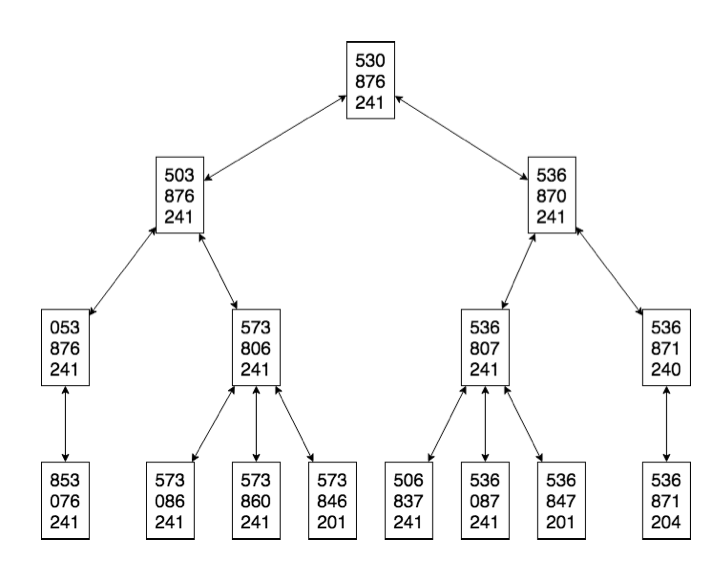
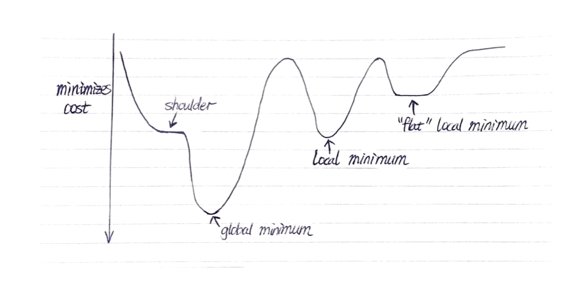
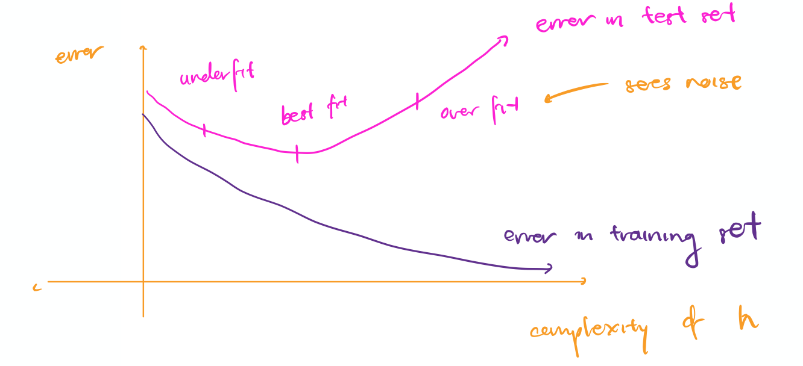
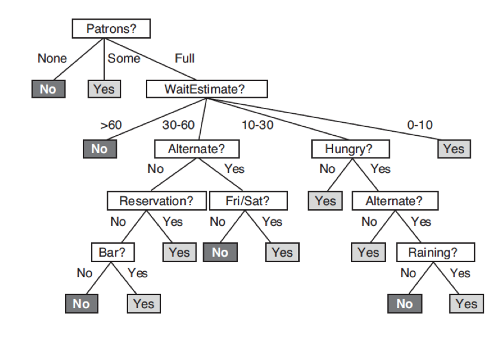
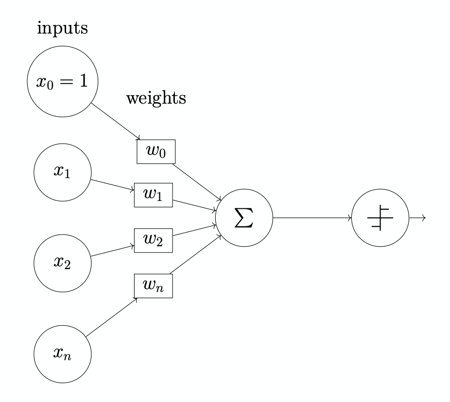

> Professor Alice Gao, Spring 2019

# Lecture 1

Applications of AI:

- checkers
- chess
- go
- Jeopardy

Topics in this course:

- Search: Heuristic
- Supervised Learning
- Reasoning under uncertainty
- Learning under uncertainty
- Decision making under uncertainty

Describe the four definitions of AI. Explain why we will pursue one over the other three.

1. Cognitive Modeling Approach
   - Model human thoughts through brain imaging, cognitive science, etc.
   - Systems that think like humans
2. Turing Test Approach
   - See if a human judge can distinguish a robot from a computer
   - Systems that act like humans
3. Laws of Thought Approach
   - Laws of logic
   - Systems that think rationally
4. Rational Agent Approach
   - Rational agent has rational behavior e.g. learning, having goals
   - Rational behavior means to take an action that maximizes the best outcome
   - Systems that act rationally

A system is intelligent if it **acts** rationally.

We pursue the rational agent approach because humans are not necessarily rational (excludes 1 and 2) and laws of logic are hard to translate/apply (excludes 3).

Rationality is mathematically well-defined and completely general.

# Lecture 2

sensor ⇒ perceives the environment e.g. mouse, eyes

act ⇒ acts on the environment e.g. monitor, hands, feet

**rational agent:** selects an action that maximizes its performance measure given a percept sequence and prior knowledge (e.g. rules)

properties of a task environment:

- fully observable vs. partially observable (uncertainty) e.g. chess vs. poker (hands of other players are not observed)

- deterministic vs. stochastic (uncertain dynamics) e.g. chess (if we know what move the opponent is going to make e.g. opponent is a computer) vs. poker (next card flipped is random)

- static vs. dynamic (changing environment) e.g. chess vs. medical diagnostic

- episodic vs. sequential (long term consequences of actions) e.g. imagic classification vs. crossword

- known vs. unknown (agent knows the rules of the environments) e.g. chess vs. playing chess for the first time

- single agent vs. multi-agent e.g. crossword vs. autonomous cars (when you model other cars)

We can formulate real world problems as search problems.

##### N Queens

- states: 16C8 positions for the queens
- start state: any of those states
- goal test: are the queens attacking each other?
- action: move 1 queen away (in any valid direction) from attacking queen, cost of movement is 0
- successor function: valid actions

##### River Crossing

- states: who is on either side of the river
- start state: parent and children are on left side of the river
- goal state: parent and children are on the right side of the river
- successor function: move up to 100kg of weight across the river

##### Propositional satisfiability

- states: truth values of each boolean variable used in the expression
- start state: all false
- goal state: expression is true
- successor function: try to flip a boolean variable, from right to left

##### Traveling salesman problem

- states: path of salesman
- start state: salesman at start city
- goal state: salesman goes to every city
- successor function: cool

# Lecture 3

##### 8 Puzzle Problem

**state:** Each state is given by
$$
x_{00},x_{01},x_{02}, \\ x_{10},x_{11},x_{12}, \\ x_{20},x_{21},x_{22}
$$
where $x_{ij}$ is the value in the space at column i and row j. If the space is blank, the value is 0. $i, j \in {0, 1, 2}$, $x_{ij} \in {0, \dots, 8}$.

**initial state:** 530, 876, 241

**goal state**: 123, 456, 780

**action:** Move the blank space up, down, left, or right, wherever possible.

**successor function:** The resulting state after 1 action

**cost function:** Each move has a cost of 1.

For the 8 puzzle problem, here are the first 4 layers of the search graph:



```python
frontier = []
frontier.append(initial_state)

while frontier:
	# DFS: Expand most recent
	curr_state = frontier.pop()
	# BFS: Expand oldest
	curr_state = frontier.pop(0)
	if curr_state == GOAL_STATE:
		return curr_state
	successors = get_successors(curr_state)
	# Implementation assumes no duplicates
	# If duplicates, remember search tree as hashmap
	frontier += successors

raise Exception("No solution")
```

Whether we should use BFS or DFS depends on the scenario:

- Memory is limited ⇒ DFS

- All solutions are deep in the tree ⇒ DFS

- The search graph contains cycles ⇒ BFS

  If we don't remember the search tree, DFS gets cycles. BFS also gets stuck in cycles, but it will add its cycle to a queue.

- The branching factor is large ⇒ DFS

  Assume m is the number of levels, b is the branching factor. Then DFS is O(bm) while BFS is O(b^m).

- We must find the shallowest goal node ⇒ BFS

- Some solutions are very shallow ⇒ BFS

**search graph:** contains all states and edges for the successor function

**search tree:** constructed as we execute the algorithm (tree nodes are 1 directional)

**frontier:** all leaf nodes available for expansion

- expanding a node removes it from the frontier
- generating a node adds it to the frontier

# Lecture 4

BFS and DFS are _uninformed_ search algorithms. When we can, we should used _informed_ search algorithms like A* search to find the target solution faster.

### A* search algorithm

**g(n):** cost of the path from initial state to current state n, known

**search heuristic h(n)**: estimate of the cost of the cheapest path from node n to a goal node

- h(n) ≥ 0. If n is a goal node, h(n) = 0
- h(n) must be easy to compute (without search)

**informed search algorithm:** Same as DFS/BFS, except you treat the frontier as a priority queue ordered by f(n)

- Djikstra's: f(n) = g(n)
- Greedy: f(n) = h(n)
- A*: f(n) = g(n) + h(n)

A* is optimally efficient because among all optimal algorithms that start from the same start node and use the same heuristic, A* expands the fewest nodes.

**admissible heuristic:** lower bound optimistic estimate of the cost of getting from node n to the nearest goal node

We verify that a heuristic is admissible by showing that it is an optimal solution to a relaxed version of the problem.

For the 8 puzzle problem, relaxed problems are:

- A tile can move from A to B if A and B are adjacent
  - Optimal solution is Manhattan distance for each tile
- A tile can move from A to B if B is blank
- A tile can move from A to B
  - Optimal solution is the number of misplaced tiles

To construct an admissible heuristic, relax a search problem and find the optimal solution in the relaxed case.

A heuristic $h_1(n)$ **dominates** another heuristic $h_2(n)$ if for all states $h_1$ ≥ $h_2$ and for at least 1 state, $h_1$ > $h_2$.

If $h_1$ dominates $h_2$, A* using $h_1$ will never expand more states using $h_1$ than $h_2$. So, we should always choose dominating heuristics.

Other desirable properties:

- heuristic admissible, but with high values (close to true h)
- not a constant function

# Lecture 5

Components of a constraint satisfaction problem (CSP):

- A set X of variables
- A set D of domains
- A set C of constraints specifying allowable combinations of values

A solution to a CSP is a set of assignments to X that satisfy all C.

For the 4 Queens problem:

- X = ${x_0, x_1, x_2, x_3}$, where $x_i$ is the row of the the Queen in column i
- Domain of $x_i$ is ${0, 1, 2, 3}$
- C:
  - No 2 queens can be in the same row ⇒ For all i, j where i ≠ j, $x_i$ ≠ $x_j$
  - No 2 queens can be in the same diagonal ⇒ For all i, j where i ≠ j, $\vert x_i - x_j \vert ≠ 2$
  - No 2 queens can be in the same column ⇒ Not necessary since this is impossible by the formulation of X

For the 4 queens problem, we have the constraint: *The queens in columns 0 and 2 are not in the same row or diagonal*.

In table format:

| $x_0$ | $x_1$ |
| ----- | ----- |
| 0     | 1     |
| 0     | 3     |
| 1     | 0     |
| 1     | 2     |

In formula format:

$$(x_0 \ne x_2) \land (|x_0 - x_2| \ne 2)$$

**arc-consistency:** $X_i$ is arc-consistent with respect to another variable $X_j$ if and only if for every value $c_i$ in $D_i$, there is a value $v_j$ in $D_j$ such that $(v_i, v_j)$ satisfies the constraint $(X_i, X_j)$.

### Arc consistency algorithm

```python
def revise(X_i, C):
	revised = False
	for x in dom(X_i):
		if not exists y in dom(X_i s.t. (x, y) satisfies C:
			remove x from dom(X_i)
			revised = True
	return revised

def ac3(X, D, C):
	Put (v, C) in the set S for every variable v and every constraint involving v
	while S:
		X_i, C_ij = S.pop()
		if revise(X_i, Cij):
			if not dom(X_i): 
				return False
			# For all constraints where X_i is the other variable
			for X_k where C_ki is a constraint between X_k and X_i:
				# Adds if X_k, C_ki is not already in S
				S.add((X_k, C_ki))
```

3 possible outcomes to the arc-consistency algorithm:

- no solution
- 1 unique solution
- multiple solutions

#### Complexity of the arc consistency algorithm

Assume $n$ variables, $c$ binary constraints, and the size of the domain at each step is at most $d$. Then the complexity is $O(ncd)$.

The algorithm always terminate because we shrink the domain at each step.

**arity:** the number of variables involved in a constraint

# Lecture 6, 7

**local search:** keep track of a single node, move to a neighbor of the node based on how good the neighbor is

Advantages over other search algorithms:

- Can be used when state space is large or infinite
- Doesn't use a lot of memory (only stores 1 state)
- Can solve pure optimization problems where there is no goal state to test against

- Good for solving CSPs, since path to goal state in CSP is irrelevant.

Components of a local search problem:

- A set of variables
- Domains for variables
- Constraints on the joint values of variables
- Node: a complete assignment to all of the variables
- Neighbor relation for each node
  - If the neighborhood at each step
    - large, we get large improvements at each step, less likely to get stuck
    - small, we get small improvement at each step, faster
- Cost function for each node

For the 4 queens problem:

- **state:** 4 queens on the board
  - Variables: $x_0, x_1, x_2, x_3$
  - Domain for each variable: $x_i \in {0, 1, 2, 3}$

- **initial state**: Any random state

- **goal state:** No pair of queens attacking each other

- **neighbor relation:**
  - Version A: Move a single queen to another square in the same column
  - Version B: Swap the row positions of two queens

- **cost function:** The number of pairs of queens attacking each other directly or indirectly



**local optima:** a state s* is locally optimal if c(s*) ≤ c(s) for every state s in the neighborhood of s*

**global optima:** a state s* is globally optimal if c(*) ≤ c(s) for every state s

**plateau:** flat area in the state space

- shoulder: possible to improve when we escape
- flat local optimum: cannot improve even if we escape

Strategies for escaping local optima

- sideway moves ⇒ allow max number of moves to neighbors with the same cost
- taboo list ⇒ keep a small list of recently visited states and forbid the algorithm to return to those states
- hill climbing with random restarts ⇒ restart search in different part of the state space
  - finds optimal solution given enough restarts
- hill climbing with simulated annealing ⇒ move to a state with high cost occasionally
  1. Start with a random solution and a large T.
  2. Choose a random neighbor. If the neighbor is better than current move to the neighbor. If the neighbor is not better than the current state, move to the neighbor with probability $$p = e^{\frac{\Delta E}{T}}$$ where $E = \text{cost}(current) - \text{cost}(next)$. Define lower $\text{cost(x)}$ to be better.
  3. Stop when T = 0. If T decreases slowly enough, simulated annealing is guaranteed to fin the global optimum.

Comparing hill climbing with genetic algorithms:

- Exploring state space
  - Hill climbing explores neighbors of the state based on neighbor relation
  - Genetic algorithm uses mutation/reproduction to explore
- Optimizing quality of state/population
  - Hill climbing chooses the best neighbor
  - Genetic algorithm chooses best parents

Parallel search

- Maintain k nodes, update each one independently
- Equivalent to doing k random restarts in parallel

Beam search

- Maintain k nodes, choose k best nodes out of all the neighbors
- When k = 1, hill climbing
- Loses diversity very fast if all k neighbors in the same area

Stochastic beam search

- Beam search, but k best nodes are chosen with a probability proportional to fitness of the node
- Maintains diversity

Genetic algorithm

- Keep track of a set of states. Each state has a fitness.
- Randomly two states to reproduce. The fitter a state, the more likely it's chosen to reproduce
- Two parent states cross over to produce a child state
- The child state mutates with a small independent probability
- Add the child state to the new population
- Repeat reproduction until we produce a new population. Replace the old population with the new one
- Repeat until one state in the population has high enough fitness.

# Lecture 8, 9

Reasons for building an agent that can learn

- Don't know the solution ourselves
- World evolves, cannot anticipate all changes over time
- Cannot anticipate all possible situations

Different types of learning

- **unsupervised learning:** learn patterns in the examples, no labels available

- **semi-supervised learning:** learn from a few labeled examples and a large number of unlabelled examples

- **supervised learning:** learn a function that maps from examples to labels

**supervised learning:**

- training set of (x, y) pairs generated by some unknown function f(x) = y
- find a function h in hypothesis space H that approximates f
  - Choose h that is most accurate on the test set of examples ⇒ h that generalizes best
  - We want the simplest consistent hypothesis

**classification:** label is a discrete value

**regression**: label has continuous values



**overfitting:** h that fits training data too well and does not generalize to test set

**decision tree:** graph of nodes, at each node divide up examples based on the value for a chosen feature



We construct a decision tree by testing features in order until each leaf contains training examples with the same label. The resulting tree will fit the training set perfectly.

We want an order of testing features that gives a tree that is as shallow (simple) as possible.

```python
def ID3(features, examples):
	If all examples are positive, return a leaf node with decision yes
	If all examples are negative, return a leaf node with decision no
	# If there are hidden features or data is noisy
	If no features left, return a leaf node with the majory decision of the examples
	# If training data doesn't contain this combination of values
	If no examples left, return a leaf node with the majority decision of the examples in the parent
	
	# Choose the feature with greatest information gain
	Choose the most important feature f
	for each value v of feature f:
		add arc with label v
		add subtree ID3(F - f, s in S | f(s) = v)
```

entropy of distribution with k outcomes:
$$
I(P(c_1) \dots P(c_k) = -\sum^{k}_{i = 1} P(c_i)\log_2 P(c_i)
$$

- maximum entropy = 1 when distribution is even between classes

- Define I(1, 0) = 0, I(0, 1) = 0

#### Expected information gain for selecting a feature

Before testing a feature, suppose there are p positive examples and n negative examples.

Entropy before testing the feature:

$$
E_0 = I(\frac{p}{p + n}, \frac{n}{p + n})
$$
Expected entropy after testing the feature:

$$
E_1 = \sum^k_{i = 1} \frac{p_i + n_i}{p + n} \cdot I(\frac{p_i}{p_i + n_i}, \frac{p_i}{p_i + n_i})
$$
Expected information gain after testing the feature:

$$
G = E_0 - E_1
$$

# Lecture 10

#### Decision trees with real-value features

To choose a split point for a real valued feature:

1. Sort the instances according to the real valued feature
2. Call every value halfway between two adjacent instance values a possible split point. If there exist at least 1 pair of labels with differing values on either side of the split point, record its expected information gain.
3. Pick the split point with the maximum information gain.

We can test a real valued features multiple times, but discrete valued features a maximum of once. This makes computing real valued decision trees expensive.

#### Preventing overfitting in decision trees

To get a smaller tree to prevent overfitting to noisy data:

- Grow the tree to a maximum depth
- Enforce a minimum number of examples at a leaf node
- Post-prune the tree using a validation set

Choose the best maximum depth of decision tree by k-fold cross validation

- Use k-fold cross validation to split the dataset into k pairs of training sets and validation sets. Train k trees of a given depth. The accuracy for that depth is the average accuracy between the k trees.

- Do k-fold cross validation several times to pick the best maximum depth.

# Lecture 11

Causes and resolutions of the two AI winters:

1. 1970s - 1980s
   - 1969 → Marvin Minsky proved we need to use multi-layer perceptrons to represent simple non-linear functions such as XOR
   - Unclear how to train multi-layer perceptrons
     - 1986 → Rumelhart, Hinton, and Williams use back-propagation to train multi-layer perceptrons
2. mid 1990s
   - Multi-layer neural networks trained with back propagation don't work well compared to simpler models
   - Rise of deep learning
     - 2006 → Hinton, Osindero, and Teh show that back-propagation works if initial weights are chosen in a smart way
     - 2012 → Hinton enters ImageNet competition using deep convolutional neural networks and did far better than the next closest entry

4 lessons learned summarized by Geoff Hinton

1. Labelled data sets were thousands of times too small
2. Our computers were millions of times too slow
3. We initialized the weights in a stupid way
4. We used the wrong type of non-linearity (relu better than sigmoid).

A drawn simple perceptron:



# Lecture 12

$P(X)$ ⇒ prior, unconditional, likelihood of X given background information

$P(X \vert Y)$ ⇒ posterior, conditional, likelihood of X given Y

**random variable**

- has a domain of possible values
- has an associated probability distribution

**probabilistic model:** a set of random variables

**atomic event:** assigns a value to every ranom variable in the model

**joint probability distribution:** assigns a probability to every atomic event

Sum rule:
$$
P(X = x \land Y = y) = \sum_{z = \{T, F\}} P(X = x \land Y = y \land Z = z)
$$
Product rule:

$$
P(X = x \vert Y = y) = \frac{P(X=x \land Y = y}{P(Y = y)}
$$
Chain Rule:

$$
P(A, B, C) = P(A \vert B, C) \cdot P(B \vert C) \cdot P(C)
$$
Bayes Rule:

$$
P(X \vert Y) = \frac{P(Y \vert X) \cdot P(X)}{P(Y)}
$$

# Lecture 13

**independence:** $X$ is independent of $Y$ if $P(X \vert Y) = P(X)$

**conditional independence:** $X$ is conditionally independent of $Y$ if $P(X \vert Y, Z) = P(X \vert Z)$

Computing a joint probability given a Bayesian network:

1. Choose an order of the variables consistent with the partial ordering in the Bayesian Network

2. Compute the joint probability using the formula
   $$
   P(X_n, \dots, X_1) = \prod^n_{i = 1} P(X_i \vert Parents(X_i))
   $$

**Markov blanket:** the node's parents, children, and other parents of children

In a Bayesian network, a node is conditionally independent of all other nodes given the node's Markov Blanket.

# Lecture 16

Markov model:

- Each world contains a series of time slices
- Each time slice t contains X, unobservable state variables and E, observable evidence variables
- Markov assumption: The current state only depends on a fixed number of previous states
- First order Markov process: every variable only depends on previous state

