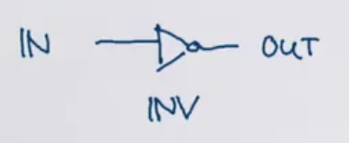

[Functional Program Design in Scala](https://www.coursera.org/learn/progfun2)

# Week 1

### Recap: Functions and Pattern Matching

```scala
// We'd represent JSONs in Scala using case classes
abstract class JSON
case class JSeq(elems: List[JSON] extends JSON
case class JObj(bindings: Map[String, JSON]) extends JSON
case class JNum(num: double) extends JSON
case class JStr(str: String) extends JSON
case class JBool(b: Boolean) extends JSON
case object JNull

type JBinding = [String, JSON]

val data = JObj(Map(
	"firstName" -> JStr("John"),
	"address" -> JObj(Map(
		"streetAdrress" -> JStr("21 2nd Street"),
		"state" -> JStr("NY"),
		"postalCode" -> JNum(10021)
	)),
	"phoneNumbers" -> JSeq(List(
		JStr("212 555-1234"), JStr("646 555-4567")
	))
))

// To show a JSON, we'd also use pattern matching
def show(json: JSON): String = json match {
	case JSeq(elems) =>
		"[" + (elems map show mkString ",") + "]"
	case JObj(bindings) =>
		val assocs = bindings map {
			// This case block is a function of type JBinding => String,
			// or, scala.Function1[JBinding, String], where Function1 is a trait
			case (k, v) => "\"" + k + "\": " + show(v)
		}
		"{" + (assocs mkString ",") + "}"
	case JNum(num) => num.toString
	case JStr(str) => "\"" + str + "\""
	case JBool(b) => b.toString
	case JNull => "null"
}

// We could rewrite the anonymous function in the case block as
trait Function1[-A, +R] {
	def apply(x: A): R
}
new Function1[JBinding, String] {
	def apply(x: JBinding) = x match {
		case (k, v) => "\"" + k + "\": " + show(v)
	}
}

// Functions are traits, so we can subclass functions in Scala
// maps are functions from keys to values
trait Map[Key, Value] extends (Key => Value) ...
// sequences are functions from indices to elements
trait Seq[Elem] extends (Int => Elem) ...

// f is a function
val f: String => String = { case "ping" => "pong" }
f("ping") // pong
f("abc") // MatchError

// To guard against MatchErrors, we can use PartialFunctions
val f: PartialFunction[String, String] = { case "ping" => "pong" }
f.isDefinedAt("ping") // true
f.isDefinedAt("abc") // false
```

```scala
// As an exercise, let's look at the following function
val f: PartialFunction[List[Int], String] = {
	case Nil => "one"
	case x :: y :: rest => "two"
}

f.isDefinedAt((List(1, 2, 3)) // true, since it returns "two"

// A variation
val g: PartialFunction[List[Int], String] = {
	case Nil => "one"
	case x :: rest => {
		rest match {
			case Nil => "two"
		}
	}
}

f.isDefinedAt((List(1, 2, 3)) // true, even though you'd get a MatchError!
// because rest matches against the [2, 3]
// isDefinedAt only guarantees the outermost pattern matching
```

### Recap: Collections

All collections share the methods: `map, flatMap, filter, foldLeft, foldRight`

```scala
// Let's see these methods on a List
// These are idealized, since they should actually be
// applicable to arbitrary collections and tail recursives
abstract class List[+T] {
	def map[U](f: T => U): List[U] = this match {
		case x :: xs => f(x) :: xs.map(f)
		case Nil => Nil
	}

	// f returns a List[U], which we must flatten to U
	def flatMap[U](f: T => List[U]): List[U] = this match {
		// use the ++ concatenation operation instead of ::
		case x :: xs => f(x) ++ flatMap(xs)
		case Nil => Nil
	}

	def filter(p: T => Boolean): List[U] = this match {
		case x :: xs => if p(x) x :: xs.filter(p) else xs.filter(p)
		case Nil => Nil
	}
}
```

Recall for-expressions, which simplify applications of `flatMap`, `map`, `filter`, etc.

```scala
// Translate for into flatMaps/maps/filters
for {
	i <- 1 until n
	j <- 1 until i
	if isPrime(i + j)
} yield (i, j)
=== (1 until n) flatMap ( i =>
	(1 until i) withFilter (j => isPrime(i + j)) map
			(j => (i, j))

// Translate map, flatMap, filter into for
def map[T, U](xs: List[T], f: T => U): List[U] =
	for (x <- xs) yield f(x)

def flatMap[T, U](xs: List[T], f: T => Iterable[U]): List[U] =
	for (x <- xs; y <- f(x)) yield y

def filter[T](xs: List[T], p: T => Boolean): List[T] =
	for (x <- xs if p(x)) yield x
```

The Scala compiler is automatically able to perform this conversion based on 3 rules:

1. `for (x <- e1) yield e2` ⇒ `e1.map(x => e2)`
2. `for (x <- e1 if f; s) yield e2` ⇒ `for (x <- e1.withFilter(x => f); s) yield e2`

   `withFilter` is a lazy implementation of `filter` that immediately create a new intermediate filtered list. Instead, on the next subsequent call to the list (i.e. in a `map`) it remembers that it should filter.

3. `for (x <- e1; y <- e2; s) yield e3` ⇒ `e1.flatMap(x => for (y <- e2; s) yield e3)`

```scala
// The left-hand side of a generator may also be a pattern
al data: List[JSON] = ...
for {
	// match JSeq(bindings) to data
	// an implicit filter that discards JSeq, JStr etc.
	JObj(bindings) <- data
	// pattern match bindings("phoneNumbers") to JSeq(phones)
	JSeq(phones) = bindings("phoneNumbers")
	JObj(phone) <- phones
	JStr(digits) = phone("number")
	if digits startsWith "212"
} yield (bindings("firstName"), bindings("lastName"))

// If pat is a pattern with a single variable x,
pat <- expr
===
x <- expr withFilter {
	case pat => true
	case _ => false
} map {
	case pat => x
}
```

As an exercise, let's translate the following expression:

```scala
for {
	x <- 2 to N
	y <- 2 to x
	if (x % y == 0)
} yield (x, y)
===
(2 to N) flatMap (x =>
	(2 to x) withFilter (y =>
		x % y == 0) map (y => (x, y)))
```

### Queries with For

Suppose we have a database of books, represented as a list of books.

```scala
case class Book(title: String, authors: List[String])

val books: List[Book] = List(
	Book(
		title = "Structure and Interpretation of Computer Programs",
		authors = List("Abelson, Harald", "Sussman, Gerald J.")),
	Book(
		title = "Introduction to Functional Programming",
		authors = List("Bird, Richard", "Wadler, Phil")),
	Book(
		title = "Effeective Java",
		authors = List("Bloch, Joshua")),
	Book(
		title = "Java Puzzlers",
		authors = List("Bloch, Joshua", "Gafter, Neal")),
	Book(
		title = "Programming in Scala",
		authors = List("Odersky, Martin", "Spoon, Lex", "Venners, Bill")),
)

// Find the titles of books whose author's last name is Bird
for (b <- books; a <- b.authors if a startsWith "Bird,")
yield b.title

// Find all the books which have the word "Program" in the title
for (b <- books if b.title indexOf "Program" >= 0)
yield b.title

// Find the names of all authors who have written at least 2 books
{
	for {
		b1 <- books
		b2 <- books
		if b1.title < b2.title // prevent repeats like (B2, B1), (B1, B2)
		a1 <- b1.authors
		a2 <- b2.authors
		if a1 == a2
	} yield a1
}.distinct

// Suppose an author has published 3 books
// Then, we would have matches (B1, B2), (B1, B3), (B2, B3) in order
// So, the same author would be printed 3 times, so we need "distinct"
// Or, we can make the books list a Set to remove duplicates
```

### Translation of For

Recall the Scala compiler for-expression conversion rules.

1. `for (x <- e1) yield e2` ⇒ `e1.map(x => e2)`
2. `for (x <- e1 if f; s) yield e2` ⇒ `for (x <- e1.withFilter(x => f); s) yield e2`
3. `for (x <- e1; y <- e2; s) yield e3` ⇒ `e1.flatMap(x => for (y <- e2; s) yield e3)`

```scala
// Find the titles of books whose author's last name is Bird
for (b <- books; a <- b.authors if a startsWith "Bird,")
yield b.title
=== // by rule 3
books.flatMap(b =>
	for (a <- b.authors if a startsWith "Bird,") yield b.title
)
=== // by rule 2
books.flatMap(b =>
	for (a <- b.authors withFilter (a => startsWith "Bird,")) yield b.title
)
=== // by rule 1
books.flatMap(b =>
	b.authors withFilter (a => a startsWith "Bird,") map (b => b.title)
)
```

Notice for-expression translation is only dependent on the existence of the methods `map`, `flatMap`, and `withFilter`. This means that `for` expressions can be used with any types such as arrays, iterators, databases, XML data, optional values, parsers, etc which implement these methods, and not just lists.

```scala
// An example from Slick, the Scala SQL library
// coffees, suppliers are tables
val crossJoin = for {
  (c, s) <- coffees join suppliers
} yield (c.name, s.name)
// compiles to SQL (simplified):
//   select x2."COF_NAME", x3."SUP_NAME" from "COFFEES" x2
//     inner join "SUPPLIERS" x3
```

### Functional Random Generators

Let's now use for-expressions to create a random value (booleans, strings, lists, pairs, sets etc.) generator.

```scala
trait Generator[+T] {
	self => // alias for "this"
	def generate: T
	def map[S](f: T => S): Generator[S] = new Generator[S] {
		// Notice we have to use self in front of "generate" to avoid
		// recursive calls to this.generate
		// Or, we could use Generator.this.generate (works in Java too!)
		def generate = f(self.generate)
	}
	def flatMap[S](f: T => Generator[S]): Generator[S] = new Generator[S] {
		// f(self.generate) gives a Generator[S], which we should generate again
		def generate = f(self.generate).generate
	}
	def filter[T](p: T => Boolean): Generator[T] = new Generator[T] {
		def generate = (x => if (p(x) x else generate)(self.generate)
	}
}

val integers = new Generator[Int] {
	val rand = new java.util.Random
	def generate = rand.nextInt()
}

val booleansBP = new Generator[Boolean] {
	def generate = integers.generate > 0
}

val pairsBP = new Generator[(Int, Int)] {
	def generate = (integers.generate, integers.generate)
}

// Since we wrote flatMap, map, and filter functions
// We can also define booleans and pairs like this and avoid boilerplate
val booleans = for (x <- integers) yield x > 0
===
	integers map { x => x > 0 }
===
	new Generator[Boolean] {
		def generate = (x: Int => x > 0)(integers.generate)
	}
=== // the expression we started with
	new Generator[Boolean] {
		def generate = integers.generate > 0
	}

def pairs[T, U](t: Generator[T], u: Generator[U]) = for {
	x <- t,
	y <- u
} yield (x, y)
===
	t flatMap { x => u map { y => (x, y) } }
===
	t flatMap { x => new Generator[(T, U)] { def generate = (x, u.generate) }}
===
	new Generator[(T, U)] {
		def generate = (new Generator[(T, U)] {
			def generate = (t.generate, u.generate)
		}).generate
	}
=== // the expression we started with
	new Generator[(T, U)] {
		def generate = (t.generate, u.generate)
	}
```

```scala
// Let's look at some examples of Generators
def single[T](x: T): Generator[T] = new Generator[T] {
	def generate = x
}

def choose(lo: Int, hi: Int): Generator[Int] =
	for (x <- integers) yield lo + x % (hi - lo)

// T* means as many arguments as you want
def oneOf[T](xs: T*): Generator[T] =
	for (idx <- choose(0, xs.length)) yield xs(idx)

def lists: Generator[List[Int]] = for {
	isEmpty <- booleans // flip a coin to see if the list should be empty
	list <- if (isEmpty) emptyLists else nonEmptyLists
} yield list

def emptyLists = single(Nil)
def nonEmptyList = for {
	head <- integers // pick a random head element
	tail <- lists // pick a random list for the rest of the list
} yield head :: tail
```

As an exercise, let's now implement a generator that creates random `Tree` objects.

```scala
trait Tree
case class Inner(left: Tree, right: Tree) extends Tree
case class Leaf(x: Int) extends Tree

def trees: Generator[Tree] = for {
	isLeaf <- booleans // flip a coin to see if this is a leaf or an inner node
	tree <- if (isLeaf) leafs else inners
} yield tree

def leafs = for {
	x <- integers
} yield Leaf(x)

def inners = for {
	l <- trees
	r <- trees
} yield Inner(l, r)
```

One important application of random value generation is generating random test inputs.

```scala
def test[T](g: Generator[T], numTimes: Int = 100)
	// test returns true if passed, false if failed
	(test: T => Boolean): Unit = {
	for (i <- 0 until numTimes) {
		val value = g.generate
		assert(test(value), "test failed for " + value)
	}
	println("passed " + numTimes + " tests")
}

// Example usage
test(pairs(lists, lists)) {
	case (xs, ys) => (xs ++ ys).length > xs.length
}
// test fails because ys is sometimes empty
```

Using ScalaCheck, we can write _properties_ which are assumed to hold instead of tests.

```scala
// l1 and l2 are automatically generated by ScalaCheck
forAll { (l1: List[Int], l2: List[Int]) =>
	l1.size + l2.size == (l1 ++ l2).size
}
// ScalaCheck will try to return the smallest possible counterexample
```

### Monads

monad ⇒ a parametric type `M[T]` with two operations, `flatMap` and `unit`

Monads implementing `withFilter` are called "monads with zero".

```scala
trait M[T] {
	def flatMap[U](f: T => M[U]): M[U]
}

def unit[T](x: T): M[T]
```

We have seen some monads already:

- List is a monad with `unit(x) = List(x)`
- Set is a monad with `unit(x) = Set(x)`
- Option is a monad with `unit(x) = Some(x)`
- Generator is a monad with `unit(x) = single(x)`

`map` can be defined for every monad as:

```scala
// Scala doesn't have a global unit function, so map is a primitive
// function defined on every monad
m map f === m flatMap (x => unit(f(x)))
				=== m flatMap (f andThen unit)
```

Monads satisfy three laws:

1. Associativity

   ```scala
   (m flatMap f) flatMap g === m flatMap (x => f(x) flatMap g)
   ```

2. Left unit

   ```scala
   unit(x) flatMap f === f(x)
   ```

3. Right unit

   ```scala
   m flatMap unit === m
   ```

Let's check the monad laws for Option.

```scala
abstract class Option[+T] {
	def flatMap[U](f: T => Option[U]): Option[U] = this match {
		case Some(x) => f(x)
		case None => None
	}
}

// Left unit law
Some(x) flatMap f
===
	Some(x) match {
		case Some(x) => f(x)
		case None => None
	}
===
	f(x) // Some(x) matches Some(x)

// Right unit law
opt flatMap Some
===
	opt match {
		case Some(x) => Some(x)
		case None => None
	}
===
	opt // since in each case, we just return what we started with

// Associative law
(opt flatMap f) flatMap g
===
	(opt match { case Some(x) => f(x) case None => None })
		match { case Some(y) => g(y) case None => None }
=== // move the second match _into_ the first one
	opt match {
		case Some(x) =>
			f(x) match { case Some(y) => g(y) case None => None }
		case None =>
			None match { case Some(y) => g(y) case None => None }
	}
=== // simplify
	opt match {
		case Some(x) => f(x) flatMap g // expansion in reverse
		case None => None
	}
===
	opt flatMap (x => f(x) flatMap g)

// So, Option is a Monad
```

Monad laws allow us to formally justify certain rewritings.

```scala
// Associativity
for (
	y <- for (x <- m; y <- f(x)) yield y
	z <- g(y)
) yield z
===
for (
	x <- m
	y <- f(x)
	z <- g(y)
) yield z

// Right unit
for (x <- m) yield x === m
```

Let's now look at type `Try`, used to pass results of computations that can fail with an exception.

```scala
abstract class Try[+T]
// Like Option, except the Success case has a value and
// the Failure case has an exception
// Success doesn't really mean Success, more like Trial
case class Success[T](x: T) extends Try[T]
case class Failure(ex: Exception) extends Try[Nothing]

class Try {
	// expr is passed by name so that it's not evaluated before Success(expr)
	def apply[T](expr: => T): Try[T] =
		try Success(expr)
		catch {
			// Doesn't make sense to export fatal exceptions
			case NonFatal(ex) => Failure(ex)
		}

	def flatMap[U](f: T => Try[U]): Try[U] = this match {
		case Success(x) => try f(x) catch { case NonFatal(ex) => Failure(ex) }
		case fail: Failure => fail
	}

	def map[U](f: T => U): Try[U] = this match {
		case Success(x) => Try(f(x))
		case fail: Failure => fail
	}
}

for {
	x <- computeX
	y <- computeY
} yield f(x, y)
// if computeX and computeY succeed, returns Success(f(x, y))
// if either fails, returns Failure(ex) of the first exception

// For a Try value t
t map f === t flatMap (x => Try(f(x)))
				=== t flatMap (f andThen Try)
```

As an exercise, let's try to prove that `Try` is a monad with unit of `Try`.

```scala
// Left unit fails
Try(expr) flatMap f
===
Try(expr) match {
	case Success(x) => try f(x) catch { case NonFatal(x) => Failure(ex) }
	case fail: Failure => fail
}
// this is not f(expr), since it can raise an exception from f or expr
```

# Week 2

## Structural Induction on Trees

To prove a property P(1) for all trees t:

1. Show that P(1) holds for all leaves 1 of a tree
2. For each internal node t with subtrees $s_1, \dots, s_n$, show that $P(s_1) \land \dots \land P(s_n)$ implies P(t).

Recall the implementation of `IntSet`:

```scala
abstract class IntSet {
	def incl(x: Int): IntSet
	def contains(x: Int): Boolean
	def union(other: IntSet): IntSet
}

object Empty extends IntSet {
	def contains(x: Int): Boolean = false
	def incl(x: Int): IntSet = NonEmpty(x, Empty, Empty)
	def union(other: IntSet) = other
}

object NonEmpty(elem: Int, left: IntSet, right: IntSet) extends IntSet {
	def contains(x < elem): Boolean =
		if (x < elem) left contains x
		else if (x > elem) right contains x
		else true

	def incl(x: Int): IntSet =
		if (x < elem) NonEmpty(elem, left incl x, right)
		else if (x > elem) NonEmpty(elem, left, right incl x)
		else this

	def union(other: IntSet): IntSet = (l union (r union other)) incl x
}
```

Let's prove this implementation's correctness by proving the following 3 laws, which completely characterize the data structure:

1. `Empty contains x === false`

   Proven according to the definition of `contains` in `Empty`.

2. `(s incl x) contains x === true`

   ```scala
   // Base case: Empty
   (Empty incl x) contains x
   = NonEmpty(x, Empty, Empty) contains x // by Empty.incl
   = true // by NonEmpty.contains

   // Induction step: NonEmpty(z, l, r)

   // Case 1: z = x
   (NonEmpty(x, l, r) incl x) contains x
   = NonEmpty(x, l, r) contains x
   = true

   // Case 2: z < x
   (NonEmpty(z, l, r) incl x) contains x
   = NonEmpty(z, l, r incl x) contains x
   = (r incl x) contains x
   = true // by induction hypothesis, since for all subtrees, IH holds

   // Case 3: z > x
   (NonEmpty(z, l, r) incl x) contains x
   = NonEmpty(z, l incl x, r) contains x
   = (l incl x) contains x
   = true // by induction hypothesis, since for all subtrees, IH holds
   ```

3. `(s incl y) contains x === s contains x if x != y`

   ```scala
   // Assume that y < x. The dual case will be completely analogous.

   // Base case: Empty
   (Empty incl y) contains x
   = NonEmpty(y, Empty, Empty) contains x
   = Empty contains x

   // Induction step: NonEmpty(x, l, r)
   // Case 1: z = x
   NonEmpty(x, l, r) incl y) contains x
   = NonEmpty(x, l incl y, r) contains x
   = true
   = NonEmpty(x, l, r) contains x

   // Case 2: z = y
   NonEmpty(y, l, r) incl y) contains x
   = NonEmpty(y, l, r) contains x

   // Case 3: z < y < x
   (NonEmpty(z, l, r) incl y) contains x
   = NonEmpty(z, l, r incl y) contains x
   = (r incl y) contains x
   = r contains x // by induction hypothesis
   = NonEmpty(z, l, r) contains x

   // Case 4: y < z < x
   (NonEmpty(z, l, r) incl y) contains x
   = NonEmpty(x, l incl y, r) contains x
   = r contains x
   = NonEmpty(z, l, r) contains x

   // Case 5: y < x < x
   (NonEmpty(z, l, r) incl y) contains x
   = NonEmpty(z, l incl y, r) contains x
   = (l incl y) contains x
   = l contains x // by induction hypothesis
   = NonEmpty(z, l, r) contains x
   ```

As an exercise, let's now look at the correctness of union, which is translated into the law `(xs union ys) contains x = xs contains x || ys contains x`

```scala
// Base case: Empty
(Empty union ys) contains x
= ys contains x
= ys contains x || false
= ys contains x || Empty contains x

// Induction step: NonEmpty(z, l, r)

// Case 1: z = x
((NonEmpty(x, l, r) union ys) contains x
= ((l union (r union ys)) incl x) contains x
= true // by (s incl x) contains x === true
= true || ys contains x
= ((NonEmpty(x, l, r) incl x) contains x) || ys contains x
= NonEmpty(x, l, r) contains x || ys contains x

// Case 2: z < x
((NonEmpty(z, l, r) union ys) contains x
= ((l union (r union ys)) incl x) contains x
=
```

## Streams

Suppose we wanted to find the second prime number between 1000 and 10000.

```scala
// We could write
((1000 to 10000) filter isPrime)(1)

// Or
def secondPrime(from: Int to: Int) = nthPrime(from, to, 2)
def nthPrimt(from: Int, to: Int, n: Int): Int =
	if (from >= to) throw new Error("no prime")
	else if (isPrime(from))
		if (n == 1) from else nthPrime(from + 1, to, n - 1)
		else nthPrime(from + 1, to, n)
```

The first implementation is much cleaner, but much slower, since it has to construct all prime numbers between 1000 and 10000 in a list. We can make the first implementation more efficient using a _stream_.

stream ⇒ list where tail is evaluated only on demand

```scala
// Streams are defined from Stream.empty and a constructor Stream.cons
val xs = Stream.cons(1, Stream.cons(2, Stream.empty))
// Or use factory construction method
	=== Stream(1, 2)
// Or, turn a collection into a stream
	=== (1 to 2).toStream
```

Let's write a function that returns a function that returns `(lo until hi).toStream`.

```scala
// This is how we would create a list like (1 to 40)
def listRange(lo: Int, hi: Int): List[Int]
	if (lo >= hi) Nil
	else lo :: listRange(lo + 1, hi)

// The code for streams is very similar, but Stream.cons is a lazy
// constructor, unlike ::
def streamRange(lo: Int, hi: Int): Stream[Int] =
	if (lo >= hi) Stream.empty
	else Stream.cons(lo, streamRange(lo + 1, hi))
```

`Stream` supports almost all methods of `List`.

```scala
// Find the second prime number between 1000 and 10000
((1000 to 10000).toStream filter isPrime)(1)

// However, :: always produces a List
x :: xs === List(x, xs)

// Use the operator #:: to produce a stream
x #:: xs === Stream(x, xs)
```

Let's look at implementing `Stream`.

```scala
// Streams are covariant
trait Stream[+A] extends Seq[A] {
	def isEmpty: Boolean
	def head: A
	def tail: Stream[A]
	// ...
}

class Stream[+T] {
	// t param is call by name parameter, whereas for lists,
	// t would be call by value
	def cons[T](h: T, t => Stream[T]) = Stream[T] {
		def isEmpty = false
		def head = h
		def tail = t // t will be evaluated the first time tail is called
	}

	// Notice cons and empty are members of Stream
	def empty = new Strean[Nothing] {
		def isEmpty = true
		def head = throw new NoSuchElementException("empty.head")
		def tail = throw new NoSuchElementException("empty.tail")
	}

	// Other Stream methods are implemented similarly to List
	def filter(p: T => Boolean): Stream[T] =
		if (isEmpty) this
		// tail.filter(p) is in a cons for lazy evaluation
		else if (p(head)) cons(head, tail.filter(p))
		else tail.filter(p)

	def apply(n: Int): T =
		if (n == 0) head
		else tail.apply(n - 1)
}
```

Let's now see an exercise.

```scala
// We've modified streamRange to the following:
def streamRange(lo: Int, hi: Int): Stream[Int] = {
	println(lo + " ")
	if (lo >= hi) Stream.empty
	else Stream.cons(lo, streamRange(lo + 1, hi))
}

// Evaluate streamRange(1, 10).take(3).toList
// streamRange(1, 10) returns a stream, and so does take
// So, it would print
1
2
3
// and evaluate to
[1, 2, 3]
```

## Lazy Evaluation

Our implementation of `Stream` recomputes tail each time it's called, which is very inefficient. Instead, let's use _lazy evaluation_ to store the result of the first evaluation of tail and return it on each subsequent call. We can do this because in a purely functional language, an expression should return the same result every time.

Recall and compare the other evaluation schemes we've seen:

- by-name evaluation ⇒ evaluate the expression every time
- strict evaluation ⇒ normal parameters and `val` definitions
- lazy evaluation ⇒ evaluate the expression by-name, and then use strict evaluation afterwards

Lazy evaluation is very attractive because it is optimized to avoid both unnecessary and repeated computation. In some programming languages, i.e. Haskell, all evaluations are lazy by default. However, the downside to using it is that lazy evaluations are unpredictable in when computations happen and how much space they take.

Scala uses strict evaluation by default by allows lazy evaluation using the `lazy` keyword.

```scala
lazy val x = expr // expr is not evalauted until someone calls x

// Consider the following program
def expr = {
	// x prints immediately when expr is evaluated
	val x = { print("x"); 1 }
	lazy val y = { print("y"); 2 }
	def z = { print("z"); 3 }
	// then, z is evaluated and so is y from z + y + ...
	// x is not printed since it has been evaluated
	// z would be printed
	// y, x are not printed since they have been evaluated
	z + y + x + z + y + x
}

// What does expr print?
expr
// prints
x
z
y
z
3 + 2 + 1 + 3 + 2 + 1
```

To make our streams more efficient, we only have to change our implementation of `Stream.cons`.

```scala
def cons[T](h: T, t => Stream[T]) = new Stream[T] {
	def head = h
	lazy val tail = t
	// ...
}
```

To convince ourselves that the implementation of streams really avoids unnecessary computation, let's trace an expression evaluation.

```scala
(streamRange(1000, 10000) filter isPrime) apply 1
=== ( // expand streamRange
	if (1000 >= 10000) empty
	else cons(1000, streamRange(1000 + 1, 10000)
).filter(isPrime).apply(1)
=== // evaluate if
	cons(1000, streamRange(1000 + 1, 10000).filter(isPrime).apply(1)
// Abbreviate cons(1000, streamRange(1000 + 1, 10000) to C1
=== (
	if (C1.isEmpty) C1
	else if (isPrime(C1.head)) cons(C1.head, C1.tail.filter(isPrime))
	else C1.tail.filter(isPrime))
).apply(1)
=== // evalulae ifs
	C1.tail.filter(isPrime).apply(1)
=== streamRange(1001, 10000).filter(isPrime).apply(1)
// ... until the first prime number until the prime 1009
=== streamRange(1009, 10000).filter(isPrime).apply(1)
=== cons(1009, streamRange(1009 + 1, 10000)).filter(isPrime).apply(1)
// Abbreviate cons(1009, streamRange(1009 + 1, 10000) to C2
=== C2.filter(isPrime).apply(1)
===  // evaluate filter
	cons(1009, C2.tail.filter(isPrime)).apply(1)
=== // evaluate apply, ask for index n = 1
	if (1 == 0) cons(1009, C2.tail.filter(isPrime)).head
	else cons(1009, C2.tail.filter(isPrime)).tail.apply(0)
===
	cons(1009, C2.tail.filter(isPrime)).tail.apply(0)
===
	C2.tail.filter(isPrime).apply(0)
===
	streamRange(1010, 10000).filter(isPrime).apply(0)
// ... until the second prime 1013
===
	streamRange(1013, 10000).filter(isPrime).apply(0)
===
	cons(1013, streamRange(1013 + 1, 10000)).filter(isPrime).apply(0)
// Abbreviate cons(1013, streamRange(1013 + 1, 10000)) to C3
=== C3.filter(isPrime).apply(0)
=== cons(1013, C3.tail.filter(isPrime)).apply(0) // evaluate filter
=== 1013 // by evaluate apply

// We never look for prime numbers past 1013
```

## Computing with Infinite Sequences

By not defining an end to a stream, we can define an infinite stream.

```scala
// gives a stream of all numbers from a given start
def from(n: Int): Stream[Int] = n #:: from(n + 1)

// stream of all natural numbers
val nats = from(0)

// stream of all multiples of 4
nats map (_ * 4)
```

Let's implement the Sieve of Eratosthenes, which is an algorithm to calculate all prime numbers. It works like this:

1. Start with all integers from 2, the first prime number.
2. Eliminate all multiples of 2.
3. 3 will be the next prime number.
4. Eliminate all multiples of 3.
5. Iterate forever. At each step, the first number in the list is a prime number and we eliminate all its multiples.

```scala
def sieve(x: Stream[Int]): Stream[Int] =
	s.head #:: sieve(s.tail filter(_ % s.head != 0))

val primes = sieve(from(2))
```

Let's now implement a function to calculate square roots. Recall that the algorithm tries to converge guesses on a single square root, which we can now express as an infinite converging sequence.

```scala
def sqrtStream(x: Double): Stream[Double] = {
	def improve(guess: Double) = (guess + x / guess) / 2
	// guess 1 first
	lazy val guesses: Stream[Double] = 1 #:: (guesses map improve)
	guesses
}

// We can now define the termination sequence separately
def isGoodEnough(guess: Double, x: Double) =
	math.abs((guess * guess - x) / x) < 0.0001

sqrtStream(4).take(10).toList
=== 1 #:: (guesses map improve)
=== 1 #:: ((1 #:: (guesses map improve)) map improve)
// evaluate outer improve for 1 map improve
=== 1 #:: 2.5 #:: ((guesses map improve) map improve)
// substitute innermost guesses with 1 #:: (guesses map improve)
=== 1 #:: 2.5 #:: (((1 #:: (guesses map improve)) map improve) map improve)
=== 1 #:: 2.5 #:: ((2.5 #:: (guesses map improve) map improve) map improve)
=== 1 #:: 2.5 #:: 2.05 #:: ...

// just the guesses that are good enoguh
sqrtStream(4).filter(isGoodEnough(_, 4)).take(10).toList
```

Let's now do an exercise. Consider two ways to express the infinite stream of multiples of a given number N.

```scala
val xs = from(1) map (_ * N)
val ys =  from(1) filter (_ % N == 0)
```

`xs` would generate its examples faster since it doesn't generate unnecessary elements.

## Case Study: The Water Pouring Problem

Let's say you're given a faucet, a sink, and glasses of varying sizes. We must produce a given volume of water in a glass.

We could represent this problem in code like this:

- Glass ⇒ `Int`
- State ⇒ `Vector[Glass]`
- Moves: `Empty(glass), Fill(glass), Pour(from, to)`

We can represent the solution as a BFS, where we generate all paths from the starting state until we find the correct state or we have exhausted all possible paths.

```scala
// Given the
class Pouring(capacity: Vector[Int])  {
	// States
	type State = Vector[Int]
	// initial state is all glasses empty
	val initialState = capacity map (_ => 0)

	// Moves
	trait Move {
		def change(state: State): State
	}
	case class Empty(glass: Int) extends Move {
		def change(state: State) = state updated (glass, 0)
	}
	case class Fill(glass: Int) extends Move {
		def change(state: State) = state updated (glass, capacity(glass))
	}
	case class Pour(from: Int, to: Int) extends Move {
		def change(state: State) = {
			// minimum of (amount in from) and (free space in to)
			val amount = state(from) min (capacity(to) - state(to))
			state updated (from, state(from) - amount)
			state updated (to, state(to) + amount)
		}
	}

	// Paths
	// put endState as a value to avoid recomputation of it
	class Path(history: List[Move], val endState: State) {
		// the newest move is appended to the head, not the tail
		def extend(move: Move) = new Path(move :: history, move change endState)
		// reverse the history for printing
		override def toString = (history.reverse mkString " ") + "-->" + endState
	}

	val initialPath = Path(Nil, initialState)

	def from(paths: Set[Path], explored: Set[State]): Stream[Set[Path]] =
		if (paths.isEmpty) Stream.empty
		else {
			val more = for {
				path <- paths
				next <- moves map path.extend
				if !(explored contains next.endState)
			} yield next
			paths #:: from(more, explored ++ (more map (_.endState)))
		}

	// Set(initialPath).isEmpty === false
	val pathSets = from(Set(initialPath), Set(initialPath))

	def solution(target: Int): Stream[Path] =
		for {
			pathSet <- pathSets
			path <- pathSet
			if path.endState contains target
		} yield path

	// index the glasses
	val glasses = 0 until capacity.length
	val moves =
		(for (g <- glasses) yield Empty(g)) ++ // we can empty a glass
		(for (g <- glasses) yield Fill(g)) ++ // we can fill a glass
		(for (from <- glasses; to <- glasses if from != to)
			yield Pour(from, to)) // or we can pour from one glass to another
}

val problem = new Pouring(Vector(4, 7))
problem.solution(6)
```

Guiding principles for good design:

- Name everything you can
- Put operations into natural scopes
- Keep degrees of freedom for future refinements

# Week 3

## Type-Directed Programming

We've previously seen that the Scala compiler is able to infer types given values.

```scala
val x = 42 // Scala infers x:Int
val y = x + 1 // Scala infers y:Int
```

It's also possible to use _type-directed programming_ to infer _values given types_. Consider a sorting method that can sort multiple types.

```scala
// use Scala's native ordering to compare types
import scala.math.Ordering
def sort[A](xs: List[A])(ord: Ordering[A]): List[A] = {
  ...
  ... if (ord.lt(x, y)) ...
  ...
}

// Ordering.Int and Ordering.String are _values_ defined by Scala
sort(xs)(Ordering.Int) // sort infers that xs: List[Int]
sort(strings)(Ordering.String) // sort infers that strings: List[String]
```

In fact, it's possible to make the compiler infer the ordering argument for us by marking the `Ordering` parameter as `implicit`. The compiler will then look for _candidate definitions_ that match the expected type.

Restrictions apply to how _implicit parameters_ are used:

- A method can only have one implicit parameter list, and it must be the last parameter list given
- You can explicitly pass an argument marked as `implicit`, but it's usually left out
- If there is more than one candidate definition possible and neither is more _specific_ than the other, an ambiguity error will be thrown

  A definition `a: A` is more specific than a definition `b: B` if:

  - type `A` has more fixed parts
  - `a` is defined in a class or object which is a subclass of the class defining b

- If there is no candidate definition possible, an error is thrown

```scala
def sort[A](xs: List[A])(implicit ord: Ordering[A]): List[A] = {
  ...
  ... if (ord.lt(x, y)) ...
  ...
}

// Now we can call sort like this
sort(xs) // Scala infers that A: Int from xs, and then infers Ordering[Int]
sort(strings)
```

For a given type T, the compiler looks for candidate definitions that:

- have type T
- are marked implicit
- are visible at the point of the function call (lexical scope), or are defined in a _companion_ object _associated_ with T (implicit scope)

  **companion object** ⇒ object with the same name as a class and declared in the same file as that class

  ```scala
  class Pizza {}
  // object Pizza is a companion object to class Pizza
  object Pizza {}

  // class Pizza and object Pizza can access each other's private members
  ```

  For a type `F[C]`, the implicit scope includes:

  - the companions of both `F` and `C`
  - the companions of the base classes of `F` and `C`, including package objects such as `p` for `p.F`

  For example, in the following type hierarchy:

  ```scala
  // Assume all of these types have their own companion objects
  trait Foo[A]
  trait Bar[A] extends Foo[A]
  trait Baz[A] extends Bar[A]
  trait X
  trait Y extends X
  ```

  If an implicit value of type Bar[Y] is required, the compiler will look for candidate definitions in the following companion objects:

  - Bar, because it is a part of Bar[Y]
  - Y, because it is a part of Bar[Y]
  - Foo, because it is a parent type of Bar
  - X, because it is a parent type of Y

  However, the companion object Baz will not be visited.

**implicit definition** ⇒ definition qualified with `implicit` keyword

```scala
object Ordering {
	// an implicit definition of an implicit value
  implicit val Int: Ordering[Int] = ...
}

implicit def orderingPair[A, B](
	implicit orderingA: Ordering[A], // implicit parameter
	orderingB: ordering[B] // type parameter
): Ordering[(A, B)]
```

Let's see some examples of implicit parameter calling.

```scala
implicit def universal[A]: A = ???
implicit def int: Int = ???
def f(implicit n: Int) = ()
// Which implicit definition matches n when f is called?
f
// Because universal takes A, int is more specific, so n = int
```

```scala
trait A {
  implicit val x: Int = 0
}
trait B extends A {
  implicit val y: Int = 1
  def f(implicit n: Int) = ()
	// Which implicit definition matches n when f is called?
  f
}
// Because y is in a subtrait of A, y is more specific, so n = y
```

Syntactic sugar allows for the omission of the implicit parameter list in definitions.

```scala
// A: Ordering is a context bound
def printSorted[A: Ordering](as: List[A]): Unit = {
  println(sort(as))
}
===
def printSorted[A](as: List[A])(implicit ev1: Ordering[A]): Unit = {
  println(sort(as))
}
```

We can check the implicit value for any given type by calling the function `implicitly`:

```scala
// definition of implicitly
def implicitly[A](implicit value: A): A = value

implicitly[Ordering[Int]]
=== Ordering[Int] = scala.math.Ordering$Int$@73564ab0
```

## Type Classes

**type class** ⇒ class defining multiple implicit values of differing types which the compiler resolves between e.g. `Ordering`, which defines `implicit val Ordering.Int: Ordering[Int]` and `implicit val Ordering.String: Ordering[String]`

Using type classes, we can extend data types without changing the original definition of those datatypes.

```scala
// Suppose we wanted to compare rationals
case class Rational(num: Int, denom: Int)

// Instead of changing the class, we can add an implicit ordering
object Rational {
  implicit val orderingRational: Ordering[Rational] =
    new Ordering[Rational] {
      def compare(q: Rational, r: Rational): Int =
        q.num * r.denom - r.num * q.denom
    }
}
```

In order to make sure that a type class is correct, we can define certain _laws_ about the instances of that type. For example, instances of `Ordering[A]` must satisfy:

- inverse ⇒ sign(`compare(x, y)`) must be the inverse of sign(`compare(y, x)`)
- transitive ⇒ if `compare(x, y) == -1` and `compare(y, z) == -1`, then `compare(x, z) == -1`
- consistent ⇒ if `x == y`, then sign(`compare(x, z)`) is equal to sign(`compare(y, z)`)

Let's now write a `Ring` type class as an example. A ring in algebra is a set supporting + and \*, satisfying the following ring axioms:

- - is associative ⇒ (a + b) + x = a + (b + c)
- - is commutative ⇒ a + b = b + a
- 0 is the additive identity ⇒ a + 0 = 0
- -a is the additive inverse of a ⇒ a + (-a) = 0
- - is associative ⇒ (a _ b) _ c = a _ (b _ c)
- 1 is the multiplicative identity ⇒ a \* 1 = a
- left distributivity ⇒ a _ (b + c) = a _ b + a \* c
- right distributivity ⇒ (b + c) _ a = b _ a + c \* a

```scala
// Ring type class
trait Ring[A] {
  def plus(x: A, y: A): A
  def mult(x: A, y: A): A
  def inverse(x: A): A
  def zero: A
  def one: A
}

object Ring {
	// instance of Ring[Int]
  implicit val ringInt: Ring[Int] = new Ring[Int] {
    def plus(x: Int, y: Int): Int = x + y
    def mult(x: Int, y: Int): Int = x * y
    def inverse(x: Int): Int = -x
    def zero: Int = 0
    def one: Int = 1
  }
}

// law to check that + is associative on rings
def plusAssociativity[A](x: A, y: A, z: A)(implicit ring: Ring[A]): Boolean =
  ring.plus(ring.plus(x, y), z) == ring.plus(x, ring.plus(y, z))
```

## Conditional Implicit Definitions

Notice that when we compare sequences of characters, like "abc" and "abd" for instance, all we're doing is character comparison one letter at a time. We can generalize these comparisons in sequence using `Ordering[List[A]]`.

```scala
// takes an implicit parameter of Ordering[A]
implicit def orderingList[A](implicit ord: Ordering[A]): Ordering[List[A]] =
  new Ordering[List[A]] {
    def compare(xs: List[A], ys: List[A]) =
      (xs, ys) match {
        case (x :: xsTail, y :: ysTail) =>
          val c = ord.compare(x, y) // compare x and y
					// if x and y were the same, keep comparing with list remaining
          if (c != 0) c else compare(xsTail, ysTail)
        case (Nil, Nil) => 0 // two empty lists are equal
        case (_, Nil)   => 1 // full list > empty list
        case (Nil, _)   => -1 // empty list < full list
      }
  }

// We can use this to sort a list of numbers
val xss = List(List(1, 2, 3), List(1), List(1, 1, 3))
// > List[List[Int]] = List(List(1, 2, 3), List(1), List(1, 1, 3))

sort(xss) // compiler fills in the following implicit defs
	=== sort[List[Int]](xss)
	=== sort[List[Int]](xss)(orderingList(Ordering.Int))
// > List[List[Int]] = List(List(1), List(1, 1, 3), List(1, 2, 3))
```

The compiler can recursively look for implicit definitions by looking for the arguments of arguments.

```scala
implicit def a: A = ...
implicit def aToB(implicit a: A): B = ...
implicit def bToC(implicit b: B): C = ...
implicit def cToD(implicit c: C): D = ...

implicitly[D]
	=== cToD(implicit c: C)
	=== cToD(bToC(implicit b: B))
	=== cToD(bToC(aToB(implicit a: A)))
	=== cToD(bToC(aToB(a)))

// If no recusion termination is possible, the compiler throws an error
trait X
implicit def loop(implicit x: X): X = x

implicitly[X] // throws error
```

Let's now look at an example where we want to compare movies, which have titles, ratings and durations.

```scala
case class Movie(title: String, rating: Int, duration: Int)

val movies = Seq(
  Movie("Interstellar", 9, 169),
  Movie("Inglourious Basterds", 8, 140),
  Movie("Fight Club", 9, 139),
  Movie("Zodiac", 8, 157)
)

def sort[A, B](elements: Seq[A])(critera: A => B)(implicit
  ord: Ordering[B]
): Seq[A] = ...

implicit def orderingPair[A, B](implicit
  orderingA: Ordering[A],
  orderingB: Ordering[B]
): Ordering[(A, B)] =
  new Ordering[(A, B)] {
    def compare(pair1: (A, B), pair2: (A, B)): Int = {
      val firstCriteria = orderingA.compare(pair1._1, pair2._1)
			// compare by first criteria, then second
      if (firstCriteria != 0) firstCriteria
      else orderingB.compare(pair1._2, pair2._2)
    }
  }

// sort movies by title, B inferred as String
sort(movies)(_.title)
// sort movies by rating, B inferred Int
sort(movies)(_.rating)

// sort movies by rating then duration, B inferred as Ordering[(A, B)]
// which becomes Ordering[(Int, Int)]
sort(movies)(movie => (movie.rating, movie.duration))
```

## Implicit Conversions

**implicit conversions** ⇒ implicit methods (or class constructors) that take exactly one non-implicit parameter for automatic conversion between types

Let's implement JSON library that uses implicit conversions for type coercion.

```scala
// JSON represented as an AST (Abstract Syntax Tree)
sealed trait Json
case class JNumber(value: BigDecimal) extends Json
case class JString(value: String) extends Json
case class JBoolean(value: Boolean) extends Json
case class JArray(elems: List[Json]) extends Json
case class JObject(fields: (String, Json)*) extends Json

object Json {
	import scala.language.implicitConversions
// lets us write obj("foo" -> "bar") instead of obj("foo" -> JString("bar"))
  implicit def stringToJson(s: String): Json = JString(s)
  implicit def intToJson(n: Int): Json = JNumber(n)
}

// { "name": "Paul", "age": 42 } would be constructed as
JObject("name" -> JString("Paul"), "age" -> JNumber(42))

// Let's define an obj function that will make construction less wordy
def obj(fields: (String, Json)*): Json = JObject(fields: _*)

// Now we can write
obj("name" -> "Paul", "age" -> 42)
=== obj( // compiler does this conversion
		"name" -> Json.stringToJson("Paul"),
		"age" -> Json.intToJson(42)
	)
```

Along the same lines, let's now see how to extend a duration library to support cleaner construction syntax.

```scala
case class Duration(value: Int, unit: TimeUnit)

object Duration {
  object Syntax {
    import scala.language.implicitConversions
		// constructors of implicit classes act as implicit conversions
    implicit class HasSeconds(n: Int) {
      def seconds: Duration = Duration(n, TimeUnit.Second)
    }
  }
}

val delay = Duration(15, TimeUnit.Second)

// We extend Duration to support this cleaner syntax
val delay = 15.seconds
	=== new HasSeconds(15).seconds // compiler does this conversion
```

The compiler looks for implicit conversions of an expression `e` of a type `T` when:

- `T` does not conform to the expression's expected type
- in a selection `e.m`, if member `m` is not accessible on `T`
- in a selection `e.m(args)`, if member `m` is accessible on `T` but not applicable to the arguments `args`

The compiler looks for implicit conversions in the enclosing lexical scope and the implicit search scope, just like it does with implicit definitions.

Use implicit conversions sparingly, since they can confuse developers reading code.

# Week 4

## Functions and State

Recall the substitution model of evaluation, where we evaluate expressions by rewriting them e.g. function applications. The substitution model doesn't have a concept of time—according to the Church-Rosser Theorem of lambda calculus (confluence), rewritings can be done at any time at any place in a term, and the resulting evaluation would be the same.

```scala
// don't call this with negative n
def iterate(n: Int, f: Int => Int, x: Int) =
	if (n == 0) x else iterate(n - 1, f, f(x))
def square(x: Int) = x * x

// Rewriting 1
iterate(1, square, 3)
=== if (1 == 0) 3 else iterate(1 - 1, square, square(3))
=== iterate(0, square, square(3))
=== iterate(0, square, 9)
=== if (0 == 0) 9 else iterate(0 - 1, square, square(9))
=== 9

// Rewriting 2
iterate(1, square, 3)
=== if (1 == 0) 3 else iterate(1 - 1, square, square(3))
=== if (1 == 0) 3 else iterate(1 - 1, square, 3 * 3)
=== iterate(0, square, 9)
=== if (0 == 0) 9 else iterate(0 - 1, square, square(9))
=== 9 // same result
```

stateful object ⇒ object whose behavior is affected by its history e.g. bank account

```scala
// Mutable state created by `var`
var x: String = "abc"
var count = 111

// Vars can be reassigned
x = "hi"
count = count + 1

// class modelling a bank account
class BankAccount {
	private var balance = 0

	def deposit(amount: Int): Unit) =
		if (amount > 0) balance = balance + amount

	def withdraw(amount: Int): Int =
		if (0 < amount && amount <= balance) {
			balance = balance - amount
			balance
		} else throw new Error("insufficient funds")
}

val acct = new BankAccount
acct deposit 50
acct withdraw 20
acct withdraw 20
acct withdraw 15 // Error, insufficient funds

// a stateful object, since it behaves statefully
// even though it has no mutable variables itself
class BankAccountProzy(ba: BankAccount) {
	def deposit(amount: Int): Unit = ba.deposit(amount)
	def withdraw(amount: Int): Int = ba.withdraw(amount)
}
```

Recall the implementation streams, which used `lazy val`. We could also implement non-empty streams using a mutable variable.

```scala
def cons[T](h: T, t => Stream[T]) = new Stream[T] {
	def head = h
	private var tOpt: Option[Stream[T]] = None
	def tail: T = tOpt match {
		case Some(x) => x
		case None => tOpt = Some(t); tail
	}
}
```

Is the result of `cons` a stateful object?

It depends! If we assume that the tail operation `t` does not have side effects, then the state of `tOpt` (cached or not cached) does not have an observable effect outside of `cons`, so `cons` is still not stateful.

However, if `t` had a side effect like a `println`, then we would not see that side effect each subsequent time we called `tail`, so `cons` would be stateful.

## Identity and Change

```scala
// Without state, it's easy to decide whether objects are the same
val x = E; val y = E
x === y

// referential transparency
val x = E; val y = x
x === y

// With state, the substitution model doesn't apply
val x = new BankAccount
val y = new BankAccount
x ?== y

// Suppose for all possible functions f performing a sequence of ops S,
f(x, y) === f(x, x) // then x, y are operationally equivalent
```

operational equivalence ⇒ x and y are operationally equivalent if no possible test can distinguish between them

It's possible to still use the Substitution Model to reason about programs with state, but we need to add to it the concept of a store that keeps track of all the references. However, this is more complicated and is outside the scope of this course.

## Loops

Variables are enough to model all imperative programs.

```scala
// We can rewrite this program to not use the while keyword
def power(x: Double, exp: Int): Double = {
	var r = 1.0
	var i = exp
	// while (i > 0) { r = r * x; i = i - 1 }
	WHILE(i > 0)({r = r * x; i = i - 1})
	// notice, () => { r = r * x; i = i - 1 } would be wrong
	// because the scope would not allow for i to be changed
	r
}

// condition and command must be passed by name
// so they are re-evaluated each time
def WHILE(condition: => Boolean)(command: => Unit): Unit =
	if (condition) {
		command
		while(condition)(command) // tail recursive, as efficient as loop
	}
	else ()
```

We can also write other control structures:

```scala
/**
	Executes command 1 or more times until condition is true
	Same as a do-while
	REPEAT {
		command
	} UNTIL (condition)
**/

// a class, because objects in Scala take no params
class Repeater(body : => Unit) {
  def UNTIL(condition: => Boolean): Unit = {
    body
    if (condition) ()
    else UNTIL(condition)
  }
}

object Repeater {
  def REPEAT(x : => Unit) : Repeater = {
    new Repeater(x)
  }
}

// use like this
import Repeater.REPEAT
var y = 0
REPEAT {
  println(y)
  y = y + 1
} UNTIL (y == 5)
```

```scala
// Java's for-loops have a declaration, so they can't be modelled
// by a higher order function
for(int i = 0; i < 3; i++) { ... } // impossible to model

// Instead, Scala has this, which is modelled by Collection's foreach
for(i <- 0 until 3) { ... }

// Apply `f` to each element of the collection
def foreach(f: T => Unit): Unit

for(i <- 1 until 3; j <- "abc") println(i + " " + j)
=== (1 until 3) foreach(i =>
				"abc" foreach(j => println(i + " " + j))
		)
```

## Example: Discrete Event Simulation

Let's build a simple digital circuit simulator. A digit circuit is composed of wires and functional components.

wires ⇒ transport signals transformed by components (must start/end at an input or component)

signal ⇒ either `true` or `false`

base components (gates):

- inverter ⇒ outputs inverse of input

  

- and gate ⇒ outputs the conjunction of the inputs

  

- or gate ⇒ outputs the disjunction of the inputs

  

components ⇒ some combination of the base components, each of which has a delay between feeding in the input and getting the output

As an example, this would be a half-adder circuit, which outputs the sum of two inputs as well as the carry. Diagrammed, it looks like this.


Mathematically:

$$S = (a \lor  b) \land \neg(a \land b) \\ C = a \land b$$

We can construct a full adder (adds 1 bit) using 2 half adders.


```scala
abstract class Circuits extends Gates {
	def halfAdder(a: Wire, b: Wire, s: Wire, c: Wire): Unit = {
		val d = new Wire
		val e = new Wire
		// connect wires using gates
		orGate(a, b, d)
		andGate(a, b, c)
		inverter(c, e)
		andGate(d, e, s)
	}

	// We can construct a full adder (adds 1 bit) using 2 half adders
	def fullAdder(a: Wire, b: Wire, cin: Wire, sum: Wire, cout: Wire): Unit = {
		val s = new Wire
		val c1 = new Wire
		val c2 = new Wire
		halfAdder(b, cin, s, c1)
		halfAdder(a, s, sum, c2)
		orGate(c1, c2, cout)
	}

	// f => a !== b
	def f(a: Wire, b: Wire, c: Wire): Unit = {
		val d, e, f, g = new Wire
		inverter(a, d) // d = !a
		inverter(b, e) // e = !b
		andGate(a, e, f) // f = a ^ !b
		andGate(b, d, g) // g = b ^ !a
		orGate(f, g, c) // c = (a ^ !b) | (b ^ !a) = (a !== b)
	}
}
```

discrete event simulator ⇒ performs actions (function that takes no params and returns `Unit`) specified by the user at the given moment

```scala
// Wires and basic gates should inherit from this
abstract class Simulation {

	type Action = () => Unit

	case class Event(time: Int, action: Action)
	// sorted list of events to perform
	private type Agenda = List[Event]

	private var agenda: Agenda = List()
	private var curtime = 0

	def currentTime: Int = curtime

	def afterDelay(delay: Int)(block: => Unit): Unit = {
		val item = Event(curtime + delay, () => block)
		agenda = insert(agenda, item)
	}

	private def insert(ag: List[Event], item: Event): List[Event] = ag match {
		case first :: rest if first.time <= item.time =>
			first :: insert(rest, item)
		case _ =>
			item :: ag
	}

	private def loop(): Unit = agenda match {
		case first :: rest => {
			agenda = rest
			curtime = first.time // doesn't really delay, just calculates new time
			first.action()
			loop()
		}
		case Nil =>
	}

	def run(): Unit = {
		afterDelay(0) {
			println("*** simulation started, time = " + currentTime + " ***")
		}
		loop()
	}
}

abstract class Gates extends Simulation {
	def InverterDelay: Int
	def AndGateDelay: Int
	def OrGateDelay: Int

	class Wire {
		private val sigVal = false
		private var actions: List[Action] = List()

		// return the current value of the signal
		def signal: Boolean = sigVal

		// modify the value of the signal
		def setSgnal(sig: Boolean): Unit =
			if (s != sigVal) {
				sigVal = s
				actions foreach (_()) // run each action
			}

		// Performs the new action added immediately and
		// adds it to the list of actions performed each time the signal changes
		def addAction(a: Action): Unit = {
			actions = a :: actions
			a()
		}
	}

	// We can then implement the basic gates like this
	def inverter(input: Wire, output: Wire): Unit = {
		def invertAction(): Unit = {
			val inputSig = input.getSignal
			afterDelay(InverterDelay) { // change is effective after a delay
				ouput setSignal !inputSig // produce inverse signal on output wire
			}
		}
		// install inverse action on input wire so that inverse is performed
		// each time the signal on the input wire changes
		input addAction invertAction
	}

	def andGate(a: Wire, b: Wire, output: Wire): Unit = {
		def andAction(): Unit = {
			// If we fetched signals from A, B after the delay
			// andGate computation would be as if it was instantaneous
			val aSig = a.getSignal
			val bSig = b.getSignal
			afterDelay(AndGateDelay) { output setSignal (aSig & bSig) }
		}
		a addAction andAction
		b addAction andAction
	}

	def orGate(a: Wire, b: Wire, output: Wire): Unit = {
		def orAction(): Unit = {
			val aSig = a.getSignal
			val bSig = b.getSignal
			afterDelay(OrGateDelay) { output setSignal (aSig | bSig) }
		}
		a addAction orAction
		b addAction orAction
	}

	// use probe to check signal of a wire
	def probe(name: String, wire: Wire): Unit = {
		def probeAction(): Unit = {
			println(s"$name $currentTime value = ${wire.getSignal}")
		}
		wire addAction probeAction
	}
}

trait Parameters {
	def InvertedDelay = 2
	def AndGateDelay = 3
	def OrGateDelay = 5
}

// Create simulation object
object sim extends Circuits with Parameters {
	import sim._
	val a, b, sum, carry, = new Wire
	halfAdder(a, b, sum, carry)
	probe("sum", sum) // sum = 0 at time 0
	probe("carry", carry) // carry = 0 at time 0

	a setSignal true // simulation started
	run() // sum = 1 at time 8

	// We can also define OR in terms of AND and INV
	// a | b = !(!a && !b)
	def orGateAlt(a: Wire, b: Wire, output: Wire): Unit {
		val notA, notB, notOut = new Wire
		inverter(a, notA); inverter(b, notB)
		andGate(notA, notB, notOut)
		inverter(notOut, output)
	}

	// If we replace orGate with orGateAlt, we'd get the same final outputs
	// but we'd see oscillation events, and the timings will be different
}
```

# Week 5

**Observer Pattern** ⇒ separating programs into:

- models ⇒ holds data which it publishes to views
- views ⇒ subscribes to data from models
- controller ⇒ optional manager of views and models

```scala
trait Publisher {
	var subscribers: Set[Subscriber] = Set()

	def subscribe(subsriber: Subscriber): Unit =
		subscribers += subscriber

	def unsubscribe(subscriber: Subscriber): Unit =
		subscribers -= subscriber

	def publish(): Unit =
		subscribers.foreach(_.handler(this))
}

trait Subscriber {
	def handler(pub: Publisher)
}
```

Let's implement `BankAccount` as an Observer pattern.

```scala
class BankAccount extends Publisher {
	private var balance = 0

	def currentBalance = balance

	def deposit(amount: Int): Unit) =
		if (amount > 0) {
			balance = balance + amount
			publish()
		]

	def withdraw(amount: Int): Unit =
		if (0 < amount && amount <= balance) {
			balance = balance - amount
			publish()
		} else throw new Error("insufficient funds")
}

// knows the total balance of observed bank accounts
class Consolidator(observed: List[BankAcconut]) extends Subscriber {

	observed.foreach(_.subscribe(this))
	private var total: Int = _ // uninitialized field
	compute() // computes total

	private def compute() =
		total = observed.map(_.currentBalance).sum

	// recompute on each bank account balance change
	def handler(pub:Publisher) = compute()

	def totalBalance = total
}

// use like this
val a, b = new BalnkAccount
val c = new Consolidator(List(a, b))
c.totalBalance // 0
a deposit 20
c.totalBalance // 20
```

Observer Pattern pros:

- decouples views from states
- allows for a varying number of views of a single state
- simple to set up

Observer Pattern cons:

- forces imperative updates, since handlers are `Unit` typed
- many calls between Publishers and Subscribers, which increases complexity and causes concurrency problems
- views are tightly bound to states

From Adobe's 2008 study of their own desktop applications:

- 1/3 of all code is devoted to event handling (bulky!)
- 1/2 of all bugs are in the event handling code (buggy!)

## Functional Reactive Programming

reactive programming ⇒ react to sequences of events that happen in time

functional reactive programming (FRP) ⇒ think of events as a function from time to some signal, and define reaction to events as a new signal function based on existing ones

As an example, consider a mouse movement event:

- in an event based view, an event `MouseMoved(toPos: Position)` is fired
- in FRP, a signal `mousePosition: Signal[Position]` is defined that represents the current mouse position at any point in time

FRP started in 1997 with the paper Functional Reactive Animation by Elliot and Paul Hudak. FRP systems and languages include: Fran Library, Flapjax, Elm, Bacon.js, React4J etc.

FRP is related to but distinct from Rx, which is an event streaming dataflow programming system.

Let's now look at `frp.Signal`, which is a simplification of `Scala.react`.

Signals have 2 fundamental operations:

1. Obtain the value of the signal by `()` application
2. Define a signal in terms of other signals using the `Signal` constructor.

```scala
// is a mouse position within a given rectangle?
def inRectangle(LL: Position, UR: Position: Signal[Boolean] =
	Signal {
		val pos = mousePosition()
		LL <= pos && pos <= UR
	}

// constant signal giving value 3
val sig = Signal(3)
```

`Var` is a subclass of `Signal` that is mutable. However, it's not like a mutable variable. If you update a signal, the signals upstream which depend on it automatically receive its update as well. However, you must manually update all variables which depend upon your changed mutable variable.

```scala
val sig = Var(3)
sig.update(5) // redefines signal value from this point on

// In Scala, calls to update can be written as assignments
arr.update(i, 0)
	=== arr(i) = 0

sig.update(5)
	=== sig() = 5
```

Let's rewrite our `BankAccount` example using signals.

```scala
class BankAccount {
	val balance = Var(0)

	def currentBalance = balance

	def deposit(amount: Int): Unit) =
		if (amount > 0) {
			// `balance() = balance() + amount` would be a cyclic defintion
			// it defines balance as amount larger than itself at all times
			val b = balance()
			balance() = b + amount
		]

	def withdraw(amount: Int): Unit =
		if (0 < amount && amount <= balance) {
			val b = balance()
			balance() = b - amount
		} else throw new Error("insufficient funds")
}

// knows the total balance of observed bank accounts
def consolidated(observed: List[BankAcconut]): Signal[Int] =
	Signal(observed.map(_.balance()).sum)

val exchangeRate = Signal(5.00)
val inDollar = Signal(c() * exchangeRate())

val a = new BankAccount()
val b = new BankAccount()

val c = consolidated(List(a, b))
c() // 0
a deposit 20
c() // 20

inDollar() // 100.00
```

This solution is shorter and cleaner than the Observer model we previously saw, since there are fewer state updates.

```scala
// 1
val num = Var(1)
val twice = Signal(num() * 2)
num() = 2 // call update function
twice() // 4

// 2
val num = Var(1)
val twice = Signal(num() * 2)
num = Var(2) // define a new signal num!
twice() // 2
```

Let's now see a simple implementation of `Signal` and `Var`.

Each signal maintains:

- its current values
- the current expression that defines the signal value
- a set of observer signals that depend on its value

We maintain the set of observer signals by:

1. Whenever `sig()` is called, add the caller to the list of observers. For now, we can track the caller in a global stack variable.
2. When `sig` has its value changed, all observers are re-evaluated and the set of observers is cleared. We can do this because if a re-evaluated observer still depends on `sig`, it will be added to the list of observers again when it calls `sig()`.

```scala
class StackableVariable[T](init: T) {
	private var values: List[T] = List(init)
	def value: T = values.head
	def withValue[T](newValue: T)(op: => R): R = {
		// put the new value at the top of the list
		values = newValue :: values
		// after the operation is finished, pop the new value from the list
		try op finally values = value.tail
	}
}

// global caller variable
val caller = new StackableVar(initialSig)
// while expr evaluates, caller = otherSig
caller.withValue(otherSig) { expr }

// Initially, there is no caller which we represent by NoSignal
// We can pass ??? as unimplemented in Scala
object NoSignal extends Signal[Nothing](???) {
	override def computeValue() = ()
}

object Signal {
	// use Scala's thread safe version of StackableVariable
	private val caller = new DynamicVariable[Signal[_]](NoSignal)
	def apply[T](expr: => T) = new Signal(expr)
}

class Signal[T](expr: => T) {
	import Signal._
	private var myExpr: () => T = _
	private var myValue: T = _
	private var observers: Set[Signal[_]] = Set()
	// initialize myExpr and myValue using update call
	update(expr)

	protected def update(expr: => T): Unit = {
		myExpr = () => expr
		computeValue()
	}

	protected def computeValue(): Unit = {
		val newValue = caller.withValue(this)(myExpr())
		if (myValue != newValue) {
			myValue = newValue
			val obs = observers
			observers = Set()
			obs.foreach(_.computeValue())
		}
	}

	def apply() = {
		observers += caller.value
		assert(
			!caller.value.observers.contains(this),
			"cyclic signal definition"
		)
		myValue
	}
}

class Var[T](expr: => T) extends Signal[T](expr) {
	// expose protected method from parent
	override def update(expr: => T): Unit = super.update(expr)
}

object Var {
	def apply[T](expr: => T) = new Var(expr)
}
```

However, our implementation of `caller` as global state is problematic when you consider concurrent programs. We could try to use synchronization, but that blocks threads, can be slow, and can lead to deadlocks.

Instead we should use thread local state (`scala.util.DynamicVariable`), meaning that each thread accesses a separate copy of a variable. However, it still comes with disadvantages:

- imperative nature produces hidden dependencies which are hard to manage
- implementation on JDK involves a global hash table lookup, which can be a performance problem
- doesn't play well when threads are multiplexed between several tasks

A cleaner solution involves passing implicit parameter, which is purely functional. However, it requires more boilerplate than the thread-local version.

We've only looked at discrete event signals so far, but for continuous signals, we need to use sampling. Continuous signals are outside the scope of this course.
